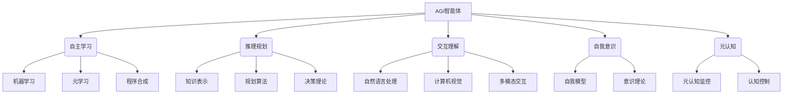

以下是根据您提供的标题和要求撰写的技术博客文章正文部分：

# AI Agent: AI的下一个风口 智能体的五种超能力

## 1. 背景介绍

### 1.1 问题的由来

在过去几十年中,人工智能(AI)的发展取得了长足的进步,尤其是在机器学习和深度学习领域。大量基于统计模型和神经网络的算法被开发出来,展现出了强大的数据处理和模式识别能力。然而,这些算法大多被视为"狭义AI",因为它们只能在特定领域发挥作用,缺乏灵活性和通用性。

与此同时,人类智能体具有更广阔的认知能力,如规划、推理、交互、学习和自我意识等。这种"通用人工智能"(Artificial General Intelligence, AGI)的追求,一直是AI研究的终极目标之一。AGI智能体被期望能够像人类一样,具备跨领域的通用认知能力,并在动态环境中自主学习、决策和行动。

### 1.2 研究现状  

近年来,AGI研究取得了一些重要进展。例如,基于深度学习的大型语言模型(如GPT-3)展现出了惊人的自然语言理解和生成能力。同时,多智能体系统、元学习、程序合成等新兴技术,为构建AGI智能体提供了新的思路和方法。

然而,实现真正的AGI仍然是一个巨大的挑战。现有的AI系统大多局限于特定任务,缺乏像人类那样的通用认知能力。构建具有自主学习、推理、规划和交互能力的智能体,需要突破多个技术瓶颈。

### 1.3 研究意义

AGI智能体的实现将对人类社会产生深远的影响。它们不仅能够辅助人类完成各种复杂任务,还可能在未来成为人类的合作伙伴,共同应对全球性挑战。同时,AGI智能体的出现也可能带来一些伦理和社会问题,需要我们提前思考和应对。

总的来说,AGI智能体被视为AI发展的下一个风口,吸引了越来越多的研究投入。本文将探讨AGI智能体的核心概念、关键技术,以及未来的发展趋势和挑战。

### 1.4 本文结构

本文将首先介绍AGI智能体的核心概念和与传统AI系统的区别,然后重点分析AGI智能体所需的五种关键能力:自主学习、推理规划、交互理解、自我意识和元认知。对于每种能力,文章将阐述其核心算法原理、数学模型,并通过实例代码和应用场景进行详细说明。最后,文章将总结AGI智能体的发展趋势和面临的挑战,并给出相关的学习资源和工具推荐。

## 2. 核心概念与联系

AGI智能体(Artificial General Intelligence Agent)是指具有与人类类似的通用认知能力的人工智能系统。与传统的"狭义AI"不同,AGI智能体不局限于特定领域,而是能够在动态环境中自主学习、推理、规划和交互,展现出类似人类的智能行为。

构建AGI智能体需要整合多种技术,包括机器学习、知识表示、自然语言处理、计算机视觉、规划与决策等。同时,AGI智能体还需要具备自我意识和元认知能力,能够反思自身的认知过程并进行自我调节。

AGI智能体的核心概念可以用下面的Mermaid流程图来表示:

上图展示了AGI智能体所需的五大核心能力,以及与之相关的技术领域。这些能力相互关联、相互作用,共同赋予AGI智能体通用的认知能力。接下来,我们将逐一探讨这五大能力的核心算法原理、数学模型和实践应用。

## 3. 核心算法原理 & 具体操作步骤  

### 3.1 算法原理概述

构建AGI智能体需要整合多种算法和技术,下面我们将概述五大核心能力所涉及的主要算法原理:

1. **自主学习能力**:
   - 机器学习算法(如深度学习、强化学习等)
   - 元学习算法(如模型争用学习、学习到学习等)
   - 程序合成算法(如神经程序搜索、程序引导等)

2. **推理规划能力**:
   - 知识表示方法(如逻辑规则、语义网络、概念图等)
   - 规划算法(如启发式搜索、层次规划、基于模型的规划等)
   - 决策理论(如马尔可夫决策过程、部分可观测马尔可夫决策过程等)

3. **交互理解能力**:
   - 自然语言处理算法(如序列到序列模型、注意力机制等)
   - 计算机视觉算法(如卷积神经网络、目标检测等)
   - 多模态融合算法(如跨模态注意力、多任务学习等)

4. **自我意识能力**:
   - 自我模型构建算法(如自监督学习、对比学习等)
   - 意识理论模型(如全局工作空间理论、集成信息理论等)

5. **元认知能力**:
   - 元认知监控算法(如注意力残差、认知反射等)
   - 认知控制算法(如辅助学习、元强化学习等)

这些算法原理为AGI智能体的构建提供了理论基础和技术支撑。下面我们将具体介绍其中一些核心算法的操作步骤。

### 3.2 算法步骤详解

#### 3.2.1 机器学习算法:深度学习

深度学习是当前最成功的机器学习范式之一,它使用多层神经网络来自动从数据中提取特征和模式。以下是训练一个深度神经网络的一般步骤:

1. **数据预处理**: 收集和清理训练数据,进行标准化、归一化等预处理操作。

2. **网络架构设计**: 根据任务需求设计合适的网络架构,如卷积神经网络(CNN)用于图像处理,循环神经网络(RNN)用于序列数据处理。

3. **初始化网络参数**: 使用随机值或预训练模型对网络参数进行初始化。

4. **定义损失函数**: 选择合适的损失函数,如交叉熵损失用于分类任务,均方误差用于回归任务。

5. **选择优化器**: 选择优化算法(如随机梯度下降)来更新网络参数,最小化损失函数。

6. **训练网络**: 将训练数据输入网络,计算损失,使用优化器更新参数,重复此过程直到收敛。

7. **模型评估**: 在验证集或测试集上评估模型性能,根据需要调整超参数或网络架构。

8. **模型部署**: 将训练好的模型部署到实际应用中,进行预测或决策。

深度学习算法展现出了强大的特征提取和模式识别能力,是构建AGI智能体自主学习能力的重要基础。

#### 3.2.2 规划算法:启发式搜索

规划算法是AGI智能体推理规划能力的关键。启发式搜索算法(如A*算法)通过评估函数来有效地探索状态空间,寻找最优解。以下是A*算法的基本步骤:

1. **初始化**: 定义问题的初始状态和目标状态,创建一个优先队列来存储待探索的节点。

2. **评估函数**: 设计一个评估函数 $f(n) = g(n) + h(n)$,其中 $g(n)$ 是从初始状态到当前节点 $n$ 的实际代价, $h(n)$ 是从节点 $n$ 到目标状态的估计代价(启发函数)。

3. **搜索循环**:
   a. 从优先队列中取出代价最小的节点 $n$。
   b. 如果 $n$ 是目标状态,返回解决方案路径。
   c. 否则,展开节点 $n$,生成其后继节点。
   d. 对于每个后继节点 $n'$,计算 $f(n') = g(n') + h(n')$,并将 $n'$ 插入优先队列。
   e. 重复步骤a-d,直到找到目标状态或队列为空。

4. **路径重构**: 如果找到目标状态,从该状态反向追溯到初始状态,重构解决方案路径。

A*算法通过合理的启发函数,能够有效地剪枝搜索空间,提高搜索效率。它广泛应用于机器人路径规划、游戏AI等领域,是AGI智能体规划能力的重要算法基础。

### 3.3 算法优缺点

#### 3.3.1 深度学习算法

**优点**:

- 强大的特征提取和模式识别能力,能够自动从数据中学习有用的表示。
- 端到端的训练方式,无需手动设计特征。
- 通过增加网络深度和宽度,可以提高模型的表达能力。
- 可以通过迁移学习和预训练技术,在新任务上快速收敛。

**缺点**:

- 需要大量的标注数据进行有监督训练,数据标注成本高。
- 训练过程计算量大,需要强大的硬件支持(GPU/TPU)。
- 模型往往是"黑箱",缺乏可解释性和透明度。
- 存在过拟合风险,需要合理的正则化和提早停止等技术。
- 对于一些特殊任务(如逻辑推理),表现可能不佳。

#### 3.3.2 A*搜索算法

**优点**:

- 对于许多问题,A*算法能够找到最优解。
- 通过合理的启发函数,可以有效剪枝搜索空间,提高效率。
- 算法逻辑简单,易于理解和实现。
- 具有可解释性,可以追溯搜索过程和生成解决方案路径。

**缺点**:

- 对于大规模的搜索空间,A*算法可能耗费大量内存和计算资源。
- 算法性能很大程度上依赖于启发函数的设计质量。
- 对于一些特殊问题(如具有不可赔路约束的规划问题),A*算法可能失效。
- 无法处理动态环境中的在线规划问题。

总的来说,不同算法都有其适用场景和局限性。在构建AGI智能体时,需要根据具体任务和需求,选择合适的算法组合,并进行优化和改进。

### 3.4 算法应用领域

深度学习和规划搜索等算法在AGI智能体的构建中发挥着重要作用,同时也广泛应用于其他领域:

1. **深度学习**:
   - 计算机视觉: 图像分类、目标检测、语义分割等
   - 自然语言处理: 机器翻译、文本生成、对话系统等
   - 推荐系统: 个性化推荐、内容过滤等
   - 金融: 算法交易、风险管理、欺诈检测等
   - 医疗健康: 医学影像分析、药物发现、疾病诊断等

2. **规划搜索算法**:
   - 机器人路径规划: 避障导航、行为决策等
   - 游戏AI: 棋类游戏AI、实时策略游戏AI等
   - 物流优化: 车辆路线规划、工厂调度等
   - 航空航天: 航线规划、航天器任务规划等
   - 制造业: 工艺流程规划、资源调度等

可以看出,这些算法在现代社会的各个领域都有广泛的应用,为AGI智能体的发展奠定了坚实的基础。

## 4. 数学模型和公式 & 详细讲解 & 举例说明

### 4.1 数学模型构建