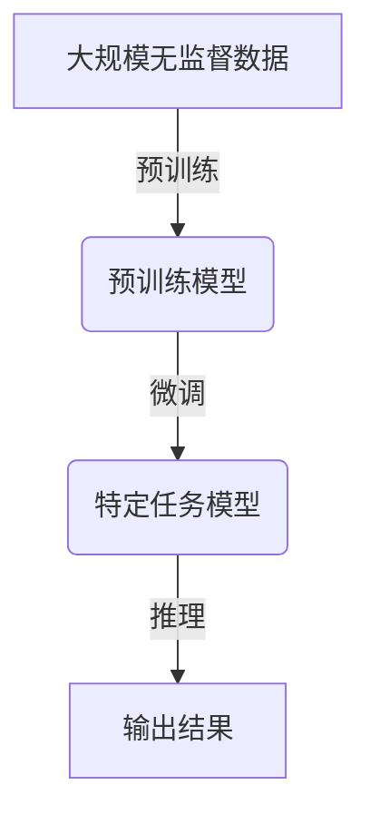

# AI 大模型原理与应用：基于 scaling law 让模型变大，探索智能的边界

## 1. 背景介绍

### 1.1 问题的由来

人工智能的发展一直是科技界的热门话题。随着计算能力的不断提升和数据量的激增,大规模的神经网络模型开始展现出令人惊叹的能力。这些被称为"大模型"(Large Models)的神经网络,通过吸收海量数据进行训练,可以在自然语言处理、计算机视觉、推理决策等多个领域取得出色的表现。

然而,大模型的训练和应用也面临着诸多挑战。首先,大规模模型需要消耗大量的计算资源,导致训练成本高昂。其次,模型的可解释性和鲁棒性仍然是一个难题,存在潜在的安全隐患。此外,大模型在特定领域表现出色,但通用智能能力仍有待提高。

### 1.2 研究现状  

为了应对上述挑战,科研界和工业界都在积极探索大模型的理论基础和实践应用。一个重要的发现是,模型的性能与其规模(参数数量)之间存在着明显的正相关关系,被称为"Scaling Law"(缩放定律)。基于这一发现,研究人员开始专注于设计更大更强大的模型,以期获得更出色的性能表现。

目前,已经出现了多个里程碑式的大模型,如OpenAI的GPT-3、谷歌的PaLM、DeepMind的Gopher等,它们在自然语言处理、多模态任务等领域取得了令人瞩目的成绩。与此同时,一些新兴的模型架构和训练策略也不断涌现,为大模型的发展注入新的活力。

### 1.3 研究意义

探索大模型的原理和应用,对于推动人工智能的发展具有重要意义:

1. **性能突破**:通过扩大模型规模,有望在各种任务上获得性能的大幅提升,推动人工智能的能力边界。
2. **通用智能**:大模型有望展现出更强的通用能力,为实现人工通用智能(Artificial General Intelligence, AGI)奠定基础。
3. **高效学习**:研究大模型的学习机制,有助于设计出更高效的学习算法,提高人工智能系统的学习效率。
4. **可解释性**:深入探究大模型的内在机理,或许能够增进对人工智能黑盒的理解,提高其可解释性和可信赖性。
5. **应用前景**:大模型在自然语言处理、计算机视觉、决策推理等领域展现出广阔的应用前景,有望为各行各业带来深远影响。

### 1.4 本文结构

本文将全面探讨大模型的原理和应用。首先介绍大模型的核心概念和相关联系,阐述Scaling Law等关键理论。接下来深入讲解核心算法原理和数学模型,并通过案例分析加以说明。然后介绍大模型在实际项目中的应用,包括开发环境搭建、代码实现等实践内容。最后,探讨大模型在不同领域的应用场景,分享学习资源和发展趋势,并指出仍需面临的挑战。

## 2. 核心概念与联系

大模型(Large Models)是一种参数量极其庞大的深度神经网络模型。它们通过吸收海量数据进行训练,从而获得出色的表现能力。大模型的核心思想是利用规模效应(Scale Effect),即通过扩大模型规模(增加参数数量)来提升模型性能。

这一思想的理论基础是Scaling Law(缩放定律)。2020年,OpenAI的研究人员在论文《Scaling Laws for Neural Language Models》中发现,模型的性能(如困惑度)与其规模(参数数量、训练数据量等)之间存在着明显的幂律关系。也就是说,只要按照一定比例扩大模型规模,就能够获得相应幅度的性能提升。这为大模型的发展奠定了重要理论基础。

```math
Performance \propto Model\ Size^{\alpha}
```

其中,Performance表示模型性能指标,Model Size表示模型规模(如参数数量),而$\alpha$是一个经验常数,反映了性能和规模之间的缩放关系。

为了支持大规模模型的训练,一些新的模型架构和训练策略也应运而生。例如,Transformer架构通过自注意力机制有效捕捉长距离依赖关系,成为大模型的主流选择。而对抗性训练(Adversarial Training)、多任务训练(Multi-task Training)等策略则有助于提高模型的鲁棒性和泛化能力。

当前,大模型已经在自然语言处理、计算机视觉、推理决策等多个领域展现出卓越的表现。例如GPT-3在文本生成、问答等任务上取得了惊人的成绩;DALL-E在文本到图像生成方面独树一帜;AlphaFold则在蛋白质结构预测领域创造了新的里程碑。这些成就都离不开大模型强大的表示学习能力。

然而,大模型也面临着一些挑战,如训练成本高昂、可解释性差、潜在的安全和伦理风险等。因此,如何高效训练大模型、提高其可解释性和鲁棒性,以及如何规避其潜在风险,都是亟待解决的重要课题。

## 3. 核心算法原理与具体操作步骤  

### 3.1 算法原理概述

大模型的核心算法原理可以概括为三个关键环节:预训练(Pre-training)、微调(Fine-tuning)和推理(Inference)。

1. **预训练**:首先在大规模无监督数据(如网页文本、图像等)上进行自监督训练,学习通用的表示能力。常用的预训练目标包括掩码语言模型(Masked Language Modeling)、下一句预测(Next Sentence Prediction)等。

2. **微调**:将预训练模型在有监督的下游任务数据上进行进一步微调,使模型适应特定任务。例如对话系统任务、文本分类任务等。

3. **推理**:最终将微调后的模型应用于实际的推理过程,生成所需的输出,如自然语言回复、图像描述等。

这一"预训练+微调"的范式被广泛应用于大模型的训练过程中,可以充分利用大规模无监督数据,提高模型的泛化能力。同时,微调环节使模型能够专注于特定任务,发挥最佳性能。



### 3.2 算法步骤详解

以基于Transformer的大型语言模型GPT为例,其训练步骤可以具体分为以下几个环节:

1. **数据预处理**:将大规模文本语料进行标记化(Tokenization)、填充(Padding)等预处理,以构建训练数据集。

2. **构建模型**:根据Transformer的编码器-解码器架构,构建包含多层自注意力和前馈神经网络的大型语言模型。

3. **预训练**:在大规模语料上进行自监督预训练,优化目标通常是掩码语言模型损失。可采用梯度下降等优化算法,并使用大批量训练(Large Batch Training)等策略加速训练过程。

4. **微调**:将预训练模型在特定任务数据(如文本分类、问答等)上进行微调,优化相应的监督损失函数。可采用较小的学习率和训练批量等策略。

5. **推理**:最终将微调后的模型应用于实际任务的推理过程,根据输入(如问题文本)生成所需的输出(如答案文本)。

6. **评估**:在标准测试集上评估模型的性能指标,如困惑度(Perplexity)、精确率(Precision)、召回率(Recall)等。

在整个过程中,还可以采用一些辅助策略来提升模型性能,如对抗训练(增强鲁棒性)、多任务训练(提高泛化能力)、模型压缩(减小部署开销)等。

### 3.3 算法优缺点

大模型算法的优点主要体现在以下几个方面:

1. **强大的表示学习能力**:通过预训练吸收海量数据,大模型能够学习到丰富的语义和世界知识表示,为下游任务奠定坚实基础。

2. **出色的泛化性能**:由于在大规模数据上进行训练,大模型往往具有很强的泛化能力,可以应对多种形式的输入,处理复杂的任务。

3. **一统天下**:单一大模型能够通过微调适应多种下游任务,体现了"一统天下"的强大潜力,简化了模型开发流程。

4. **持续学习**:大模型具有持续学习的能力,可以不断吸收新数据,扩展知识面,实现增量式学习。

然而,大模型算法也存在一些缺点和挑战:

1. **训练成本高昂**:训练大规模模型需要消耗大量的计算资源和存储资源,导致训练成本高昂,对硬件要求苛刻。

2. **可解释性差**:大模型往往是一个黑盒系统,其内部机理和决策过程缺乏透明度,可解释性较差。

3. **鲁棒性不足**:大模型容易受到对抗样本的攻击,存在一定的安全隐患,需要进一步增强其鲁棒性。

4. **偏见和不当内容**:由于训练数据中可能存在偏见和不当内容,大模型也可能继承和放大这些问题。

5. **缺乏因果推理能力**:尽管大模型在相关性建模方面表现出色,但其对因果关系的推理能力仍然有限。

### 3.4 算法应用领域

大模型算法在多个领域展现出广阔的应用前景:

1. **自然语言处理**:大模型在文本生成、机器翻译、问答系统、情感分析等NLP任务中表现出众。

2. **计算机视觉**:通过预训练视觉-语言大模型,可以支持图像描述、视觉问答、图像编辑等CV任务。

3. **多模态学习**:融合视觉、语音、文本等多种模态数据,大模型有望在多模态理解和生成任务中大显身手。

4. **推理决策**:大模型有望在策略优化、规划决策、因果推理等高级任务中发挥重要作用。

5. **科学发现**:借助大模型强大的知识表示能力,或许能够加速科学理论和公式的发现过程。

6. **创意设计**:通过预训练大模型生成创意内容(如文案、图像、音乐等),为创意设计领域带来新的可能。

总的来说,大模型算法为人工智能系统带来了巨大的能力提升,有望在多个领域发挥重要作用,推动智能系统的发展。

## 4. 数学模型和公式 & 详细讲解 & 举例说明

### 4.1 数学模型构建

大模型的核心数学模型是基于深度神经网络的序列生成模型。其中,Transformer架构因其强大的长距离依赖建模能力,成为大模型的主流选择。

Transformer的核心思想是通过Self-Attention机制来捕捉输入序列中任意两个位置之间的依赖关系,从而更好地建模序列数据。具体来说,给定一个长度为$n$的输入序列$\boldsymbol{x} = (x_1, x_2, \ldots, x_n)$,Self-Attention机制首先计算出每个位置$i$对其他所有位置$j$的注意力权重$\alpha_{ij}$:

$$\alpha_{ij} = \frac{e^{f(x_i, x_j)}}{\sum_{k=1}^n e^{f(x_i, x_k)}}$$

其中,函数$f(\cdot, \cdot)$用于计算两个位置的相似性分数,通常采用点积或缩放点积的形式。然后,将注意力权重与对应的输入向量相结合,得到位置$i$的注意力表示$z_i$:

$$z_i = \sum_{j=1}^n \alpha_{ij} \boldsymbol{x}_j$$

通过这种自注意力机制,Transformer能够有效地捕捉输入序列中任意两个位置之间的依赖关系,