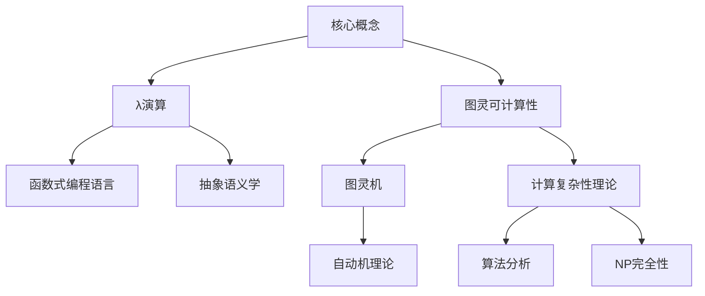

# AI 大模型计算机科学家群英传：丘奇（Alonzo Church）

## 1. 背景介绍

### 1.1 问题的由来

在现代计算机科学和人工智能领域中,有许多杰出的科学家和思想家为这一领域的发展做出了卓越贡献。其中,阿隆佐·丘奇(Alonzo Church)是一位非常重要的人物,他的工作奠定了计算理论和可计算性理论的基础。

计算理论和可计算性理论探讨了哪些问题是可以被计算机有效解决的,以及计算机的计算能力和局限性。这些理论对于理解计算机的本质和极限至关重要,也为后来的编程语言、算法设计和人工智能等领域奠定了坚实的理论基础。

### 1.2 研究现状

目前,计算理论和可计算性理论已经成为计算机科学的核心部分,在编程语言设计、编译器构建、算法复杂度分析等领域发挥着重要作用。同时,这些理论也为人工智能的发展提供了理论支撑,帮助我们更好地理解智能系统的能力和局限性。

然而,随着计算机硬件和软件的不断发展,以及人工智能技术的快速进步,我们也面临着新的挑战和问题。例如,量子计算机的出现可能会改变我们对可计算性的理解;大规模并行计算和分布式系统也对传统的计算模型提出了新的要求。

### 1.3 研究意义

深入研究丘奇及其同时代人的工作,有助于我们更好地理解计算理论和可计算性理论的起源和发展历程。通过探索他们的思想和理论,我们可以获得更深刻的洞见,从而更好地应对当前和未来的计算挑战。

此外,回顾这些先驱者的工作也有助于我们反思计算机科学和人工智能的本质,思考它们的局限性和潜在风险,以及如何更好地利用这些技术造福人类。

### 1.4 本文结构

本文将首先介绍丘奇的生平和主要贡献,然后深入探讨他提出的λ演算(Lambda Calculus)和图灵机(Turing Machine)等核心概念。接下来,我们将详细解释这些概念的数学模型和公式,并通过实例和案例进行说明。

此外,本文还将介绍基于丘奇理论的一些实际应用,以及相关的工具和资源。最后,我们将总结丘奇理论的意义和影响,并展望未来的发展趋势和挑战。

## 2. 核心概念与联系

丘奇在计算理论和可计算性理论方面的主要贡献包括λ演算(Lambda Calculus)和图灵可计算性(Turing Computability)等概念。这些概念不仅奠定了计算理论的基础,也为后来的编程语言、算法设计和人工智能等领域提供了理论支撑。

### 2.1 λ演算(Lambda Calculus)

λ演算是一种用于研究函数定义、函数应用和递归的形式系统。它为后来的函数式编程语言(如Lisp、Haskell等)奠定了理论基础,也为研究程序语义学提供了重要工具。

λ演算的核心思想是将计算视为函数的组合和应用。它定义了一组简单的语法规则和演算法则,用于表示和操作函数。通过这些规则,我们可以构建复杂的函数,并研究它们的性质和行为。

### 2.2 图灵可计算性(Turing Computability)

图灵可计算性理论由阿兰·图灵(Alan Turing)提出,但与丘奇的λ演算思想密切相关。它定义了一个抽象的计算模型,即图灵机(Turing Machine),用于研究计算机能够解决的问题和不能解决的问题。

图灵机是一种理论上的计算模型,它由一个带有读写头的无限长度的带和一组规则组成。根据当前状态和读写头下的符号,图灵机会执行相应的操作,例如移动读写头、修改带上的符号或改变状态。

通过研究图灵机的能力和局限性,我们可以更好地理解计算机的计算能力边界,并探索哪些问题是可计算的,哪些是不可计算的。这对于算法设计、复杂性分析和人工智能等领域都有重要意义。

### 2.3 其他相关概念

除了λ演算和图灵可计算性之外,丘奇的工作还与其他一些重要概念密切相关,例如:

- **递归理论(Recursion Theory)**: 研究递归函数和递归可枚举集合的性质。
- **形式语言和自动机理论(Formal Languages and Automata Theory)**: 研究形式语言的结构和自动机的计算能力。
- **程序语义学(Programming Language Semantics)**: 研究程序语言的形式语义,包括操作语义和公理语义等。
- **类型理论(Type Theory)**: 研究类型系统和类型推导的形式化方法。

这些概念与丘奇的工作密切相关,共同构成了计算理论和可计算性理论的重要组成部分。

## 3. 核心算法原理 & 具体操作步骤

### 3.1 算法原理概述

丘奇在计算理论和可计算性理论方面的核心算法原理包括λ演算和图灵机。

**λ演算**的核心思想是将计算视为函数的组合和应用。它定义了一组简单的语法规则和演算法则,用于表示和操作函数。通过这些规则,我们可以构建复杂的函数,并研究它们的性质和行为。

**图灵机**是一种理论上的计算模型,它由一个带有读写头的无限长度的带和一组规则组成。根据当前状态和读写头下的符号,图灵机会执行相应的操作,例如移动读写头、修改带上的符号或改变状态。

这两种算法原理为后来的编程语言设计、算法分析和人工智能等领域奠定了坚实的理论基础。

### 3.2 算法步骤详解

#### 3.2.1 λ演算步骤

1. **定义λ表达式语法**:
   - 变量(如x、y、z等)是λ表达式。
   - 如果M和N是λ表达式,那么(MN)也是λ表达式(函数应用)。
   - 如果x是变量,M是λ表达式,那么(λx.M)也是λ表达式(函数抽象)。

2. **定义β归约(β-reduction)规则**:
   - 如果M是λ表达式(λx.N),P是任意λ表达式,那么(MP)可以归约为N[x:=P],即用P替换N中的所有自由出现的x。

3. **构建λ表达式**:
   - 使用语法规则构建所需的λ表达式。
   - 应用β归约规则简化λ表达式。

4. **研究λ表达式的性质**:
   - 等价性:判断两个λ表达式是否等价。
   - 终止性:判断一个λ表达式是否能够归约到不可归约的形式。
   - 类型系统:为λ演算设计类型系统,研究类型推导和类型检查问题。

#### 3.2.2 图灵机步骤

1. **定义图灵机模型**:
   - 带(Tape):一个无限长度的带,初始时只有有限个非空白符号。
   - 状态(State):一组有限的状态集合。
   - 转移函数(Transition Function):根据当前状态和读写头下的符号,确定下一步操作。

2. **设计图灵机**:
   - 确定输入:在带上写入初始输入。
   - 定义状态集合和转移函数。
   - 设置初始状态和终止状态。

3. **运行图灵机**:
   - 从初始状态开始,根据转移函数执行操作。
   - 移动读写头、修改带上的符号、改变状态。
   - 直到达到终止状态或进入循环。

4. **研究图灵机的能力**:
   - 判断一个问题是否是图灵可计算的。
   - 探索图灵机的计算能力和局限性。
   - 研究图灵机的变种,如非确定性图灵机等。

### 3.3 算法优缺点

#### λ演算

**优点**:

- 简洁性:λ演算的语法和规则非常简洁,易于理解和操作。
- 表达能力:λ演算能够表示任意可计算函数,具有很强的表达能力。
- 理论基础:为函数式编程语言和程序语义学提供了坚实的理论基础。

**缺点**:

- 抽象性:λ演算过于抽象,难以直接应用于实际编程。
- 可读性:λ表达式的可读性较差,难以直观理解复杂函数的含义。
- 效率问题:λ演算的归约过程可能会导致指数级的时间复杂度。

#### 图灵机

**优点**:

- 简单性:图灵机模型非常简单,易于理解和分析。
- 通用性:图灵机是一种通用计算模型,能够模拟任何可计算的函数。
- 理论意义:奠定了可计算性理论的基础,对算法复杂度分析等领域有重要影响。

**缺点**:

- 抽象性:图灵机是一种高度抽象的理论模型,难以直接应用于实际编程。
- 有限性:尽管图灵机是通用的,但它仍然受到一定的计算能力限制。
- 低效率:图灵机的计算过程通常非常低效,不适合实际编程应用。

### 3.4 算法应用领域

#### λ演算应用领域

- **函数式编程语言**:λ演算为函数式编程语言(如Lisp、Haskell等)提供了理论基础。
- **程序语义学**:λ演算是研究程序语义学的重要工具,用于定义和分析程序语言的语义。
- **类型理论**:λ演算是研究类型系统和类型推导的基础,在编程语言设计中发挥重要作用。
- **证明助理**:λ演算被广泛应用于形式化证明和定理证明助理系统中。

#### 图灵机应用领域

- **计算复杂性理论**:图灵机是研究算法复杂度和NP完全性问题的基础模型。
- **自动机理论**:图灵机是自动机理论中最强大的计算模型,与有限自动机等密切相关。
- **形式语言理论**:图灵机用于研究形式语言的可计算性和识别问题。
- **密码学**:图灵机在密码学中用于分析加密算法的安全性和可计算性。

除了上述领域外,λ演算和图灵机的思想也在人工智能、量子计算等领域产生了重要影响。

## 4. 数学模型和公式 & 详细讲解 & 举例说明

### 4.1 数学模型构建

#### λ演算数学模型

λ演算的数学模型基于一组简单的语法规则和演算法则。

**语法规则**:

- 变量(如x、y、z等)是λ表达式。
- 如果M和N是λ表达式,那么(MN)也是λ表达式(函数应用)。
- 如果x是变量,M是λ表达式,那么(λx.M)也是λ表达式(函数抽象)。

**演算法则**:

- α-转换(α-conversion):重命名绑定变量的名称。
- β-归约(β-reduction):如果M是λ表达式(λx.N),P是任意λ表达式,那么(MP)可以归约为N[x:=P],即用P替换N中的所有自由出现的x。
- η-归约(η-reduction):如果M是λ表达式(λx.Mx),那么M可以归约为N,其中N是M中所有自由出现的x被替换为y的结果(y不出现在N中)。

通过这些规则,我们可以构建和操作λ表达式,研究它们的性质和行为。

#### 图灵机数