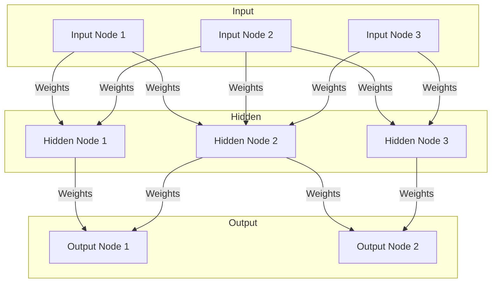

以下是按照要求撰写的技术博客文章正文:

# AI 神经网络计算艺术之道

## 1. 背景介绍

### 1.1 问题的由来

在当今的数字时代,人工智能(AI)已经渗透到我们生活的方方面面。无论是网络搜索、语音助手、自动驾驶汽车,还是医疗诊断和金融预测,AI都扮演着越来越重要的角色。而神经网络作为AI的核心技术之一,正在推动着这场深刻的技术革命。

神经网络的概念源于对生物神经系统的模拟,旨在构建能够像人脑一样学习和推理的计算模型。尽管早在20世纪60年代,神经网络的基本理论就已经提出,但由于计算能力和数据量的限制,很长一段时间里它都未能获得实质性的突破。直到近年来,大数据、强大的硬件加速和新的训练算法的出现,神经网络才真正展现出了它强大的能力,在计算机视觉、自然语言处理、推荐系统等众多领域取得了令人瞩目的成就。

### 1.2 研究现状

当前,神经网络在学术界和工业界都受到了广泛的关注和研究。在学术界,研究人员不断探索新的网络结构、训练方法和理论基础,以提高神经网络的性能和可解释性。例如,卷积神经网络(CNN)、循环神经网络(RNN)、生成对抗网络(GAN)、注意力机制等都是近年来的重要突破。同时,神经网络的应用也在不断扩展,从传统的计算机视觉和自然语言处理,到医疗健康、金融、制造业等各个领域。

在工业界,科技巨头和初创公司都在大力投资神经网络技术。谷歌的TensorFlow、Facebook的PyTorch、亚马逊的MXNet等开源框架,为神经网络的开发和应用提供了强有力的支持。同时,专用的硬件加速器(如GPU和TPU)的出现,也极大地提高了神经网络的训练和推理效率。

### 1.3 研究意义

神经网络作为AI的核心技术之一,其重要性不言而喻。深入研究神经网络不仅有助于我们更好地理解和模拟人类智能,还能推动AI技术在各个领域的应用和创新。具体来说,神经网络研究的意义主要体现在以下几个方面:

1. **提高智能系统的性能**。神经网络展现出了强大的模式识别和预测能力,能够从海量数据中自动学习特征,并对复杂问题进行高精度的预测和决策。持续优化神经网络模型和算法,将进一步提升智能系统的性能,推动AI技术在更多领域的落地应用。

2. **促进人工智能的可解释性**。虽然神经网络被视为"黑箱"模型,但通过深入研究其内在机理和表现形式,我们可以更好地理解人工智能系统的决策过程,从而提高其可解释性和可信度,为AI的安全可靠应用奠定基础。

3. **推动跨学科融合创新**。神经网络的研究需要计算机科学、数学、统计学、神经科学等多个学科的知识和方法,必将促进不同领域的交叉融合,催生新的研究方向和应用场景。

4. **培养人工智能人才**。随着神经网络技术的快速发展,对高素质人工智能人才的需求将与日俱增。开展神经网络研究不仅能培养复合型人才,还将推动教育体系的变革,为人工智能时代做好人才储备。

### 1.4 本文结构

本文将全面深入地探讨神经网络的核心概念、算法原理、数学模型、实践应用等多个方面的内容。具体来说,第2章将介绍神经网络的基本概念和不同类型的网络结构;第3章将详细阐述神经网络的核心算法原理和具体操作步骤;第4章将构建神经网络的数学模型,并通过公式推导和案例分析进行深入讲解;第5章将通过实际代码实例,演示如何开发和部署神经网络模型;第6章将介绍神经网络在不同领域的实际应用场景;第7章将为读者推荐相关的学习资源、开发工具和研究论文;最后第8章将总结神经网络的发展趋势和面临的挑战,并对未来的研究方向进行展望。

## 2. 核心概念与联系

神经网络是一种受生物神经系统启发而设计的计算模型,旨在模拟人脑的信息处理过程。与传统的机器学习算法不同,神经网络能够自动从数据中学习特征表示,并对输入数据进行非线性建模,从而解决复杂的模式识别和预测问题。

神经网络的核心概念包括:

1. **神经元(Neuron)**:神经网络的基本计算单元,类似于生物神经元,接收输入信号、进行加权求和计算,并通过激活函数产生输出信号。

2. **连接(Connection)**:神经元之间通过加权连接进行信息传递,连接的权重决定了输入对输出的影响程度。

3. **层(Layer)**:神经网络由多个层级组成,包括输入层、隐藏层和输出层。信息通过层与层之间的连接从输入层流向输出层。

4. **激活函数(Activation Function)**:引入非线性,使神经网络能够拟合复杂的函数映射关系。常用的激活函数有Sigmoid、ReLU、Tanh等。

5. **损失函数(Loss Function)**:衡量神经网络预测输出与真实标签之间的差异,是模型优化的目标函数。

6. **优化算法(Optimization Algorithm)**:通过迭代调整神经网络的连接权重,最小化损失函数,实现模型的训练。常用的优化算法有梯度下降、Adam等。

7. **正则化(Regularization)**:通过引入约束项,防止过拟合,提高模型的泛化能力。常用的正则化方法有L1、L2正则化等。

8. **超参数(Hyperparameter)**:神经网络模型中需要人为设置的参数,如学习率、批大小、epochs数等,对模型性能有重要影响。

这些核心概念相互关联、环环相扣,共同构建了神经网络的基本框架。根据不同的网络结构和应用场景,还衍生出了卷积神经网络、递归神经网络、生成对抗网络等多种具体的神经网络模型。

下面是神经网络的基本结构和信息流动的Mermaid流程图:

## 3. 核心算法原理 & 具体操作步骤

### 3.1 算法原理概述

神经网络的核心算法原理是通过反向传播(Backpropagation)算法对网络进行训练,使其能够从数据中自动学习特征表示,并对输入数据进行建模和预测。具体来说,反向传播算法包括以下几个关键步骤:

1. **前向传播(Forward Propagation)**:输入数据经过神经网络的层层计算,产生输出预测值。每个神经元接收上一层神经元的加权输入,通过激活函数进行非线性变换,得到自身的输出。

2. **计算损失(Loss Computation)**:将网络输出与真实标签进行比较,计算损失函数的值,衡量模型的预测误差。常用的损失函数有均方误差、交叉熵损失等。

3. **反向传播误差(Backpropagation of Errors)**:根据链式法则,计算损失函数相对于每个权重的梯度,即每个权重对最终损失的敏感程度。这个过程从输出层反向传播到输入层。

4. **更新权重(Weight Update)**:利用优化算法(如梯度下降)根据梯度信息,按照损失函数下降的方向调整每个权重的值,使损失函数最小化。

5. **重复迭代(Iteration)**:重复执行前向传播、计算损失、反向传播误差和更新权重的过程,不断优化神经网络的参数,直到模型收敛或达到预期性能。

通过不断迭代训练,神经网络能够自动从数据中提取特征,并学习到最优的权重参数,从而对新的输入数据进行准确的预测和决策。

### 3.2 算法步骤详解

为了更好地理解反向传播算法的具体实现,下面将对其核心步骤进行详细讲解:

1. **前向传播**

   设输入层有$n$个神经元,隐藏层有$m$个神经元,输出层有$k$个神经元。前向传播的计算过程如下:

   对于隐藏层的第$j$个神经元$h_j$,其输入$net_j$为:

   $$net_j = \sum_{i=1}^{n}w_{ji}x_i + b_j$$

   其中$w_{ji}$为输入层第$i$个神经元到隐藏层第$j$个神经元的连接权重,$b_j$为隐藏层第$j$个神经元的偏置项。

   $h_j$的输出$o_j$通过激活函数$f$计算得到:

   $$o_j = f(net_j)$$

   常用的激活函数有Sigmoid函数、ReLU函数等。

   对于输出层的第$k$个神经元$y_k$,其输入$net_k$为:

   $$net_k = \sum_{j=1}^{m}w_{kj}o_j + b_k$$

   其中$w_{kj}$为隐藏层第$j$个神经元到输出层第$k$个神经元的连接权重,$b_k$为输出层第$k$个神经元的偏置项。

   $y_k$的输出通过激活函数$g$计算得到:

   $$y_k = g(net_k)$$

   输出层的激活函数根据具体问题而定,如回归问题常用线性函数或Sigmoid函数,分类问题常用Softmax函数。

2. **计算损失**

   设真实标签为$t$,模型输出为$y$,则损失函数$E$可以定义为:

   $$E = L(t, y)$$

   其中$L$为具体的损失函数,如均方误差损失函数:

   $$L(t, y) = \frac{1}{2}\sum_k(t_k - y_k)^2$$

   或交叉熵损失函数(用于分类问题):

   $$L(t, y) = -\sum_kt_k\log y_k$$

3. **反向传播误差**

   根据链式法则,我们可以计算损失函数$E$相对于每个权重$w$的梯度:

   $$\frac{\partial E}{\partial w} = \frac{\partial E}{\partial y}\frac{\partial y}{\partial net}\frac{\partial net}{\partial w}$$

   具体计算过程如下:

   (1) 计算输出层误差项:

   $$\delta_k = \frac{\partial E}{\partial net_k} = \frac{\partial E}{\partial y_k}\frac{\partial y_k}{\partial net_k}$$

   (2) 计算隐藏层误差项:

   $$\delta_j = \frac{\partial E}{\partial net_j} = \sum_k\frac{\partial E}{\partial net_k}\frac{\partial net_k}{\partial o_j}\frac{\partial o_j}{\partial net_j}$$

   (3) 计算权重梯度:

   $$\frac{\partial E}{\partial w_{kj}} = \delta_ko_j$$

   $$\frac{\partial E}{\partial w_{ji}} = \delta_jx_i$$

4. **更新权重**

   使用梯度下降优化算法,按照梯度的反方向更新权重:

   $$w_{kj} \leftarrow w_{kj} - \eta\frac{\partial E}{\partial w_{kj}}$$

   $$w_{ji} \leftarrow w_{ji} - \eta\frac{\partial E}{\partial w_{ji}}$$