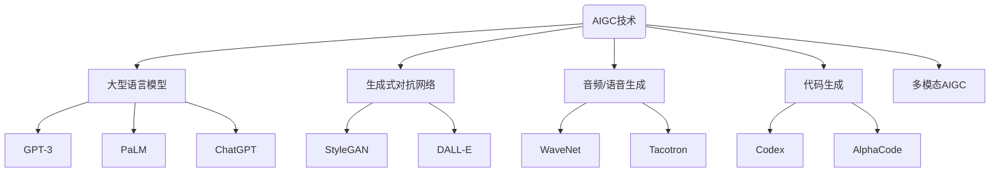

# AIGC从入门到实战：AIGC 小知识

## 1. 背景介绍

### 1.1 问题的由来

在过去几年中，人工智能(AI)和生成式人工智能(Generative AI)技术的发展令人瞩目。随着大型语言模型(LLM)和生成式对抗网络(GAN)等技术的不断进步,AI生成内容(AIGC)应用程序开始在各个领域涌现。无论是文本、图像、视频、音频还是代码生成,AIGC都展现出了巨大的潜力和影响力。

然而,尽管AIGC带来了诸多机遇,但它同时也带来了一些挑战和风险。例如,AIGC生成的内容可能存在偏差、不准确或不当之处。此外,AIGC系统在训练过程中可能吸收了有偏见的数据,从而导致生成的内容存在潜在的偏见。因此,如何正确理解和使用AIGC技术,如何规范AIGC系统的开发和应用,成为了一个亟待解决的问题。

### 1.2 研究现状

目前,AIGC技术的研究和应用主要集中在以下几个方面:

1. **大型语言模型(LLM)**: 像GPT-3、PaLM、ChatGPT等大型语言模型,通过从海量文本数据中学习,可以生成看似人类水平的文本内容。

2. **生成式对抗网络(GAN)**: 这种深度学习架构可用于生成逼真的图像、视频等视觉内容。著名的GAN模型包括StyleGAN、DALL-E等。

3. **音频/语音生成**: 利用深度学习模型(如WaveNet、Tacotron)生成逼真的语音和音频内容。

4. **代码生成**: 基于大型语言模型训练的代码生成系统(如Codex、AlphaCode),可以根据自然语言描述生成代码。

5. **多模态AIGC**: 结合不同模态(如文本、图像、视频等),实现跨模态的内容生成和理解。

虽然AIGC技术取得了长足进步,但仍面临诸多挑战,如内容质量、偏差、安全隐患、版权问题等,需要进一步的研究和探索。

### 1.3 研究意义

AIGC技术的发展对于提高生产力、促进创新、增强人机协作等方面具有重要意义:

1. **提高效率**: AIGC可以自动化和加速内容生成过程,大幅提高生产效率。

2. **扩展创造力**: AIGC为人类创作提供了新的思路和辅助,有助于激发创造力。

3. **降低门槛**: AIGC降低了内容生成的门槛,使更多人能够参与创作。

4. **促进协作**: AIGC为人机协作提供了新的模式,人与AI可以相互补充,完成更复杂的任务。

5. **拓展应用领域**: AIGC技术可应用于多个领域,如内容创作、教育、医疗、科研等,带来广泛影响。

因此,深入研究AIGC技术、规范其发展,对于释放其潜力、规避风险具有重要意义。

### 1.4 本文结构

本文将全面介绍AIGC技术的基础知识、核心原理、实践应用等内容,具体结构安排如下:

- 第2部分介绍AIGC的核心概念及其相互关系。
- 第3部分深入探讨AIGC核心算法的原理和具体操作步骤。
- 第4部分阐述AIGC相关的数学模型和公式,并结合案例进行详细讲解。
- 第5部分提供AIGC项目的实践案例,包括代码实现和运行结果分析。
- 第6部分探讨AIGC在不同领域的实际应用场景。
- 第7部分推荐AIGC相关的学习资源、开发工具和论文等。
- 第8部分总结AIGC的研究成果、发展趋势和面临的挑战。
- 第9部分列出AIGC常见问题并给出解答。

## 2. 核心概念与联系

AIGC(AI Generated Content)技术主要包括以下几个核心概念:

1. **大型语言模型(LLM)**:通过从海量文本数据中学习,LLM可以生成看似人类水平的文本内容。代表性模型包括GPT-3、PaLM、ChatGPT等。

2. **生成式对抗网络(GAN)**:这种深度学习架构可用于生成逼真的图像、视频等视觉内容。著名的GAN模型有StyleGAN、DALL-E等。

3. **音频/语音生成**:利用深度学习模型(如WaveNet、Tacotron)生成逼真的语音和音频内容。

4. **代码生成**:基于大型语言模型训练的代码生成系统(如Codex、AlphaCode),可以根据自然语言描述生成代码。

5. **多模态AIGC**:结合不同模态(如文本、图像、视频等),实现跨模态的内容生成和理解。

这些概念相互关联、相辅相成,共同推动了AIGC技术的发展。例如,LLM可以为其他AIGC模型(如GAN、音频生成模型)提供文本描述输入;多模态AIGC则将不同模态的AIGC技术结合起来,实现更复杂的内容生成任务。

## 3. 核心算法原理 & 具体操作步骤

### 3.1 算法原理概述

AIGC技术的核心算法主要基于深度学习和机器学习方法,尤其是自然语言处理(NLP)、计算机视觉(CV)和生成式模型等领域的最新进展。

1. **自然语言处理(NLP)**:NLP算法用于处理和生成文本内容,是LLM和代码生成模型的基础。常用的NLP模型包括Transformer、BERT、GPT等。

2. **计算机视觉(CV)**:CV算法用于处理和生成图像、视频等视觉内容,是GAN等视觉生成模型的基础。常用的CV模型包括CNN、RNN等。

3. **生成式模型**:生成式模型旨在从潜在空间中采样生成新的数据样本,是AIGC的核心算法范式。常用的生成式模型包括VAE、GAN、Flow模型等。

4. **多模态学习**:多模态学习算法用于处理和生成多种模态的数据,是多模态AIGC的基础。常用的多模态模型包括Vision-Language Model、Unified Modal Interface等。

这些算法通常采用端到端的训练方式,从大量数据中学习内容模式,最终实现内容生成的目标。

### 3.2 算法步骤详解

以Transformer为基础的LLM算法为例,其核心步骤如下:

1. **数据预处理**:将原始文本数据转换为模型可以处理的形式,通常包括标记化(tokenization)、填充(padding)和构建数据批次(batching)等步骤。

2. **嵌入层(Embedding Layer)**:将标记化的输入序列映射到连续的向量空间,作为Transformer的输入。

3. **编码器(Encoder)**:编码器由多个相同的编码器层组成,每一层包含多头自注意力(Multi-Head Attention)和前馈神经网络(Feed-Forward Neural Network)。编码器捕获输入序列中的上下文信息。

4. **解码器(Decoder)**:解码器也由多个相同的解码器层组成,每一层包含掩蔽的多头自注意力、编码器-解码器注意力和前馈神经网络。解码器根据编码器的输出和前一步生成的标记,预测下一个标记。

5. **生成(Generation)**:解码器逐步生成输出序列,直到达到终止条件(如生成特殊的结束标记)。

6. **训练**:使用监督学习方法(如最大似然估计)在大量文本数据上训练模型,最小化生成序列与真实序列之间的损失。

7. **推理(Inference)**:对于新的输入,模型重复执行编码和解码过程,生成相应的输出序列。

这只是Transformer的简化版本,实际上还包括诸多技术细节和优化策略,如注意力掩码、位置编码、层归一化等。

### 3.3 算法优缺点

AIGC算法具有以下优点:

1. **生成能力强大**:经过大规模训练,AIGC算法能够生成看似人类水平的高质量内容。

2. **泛化能力好**:算法可以在看不见的数据上良好泛化,生成多样化的内容。

3. **高效性**:一旦训练完成,算法可以快速高效地生成所需内容。

4. **多模态支持**:算法可以扩展到处理多种模态数据,实现跨模态生成。

然而,AIGC算法也存在一些缺点和挑战:

1. **数据质量依赖**:算法的性能很大程度上依赖于训练数据的质量和数量。

2. **缺乏因果推理**:大多数AIGC算法缺乏对因果关系的真正理解,容易产生不合理的输出。

3. **偏见和安全隐患**:算法可能从训练数据中学习到不当的偏见,并生成有害或不当的内容。

4. **计算资源需求大**:训练大型AIGC模型需要大量的计算资源,成本高昂。

5. **解释性差**:AIGC模型通常是黑盒模型,其内部工作机制缺乏透明度和可解释性。

6. **版权和伦理问题**:AIGC生成内容可能涉及版权、知识产权等法律和伦理问题。

### 3.4 算法应用领域

AIGC算法可以应用于多个领域,包括但不限于:

1. **内容创作**:生成文本、图像、视频、音频等各种形式的创意内容。

2. **教育**:生成个性化的教育资源、练习题目、解释等,辅助教学。

3. **客户服务**:生成自动问答、客户响应等,提高服务效率。

4. **营销和广告**:生成个性化的营销文案、广告创意等。

5. **新闻媒体**:自动生成新闻报道、文章摘要等。

6. **科研**:生成代码、数学公式推导、论文初稿等,辅助科研工作。

7. **医疗保健**:生成病史记录、治疗方案等,辅助医疗决策。

8. **创意设计**:生成创意图案、产品设计等视觉内容。

9. **娱乐**:生成虚拟角色、剧本、游戏内容等,增强娱乐体验。

10. **其他**:AIGC还可应用于文本摘要、机器翻译、代码优化等多个领域。

总的来说,AIGC算法为人类创造力提供了强大的辅助工具,有望在多个领域发挥重要作用。

## 4. 数学模型和公式 & 详细讲解 & 举例说明

### 4.1 数学模型构建

AIGC算法通常基于概率模型和深度学习模型,下面介绍一些常见的数学模型:

1. **自回归语言模型(Autoregressive Language Model)**

自回归语言模型是LLM的核心,其基本思想是最大化生成序列的条件概率:

$$P(x_1, x_2, \dots, x_n) = \prod_{t=1}^n P(x_t | x_1, \dots, x_{t-1})$$

其中 $x_t$ 表示序列的第 $t$ 个标记。模型通过学习从前面的标记预测下一个标记的条件概率分布,从而生成整个序列。

2. **生成式对抗网络(Generative Adversarial Network, GAN)**

GAN由生成器(Generator)和判别器(Discriminator)两部分组成,它们相互对抗地训练,目标是使生成器生成的样本无法被判别器区分出来。