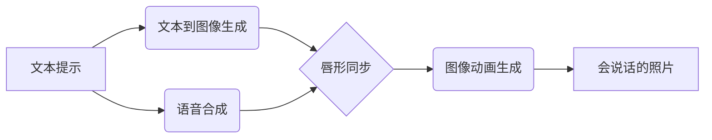

# AIGC从入门到实战：借助 AI，听听照片里的人物怎么说

作者：禅与计算机程序设计艺术 / Zen and the Art of Computer Programming

## 1. 背景介绍

### 1.1 问题的由来

在人工智能技术快速发展的今天，AIGC(AI Generated Content)正在悄然改变着我们的生活。从自动生成的新闻报道到AI绘画，再到AI音频克隆，AIGC技术正在不断拓展人工智能的应用边界。其中，如何让静态的照片"开口说话"，让照片中的人物"复活"，成为了一个有趣而富有挑战的课题。

### 1.2 研究现状

目前，利用人工智能技术实现照片说话的研究已经取得了一定进展。比如，DeepFake技术可以生成逼真的人脸视频，让目标人物"口型同步"，仿佛在说话一般。但DeepFake生成的视频还是有一定的不自然感。另外，一些研究尝试利用语音合成技术，配合面部关键点检测和唇形合成，生成与音频同步的人脸视频。但效果还不够理想，生成的视频往往缺乏真实感。

### 1.3 研究意义

让照片里的人物开口说话，有着广泛的应用前景。比如在教育领域，可以让历史人物照片"复活"，用第一人称讲述自己的人生故事，增强学习的趣味性和沉浸感。在娱乐领域，可以让明星的照片说话，制作有趣的短视频内容。在客服领域，可以让AI客服拥有栩栩如生的形象，提升用户体验。总之，这项技术若能实现突破，将为人机交互开辟新的可能。

### 1.4 本文结构

本文将详细介绍如何利用前沿的AIGC技术，尤其是Stable Diffusion模型，让照片里的人物"开口说话"。内容涵盖了从基本原理到实战代码的方方面面。全文分为以下几个部分：

- 核心概念介绍：讲解实现照片说话的关键技术，如Stable Diffusion、语音合成、唇形同步等。  
- 算法原理剖析：深入讲解Stable Diffusion的工作原理，分析其优缺点和应用场景。
- 数学模型推导：介绍Stable Diffusion背后的VAE、UNet等模型的数学原理。
- 代码实战演示：手把手带你用Stable Diffusion实现照片说话的完整流程。
- 应用场景展望：畅想照片说话技术的未来应用前景，提出可能的发展方向。

## 2. 核心概念与联系

要让照片里的人物开口说话，需要多种AI技术的协同配合。其中最关键的技术包括：

- **文本到图像生成**：利用大规模图像-文本对预训练的扩散模型，根据文本提示生成与之匹配的逼真图像。代表模型有DALL-E、Stable Diffusion、Midjourney等。
- **语音合成**：将文本转化为自然流畅的语音。常见的方法有拼接合成、参数合成、端到端声学模型如Tacotron等。
- **唇形同步**：将语音与人物的口型动作同步，让人物看起来像是真的在说话。基于关键点检测和运动估计的唇形合成是主流方法。
- **图像动画生成**：在保持人物身份特征的同时，让人脸产生与语音同步的说话动作。基于GAN的人脸动画生成是一种常用方案。

这些技术相互配合，形成了一套完整的AIGC工作流。下面这张Mermaid图展示了它们之间的联系：

## 3. 核心算法原理 & 具体操作步骤

### 3.1 算法原理概述

本文重点介绍Stable Diffusion模型在照片说话任务中的应用。Stable Diffusion是一个强大的文本到图像生成模型，通过对大规模图文对数据集进行训练，可以根据文本提示生成逼真的图像。它主要由三部分组成：

1. 文本编码器：将文本提示转化为潜在空间的条件向量。
2. 图像VAE：学习图像的压缩表示，将图像映射到潜在空间。 
3. UNet：以噪声和条件向量为输入，通过去噪过程生成目标图像。

在推理时，我们先用文本编码器将提示词编码为条件向量，然后用随机采样的噪声图片和条件向量驱动UNet，经过多轮去噪，生成与提示词相关的图像。最后通过图像VAE的解码器将潜在表示解码为RGB图像。

### 3.2 算法步骤详解

下面详细讲解利用Stable Diffusion生成会说话照片的步骤：

1. 准备输入照片和文本提示词。提示词需要描述人物的身份特征和要说的话，比如"A smiling woman with blonde hair says hello"。

2. 用Stable Diffusion的文本编码器将提示词编码为条件向量 $c$，维度为 $d_c$。

3. 将输入照片 $I$ 编码为潜在空间表示 $z$。具体做法是先用图像VAE的编码器将 $I$ 编码为均值 $\mu(I)$ 和方差 $\sigma(I)$，然后从高斯分布 $\mathcal{N}(\mu(I), \sigma(I))$ 中采样得到 $z$。

4. 生成一个随机噪声向量 $\epsilon$，与 $z$ 维度相同。

5. 将 $z$、$\epsilon$ 和条件向量 $c$ 输入UNet，经过多轮去噪后，得到去噪后的潜在表示 $\hat{z}$。每一轮去噪对应一个时间步 $t$，去噪过程可以表示为：

$$
\begin{aligned}
\hat{z}_t &= \epsilon_\theta(\hat{z}_{t-1}, t, c) \\
\hat{z}_0 &= z + \epsilon
\end{aligned}
$$

其中 $\epsilon_\theta$ 是UNet的去噪函数，$\theta$ 是UNet的参数。$t$ 从 $T$ 递减到 $1$，$T$ 是总的去噪时间步数。

6. 用图像VAE的解码器将最终的潜在表示 $\hat{z}_T$ 解码为RGB图像 $\hat{I}$。

7. 用唇形同步算法将 $\hat{I}$ 中人物的唇部运动与语音同步，得到会说话的人物照片。

### 3.3 算法优缺点

Stable Diffusion的优点在于：
- 生成图像的质量和分辨率较高，更加逼真自然。
- 支持任意文本提示，生成图像的语义可控性强。
- 推理速度快，生成一张图像只需要几秒钟。

但它也有一些局限性：
- 生成的人脸细节不够精细，比如牙齿、毛发等。
- 对于一些抽象的、复杂的场景描述，生成效果不够理想。
- 需要海量的图文对数据进行训练，对计算资源要求较高。

### 3.4 算法应用领域

Stable Diffusion作为一种通用的图像生成模型，在照片说话任务之外，还可以应用于以下场景：

- 根据文字描述生成产品设计图、插画、概念艺术等。
- 进行图像编辑，比如更换人物服装、调整场景风格等。
- 生成游戏、电影中的场景和角色。
- 辅助时尚设计，根据描述生成服装款式。

总之，Stable Diffusion为AIGC领域带来了全新的可能性，有望成为未来内容生产的重要工具。

## 4. 数学模型和公式 & 详细讲解 & 举例说明

### 4.1 数学模型构建

Stable Diffusion背后的核心思想是扩散模型(Diffusion Model)。扩散模型通过马尔可夫链的逐步去噪过程，将简单分布(如高斯噪声)转化为复杂的数据分布(如逼真人像)。形式化地，记原始数据分布为 $q(x)$，噪声分布为 $\pi(x)$，扩散模型学习一个去噪过程 $p_\theta(x_{0:T})$去逼近 $q(x)$。

$$
p_\theta(x_{0:T}) = p(x_T) \prod_{t=1}^T p_\theta(x_{t-1}|x_t)
$$

其中 $x_t$ 是 $t$ 时刻的噪声样本，$x_0$ 是原始数据样本。$p(x_T)$ 通常选择标准正态分布 $\mathcal{N}(0,I)$。反向去噪过程 $p_\theta(x_{t-1}|x_t)$ 通过神经网络(如UNet)拟合。

训练时，我们构造一个与 $p_\theta(x_{0:T})$ 方向相反的噪声注入过程 $q(x_{1:T}|x_0)$：

$$
q(x_{1:T}|x_0) = \prod_{t=1}^T q(x_t|x_{t-1}) 
$$

其中 $q(x_t|x_{t-1})$ 是固定的高斯分布 $\mathcal{N}(\sqrt{1-\beta_t} x_{t-1}, \beta_t I)$，$\beta_t$ 是噪声注入强度的超参数。

训练目标是最小化 $q(x_{1:T}|x_0)$ 和 $p_\theta(x_{0:T})$ 的KL散度，等价于最大化变分下界(ELBO)：

$$
\begin{aligned}
\mathbb{E}_{q(x_0)}\left[\log \frac{p_\theta(x_{0:T})}{q(x_{1:T}|x_0)}\right] &= 
\mathbb{E}_{q(x_0)}\left[\log p(x_T) + \sum_{t=1}^T \log \frac{p_\theta(x_{t-1}|x_t)}{q(x_t|x_{t-1})} \right] \\
&= \mathbb{E}_{q(x_0)}\left[\log p(x_T) - \sum_{t=1}^T D_{KL}(q(x_t|x_{t-1})||p_\theta(x_{t-1}|x_t)) \right]
\end{aligned}
$$

直观地，优化目标就是让去噪过程 $p_\theta(x_{t-1}|x_t)$ 尽可能接近噪声注入过程 $q(x_t|x_{t-1})$。

### 4.2 公式推导过程

为了得到更易于优化的目标函数，我们对 $q(x_t|x_{t-1})$ 做一些变换。由于 $q(x_t|x_{t-1})$ 服从高斯分布 $\mathcal{N}(\sqrt{1-\beta_t} x_{t-1}, \beta_t I)$，我们可以将 $x_t$ 重参数化为：

$$
x_t = \sqrt{1-\beta_t} x_{t-1} + \sqrt{\beta_t} \epsilon
$$

其中 $\epsilon \sim \mathcal{N}(0,I)$。进一步地，$x_t$ 可以直接从 $x_0$ 采样得到：

$$
x_t = \sqrt{\bar{\alpha}_t} x_0 + \sqrt{1-\bar{\alpha}_t} \epsilon
$$

其中 $\alpha_t = 1- \beta_t$，$\bar{\alpha}_t = \prod_{s=1}^t \alpha_s$。

现在，我们的优化目标变为：

$$
\mathbb{E}_{x_0,\epsilon,t}\left[\frac{1}{2}||\epsilon - \epsilon_\theta(\sqrt{\bar{\alpha}_t} x_0 + \sqrt{1-\bar{\alpha}_t} \epsilon, t)||^2\right]
$$

其中 $\epsilon_\theta$ 是我们要学习的去噪网络(如UNet)，$t$ 是均匀采样的时间步。这个目标函数的意义是，给定任意时间步 $t$ 的噪声样本 $x_t$，去噪网络要学会预测噪声 $\epsilon$，从而去除噪声得到原始样本 $x_0$。

### 4.3 案例分析与讲解

下面我们以一个简单的例子来说明扩散模型的去噪过程。假设我们要生成一张 $32\times32$ 的人脸图像。

首先，我们随机采样一个高斯噪声图像 $x_T$，作为起始点。然后，我们用去噪网络 