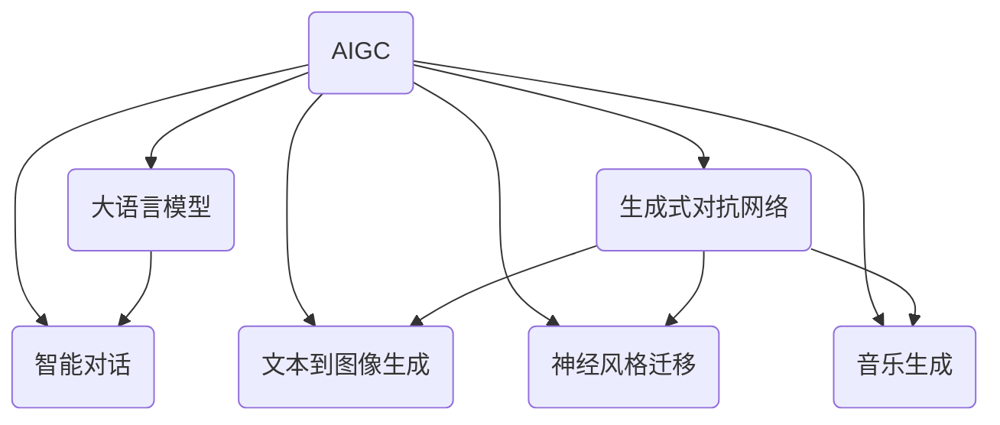

# AIGC从入门到实战：基建：人工智能时代的变迁

关键词：AIGC、人工智能、基础设施、算法、数学模型、应用场景、未来趋势

## 1. 背景介绍
### 1.1 问题的由来
人工智能生成内容(AIGC)技术的快速发展,正在深刻改变着我们的生活和工作方式。从智能助手、智能客服到内容创作,AIGC无处不在。然而,对于许多人来说,AIGC仍然是一个相对陌生的概念。理解AIGC的原理、应用场景和未来趋势,对于更好地拥抱这一变革至关重要。
### 1.2 研究现状
目前,AIGC领域的研究主要集中在算法优化、模型训练、数据处理等方面。谷歌、微软、OpenAI等科技巨头都在积极布局AIGC,推出了一系列创新产品和服务。学术界也在不断探索AIGC的理论基础和应用前景。但总体而言,AIGC仍处于发展的早期阶段,还有许多问题亟待解决。
### 1.3 研究意义 
AIGC代表了人工智能发展的新方向,对社会经济、科技创新都具有重大影响。深入研究AIGC,一方面有助于加速人工智能技术的进步,另一方面也为相关产业发展提供了重要参考。同时,普及AIGC知识,让更多人了解并参与其中,对于推动人工智能健康发展具有积极意义。
### 1.4 本文结构
本文将从以下几个方面展开论述：首先介绍AIGC的核心概念和关键技术;然后重点阐述AIGC算法原理和数学模型;接着通过代码实例演示AIGC的实现过程;进一步分析AIGC的应用场景;最后总结AIGC的发展趋势与挑战,并提出展望。

## 2. 核心概念与联系
AIGC的核心是利用人工智能技术,特别是深度学习算法,自动生成各种内容,如文本、图像、音视频等。它涉及到多个人工智能领域,包括自然语言处理(NLP)、计算机视觉(CV)、语音识别(ASR)等。这些技术之间相互关联、相互促进,共同推动AIGC的发展。

以下是AIGC涉及的几个关键概念:

- 大语言模型(LLM):通过海量文本数据训练得到的语言模型,能够生成连贯、通顺的文本内容。GPT系列是当前最具代表性的LLM。

- 生成式对抗网络(GAN):一种用于生成逼真图像、视频的深度学习模型。GAN 由生成器和判别器两部分组成,通过二者的博弈学习,不断提高生成内容的质量。 

- 文本到图像生成(T2I):根据文本描述自动生成相应图像的技术。Stable Diffusion、DALL-E 就是T2I的杰出代表。

- 神经风格迁移:一种可以将一幅图像的风格迁移到另一幅图像上的算法,常用于艺术创作、滤镜特效等。

- 音乐生成:利用深度学习自动创作音乐片段的技术,如OpenAI的Jukebox。

- 智能对话:通过大语言模型等技术,实现与人自然流畅对话的系统,如微软小冰、OpenAI的ChatGPT。

这些概念和技术的关系可以用下面的Mermaid图来表示:

可以看出,AIGC是一个综合性很强的领域,涉及多种人工智能技术。这些技术相互交叉、相互融合,最终形成了AIGC的丰富生态。理解了这些概念和联系,就能更好地把握AIGC的全貌。

## 3. 核心算法原理 & 具体操作步骤
### 3.1 算法原理概述
AIGC的核心算法主要包括两大类:生成式模型和判别式模型。

生成式模型通过学习数据的分布,然后从这个分布中采样生成新的数据。常见的生成式模型有VAE、GAN、Flow模型等。它们在文本生成、图像生成、语音合成等任务中表现出色。

判别式模型则是直接学习输入到输出的映射关系,给定输入预测相应的输出。典型的判别式模型包括各种分类器和回归模型,如CNN、RNN、Transformer等。判别式模型常用于分类、检测、语义理解等任务。

AIGC往往结合生成式模型和判别式模型,形成更加强大的生成系统。例如Stable Diffusion使用了VAE和Transformer的结合,ChatGPT使用了Transformer结构的GPT模型。

### 3.2 算法步骤详解
下面以图像生成中的GAN为例,详细说明其算法步骤:

1. 准备训练数据:收集大量真实图像作为训练集。

2. 初始化生成器G和判别器D:它们通常都是卷积神经网络,但结构有所不同。

3. 训练判别器D:
   - 从训练集中采样一批真实图像,标记为1;
   - 用G生成一批假图像,标记为0;
   - 将真实图像和假图像输入D,计算其损失函数,然后反向传播更新D的参数,使其能够尽可能分辨出真假图像。

4. 训练生成器G:
   - 用G生成一批假图像;
   - 将假图像输入D,但这次把标签设为1;
   - 计算G的损失函数,反向传播更新G的参数,使其能够尽可能欺骗D。

5. 重复步骤3和4,直到模型收敛或达到预设的迭代次数。

6. 用训练好的G来生成图像。

可以看出,GAN的核心思想是让G和D互相博弈,最终达到动态平衡。这个过程可以用下面的公式来表示:

$$
\min_G \max_D V(D, G) = \mathbb{E}_{x \sim p_{data}(x)}[\log D(x)] + \mathbb{E}_{z \sim p_z(z)}[\log (1 - D(G(z)))]
$$

其中,$x$表示真实图像,$z$表示随机噪声,$p_{data}$和$p_z$分别是真实图像和噪声的分布。$D(x)$表示D认为$x$为真实图像的概率,$G(z)$表示G根据噪声$z$生成的图像。

### 3.3 算法优缺点
GAN的优点在于:
- 生成效果逼真,能够生成高质量的图像;
- 通过随机噪声控制生成过程,具有一定的可解释性;
- 适用范围广,可以生成图像、视频、音频等多种模态数据。

但GAN也存在一些缺点:
- 训练不稳定,容易出现模式崩溃、梯度消失等问题;
- 对数据质量要求高,需要大量、高质量的真实数据作为训练集;
- 生成多样性不足,容易出现重复、同质化的样本。

针对这些问题,研究者提出了WGAN、LSGAN、StyleGAN等改进模型,取得了更好的效果。

### 3.4 算法应用领域
GAN在图像生成、视频生成、语音合成、风格迁移等领域都有广泛应用。例如:

- 人脸生成:根据随机噪声生成逼真的人脸图像,可用于数据增广、匿名化等。

- 动作迁移:将一个人的动作姿态迁移到另一个人身上,实现"以假乱真"的特效。

- 图像翻译:在保持图像内容不变的情况下,改变其风格,如白天到夜晚、素描到照片等。

- 超分辨率:从低分辨率图像生成高分辨率图像,提升图像质量。

- 语音转换:修改语音的音色、语调、情感等,实现语音伪装、变声等功能。

除了GAN,VAE、Transformer等模型在AIGC中也有重要应用。未来,随着算力的提升和算法的进步,AIGC必将在更多领域大放异彩。

## 4. 数学模型和公式 & 详细讲解 & 举例说明
### 4.1 数学模型构建
AIGC所涉及的数学模型主要包括概率图模型、变分推断、最优传输等。这里重点介绍VAE的数学模型。

VAE全称变分自编码器,是一种基于概率图模型的生成式模型。它假设数据是由隐变量$z$生成的,并通过最大化边际似然估计隐变量分布和生成分布的参数。VAE的数学模型可以表示为:

$$
p_{\theta}(x) = \int p_{\theta}(x|z)p(z)dz
$$

其中,$x$表示观测数据,$z$表示隐变量,$\theta$表示生成分布的参数。$p(z)$是隐变量的先验分布,通常假设为标准正态分布$\mathcal{N}(0, I)$。$p_{\theta}(x|z)$是生成分布,表示从隐变量$z$生成数据$x$的概率。

### 4.2 公式推导过程
由于边际似然$p_{\theta}(x)$的积分难以直接计算,VAE引入了一个近似后验分布$q_{\phi}(z|x)$,并最小化它与真实后验$p_{\theta}(z|x)$的KL散度:

$$
D_{KL}(q_{\phi}(z|x) || p_{\theta}(z|x)) = \mathbb{E}_{z \sim q_{\phi}(z|x)}[\log \frac{q_{\phi}(z|x)}{p_{\theta}(z|x)}]
$$

根据贝叶斯定理,可以得到:

$$
\log p_{\theta}(x) - D_{KL}(q_{\phi}(z|x) || p_{\theta}(z|x)) = \mathbb{E}_{z \sim q_{\phi}(z|x)}[\log p_{\theta}(x|z)] - D_{KL}(q_{\phi}(z|x) || p(z))
$$

等式左边是$\log p_{\theta}(x)$的下界,因为KL散度非负。等式右边称为ELBO(Evidence Lower Bound),由重构误差和KL散度两项组成。VAE的目标就是最大化ELBO,即最小化重构误差和KL散度。

### 4.3 案例分析与讲解
下面以手写数字生成为例,说明VAE的工作原理。

假设我们有一批手写数字图像$\{x^{(i)}\}_{i=1}^N$,每个图像由784(28x28)个像素组成。VAE的目标是学习这些图像的生成模型,从而能够生成新的手写数字图像。

首先,我们设计编码器$q_{\phi}(z|x)$和解码器$p_{\theta}(x|z)$。编码器将图像$x$映射为隐变量$z$的均值和方差,解码器则根据隐变量$z$重构出图像$\hat{x}$。它们的结构通常是多层感知机或卷积神经网络。

然后,我们从训练集中采样一批图像$\{x^{(i)}\}_{i=1}^M$,送入编码器得到隐变量分布$q_{\phi}(z|x^{(i)})$。再从这个分布中采样隐变量$z^{(i)}$,送入解码器得到重构图像$\hat{x}^{(i)}$。

接下来,我们计算重构误差和KL散度:

$$
\mathcal{L}_{rec} = \frac{1}{M}\sum_{i=1}^M \log p_{\theta}(x^{(i)}|z^{(i)})
$$

$$
\mathcal{L}_{KL} = \frac{1}{M}\sum_{i=1}^M D_{KL}(q_{\phi}(z|x^{(i)}) || p(z))
$$

其中,重构误差用交叉熵来度量,KL散度则有解析解。

最后,我们计算ELBO,并用梯度下降法更新编码器和解码器的参数$\phi$和$\theta$:

$$
\mathcal{L}(\phi, \theta) = \mathcal{L}_{rec