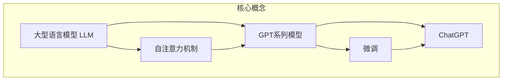

# AIGC从入门到实战：应用：目前ChatGPT能在什么场景下做什么事

## 1. 背景介绍

### 1.1 问题的由来

随着人工智能技术的不断发展,大型语言模型(Large Language Model,LLM)已经成为当前人工智能领域最引人注目的热点之一。作为LLM的代表,ChatGPT自2022年11月推出以来,就因其强大的自然语言处理能力和广泛的知识储备而备受瞩目。

ChatGPT是一种基于GPT-3.5语言模型的对话式人工智能系统,它能够理解和生成人类可读的文本,并以自然、流畅的方式与用户进行交互。凭借出色的语言生成能力,ChatGPT已在多个领域展现出广阔的应用前景,引发了人们对其潜在用途的浓厚兴趣。

### 1.2 研究现状

目前,ChatGPT在多个领域已初步展现出其应用价值,例如:

- **写作辅助**:ChatGPT可以根据提示生成高质量的文本内容,如新闻报道、小说故事、营销文案等,为写作工作提供有力支持。
- **问答系统**:凭借丰富的知识库,ChatGPT能够回答各类问题,为用户提供准确、全面的解答,可广泛应用于客服、教育等场景。
- **代码生成**:ChatGPT不仅掌握自然语言,还对编程语言有深入理解,能够根据需求生成各种编程代码,为开发人员提供编码辅助。
- **内容总结**:ChatGPT能够对大量文本内容进行总结概括,提取关键信息,为信息获取和知识管理提供便利。

然而,ChatGPT的应用远不止于此。随着人们对其能力的不断探索,其应用场景正在持续扩展。

### 1.3 研究意义 

深入研究ChatGPT在各领域的应用场景及实践方法,对于充分发挥其能力,释放其应用价值意义重大。具体来说,本研究将:

1. **拓展认知**:系统梳理ChatGPT在各领域的应用场景,扩展人们对其能力的认知。
2. **指导实践**:提供具体的实践方法,为各行业的从业者提供指导,助力其更高效地利用ChatGPT完成工作。
3. **促进创新**:挖掘ChatGPT在新兴领域的潜在应用,为人工智能技术的创新应用注入新的活力。

### 1.4 本文结构

本文将从以下几个方面系统介绍ChatGPT的应用场景及实践:

1. 核心概念与联系
2. 核心算法原理与具体操作步骤  
3. 数学模型和公式详细讲解与案例分析
4. 项目实践:代码实例和详细解释
5. 实际应用场景
6. 工具和学习资源推荐
7. 未来发展趋势与挑战
8. 常见问题解答

接下来,我们将逐一对上述内容进行深入探讨。

## 2. 核心概念与联系

在深入探讨ChatGPT的应用之前,我们有必要先了解一些核心概念,以及它们之间的联系。

### 2.1 大型语言模型(LLM)

大型语言模型(Large Language Model,LLM)是一种利用深度学习技术训练而成的人工智能模型。它能够从海量文本数据中自动学习语言知识和模式,并基于所学知识生成新的文本内容。

LLM的核心是利用自注意力(Self-Attention)机制来捕捉文本中单词之间的关联关系,从而更好地理解和生成上下文连贯的语言。目前,GPT(Generative Pre-trained Transformer)系列模型是LLM领域的代表作。

### 2.2 GPT系列模型

GPT(Generative Pre-trained Transformer)是一系列大型语言模型,由OpenAI公司开发。它们通过在大规模文本数据上进行预训练,获得了强大的语言生成能力。

- **GPT-1**(2018年)是第一代GPT模型,展示了语言模型在生成高质量文本方面的潜力。
- **GPT-2**(2019年)在GPT-1的基础上进行了大规模扩展,拥有更强的文本生成能力。
- **GPT-3**(2020年)则是目前最大的语言模型,参数量高达1750亿,在多个自然语言处理任务上表现出色。

ChatGPT是基于GPT-3.5语言模型的对话式人工智能系统,它继承了GPT-3强大的语言生成能力,并针对对话场景进行了优化和微调,从而具备了更好的交互和理解能力。

### 2.3 自注意力机制(Self-Attention)

自注意力机制是GPT等大型语言模型的核心技术,它能够捕捉文本中单词之间的关联关系,从而更好地理解和生成上下文连贯的语言。

在传统的序列模型(如RNN)中,每个单词的表示仅依赖于它前面的单词,这种局部视野限制了模型对长距离依赖关系的捕捉能力。而自注意力机制则能够同时关注整个序列中的所有单词,从而更好地建模单词之间的关联关系。

自注意力机制的工作原理可以简单概括为:对于每个单词,计算它与序列中其他所有单词的相关性得分,然后根据这些得分对其他单词的表示进行加权求和,作为该单词的表示。这种机制使得模型能够同时关注序列中的所有位置,捕捉长距离依赖关系。

### 2.4 微调(Fine-tuning)

微调是将大型语言模型应用于特定任务的常用方法。由于大型语言模型是在通用数据上进行预训练的,因此需要针对特定任务进行微调,以提高模型在该任务上的性能。

微调的过程是:在大型语言模型的基础上,利用与目标任务相关的数据进行进一步训练,使模型的参数适应该任务。通过微调,模型能够学习到目标任务的特定模式和知识,从而在该任务上表现更佳。

ChatGPT正是通过在GPT-3.5模型的基础上,利用对话数据进行微调训练而获得出色的对话交互能力。

### 2.5 Mermaid流程图

上图使用Mermaid流程图展示了上述核心概念之间的联系。大型语言模型(LLM)是基础,GPT系列模型是LLM的代表作;GPT模型采用了自注意力机制,并通过微调得到ChatGPT等特定应用模型。

## 3. 核心算法原理与具体操作步骤

### 3.1 算法原理概述

ChatGPT的核心算法原理主要包括以下几个方面:

1. **自回归语言模型(Autoregressive Language Model)**

   ChatGPT采用的是自回归语言模型的架构,它根据给定的文本前缀(Prompt),预测下一个最可能出现的单词或字符,从而逐步生成文本序列。这种架构使得ChatGPT能够生成流畅、连贯的自然语言文本。

2. **基于Transformer的编码器-解码器架构**

   ChatGPT的模型架构基于Transformer,由编码器(Encoder)和解码器(Decoder)两部分组成。编码器负责理解输入的文本,将其编码为向量表示;解码器则根据编码器的输出,生成相应的目标序列。

3. **自注意力机制(Self-Attention)**

   如前所述,自注意力机制是ChatGPT的核心技术,它能够捕捉文本中单词之间的长距离依赖关系,从而更好地理解和生成上下文连贯的语言。

4. **掩码语言模型(Masked Language Model)**

   在训练过程中,ChatGPT采用了掩码语言模型的训练目标,即随机掩盖部分单词,要求模型根据上下文预测被掩盖的单词。这种训练方式有助于提高模型对上下文的理解能力。

5. **次新词预测(Next Sentence Prediction)**

   除了单词级别的预测,ChatGPT还需要预测句子与句子之间的关系。次新词预测任务要求模型判断两个句子是否连贯,从而学习捕捉句子之间的逻辑关系。

这些核心算法原理相互配合,赋予了ChatGPT强大的自然语言理解和生成能力。

### 3.2 算法步骤详解

ChatGPT在生成文本时,主要包括以下几个步骤:

1. **输入编码**

   首先,将用户的输入文本(Prompt)输入到编码器中,编码器会利用自注意力机制捕捉单词之间的关系,将输入编码为一系列向量表示。

2. **上下文理解** 

   编码器的输出向量表示了输入文本的上下文语义信息,解码器会基于这些向量来生成相应的输出序列。

3. **生成初始输出**

   解码器初始会生成一个特殊的起始标记(Start Token),作为输出序列的开头。

4. **自回归生成**

   接下来,解码器会自回归地生成输出序列。具体来说,在每一步,解码器会根据当前已生成的输出和编码器的输出向量,预测下一个最可能出现的单词,将其添加到输出序列中。

5. **终止判断**

   解码器会重复执行第4步,不断延长输出序列,直到预测到一个特殊的终止标记(End Token),或者达到设定的最大长度,此时生成过程终止。

6. **输出结果**

   最终,ChatGPT会输出生成的完整文本序列作为回复。

需要注意的是,在上述过程中,解码器的预测是基于概率分布的取样完成的。也就是说,在每一步,解码器会给出一个概率分布,表示下一个单词是每个单词的可能性。然后,根据这个概率分布进行随机采样,选择一个单词作为输出。这种随机采样的方式,使得ChatGPT能够生成多样化的、不同的输出文本。

### 3.3 算法优缺点

ChatGPT算法具有以下优点:

1. **生成质量高**:由于采用了大型语言模型和自注意力机制,ChatGPT能够生成流畅、连贯、语义合理的高质量文本。

2. **知识面广**:在训练过程中吸收了海量文本数据,ChatGPT拥有丰富的知识储备,能够针对多种话题进行对话和生成。

3. **上下文理解能力强**:自注意力机制和次新词预测任务赋予了ChatGPT强大的上下文理解能力,使其能够捕捉长距离依赖关系。

4. **生成多样性好**:基于概率分布采样的生成方式,使ChatGPT能够产生多样化的、不同的输出,避免千篇一律。

但ChatGPT算法也存在一些缺点和局限性:

1. **知识固化**:ChatGPT的知识来源于训练数据,一旦训练完成,其知识就无法继续扩展和更新,可能会产生知识过时的问题。

2. **缺乏常识推理能力**:尽管知识面广,但ChatGPT缺乏真正的理解和推理能力,有时会产生与常识相悖的输出。

3. **存在偏见风险**:由于训练数据可能存在偏差,ChatGPT的输出也可能反映出某些潜在的偏见和不当内容。

4. **幻觉效应**:ChatGPT有时会自信地回答一些它实际上并不了解的内容,产生所谓的"幻觉"现象。

5. **计算资源消耗大**:大型语言模型的训练和推理都需要消耗大量的计算资源,给实际应用带来一定的限制。

总的来说,ChatGPT算法展现了大型语言模型在自然语言处理领域的巨大潜力,但仍有待进一步完善和发展。

### 3.4 算法应用领域

基于强大的自然语言处理能力,ChatGPT算法可以应用于多个领域,包括但不限于:

1. **对话系统**:ChatGP