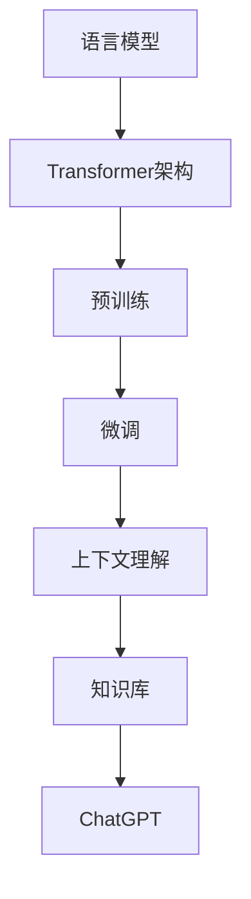

# AIGC从入门到实战：赋能高级技能，利用ChatGPT来快速编程

## 1. 背景介绍

### 1.1 问题的由来

在当今科技飞速发展的时代，编程已经成为一项基本技能。无论是学生、专业人士还是业余爱好者,掌握编程都可以为他们打开通往成功的大门。然而,编程并非一蹴而就,需要长期的学习和实践。传统的编程学习方式往往枯燥乏味,缺乏实践机会,导致学习效率低下。

### 1.2 研究现状

近年来,人工智能技术取得了长足进步,尤其是大型语言模型(LLM)的出现,为编程学习带来了全新的机遇。ChatGPT作为OpenAI推出的一款先进的对话式AI助手,凭借其强大的自然语言处理能力和广博的知识储备,在编程领域展现出了巨大的潜力。

### 1.3 研究意义

利用ChatGPT进行编程学习和辅助编码,可以极大地提高学习效率和编码效率。ChatGPT不仅能够解答编程相关的理论知识,还能根据用户需求生成代码,甚至可以对代码进行优化和调试。这为编程学习者和开发者提供了一个全新的学习和工作方式,有助于缩短学习曲线,提高编码质量,加快项目开发进度。

### 1.4 本文结构

本文将全面介绍如何利用ChatGPT进行编程学习和辅助编码,内容包括:ChatGPT的核心概念、算法原理、数学模型、项目实践、应用场景、工具资源推荐,以及未来发展趋势和挑战。通过本文的学习,读者将能够掌握ChatGPT在编程领域的应用技巧,提高编程能力和工作效率。

## 2. 核心概念与联系

ChatGPT是一种基于自然语言处理(NLP)和机器学习技术的对话式AI助手。它的核心概念包括:

1. **语言模型(Language Model)**: 用于捕捉和学习语言的统计规律,生成自然语言文本。
2. **transformer**: 一种基于注意力机制的神经网络架构,广泛应用于NLP任务中。
3. **预训练(Pre-training)**: 在大规模语料库上进行无监督预训练,获取通用语言知识。
4. **微调(Fine-tuning)**: 在特定任务数据上进行有监督微调,使模型适应特定领域。
5. **上下文理解(Context Understanding)**: 通过捕捉上下文信息,理解用户查询的真实意图。
6. **知识库(Knowledge Base)**: 存储结构化和非结构化知识,为模型输出提供支持。

这些核心概念相互关联,共同构建了ChatGPT的能力。语言模型和transformer架构为生成高质量文本奠定了基础;预训练和微调使模型获得通用和专业知识;上下文理解和知识库则提供了理解查询和生成相关响应的能力。



## 3. 核心算法原理及具体操作步骤

### 3.1 算法原理概述

ChatGPT的核心算法是基于Transformer的自回归语言模型,它通过捕捉输入序列中的上下文信息,预测下一个单词或标记的概率分布。具体来说,它包括以下几个关键步骤:

1. **输入编码**: 将输入文本序列编码为embeddings向量表示。
2. **注意力计算**: 通过多头自注意力机制,捕捉输入序列中不同位置之间的依赖关系。
3. **前馈神经网络**: 对注意力输出进行非线性变换,提取高级特征。
4. **解码器**: 根据输入和之前生成的文本,预测下一个单词或标记的概率分布。
5. **梯度更新**: 通过监督学习,调整模型参数,使生成的文本更接近目标输出。

### 3.2 算法步骤详解

1. **输入编码**

$$\text{Input Embeddings} = \text{Embedding Lookup}(\text{Input Tokens})$$

首先,将输入文本序列tokenize为一系列标记,然后通过查找Embedding矩阵,将每个标记映射为一个固定长度的向量表示。

2. **注意力计算**

$$\text{Attention}(Q, K, V) = \text{softmax}(\frac{QK^T}{\sqrt{d_k}})V$$

- $Q$: Query向量,表示当前位置需要关注的信息
- $K$: Key向量,表示其他位置的信息
- $V$: Value向量,表示其他位置的值
- $d_k$: 缩放因子,用于防止内积过大导致梯度消失

通过计算Query与所有Key的点积,获得注意力分数,然后对分数做softmax归一化,最后将注意力分数与Value相乘,得到当前位置的注意力表示。

3. **前馈神经网络**

$$\text{FFN}(x) = \max(0, xW_1 + b_1)W_2 + b_2$$

对注意力输出进行两次线性变换和一次ReLU非线性激活,提取高级特征表示。

4. **解码器**

$$P(y_t|y_{<t}, X) = \text{softmax}(W_o h_t)$$

- $y_t$: 当前时间步生成的单词
- $y_{<t}$: 之前生成的单词序列
- $X$: 输入序列
- $h_t$: 当前时间步的隐藏状态向量,由Transformer编码器根据输入和之前生成的单词计算得到

解码器根据当前隐藏状态向量,计算出下一个单词的概率分布,然后根据概率分布采样或选取概率最大的单词作为输出。

5. **梯度更新**

$$\mathcal{L} = -\sum\limits_{t=1}^T \log P(y_t|y_{<t}, X)$$

通过最小化模型生成的单词序列与目标单词序列之间的负对数似然损失函数,使用优化算法(如Adam)更新模型参数。

### 3.3 算法优缺点

**优点**:

- 自回归语言模型能够生成连贯、上下文相关的文本输出。
- Transformer架构通过注意力机制捕捉长距离依赖关系,有助于生成高质量的文本。
- 可以通过预训练和微调,在大规模语料上获取通用和专业知识。

**缺点**:

- 生成过程是序列式的,无法并行化,导致生成效率较低。
- 对于较长的输入序列,注意力计算的复杂度会迅速增加。
- 存在潜在的安全和偏见风险,生成的输出可能包含不当或有害内容。

### 3.4 算法应用领域

ChatGPT及其核心算法不仅可以应用于编程辅助,还可以广泛用于以下领域:

- 自然语言处理任务:文本生成、机器翻译、问答系统等。
- 创作写作:小说、诗歌、新闻稿件等内容生成。
- 对话系统:智能客服、虚拟助手等。
- 知识图谱构建:从非结构化文本中抽取实体、关系等知识。
- 代码生成:根据需求自动生成代码,加速开发流程。

## 4. 数学模型和公式详细讲解及举例说明

### 4.1 数学模型构建

ChatGPT的核心是一个基于Transformer的自回归语言模型,旨在最大化给定上下文下生成目标序列的条件概率:

$$P(Y|X) = \prod_{t=1}^{T}P(y_t|y_{<t}, X)$$

其中:
- $X$是输入序列
- $Y$是目标输出序列
- $y_t$是时间步$t$生成的单词
- $y_{<t}$是之前生成的单词序列

为了计算该条件概率,我们需要构建一个神经网络模型,对给定的输入$X$和部分输出$y_{<t}$,预测下一个单词$y_t$的概率分布。

### 4.2 公式推导过程

我们定义模型的输出为:

$$P(y_t|y_{<t}, X) = \text{softmax}(W_o h_t)$$

其中$h_t$是时间步$t$的隐藏状态向量,由Transformer编码器根据输入$X$和之前生成的单词$y_{<t}$计算得到。

$W_o$是一个可训练的权重矩阵,用于将隐藏状态向量映射到词汇表大小的logits向量。softmax函数则将logits向量归一化为概率分布。

为了获得$h_t$,我们需要计算注意力权重:

$$\text{Attention}(Q, K, V) = \text{softmax}(\frac{QK^T}{\sqrt{d_k}})V$$

其中$Q$、$K$、$V$分别是Query、Key和Value向量,通过多头注意力机制计算得到。$d_k$是缩放因子,用于防止内积过大导致梯度消失。

最终,隐藏状态向量$h_t$由注意力输出和前馈神经网络计算得到:

$$h_t = \text{FFN}(\text{Attention}(Q_t, K, V))$$

$$\text{FFN}(x) = \max(0, xW_1 + b_1)W_2 + b_2$$

其中$W_1$、$W_2$、$b_1$、$b_2$是可训练的权重和偏置参数。

通过最小化模型生成的单词序列与目标单词序列之间的负对数似然损失函数,可以学习到模型参数:

$$\mathcal{L} = -\sum\limits_{t=1}^T \log P(y_t|y_{<t}, X)$$

### 4.3 案例分析与讲解

假设我们要生成一个Python函数,用于计算两个数字的最大公约数。首先,我们将任务描述输入到ChatGPT:

```
Generate a Python function to calculate the greatest common divisor (GCD) of two numbers
```

ChatGPT会根据输入,生成相应的Python代码:

```python
def gcd(a, b):
    """
    Calculate the greatest common divisor of two integers a and b.
    """
    while b != 0:
        a, b = b, a % b
    return a
```

让我们分析一下ChatGPT是如何生成这段代码的:

1. 输入编码:将输入文本序列"Generate a Python..."编码为embeddings向量表示。

2. 注意力计算:根据输入,计算Query、Key和Value向量,并通过多头注意力机制捕捉它们之间的依赖关系。

3. 解码器:基于注意力输出和之前生成的代码片段(如函数定义`def gcd(a, b):`),预测下一个单词或标记的概率分布。例如,在生成函数docstring时,解码器会根据上下文预测`"""Calculate`的概率较高。

4. 梯度更新:将生成的代码与期望输出(最大公约数算法的正确实现)进行比较,计算损失函数,并使用优化算法(如Adam)更新模型参数,使下次生成的代码更加准确。

通过上述步骤的迭代,ChatGPT最终生成了正确的Python函数实现。值得注意的是,ChatGPT并非简单地从知识库中检索代码片段,而是根据输入上下文,利用学习到的模式生成新的代码。

### 4.4 常见问题解答

**Q: ChatGPT生成的代码是否总是正确的?**

A: 不是。ChatGPT生成的代码可能存在错误或不完整的情况,需要人工审查和修改。它只是一个辅助工具,而不是完全可靠的代码生成器。

**Q: ChatGPT能否生成任何编程语言的代码?**

A: 理论上,ChatGPT可以生成多种编程语言的代码,但实际表现取决于它在特定语言上的训练数据。对于一些小众语言,生成质量可能不太理想。

**Q: ChatGPT如何处理复杂的算法和数据结构?**

A: ChatGPT可以生成一定复杂度的算法和数据结构实现,但对于一些非常复杂的情况,它可能只能给出伪代码或概念性的描述。

**Q: ChatGPT生成的代码是否可以直接用于生产环境?**

A: 不建议直接将ChatGPT生成的代码用于生产环境,因为它可能存在安全隐患或未经充分测试。需