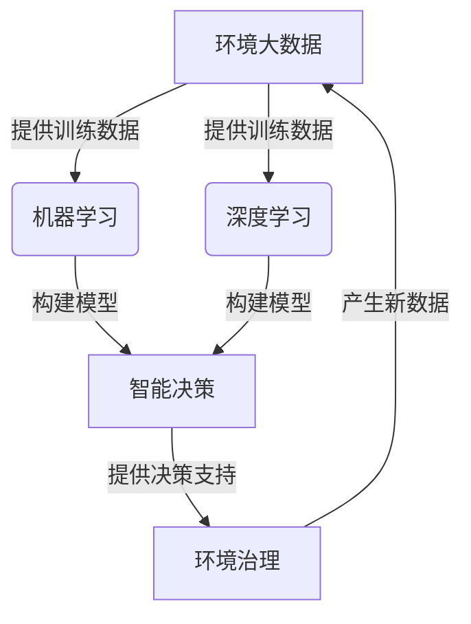

# AI人工智能 Agent：在环保领域中的应用

## 1. 背景介绍

### 1.1 问题的由来

随着工业化进程的加快和城市化水平的不断提高,环境污染问题日益严重,已经成为了全球性的挑战。大气污染、水污染、土壤污染等环境问题不仅危害人类健康,还对生态系统造成了巨大破坏。传统的环保方式和管理手段已经难以应对日益复杂的环境问题,迫切需要采用新的技术手段来解决这一挑战。

### 1.2 研究现状  

近年来,人工智能(AI)技术在环保领域的应用受到了广泛关注。AI技术具有数据处理能力强、模式识别精准、决策智能化等优势,可以为环境监测、污染预测、治理决策等环节提供有力支持。目前,AI已经在环境质量监测、污染源识别、生态保护等多个领域取得了初步应用,但仍处于起步阶段,应用深度和广度有待进一步拓展。

### 1.3 研究意义

将AI技术应用于环保领域,可以极大提高环境监测和治理的精准性、高效性和智能化水平。通过建立基于AI的环境大数据分析平台,能够实现对环境数据的智能化处理和决策支持,为制定科学的环保政策和措施提供依据。同时,AI技术在环境预测预警、生态系统保护等方面也具有广阔的应用前景,有助于实现环境的可持续发展。

### 1.4 本文结构

本文将全面介绍AI在环保领域的应用,包括背景介绍、核心概念、算法原理、数学模型、项目实践、应用场景、工具资源等多个方面,旨在为读者提供系统的理解和实践指导。

## 2. 核心概念与联系

在环保领域应用AI技术涉及多个核心概念,包括环境大数据、机器学习、深度学习、智能决策等,这些概念之间存在紧密联系。

1. **环境大数据**是AI应用的基础,包括环境监测数据、遥感影像数据、气象数据等,为机器学习算法提供了海量的训练数据。

2. **机器学习**算法可以从环境大数据中自动学习特征模式,构建环境质量评估、污染源识别等模型,为智能决策提供支持。

3. **深度学习**作为机器学习的一个分支,通过构建深层神经网络模型,可以对复杂的环境数据进行高效处理和特征提取,在环境预测等领域具有广泛应用前景。

4. **智能决策**系统基于机器学习和深度学习模型的输出,结合领域知识和决策规则,为环境治理提供智能化的决策支持,实现精准高效的环境管理。

5. 环境治理的实施将产生新的环境数据,反馈到环境大数据平台,形成闭环,为AI模型的持续优化和迭代提供数据支持。

通过环境大数据、机器学习、深度学习、智能决策等核心概念的有机结合,AI技术可以为环保领域带来全新的发展机遇。

## 3. 核心算法原理 & 具体操作步骤

### 3.1 算法原理概述

在环保领域应用AI技术主要涉及以下几种核心算法:

1. **监督学习算法**:利用标注好的环境数据训练模型,用于环境质量评估、污染源识别等任务。常用算法包括决策树、支持向量机、神经网络等。

2. **无监督学习算法**:对未标注的环境数据进行聚类分析,发现潜在模式,用于环境异常检测、数据分类等。常用算法包括K-Means聚类、高斯混合模型等。

3. **深度学习算法**:利用深层神经网络模型对复杂环境数据进行特征提取和模式识别,用于环境预测、智能决策等。常用算法包括卷积神经网络、递归神经网络、生成对抗网络等。

4. **强化学习算法**:通过与环境交互并获取反馈,不断优化决策策略,用于智能调度、资源优化等任务。常用算法包括Q-Learning、策略梯度等。

5. **集成学习算法**:将多种算法模型集成,提高预测精度和鲁棒性,常用于环境质量综合评估等场景。常用算法包括随机森林、Boosting、Bagging等。

这些算法原理各有侧重,需要根据具体应用场景选择合适的算法模型。

### 3.2 算法步骤详解

以监督学习算法为例,在环境质量评估任务中的具体步骤如下:

1. **数据采集与预处理**:收集环境监测数据,包括空气质量指标、水质指标等,对异常值和缺失值进行处理。

2. **特征工程**:从原始数据中提取有意义的特征,如地理位置、时间等,以构建特征向量。

3. **数据标注**:邀请专家对环境质量数据进行人工标注,作为模型的监督信号。

4. **训练集/测试集划分**:将数据划分为训练集和测试集,用于模型训练和性能评估。

5. **模型选择与训练**:选择合适的监督学习算法,如决策树、支持向量机等,使用训练集对模型进行训练。

6. **模型评估**:在测试集上评估模型的性能指标,如准确率、精确率、召回率等。

7. **模型调优**:根据评估结果,通过调整算法参数、特征选择等方式优化模型性能。

8. **模型部署**:将训练好的模型集成到环境质量评估系统中,用于实际应用场景。

### 3.3 算法优缺点

不同AI算法在环保领域的应用均有各自的优缺点:

1. **监督学习算法**:
   - 优点:模型可解释性强,预测精度较高。
   - 缺点:需要大量标注数据,对数据质量要求较高。

2. **无监督学习算法**:
   - 优点:无需人工标注,可发现潜在模式。
   - 缺点:结果解释性较差,受噪声影响较大。

3. **深度学习算法**:
   - 优点:对复杂数据有强大的建模能力。
   - 缺点:模型可解释性较差,需要大量训练数据。

4. **强化学习算法**:
   - 优点:可以自主学习最优决策策略。
   - 缺点:训练过程复杂,收敛性能不稳定。

5. **集成学习算法**:
   - 优点:融合多种模型,预测性能更加稳健。
   - 缺点:模型复杂度较高,可解释性降低。

在实际应用中,需要根据具体任务特点选择合适的算法,或将多种算法相结合,发挥各自的优势。

### 3.4 算法应用领域

AI算法在环保领域的应用主要包括以下几个方面:

1. **环境质量评估**:利用监督学习、集成学习等算法,对大气、水体、土壤等环境质量进行智能化评估。

2. **污染源识别**:通过无监督学习算法对环境数据进行聚类分析,识别潜在的污染源。

3. **环境预测**:基于深度学习算法,构建环境质量、气象条件等预测模型,实现智能预警。

4. **智能决策**:融合机器学习、知识图谱等技术,为环境治理提供决策支持和优化方案。

5. **生态保护**:利用强化学习算法优化资源调度策略,实现能源节约和生态环境保护。

6. **环境大数据处理**:通过深度学习、迁移学习等算法,实现对海量环境数据的高效处理和知识迁移。

上述应用场景均需要AI算法的支撑,未来还将有更多创新应用不断涌现。

## 4. 数学模型和公式 & 详细讲解 & 举例说明

在环保领域应用AI技术过程中,常常需要构建数学模型并推导公式,对环境系统进行量化描述和分析。

### 4.1 数学模型构建

以大气污染扩散模型为例,我们可以构建如下数学模型:

假设污染物在大气中的扩散过程遵循扩散方程:

$$
\frac{\partial C}{\partial t} = D\nabla^2C - u\cdot\nabla C + S
$$

其中:
- $C(x,y,z,t)$表示污染物在$(x,y,z)$位置、时刻$t$的浓度
- $D$为扩散系数
- $u$为风速场
- $S$为污染源源项

通过对上述方程进行求解,可以获得污染物在不同时空位置的浓度分布情况。

### 4.2 公式推导过程

为了求解上述扩散方程,我们可以采用数值方法,如有限差分法:

$$
\frac{C_{i,j,k}^{n+1} - C_{i,j,k}^n}{\Delta t} = D\left(\frac{C_{i+1,j,k}^n - 2C_{i,j,k}^n + C_{i-1,j,k}^n}{\Delta x^2} + \frac{C_{i,j+1,k}^n - 2C_{i,j,k}^n + C_{i,j-1,k}^n}{\Delta y^2} + \frac{C_{i,j,k+1}^n - 2C_{i,j,k}^n + C_{i,j,k-1}^n}{\Delta z^2}\right) - u_x\frac{C_{i+1,j,k}^n - C_{i-1,j,k}^n}{2\Delta x} - u_y\frac{C_{i,j+1,k}^n - C_{i,j-1,k}^n}{2\Delta y} - u_z\frac{C_{i,j,k+1}^n - C_{i,j,k-1}^n}{2\Delta z} + S_{i,j,k}^n
$$

其中$\Delta x$、$\Delta y$、$\Delta z$、$\Delta t$分别表示空间和时间步长。通过迭代计算,可以获得污染物浓度在不同时空位置的数值解。

### 4.3 案例分析与讲解

假设某城市有一个化工厂作为污染源,我们可以利用上述模型对其排放的污染物进行浓度模拟:

已知:
- 污染源位置$(x_0, y_0, z_0) = (1000, 2000, 50)$
- 排放强度$S_0 = 100\text{kg/s}$
- 扩散系数$D = 10\text{m}^2/\text{s}$
- 风速场$u = (2, 1, 0)\text{m/s}$

将这些参数代入模型,通过数值求解,我们可以获得污染物在不同时空位置的浓度分布场$C(x,y,z,t)$。

例如,在$t=3600\text{s}$时刻,距离污染源$(5000, 5000, 50)$处的污染物浓度约为$10\mu\text{g/m}^3$。通过可视化技术,我们可以直观展示污染物的扩散过程,为环境监测和应急决策提供支持。

### 4.4 常见问题解答

1. **如何处理模型中的边界条件?**

   在实际求解过程中,我们需要对模型的边界条件进行设置,如大气边界层高度、地形障碍等,可以采用反射边界条件、对流边界条件等不同处理方式。

2. **如何考虑气象条件的影响?**

   气象条件如风场、温度、湿度等会显著影响污染物的扩散过程。我们可以将这些条件作为输入,融入到扩散模型中,提高模拟精度。

3. **如何处理多种污染源的情况?**

   对于多个污染源的情况,我们可以将每个污染源的贡献进行叠加,获得总体的污染物浓度分布场。同时也需要考虑不同污染物之间的化学反应等复杂情况。

4. **模型的计算效率如何?**

   数值求解过程往往计算量很大,我们可以采用并行计算、模型简