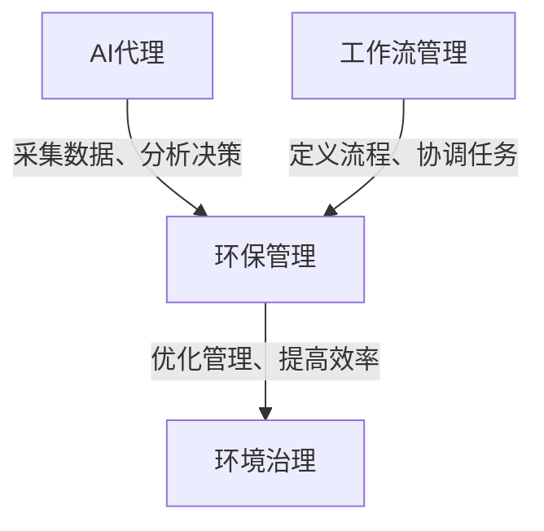
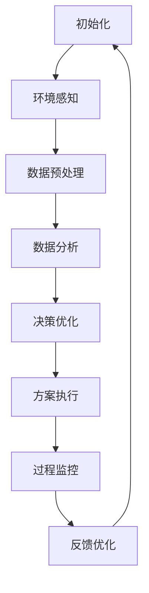

# AI人工智能代理工作流 AI Agent WorkFlow：在环保行业中的应用

## 1. 背景介绍

### 1.1 问题的由来

随着工业化进程的不断加快,环境污染问题日益严峻,已经成为全球关注的热点话题。传统的环保管理模式存在诸多不足,如数据采集困难、分析效率低下、决策缓慢等,难以满足当前环境治理的需求。因此,迫切需要一种高效、智能的环保管理系统,以应对日益复杂的环境挑战。

### 1.2 研究现状

近年来,人工智能(AI)技术在环保领域得到了广泛应用,展现出巨大的潜力。AI代理可以通过自主学习、决策和执行,实现对环境数据的高效采集、分析和管理。然而,现有的AI代理系统通常专注于某一特定环节,缺乏全流程的智能化管理。

### 1.3 研究意义

本文提出了一种基于AI代理的环保管理工作流(AI Agent Workflow for Environmental Protection,简称AAWEP),旨在实现环保全流程的智能化管理。AAWEP将AI代理技术与工作流管理相结合,构建了一个高效、协同的智能环保系统,能够有效提高环境监测、分析和决策的效率,为环境治理提供强有力的技术支持。

### 1.4 本文结构

本文首先介绍AAWEP的核心概念和架构,然后详细阐述其核心算法原理和数学模型。接下来,通过实际项目案例,展示AAWEP在环保行业中的具体应用。最后,探讨AAWEP的未来发展趋势和面临的挑战。

## 2. 核心概念与联系

AAWEP的核心概念包括AI代理、工作流管理和环保管理三个方面,它们之间存在着紧密的联系。

- **AI代理**:AI代理是一种具有自主性、反应性、主动性和社会性的智能体,能够感知环境、学习知识、做出决策并执行相应的行为。在AAWEP中,AI代理负责环境数据的采集、分析和决策,是实现智能化环保管理的关键。

- **工作流管理**:工作流管理是一种对业务流程进行建模、自动化和优化的方法。在AAWEP中,工作流管理用于定义和协调环保管理的各个环节,确保AI代理之间的协作和任务的有序执行。

- **环保管理**:环保管理是指对环境质量进行监测、评估、决策和治理的一系列活动。AAWEP将AI代理和工作流管理技术应用于环保管理的各个环节,实现了环保全流程的智能化管理。

通过将AI代理、工作流管理和环保管理有机结合,AAWEP构建了一个高效、智能的环保管理系统,能够实现环境数据的自动采集、智能分析和优化决策,从而提高环境治理的效率和质量。

## 3. 核心算法原理 & 具体操作步骤

### 3.1 算法原理概述

AAWEP的核心算法基于多智能体系统(Multi-Agent System,MAS)和工作流模型(Workflow Model)。MAS提供了AI代理之间的协作机制,而工作流模型则定义了环保管理的流程和规则。

在AAWEP中,每个AI代理都被赋予特定的角色和任务,如数据采集代理、分析代理和决策代理等。这些代理通过消息传递和协商机制进行交互,共同完成环保管理的各个环节。同时,工作流引擎负责监控和协调整个流程,确保任务按照预定义的规则有序执行。

### 3.2 算法步骤详解

AAWEP的算法步骤如下:

1. **初始化**:系统启动时,工作流引擎根据预定义的流程模型创建相应的AI代理,并分配它们的角色和任务。

2. **环境感知**:数据采集代理通过各种传感器和设备采集环境数据,如空气质量、水质、噪音等。

3. **数据预处理**:采集到的原始数据由数据预处理代理进行清洗、标准化和特征提取等操作,为后续分析做准备。

4. **数据分析**:分析代理基于机器学习和数据挖掘算法,对预处理后的数据进行分析,识别环境问题和污染源。

5. **决策优化**:决策代理根据分析结果,结合环保政策和约束条件,运用优化算法制定治理方案。

6. **方案执行**:执行代理负责将治理方案落实到实际操作中,如调度环保设备、发布预警信息等。

7. **过程监控**:工作流引擎持续监控整个流程,一旦发现异常情况,将触发相应的异常处理机制。

8. **反馈优化**:系统根据实际执行效果,对算法模型和流程规则进行优化,形成闭环反馈机制。

### 3.3 算法优缺点

**优点**:

- 高效协作:AI代理之间通过消息传递和协商实现高效协作,提高了系统的响应速度和决策质量。
- 可扩展性:基于模块化设计,新的AI代理和功能可以方便地集成到系统中。
- 智能决策:利用机器学习和优化算法,能够做出科学、高效的环保决策。
- 过程自动化:工作流引擎实现了环保管理流程的自动化和标准化。

**缺点**:

- 系统复杂度高:涉及多个AI代理的协作,增加了系统的复杂性。
- 数据质量依赖:算法的准确性和效果在很大程度上依赖于输入数据的质量。
- 算法偏差:机器学习算法可能存在偏差,导致决策结果不准确。
- 安全隐患:分布式系统面临潜在的安全风险,如数据泄露和恶意攻击。

### 3.4 算法应用领域

AAWEP算法可以应用于环保管理的多个领域,包括但不限于:

- 空气质量监测和治理
- 水资源保护和污染防治
- 土壤环境监测和修复
- 噪音污染控制
- 固体废弃物管理
- 生态环境保护
- 应急环境事件响应

## 4. 数学模型和公式 & 详细讲解 & 举例说明

### 4.1 数学模型构建

在AAWEP中,我们构建了多个数学模型来支持环保管理的各个环节。这些模型包括:

1. **环境质量评估模型**:基于监测数据,评估环境质量的状况,如空气质量指数(AQI)模型、水质评价模型等。

2. **污染源识别模型**:通过机器学习算法,识别污染物的来源和影响范围,如逆向传播模型、聚类分析模型等。

3. **决策优化模型**:将环保目标、约束条件和治理方案进行建模,并运用优化算法寻找最佳解决方案,如多目标优化模型、约束规划模型等。

4. **过程模拟模型**:模拟治理方案实施后的环境变化,预测其效果和潜在风险,如大气扩散模型、水文模型等。

以空气质量评估模型为例,我们可以构建如下数学模型:

$$AQI = \sum_{i=1}^{n}w_i \times I_i$$

其中,$$AQI$$表示空气质量指数,$$I_i$$表示第$$i$$种污染物的浓度指数,$$w_i$$为对应的权重系数,$$n$$为考虑的污染物种类数。

通过对不同污染物浓度的加权求和,我们可以得到综合的空气质量评估指标AQI。该模型不仅可以评估当前的空气质量状况,还可以用于预测未来的变化趋势。

### 4.2 公式推导过程

以空气质量评估模型为例,我们将详细推导AQI公式的构建过程。

首先,我们需要确定评估空气质量所需考虑的主要污染物种类,如PM2.5、PM10、SO2、NO2、O3和CO等。对于每种污染物,我们定义一个浓度指数$$I_i$$,用于量化其对空气质量的影响程度。

$$I_i = \frac{C_i - C_{i,min}}{C_{i,max} - C_{i,min}} \times 100$$

其中,$$C_i$$表示第$$i$$种污染物的实际浓度,$$C_{i,min}$$和$$C_{i,max}$$分别为该污染物的最小和最大浓度阈值。通过线性插值,我们可以将实际浓度映射到0-100的范围内,得到相应的浓度指数$$I_i$$。

接下来,我们需要确定每种污染物对空气质量的权重系数$$w_i$$。这些权重系数通常由环保专家根据污染物的毒性、持久性和影响范围等因素确定。

$$w_i = \frac{1}{n}\sum_{j=1}^{m}x_{ij}$$

其中,$$n$$表示专家人数,$$m$$表示考虑的评价指标数量,$$x_{ij}$$为第$$j$$个专家对第$$i$$种污染物的评分(通常采用0-1之间的分数)。

最后,将每种污染物的浓度指数$$I_i$$与对应的权重系数$$w_i$$相乘,再求和,我们就可以得到综合的空气质量指数AQI:

$$AQI = \sum_{i=1}^{n}w_i \times I_i$$

通过这个公式,我们可以将多种污染物的浓度信息融合起来,得到一个综合的空气质量评估指标,方便进行后续的决策和治理。

### 4.3 案例分析与讲解

为了更好地理解AQI模型的应用,我们以北京市为例,分析2022年1月1日的空气质量状况。

假设当天的污染物浓度数据如下:

- PM2.5: 80 $$\mu$$g/m³
- PM10: 120 $$\mu$$g/m³
- SO2: 30 $$\mu$$g/m³
- NO2: 50 $$\mu$$g/m³
- O3: 120 $$\mu$$g/m³
- CO: 3 mg/m³

根据国家环保标准,我们确定各污染物的最小和最大浓度阈值如下:

- PM2.5: (0, 500) $$\mu$$g/m³
- PM10: (0, 600) $$\mu$$g/m³
- SO2: (0, 800) $$\mu$$g/m³
- NO2: (0, 200) $$\mu$$g/m³
- O3: (0, 800) $$\mu$$g/m³
- CO: (0, 10) mg/m³

根据公式计算各污染物的浓度指数:

$$I_{PM2.5} = \frac{80 - 0}{500 - 0} \times 100 = 16$$
$$I_{PM10} = \frac{120 - 0}{600 - 0} \times 100 = 20$$
$$I_{SO2} = \frac{30 - 0}{800 - 0} \times 100 = 3.75$$
$$I_{NO2} = \frac{50 - 0}{200 - 0} \times 100 = 25$$
$$I_{O3} = \frac{120 - 0}{800 - 0} \times 100 = 15$$
$$I_{CO} = \frac{3 - 0}{10 - 0} \times 100 = 30$$

假设各污染物的权重系数为:

$$w_{PM2.5} = 0.25, w_{PM10} = 0.2, w_{SO2} = 0.1, w_{NO2} = 0.15, w_{O3} = 0.2, w_{CO} = 0.1$$

则综合空气质量指数AQI为:

$$\begin{aligned}
AQI &= 0.25 \times 16 + 0.2 \times 20 + 0.1 \times 3.75 + 0.15 \times 25 + 0.2 \times 15 + 0.1 \times 30 \\
    &= 4 + 4 + 0.375 + 3.75 + 3 + 