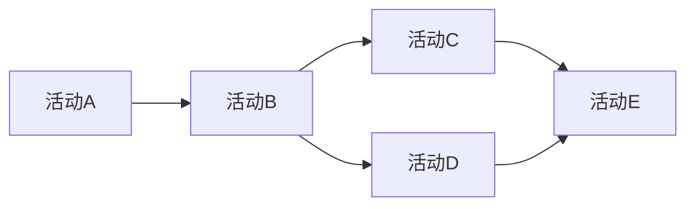

# AI人工智能代理工作流AI Agent WorkFlow：使用强化学习优化代理工作流

## 1. 背景介绍

### 1.1 问题的由来

在当今快节奏的商业环境中,企业面临着不断优化业务流程以提高效率和降低成本的压力。传统的工作流管理系统通常依赖于预定义的规则和流程,这使得它们在动态和不确定的环境中难以灵活适应。此外,随着业务复杂性的增加,手动优化工作流变得越来越具有挑战性。

强化学习(Reinforcement Learning,RL)作为机器学习的一个分支,为解决这一问题提供了一种有前景的方法。RL代理可以通过与环境的交互来学习最优策略,而无需显式编程。这使得RL代理能够自主地优化复杂的决策过程,包括业务工作流。

### 1.2 研究现状

近年来,将强化学习应用于工作流优化的研究越来越受到关注。一些学者提出了基于强化学习的工作流管理框架,展示了RL代理在简化工作流、提高效率和降低成本方面的潜力。然而,大多数现有研究都集中在特定领域或简化的场景,缺乏一个通用的、可扩展的解决方案。

### 1.3 研究意义

本文旨在提出一种通用的基于强化学习的AI代理工作流优化框架。该框架能够自动学习和优化复杂的业务工作流,同时考虑多个目标,如效率、成本和质量。通过将强化学习与工作流管理相结合,我们可以实现真正的自适应和智能化工作流,从而帮助企业提高竞争力。

### 1.4 本文结构  

本文首先介绍强化学习和工作流管理的基本概念。接下来,我们详细阐述了提出的AI代理工作流优化框架的核心组件和算法原理。然后,我们构建了数学模型并推导出相关公式。在实践部分,我们提供了一个端到端的代码示例,并对其进行了详细的解释和分析。最后,我们探讨了该框架在实际应用场景中的潜力,并总结了未来的发展趋势和挑战。

## 2. 核心概念与联系

在深入探讨我们的AI代理工作流优化框架之前,让我们先回顾一下强化学习和工作流管理的核心概念。

**强化学习(Reinforcement Learning)**是一种机器学习范式,其中智能体(代理)通过与环境的交互来学习如何采取最优策略,以最大化预期的累积奖励。强化学习问题通常被形式化为马尔可夫决策过程(Markov Decision Process,MDP)。

**工作流管理(Workflow Management)**是一种管理和自动化业务流程的方法。工作流由一系列相互关联的活动组成,这些活动按特定的顺序执行以实现预定的业务目标。传统的工作流管理系统通常依赖于预定义的规则和流程模型。

我们的AI代理工作流优化框架将强化学习与工作流管理相结合,创建了一种自适应和智能化的工作流管理系统。在这种系统中,强化学习代理作为工作流执行引擎,通过与环境(即实际的业务流程)交互来学习最优的工作流策略。这种方法允许代理动态优化工作流,而不需要预先定义复杂的规则或模型。

## 3. 核心算法原理与具体操作步骤

### 3.1 算法原理概述

我们的AI代理工作流优化框架基于强化学习的核心思想。具体来说,我们将工作流管理问题建模为一个马尔可夫决策过程(MDP),其中:

- **状态(State)**: 描述当前工作流的状态,包括已完成的活动、pending活动、相关数据等。
- **动作(Action)**: 代理可以采取的操作,如启动新活动、终止活动、分配资源等。
- **奖励(Reward)**: 根据优化目标(如效率、成本、质量等)计算的奖励或惩罚信号。
- **转移函数(Transition Function)**: 定义了在采取特定动作后,状态如何转移到下一个状态。
- **策略(Policy)**: 代理的决策逻辑,即在给定状态下选择采取何种动作。

我们的目标是找到一个最优策略,使得在执行工作流时获得的累积奖励最大化。为此,我们采用了一种基于值函数(Value Function)的强化学习算法,如Q-Learning或Deep Q-Network(DQN)。

该算法的核心思想是通过与环境交互来更新一个动作-状态值函数Q(s,a),该函数估计在状态s下采取动作a后可获得的预期累积奖励。通过不断更新Q函数,代理可以逐步改进其策略,直到收敛到最优策略。

### 3.2 算法步骤详解

我们的AI代理工作流优化算法可以概括为以下步骤:

1. **初始化**: 初始化Q函数(如使用神经网络)和工作流状态。

2. **选择动作**: 根据当前状态和Q函数值,使用某种策略(如ε-贪婪策略)选择一个动作。

3. **执行动作**: 在工作流环境中执行选定的动作,观察新的状态和获得的奖励。

4. **更新Q函数**: 根据新的状态、动作和奖励,使用时序差分(Temporal Difference,TD)学习规则更新Q函数。

5. **重复步骤2-4**: 重复选择动作、执行动作和更新Q函数的过程,直到工作流完成或达到最大迭代次数。

6. **策略改进**: 根据更新后的Q函数,提取出一个新的改进策略。

7. **重复步骤1-6**: 在新的工作流实例上重复上述过程,不断改进策略。

在实际实现中,我们可以使用各种技术来加速训练过程和提高性能,如经验回放(Experience Replay)、目标网络(Target Network)和双重Q学习(Double Q-Learning)等。

### 3.3 算法优缺点

**优点**:

- **自适应性强**: 算法可以自主学习最优策略,而无需预先定义复杂的规则或模型。
- **通用性好**: 该框架可以应用于各种类型的工作流,只需正确建模状态、动作和奖励。
- **多目标优化**: 可以通过设计合适的奖励函数来同时优化多个目标,如效率、成本和质量。
- **持续改进**: 算法可以通过不断与环境交互来持续改进其策略。

**缺点**:

- **训练开销大**: 强化学习算法通常需要大量的训练数据和计算资源。
- **收敛性问题**: 在复杂的工作流环境中,算法可能难以收敛到最优策略。
- **奖励设计挑战**: 设计合适的奖励函数对算法性能至关重要,但并非易事。
- **可解释性差**: 强化学习算法通常被视为"黑盒",其决策过程难以解释。

### 3.4 算法应用领域

我们的AI代理工作流优化框架可以应用于各种领域,包括但不限于:

- **业务流程自动化(BPA)**: 优化企业内部的各种业务流程,如采购、销售、人力资源等。
- **服务编排(Service Orchestration)**: 在云计算和微服务架构中,自动编排和优化服务调用流程。
- **智能制造(Smart Manufacturing)**: 优化制造过程中的工作流,提高生产效率和产品质量。
- **医疗保健(Healthcare)**: 优化医疗诊断和治疗流程,提高医疗质量和患者体验。
- **智能交通(Intelligent Transportation)**: 优化交通流量控制和路线规划等流程。

总的来说,任何涉及复杂决策过程和需要动态优化的领域,都可以从我们的框架中受益。

## 4. 数学模型和公式详细讲解与举例说明

### 4.1 数学模型构建

为了形式化描述我们的AI代理工作流优化问题,我们将其建模为一个马尔可夫决策过程(MDP)。一个MDP可以用一个五元组(S,A,P,R,γ)来表示,其中:

- S是状态空间的集合
- A是动作空间的集合
- P是状态转移概率函数,P(s'|s,a)表示在状态s下执行动作a后,转移到状态s'的概率
- R是奖励函数,R(s,a,s')表示在状态s下执行动作a并转移到状态s'时获得的奖励
- γ∈[0,1]是折现因子,用于权衡即时奖励和长期奖励的重要性

在我们的工作流优化问题中,状态s可以用一个向量来表示,包括已完成的活动、pending活动、相关数据等信息。动作a可以是启动新活动、终止活动、分配资源等操作。奖励函数R可以根据优化目标(如效率、成本、质量等)来设计。

我们的目标是找到一个最优策略π*,使得在执行工作流时获得的预期累积折现奖励最大化,即:

$$π* = \arg\max_π \mathbb{E}_π \left[ \sum_{t=0}^\infty \gamma^t R(s_t, a_t, s_{t+1}) \right]$$

其中,t是时间步长,s_t和a_t分别是第t步的状态和动作。

### 4.2 公式推导过程

为了求解上述最优化问题,我们引入了Q函数(Action-Value Function)的概念。Q函数Q(s,a)定义为在状态s下执行动作a后,可获得的预期累积折现奖励:

$$Q(s,a) = \mathbb{E}_π \left[ \sum_{t=0}^\infty \gamma^t R(s_t, a_t, s_{t+1}) \mid s_0=s, a_0=a \right]$$

我们可以使用贝尔曼方程(Bellman Equation)来递归地定义Q函数:

$$Q(s,a) = \mathbb{E}_{s' \sim P(\cdot|s,a)} \left[ R(s,a,s') + \gamma \max_{a'} Q(s',a') \right]$$

这个方程揭示了一个重要的关系:Q(s,a)等于在状态s下执行动作a后获得的即时奖励R(s,a,s'),加上折现后的下一状态s'的最大Q值。

通过不断更新Q函数使其满足上述贝尔曼方程,我们可以找到最优Q函数Q*,对应的策略π*就是我们所需的最优策略。

为了更新Q函数,我们可以使用时序差分(Temporal Difference,TD)学习规则:

$$Q(s_t,a_t) \leftarrow Q(s_t,a_t) + \alpha \left[ R(s_t,a_t,s_{t+1}) + \gamma \max_{a'} Q(s_{t+1},a') - Q(s_t,a_t) \right]$$

其中,α是学习率,控制着更新的步长。

在实践中,我们通常使用神经网络来近似Q函数,并通过梯度下降等优化算法来更新网络参数,使得Q函数逐渐收敛到最优解。

### 4.3 案例分析与讲解

为了更好地理解上述数学模型和公式,让我们来分析一个简单的工作流优化案例。

假设我们有一个包含5个活动的工作流,如下所示:

我们的目标是最小化工作流的总执行时间。因此,我们可以将奖励函数R(s,a,s')定义为:

$$R(s,a,s') = \begin{cases}
    -t & \text{如果a是启动新活动} \\
    0 & \text{否则}
\end{cases}$$

其中,t是启动该活动所需的时间。

现在,让我们来看一个具体的状态s和动作a。假设当前状态s是:活动A和B已完成,活动C和D pending。如果我们执行动作a(启动活动C),我们将获得奖励R(s,a,s') = -t_C,其中t_C是活动C的执行时间。

根据状态转移函数P,下一个状态s'将是:活动A、B和C已完成,活动D和E pending。在这个新状态下,我们需要计算Q(s',a')的最大值,以更新Q(s,a)。

通过不断执行这样的更新过程,Q函数