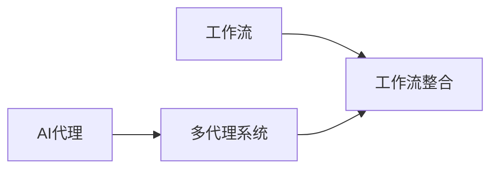
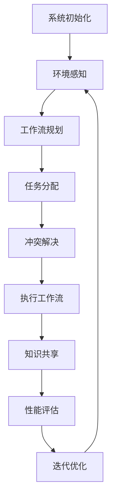

# AI人工智能代理工作流AI Agent WorkFlow：多代理系统的工作流整合方法

## 1. 背景介绍

### 1.1 问题的由来

在当今快节奏的商业环境中，企业面临着日益复杂的挑战和需求。为了保持竞争力和效率，许多组织正在转向采用人工智能(AI)代理系统来自动化和优化各种任务和流程。然而,随着AI代理系统的不断增加,管理和协调这些代理之间的工作流程变得越来越具有挑战性。

传统的工作流管理系统通常是为人工流程设计的,难以满足AI代理系统的动态性和复杂性需求。AI代理系统具有自主性、智能性和适应性,它们可以根据环境的变化自主做出决策和行动。因此,需要一种新的方法来有效地整合和协调多个AI代理系统的工作流程,以实现最佳的整体性能和效率。

### 1.2 研究现状

目前,已有一些研究致力于解决多代理系统的工作流整合问题。其中一些方法侧重于使用集中式控制器来协调代理之间的交互,而另一些则采用分布式方法,允许代理自主协商和协作。然而,这些现有方法往往存在一些局限性,如可扩展性差、对环境变化的适应性低、代理之间协作效率低等。

### 1.3 研究意义

设计一种高效的多代理系统工作流整合方法,可以带来以下重要意义:

1. **提高系统效率**:通过优化代理之间的协作和任务分配,可以最大限度地利用系统资源,提高整体效率。

2. **增强系统灵活性**:允许动态调整工作流,以适应环境的变化和新的需求,从而提高系统的灵活性和适应性。

3. **降低管理复杂度**:提供一种统一的框架来管理和监控多个代理系统,降低管理的复杂度。

4. **促进AI技术的应用**:为AI代理系统在各种领域(如制造、物流、金融等)的应用提供支持,推动AI技术的发展和应用。

### 1.4 本文结构

本文将详细介绍一种新颖的多代理系统工作流整合方法。文章首先阐述核心概念和原理,然后深入探讨算法细节和数学模型。接下来,将通过实际项目实践和代码示例,展示该方法的具体实现和应用。最后,讨论该方法在实际场景中的应用前景,并总结未来的发展趋势和挑战。

## 2. 核心概念与联系

在介绍多代理系统工作流整合方法之前,需要先了解一些核心概念和它们之间的联系。

### 2.1 AI代理

AI代理是一种具有自主性和智能性的软件实体,能够感知环境、做出决策并采取行动。AI代理可以应用于各种领域,如机器人控制、游戏AI、智能助理等。

### 2.2 工作流

工作流是一系列有序的活动或任务,它们共同完成了一个特定的业务目的或目标。工作流管理系统用于定义、执行、监控和优化这些活动或任务的流程。

### 2.3 多代理系统

多代理系统是由多个AI代理组成的分布式系统,这些代理可以相互协作以完成复杂的任务。每个代理都有自己的目标、知识和能力,但它们需要协调行动以实现整体目标。

### 2.4 工作流整合

工作流整合是将多个AI代理系统的工作流程有效地集成和协调的过程。它涉及到任务分配、资源管理、冲突解决和协作机制等方面。

### 2.5 核心概念关系

上述核心概念之间存在着密切的关系,如下所示:

- AI代理是多代理系统的基本组成单元。
- 工作流描述了任务或活动的流程。
- 多代理系统需要协调各个代理之间的工作流程。
- 工作流整合旨在有效地集成和协调多个AI代理系统的工作流。

## 3. 核心算法原理 & 具体操作步骤

### 3.1 算法原理概述

本文提出的多代理系统工作流整合方法基于以下核心原理:

1. **分层架构**:将整个系统分为多个层次,每一层负责不同的功能和决策。

2. **自适应规划**:代理能够根据环境变化和任务需求动态调整其工作流规划。

3. **协作机制**:代理之间通过协商和协作来分配任务、解决冲突和优化资源利用。

4. **知识共享**:代理可以共享相关知识和经验,以提高整体系统的学习和决策能力。

5. **分布式控制**:系统采用分布式控制机制,避免单点故障,提高可靠性和可扩展性。

### 3.2 算法步骤详解

该算法的具体步骤如下:

1. **系统初始化**:定义代理的类型、能力和初始工作流规划。

2. **环境感知**:代理持续监测环境状态和任务需求的变化。

3. **工作流规划**:基于环境信息和任务需求,代理调整自身的工作流规划。

4. **任务分配**:代理通过协商,根据各自的能力和工作负载分配任务。

5. **冲突解决**:如果出现资源冲突或目标冲突,代理协商解决冲突。

6. **执行工作流**:代理执行分配的任务,并持续监测和调整工作流。

7. **知识共享**:代理将执行过程中获得的知识和经验共享给其他代理。

8. **性能评估**:评估整体系统的性能,并根据需要优化工作流规划和协作机制。

9. **迭代优化**:重复上述步骤,持续优化系统性能。

### 3.3 算法优缺点

**优点**:

- 高效利用资源:通过协作和动态规划,可以最大限度地利用系统资源。
- 高适应性:能够根据环境变化和任务需求动态调整工作流。
- 高可靠性:分布式控制机制避免单点故障,提高系统的可靠性。
- 高可扩展性:可以方便地添加或移除代理,满足不同规模的需求。
- 知识累积:代理可以共享知识和经验,促进整体系统的学习和优化。

**缺点**:

- 复杂性较高:需要设计复杂的协作机制和决策算法。
- 通信开销:代理之间的协商和知识共享会产生一定的通信开销。
- 安全性考虑:需要注意代理之间的安全性和隐私保护。
- 收敛性问题:在某些情况下,算法可能无法收敛到最优解。

### 3.4 算法应用领域

该多代理系统工作流整合算法可以应用于各种领域,包括但不限于:

- **制造业**:优化生产流程,协调机器人和自动化系统的工作。
- **物流运输**:规划和调度车辆、无人机等运输代理的路线和任务。
- **智能建筑**:整合建筑内的各种智能系统,如照明、供暖、安防等。
- **智能城市**:协调交通、能源、环境监测等不同领域的智能代理。
- **金融服务**:优化投资组合管理、风险评估和交易执行等流程。
- **医疗保健**:整合医疗设备、诊断系统和治疗规划等代理。

## 4. 数学模型和公式 & 详细讲解 & 举例说明

为了更好地描述和优化多代理系统的工作流整合问题,我们需要建立相应的数学模型和公式。

### 4.1 数学模型构建

让我们首先定义一些基本符号和概念:

- $A = \{a_1, a_2, \ldots, a_n\}$ 表示代理集合,其中 $n$ 是代理数量。
- $T = \{t_1, t_2, \ldots, t_m\}$ 表示任务集合,其中 $m$ 是任务数量。
- $R = \{r_1, r_2, \ldots, r_k\}$ 表示资源集合,其中 $k$ 是资源种类数量。
- $C(a_i, t_j)$ 表示代理 $a_i$ 执行任务 $t_j$ 的代价或消耗。
- $Q(a_i, t_j)$ 表示代理 $a_i$ 执行任务 $t_j$ 的质量或效果。

我们的目标是找到一种任务分配方案 $X$,使得总代价 $\sum_{i=1}^{n}\sum_{j=1}^{m}C(a_i, t_j)X_{ij}$ 最小化,同时总质量 $\sum_{i=1}^{n}\sum_{j=1}^{m}Q(a_i, t_j)X_{ij}$ 最大化,其中 $X_{ij}$ 是一个二进制变量,表示任务 $t_j$ 是否分配给代理 $a_i$。

此外,我们还需要考虑以下约束条件:

- 每个任务只能分配给一个代理:
  $$\sum_{i=1}^{n}X_{ij} = 1, \quad \forall j \in \{1, 2, \ldots, m\}$$

- 每个代理的资源利用率不能超过其容量:
  $$\sum_{j=1}^{m}R(a_i, t_j)X_{ij} \leq C_i, \quad \forall i \in \{1, 2, \ldots, n\}$$
  其中 $R(a_i, t_j)$ 表示代理 $a_i$ 执行任务 $t_j$ 所需的资源,而 $C_i$ 是代理 $a_i$ 的资源容量。

### 4.2 公式推导过程

我们可以将上述问题建模为一个整数线性规划(Integer Linear Programming, ILP)问题,并使用标准的求解器来求解。

首先,定义目标函数:

$$\min \sum_{i=1}^{n}\sum_{j=1}^{m}C(a_i, t_j)X_{ij}$$
$$\max \sum_{i=1}^{n}\sum_{j=1}^{m}Q(a_i, t_j)X_{ij}$$

由于代价和质量通常是相互矛盾的,我们可以将它们合并为一个加权和:

$$\min \sum_{i=1}^{n}\sum_{j=1}^{m}(C(a_i, t_j) - \lambda Q(a_i, t_j))X_{ij}$$

其中 $\lambda$ 是一个权重参数,用于平衡代价和质量之间的权衡。

接下来,我们添加约束条件:

$$\sum_{i=1}^{n}X_{ij} = 1, \quad \forall j \in \{1, 2, \ldots, m\}$$
$$\sum_{j=1}^{m}R(a_i, t_j)X_{ij} \leq C_i, \quad \forall i \in \{1, 2, \ldots, n\}$$
$$X_{ij} \in \{0, 1\}, \quad \forall i \in \{1, 2, \ldots, n\}, \forall j \in \{1, 2, \ldots, m\}$$

上述模型可以使用标准的ILP求解器(如CPLEX、Gurobi等)来求解,从而获得最优的任务分配方案 $X^*$。

### 4.3 案例分析与讲解

为了更好地理解上述数学模型和公式,让我们来看一个具体的案例。

假设我们有三个代理 $A = \{a_1, a_2, a_3\}$ 和五个任务 $T = \{t_1, t_2, t_3, t_4, t_5\}$。代理执行任务的代价和质量如下表所示:

| 代理/任务 | $t_1$ | $t_2$ | $t_3$ | $t_4$ | $t_5$ |
|------------|-------|-------|-------|-------|-------|
| $a_1$      | 5, 8  | 3, 6  | 4, 7  | 6, 5  | 2, 