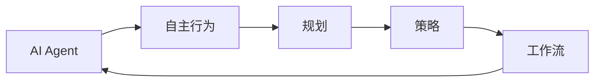
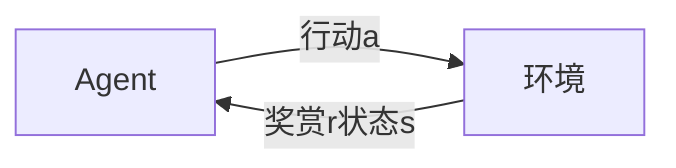

# AI人工智能代理工作流AI Agent WorkFlow：自主行为与规划策略在AI中的运用

关键词：AI Agent、工作流、自主行为、规划策略、人工智能

## 1. 背景介绍
### 1.1 问题的由来
随着人工智能技术的飞速发展,AI Agent在各个领域得到了广泛应用。然而,如何让AI Agent具备更加智能化的自主行为能力,并能根据环境变化自主制定合理的工作流程,仍然是一个亟待解决的问题。传统的AI系统大多采用预定义的规则和流程,缺乏灵活性和适应性,无法应对复杂多变的现实环境。因此,研究AI Agent的自主行为和规划策略,对于提升AI系统的智能化水平具有重要意义。

### 1.2 研究现状
目前,国内外学者对AI Agent的自主行为和规划策略开展了广泛研究。Mnih等人提出了深度强化学习算法DQN,使AI Agent能够通过与环境的交互学习最优策略。Silver等人提出了AlphaGo系统,展示了深度强化学习在复杂博弈中的巨大潜力。Toussaint等人提出了基于逻辑的规划方法,使AI Agent能够根据目标自主推理产生行为序列。但现有方法仍存在诸多局限,如对领域知识依赖较强、泛化能力不足、规划效率有待提高等。

### 1.3 研究意义 
研究AI Agent的自主行为和规划策略,对于提升AI系统的智能化水平、拓展其应用领域具有重要意义。一方面,自主行为能力可以使AI Agent更好地适应不确定环境,提高系统的鲁棒性。另一方面,智能规划策略可以使AI Agent自主分解任务、制定流程,提高执行效率。同时,本研究有助于促进多智能体协同、人机混合增强智能等前沿方向的发展。

### 1.4 本文结构
本文将重点探讨AI Agent工作流中的自主行为与规划策略。第2部分介绍相关核心概念;第3部分阐述核心算法原理与步骤;第4部分建立数学模型并给出公式推导;第5部分通过代码实例演示算法的具体实现;第6部分分析实际应用场景;第7部分推荐相关工具和学习资源;第8部分总结全文并展望未来发展方向;第9部分列举常见问题解答。

## 2. 核心概念与联系
AI Agent是一种具有自主行为能力的人工智能系统,能够感知环境状态,根据目标自主采取行动。其核心在于工作流的构建,即如何合理安排任务的执行顺序。工作流(Workflow)是一系列结构化活动的集合,用于完成特定目标。自主行为(Autonomous Behavior)是指AI Agent无需人工干预,能够根据环境反馈自主调整策略。规划(Planning)是自主行为的核心,旨在为目标生成最优行为序列。策略(Policy)定义了在给定状态下应采取的行动。

这些概念间的逻辑关系如下:



智能Agent通过自主行为不断优化策略,形成工作流,完成特定任务。可见,工作流是连接Agent行为与目标的桥梁,高效的规划策略是自主行为的保障,两者相辅相成,共同决定了AI系统的智能化水平。

## 3. 核心算法原理 & 具体操作步骤
### 3.1 算法原理概述
本文采用强化学习(Reinforcement Learning)范式,使Agent通过与环境的交互学习最优策略。其核心思想是通过试错不断积累经验,优化长期累积奖赏。马尔可夫决策过程(Markov Decision Process, MDP)为强化学习提供了理论基础。一个MDP由状态集S、行动集A、转移概率P、奖赏函数R、折扣因子γ组成。Agent与环境交互的过程可抽象为:



Agent根据策略π选择行动a,环境反馈下一状态s'和即时奖赏r,Agent据此更新策略,最终学习到最优策略π*。

### 3.2 算法步骤详解
基于MDP的强化学习算法一般包括以下步骤:

1. 初始化Q(s,a)函数,随机策略π
2. 重复迭代直到收敛:
   1) 根据当前策略π与环境交互,收集经验数据(s,a,r,s')
   2) 利用贝尔曼方程更新动作价值函数:
      $Q(s,a) \leftarrow Q(s,a) + \alpha[r+\gamma \max_{a'}Q(s',a')-Q(s,a)]$
   3) 根据ε-贪婪策略更新策略π:
      $\pi(a|s) = \left\{ \begin{aligned} 1-\varepsilon + \frac{\varepsilon}{|A|}, & a = \arg\max_{a}Q(s,a) \\ \frac{\varepsilon}{|A|}, & otherwise \end{aligned} \right.$
3. 输出最优策略π*

其中,α为学习率,ε为探索率。算法的关键在于平衡探索(exploration)和利用(exploitation),前者有助于发现更优策略,后者倾向于当前最优策略。

### 3.3 算法优缺点
优点:
- 无需预先建模,通过试错学习,适用范围广
- 能够处理连续状态、连续动作空间
- 具备一定的自适应能力和泛化能力

缺点:  
- 样本效率低,需要大量的交互数据
- 对奖赏函数敏感,奖赏设计是难点
- 容易陷入局部最优,探索策略至关重要
- 难以应对高维状态空间,需要特征工程

### 3.4 算法应用领域
强化学习已在多个领域取得突破:
- 游戏: AlphaGo, Atari games
- 机器人控制: 机械臂操纵,四足机器人运动规划
- 自然语言处理: 对话系统,机器翻译
- 推荐系统: 电商推荐,广告投放
- 自动驾驶: 端到端驾驶,决策规划

## 4. 数学模型和公式 & 详细讲解 & 举例说明
### 4.1 数学模型构建
考虑一个离散MDP $M=\langle S,A,P,R,\gamma \rangle$:
- 状态空间 $S=\{s_1,\cdots,s_n\}$ 
- 行动空间 $A=\{a_1,\cdots,a_m\}$
- 转移概率 $P(s'|s,a)$
- 奖赏函数 $R(s,a)$
- 折扣因子 $\gamma \in [0,1]$

在策略 $\pi:S \rightarrow A$ 作用下,MDP将生成一个状态-行动序列:

$$\tau = (s_0,a_0,r_0,s_1,a_1,r_1,\cdots)|a_t \sim \pi(\cdot|s_t),s_{t+1} \sim P(\cdot|s_t,a_t)$$

目标是最大化期望累积奖赏:

$$J(\pi) = \mathbb{E}_{\tau \sim \pi}[\sum_{t=0}^{\infty}\gamma^t r_t]$$

最优策略 $\pi^*$ 满足 $\pi^* = \arg\max_{\pi}J(\pi)$。

### 4.2 公式推导过程
为求解 $\pi^*$,引入状态价值函数 $V^{\pi}(s)$ 和动作价值函数 $Q^{\pi}(s,a)$:

$$V^{\pi}(s) = \mathbb{E}_{\tau \sim \pi}[\sum_{k=0}^{\infty}\gamma^k r_{t+k}|s_t=s]$$

$$Q^{\pi}(s,a) = \mathbb{E}_{\tau \sim \pi}[\sum_{k=0}^{\infty}\gamma^k r_{t+k}|s_t=s,a_t=a]$$

两者满足贝尔曼方程:

$$V^{\pi}(s) = \sum_{a \in A}\pi(a|s)Q^{\pi}(s,a)$$

$$Q^{\pi}(s,a) = R(s,a) + \gamma \sum_{s' \in S}P(s'|s,a)V^{\pi}(s')$$

定义最优价值函数:

$$V^*(s) = \max_{\pi}V^{\pi}(s), \quad Q^*(s,a) = \max_{\pi}Q^{\pi}(s,a)$$

最优贝尔曼方程为:

$$V^*(s) = \max_{a \in A}Q^*(s,a)$$

$$Q^*(s,a) = R(s,a) + \gamma \sum_{s' \in S}P(s'|s,a)V^*(s')$$

若知 $Q^*$,则最优策略为:

$$\pi^*(a|s) = \left\{ \begin{aligned} 1, & a = \arg\max_{a'}Q^*(s,a') \\ 0, & otherwise \end{aligned} \right.$$

Q-learning算法基于贝尔曼最优方程,迭代更新 $Q(s,a)$:

$$Q(s_t,a_t) \leftarrow Q(s_t,a_t) + \alpha[r_t+\gamma \max_{a}Q(s_{t+1},a)-Q(s_t,a_t)]$$

### 4.3 案例分析与讲解
考虑经典的Grid World环境,如下图所示:

```
+---+---+---+---+
| S |   |   | T |
+---+---+---+---+
|   |   |   |   |
+---+---+---+---+
|   |   |   |   |
+---+---+---+---+
|   |   |   |   |
+---+---+---+---+
```

其中S为初始状态,T为目标状态。Agent可执行上下左右四个动作。每走一步奖赏-1,到达目标奖赏+10。这构成了一个MDP:
- 状态: 网格编号1-16
- 行动: 上、下、左、右
- 转移概率: 若在边界,有较大概率停留原地;否则大概率按指定动作转移
- 奖赏: 普通-1,目标+10
- 折扣因子: 0.9

应用Q-learning算法,设置参数:
- 学习率 $\alpha=0.1$
- 探索率 $\varepsilon=0.1$
- 训练轮数 1000

最终学到最优策略如下:

```
+---+---+---+---+
| ↑ | ↑ | ↑ | * |
+---+---+---+---+
| ↑ | ↑ | ↑ | ↑ |
+---+---+---+---+
| ↑ | ↑ | ↑ | ↑ |
+---+---+---+---+
| → | → | ↑ | ↑ |
+---+---+---+---+
```

可见Agent成功学会了到达目标的最短路径。这展示了Q-learning在目标导向任务中的有效性。

### 4.4 常见问题解答
Q: Q-learning算法能否处理连续状态空间?
A: 原始Q-learning使用Q表存储每个状态-行动对的价值,难以应用于连续域。一种常见做法是使用函数逼近器(如神经网络)拟合Q函数,将连续状态映射为紧凑的特征表示。代表算法有DQN、NAF、DDPG等。

Q: 如何平衡探索和利用?
A: 探索和利用是强化学习的核心矛盾。常见的平衡策略有:
- $\varepsilon$-贪婪: 以 $\varepsilon$ 的概率随机探索,否则利用当前最优策略
- Boltzmann探索: 以Boltzmann分布采样行动,Q值高的行动被采样概率大
- 基于不确定性的探索: 量化行动的不确定性,优先探索不确定性高的行动,如Bayesian Q-learning
- 内在奖赏驱动探索: 设计内在奖赏鼓励探索,如visit count, information gain

Q: 面对稀疏奖赏问题时该如何处理?
A: 稀疏奖赏会导致信用分配问题,即很难判断哪些行动真正有助于获得奖赏。可能的解决方案包括:
- 分层强化学习: 将原任务分解为多个子任务,每个子任务有局部奖赏
- 好奇心驱动探索: 设计内在奖赏鼓励探索新颖状态
- 逆强化学习: 从专家示范中学习隐式奖赏函数
- 