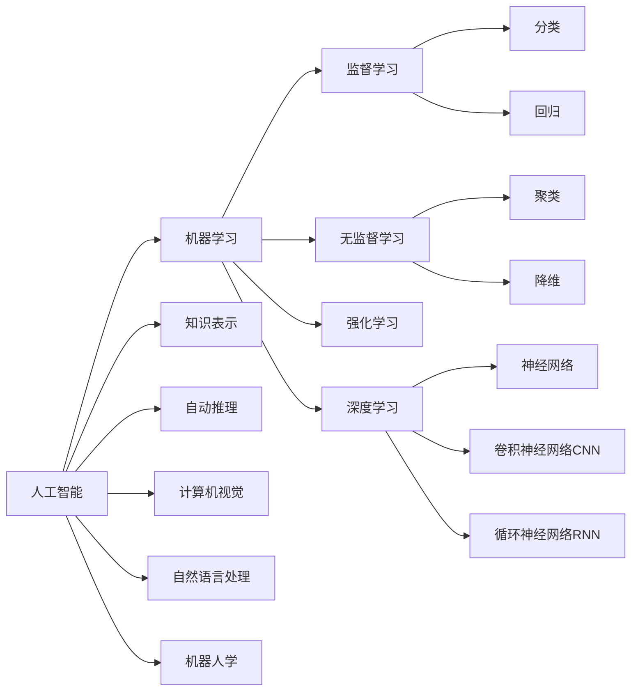

# AI人工智能核心算法原理与代码实例讲解：人工智能应用发展趋势

作者：禅与计算机程序设计艺术 / Zen and the Art of Computer Programming

关键词：人工智能, 机器学习, 深度学习, 神经网络, 自然语言处理, 计算机视觉, 强化学习, TensorFlow, PyTorch

## 1. 背景介绍

### 1.1 问题的由来

人工智能(Artificial Intelligence, AI)作为计算机科学领域最前沿、最具挑战性的分支之一，一直以来备受业界关注。自1956年达特茅斯会议首次提出"人工智能"这一概念以来，AI经历了从早期的符号主义、专家系统，到90年代以后的统计学习、深度学习等多个发展阶段。如今，得益于大数据、算力和算法的持续进步，AI正在加速走进人们的日常生活，并在工业、金融、医疗、教育等诸多领域展现出广阔的应用前景。

### 1.2 研究现状

近年来，人工智能领域涌现出一大批引领潮流的核心算法，极大地推动了AI技术的发展。其中，以深度学习为代表的算法，在计算机视觉、语音识别、自然语言处理等任务上取得了突破性进展，甚至在某些特定任务上已经达到或超越人类水平。同时，强化学习、迁移学习、元学习、图神经网络等新兴算法也不断涌现，进一步拓展了AI的应用边界。这些算法的持续演进，为人工智能未来的发展奠定了坚实基础。

### 1.3 研究意义

深入研究人工智能核心算法原理，对于推动AI技术的进步具有重要意义：

1. 有助于我们理解AI系统的内在工作机制，为算法的改进和创新提供理论指导。 
2. 通过剖析算法原理，可以发现其局限性，为后续算法优化指明方向。
3. 结合具体的代码实例，有利于将理论与实践相结合，加深对算法的理解和掌握。
4. 分析AI技术发展趋势，把握前沿动态，对于产业应用和科研布局具有重要参考价值。

### 1.4 本文结构

本文将重点探讨人工智能领域的几大核心算法，包括深度学习中的卷积神经网络(CNN)、循环神经网络(RNN)，以及强化学习中的Q-Learning、Policy Gradient等。通过分析其原理、给出具体的代码实例，并结合实际应用场景，全面解读这些算法的特点、优势和挑战。同时，本文也将展望人工智能技术的未来发展趋势。全文结构如下：

- 第2节介绍人工智能的核心概念及其内在联系
- 第3节重点阐述几大核心算法的原理和操作步骤
- 第4节给出算法涉及的数学模型和公式推导
- 第5节提供算法的代码实现和详细解释
- 第6节分析算法在实际场景中的应用情况
- 第7节推荐相关的学习资源和开发工具
- 第8节总结全文，并展望人工智能的未来发展趋势和挑战
- 第9节附录部分，解答一些常见问题

## 2. 核心概念与联系

人工智能是一个涵盖范围极其广泛的科学领域，其核心概念可以用下图来概括：

从上图可见，人工智能主要包括机器学习、知识表示、自动推理、计算机视觉、自然语言处理、机器人学等分支。其中，机器学习是实现人工智能的核心途径，它又进一步细分为监督学习、无监督学习、强化学习、深度学习等范式。深度学习是当前AI领域最热门的研究方向，主要包括各种神经网络结构，如CNN、RNN等。

这些概念之间既相互独立又密切关联。比如，机器学习算法可以用于知识表示、计算机视觉和自然语言处理等任务。深度学习则是机器学习的一个重要分支，常被用于处理复杂的感知型任务，如图像识别和语音识别等。理解这些概念之间的联系，有助于我们系统地把握人工智能技术的全貌。

## 3. 核心算法原理 & 具体操作步骤

### 3.1 算法原理概述

人工智能涉及的算法种类繁多，本节将重点介绍以下几类核心算法：

1. 卷积神经网络(Convolutional Neural Network, CNN)：主要用于图像识别等计算机视觉任务。通过卷积、池化等操作，提取图像的空间特征。

2. 循环神经网络(Recurrent Neural Network, RNN)：主要用于处理序列数据，如自然语言文本。通过在网络中引入循环结构，建模数据的时序依赖关系。

3. Q-Learning：是强化学习的一种，通过价值函数逼近的方式，学习最优策略，常用于智能体的自主决策。 

4. Policy Gradient：也是强化学习算法，通过梯度上升的方式直接优化策略函数，常与深度学习结合，用于连续动作空间的控制任务。

### 3.2 算法步骤详解

以CNN为例，其主要计算步骤如下：

1. 卷积层：使用卷积核对输入特征图进行卷积操作，提取局部特征。可表示为：
$$ h_{i,j}^l = \sigma(\sum_{m}\sum_{n} w_{m,n}^l \cdot h_{i+m,j+n}^{l-1} + b^l) $$

2. 池化层：对卷积结果进行下采样，减小特征图尺寸。常见的有最大池化和平均池化。

3. 全连接层：将卷积和池化的结果展平，送入全连接网络，生成最终的输出。

4. 反向传播：计算损失函数对各层参数的梯度，并使用优化算法更新网络权重，如：
$$ w_{i,j}^l \leftarrow w_{i,j}^l - \eta \cdot \frac{\partial L}{\partial w_{i,j}^l} $$

其中，$h$为特征图，$w$为卷积核权重，$b$为偏置项，$\sigma$为激活函数，$L$为损失函数，$\eta$为学习率。

其他算法的具体步骤这里不再赘述，可参考相关文献。

### 3.3 算法优缺点

以上各算法都有其独特的优势和局限性。比如：

- CNN在图像识别任务上表现出色，但对数据的空间平移缺乏鲁棒性。
- RNN擅长处理时序数据，但训练过程中容易出现梯度消失和梯度爆炸问题。 
- 强化学习算法通过试错式学习，可实现智能体的自主决策，但往往需要大量的环境交互数据。

因此，在实际应用中需要根据具体任务的特点，权衡算法的优缺点，选择合适的方案。

### 3.4 算法应用领域

上述算法在人工智能的各个领域都有广泛应用，举几个例子：

- CNN常用于图像分类、目标检测、语义分割等计算机视觉任务。
- RNN常用于机器翻译、情感分析、语音识别等自然语言处理任务。
- 强化学习常用于智能体的游戏对战、机器人控制、自动驾驶等决策类任务。

此外，不同算法之间还可以互相结合，发挥各自的优势。比如，CNN和RNN的结合可以处理图像描述、视频分析等多模态任务。

## 4. 数学模型和公式 & 详细讲解 & 举例说明

### 4.1 数学模型构建

以softmax回归模型为例。假设有$K$个类别，输入特征为$x \in R^n$，模型参数为$\theta = [\theta_1, \theta_2, ..., \theta_K] \in R^{n \times K}$，我们希望建立$x$到类别概率$p(y=k|x)$的映射。softmax回归模型可表示为：

$$
p(y=k|x) = \frac{e^{\theta_k^T x}}{\sum_{i=1}^K e^{\theta_i^T x}}
$$

其中，$\theta_k^T x$表示类别$k$的对应参数向量与$x$的内积。直观理解，softmax函数将$K$个内积值映射为$K$个概率值，且这些概率之和为1。

### 4.2 公式推导过程

对于softmax回归，我们通常采用极大似然估计来求解模型参数。给定训练集$\{(x^{(i)}, y^{(i)})\}_{i=1}^m$，似然函数为：

$$
L(\theta) = \prod_{i=1}^m p(y^{(i)}|x^{(i)}; \theta)
$$

取对数后得到对数似然函数：

$$
\log L(\theta) = \sum_{i=1}^m \log p(y^{(i)}|x^{(i)}; \theta)
$$

将softmax函数的定义式代入，化简可得：

$$
\log L(\theta) = \sum_{i=1}^m \left( \theta_{y^{(i)}}^T x^{(i)} - \log \sum_{j=1}^K e^{\theta_j^T x^{(i)}} \right)
$$

我们的目标是找到使对数似然函数最大化的参数$\theta$。这可以通过梯度上升算法来实现，求导可得参数的更新公式为：

$$
\theta_k := \theta_k + \alpha \sum_{i=1}^m \left( \mathbb{1}(y^{(i)} = k) - p(y^{(i)}=k | x^{(i)}; \theta) \right) x^{(i)}
$$

其中，$\alpha$为学习率，$\mathbb{1}(\cdot)$为示性函数。

### 4.3 案例分析与讲解

下面以一个简单的二分类问题为例，说明softmax回归的用法。假设我们要根据学生的两门考试成绩$x_1$和$x_2$，来预测其是否能被大学录取($y=1$表示录取，$y=0$表示不录取)。

首先，我们建立softmax回归模型：

$$
p(y=1|x) = \frac{e^{\theta_1^T x}}{e^{\theta_1^T x} + e^{\theta_0^T x}}
$$

$$
p(y=0|x) = \frac{e^{\theta_0^T x}}{e^{\theta_1^T x} + e^{\theta_0^T x}}
$$

其中，$x = [x_1, x_2]^T$，$\theta_1 = [\theta_{11}, \theta_{12}]^T$，$\theta_0 = [\theta_{01}, \theta_{02}]^T$。

然后，我们用梯度上升算法来估计模型参数。每次迭代，参数更新公式为：

$$
\theta_1 := \theta_1 + \alpha \sum_{i=1}^m \left( \mathbb{1}(y^{(i)} = 1) - p(y^{(i)}=1 | x^{(i)}; \theta) \right) x^{(i)}
$$

$$
\theta_0 := \theta_0 + \alpha \sum_{i=1}^m \left( \mathbb{1}(y^{(i)} = 0) - p(y^{(i)}=0 | x^{(i)}; \theta) \right) x^{(i)}
$$

在测试阶段，对于一个新样本$x$，我们比较$p(y=1|x)$和$p(y=0|x)$的大小，取概率值较大的类别作为预测结果。

可见，通过softmax回归模型，我们建立了考试成绩到录取概率的映射关系，从而可以用于预测新学生的录取结果。这体现了机器学习算法在分类问题中的应用价值。

### 4.4 常见问题解答

问：softmax回归和logistic回归有什么区别？

答：两者在二分类问题上是等价的。logistic回归可视为softmax回归在$K=2$时的特例。但对于多分类问题，softmax回归更具一般性，因为它