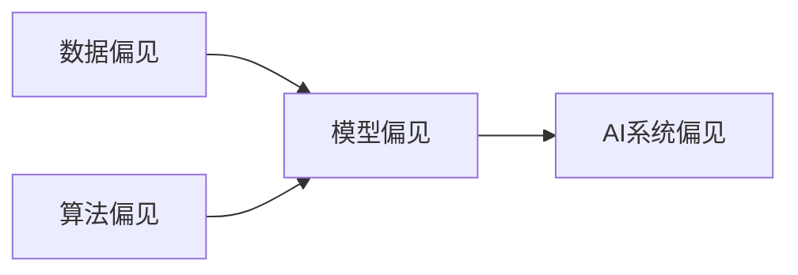
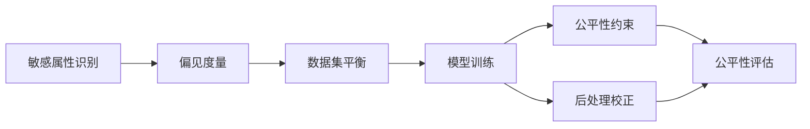

# AI人工智能核心算法原理与代码实例讲解：数据偏见

关键词：人工智能, 机器学习, 数据偏见, 公平性, 算法歧视, 数据集, 模型训练, 评估指标

## 1. 背景介绍
### 1.1 问题的由来
人工智能和机器学习技术近年来飞速发展,在图像识别、自然语言处理、推荐系统等领域取得了令人瞩目的成就。然而,随着AI系统在现实世界中的广泛应用,一个日益突出的问题逐渐浮出水面——数据偏见(Data Bias)。数据偏见会导致训练出的模型产生有失公允的决策,从而对某些群体产生歧视和不公平对待。

数据偏见通常源自训练数据收集和标注过程中引入的偏差。比如在人脸识别任务中,如果训练数据中白人男性样本占比过高,而其他人种和女性样本较少,训练出的模型在应用中往往会表现出对有色人种和女性的识别准确率明显低于白人男性。类似地,犯罪风险评估系统如果用犯罪记录数据训练,而训练数据中某些少数族裔的犯罪率统计偏高(数据偏见),训练出的模型会倾向于给这些族裔更高的犯罪风险评分。

### 1.2 研究现状
学术界和工业界已经认识到数据偏见及其负面影响的严重性,并开展了大量研究来分析和消除数据偏见:

- Torralba等人[1]研究了图像分类数据集的偏见,发现许多常用数据集存在对象-场景关联的偏差,提出了消除偏见的方法。 
- Bolukbasi等人[2]研究了词嵌入模型中的性别偏见,开发了去偏技术消除词向量中的性别刻板印象。
- Buolamwini等人[3]评估了商业人脸识别系统对不同人口统计群体的表现,揭示了显著的人种和性别差异。
- Mehrabi等人[4]全面综述了机器学习的公平性问题,系统总结了各种偏见类型及其表现。

### 1.3 研究意义
数据偏见会导致AI系统产生不公平、有失偏颇的决策,进而对个人和群体造成伤害。消除数据偏见,构建公平的机器学习系统,不仅是技术挑战,更关乎科技伦理和社会公平。这一问题的研究对于推动人工智能健康发展、建设包容互信的智能社会至关重要。只有正视并解决数据偏见等问题,人工智能才能更好地造福全人类。

### 1.4 本文结构
本文将从以下几个方面展开探讨数据偏见问题:
- 第2部分介绍数据偏见的核心概念及其与相关概念的联系
- 第3部分阐述几种主要的数据偏见类型及其成因机制
- 第4部分建立数据偏见的数学模型,推导相关公式,并举例说明
- 第5部分给出检测和消除数据偏见的算法,并提供详细的代码实现
- 第6部分讨论数据偏见在实际应用场景中的影响和应对措施
- 第7部分推荐数据偏见研究的相关工具和学习资源
- 第8部分总结全文,展望未来研究趋势和挑战
- 第9部分列出常见问题解答

## 2. 核心概念与联系
数据偏见(Data Bias)是指训练数据分布与真实世界数据分布存在系统性偏差,从而使得基于该数据训练的模型产生有偏决策。

数据偏见与以下概念密切相关:

- 模型偏见(Model Bias):模型结构、超参数选择等因素引入的偏差。
- 算法偏见(Algorithm Bias):算法设计和实现中引入的偏差。
- 统计偏差(Statistical Bias):抽样过程和样本量不足导致的统计估计偏差。
- 历史偏见(Historical Bias):数据反映的是人类社会长期存在的偏见和歧视。
- 表征偏见(Representation Bias):特征工程和表征学习可能放大或引入偏见。
- 评估偏见(Evaluation Bias):评估指标的选取和使用可能掩盖模型的偏见。

数据偏见、算法偏见、模型偏见相互影响,共同决定了机器学习系统的整体偏差。要全面评估和消除机器学习偏见,需要系统地审视数据、算法、模型的各个环节。

## 3. 核心算法原理 & 具体操作步骤
### 3.1 算法原理概述
检测和消除数据偏见的核心是度量数据集在敏感属性(如性别、种族)上的分布差异。常用的偏见度量指标包括:

- 统计均衡(Statistical Parity):要求数据集在敏感属性不同取值上的样本比例接近。 
- 机会均等(Equal Opportunity):要求模型在敏感属性不同取值上的真正例率相当。
- 预测结果均衡(Predictive Parity):要求模型在敏感属性不同取值上的正例预测值分布接近。

基于这些度量指标,可以设计数据平衡、模型约束、后处理校正等方法来消除数据偏见对模型的影响。

### 3.2 算法步骤详解
数据偏见消除的一般步骤如下:

1. 敏感属性识别:确定需要考察偏见的敏感属性,如性别、种族等。
2. 偏见度量:选择合适的偏见度量指标,计算数据集在敏感属性上的偏差。
3. 数据集平衡:对原始数据集进行重采样,使得不同敏感属性取值的样本数尽可能平衡。
4. 模型训练:在平衡后的数据集上训练模型。
5. 公平性约束:在模型训练时施加公平性约束,使得模型满足特定的公平性要求。
6. 后处理校正:对模型的预测结果进行事后校正,消除残余的偏见。
7. 公平性评估:使用多个指标全面评估模型的公平性,以验证偏见消除的效果。

### 3.3 算法优缺点
上述偏见消除算法的优点在于:
- 可以在模型训练前(数据平衡)、训练中(公平性约束)、训练后(后处理校正)多个环节消除偏见。
- 公平性约束可以灵活地纳入不同的公平性要求。
- 后处理校正不需要重新训练模型,可以直接应用于已有模型。

同时,这些方法也存在一些局限:
- 数据平衡可能损失信息,影响模型性能。
- 公平性约束和模型性能之间存在trade-off,过强的约束会降低模型效用。
- 不同的公平性指标之间可能存在冲突,难以同时满足多个指标。

### 3.4 算法应用领域
数据偏见消除算法可以广泛应用于各种机器学习任务,包括:
- 计算机视觉:消除图像分类、目标检测中的性别、年龄、种族等偏见。
- 自然语言处理:去除词嵌入、情感分析等任务中的性别刻板印象。
- 推荐系统:纠正用户画像和推荐结果中的群体偏见。
- 风险评估:确保信用评分、医疗诊断等风险评估模型的公平性。

## 4. 数学模型和公式 & 详细讲解 & 举例说明
### 4.1 数学模型构建
考虑二分类任务,令 $X$ 表示输入特征, $Y\in\{0,1\}$ 表示真实标签, $A\in\{0,1\}$ 表示敏感属性。分类器 $f$ 将特征映射为标签 $\hat{Y}=f(X)\in\{0,1\}$。

定义以下概率:
- $P(Y=1)$:真实正例率
- $P(\hat{Y}=1)$:预测正例率
- $P(Y=1|A=a)$:敏感属性取值为 $a$ 时的真实正例率
- $P(\hat{Y}=1|A=a)$:敏感属性取值为 $a$ 时的预测正例率

统计均衡(Statistical Parity, SP)要求:

$$P(\hat{Y}=1|A=0) = P(\hat{Y}=1|A=1)$$

即不同敏感属性群体的预测正例率应当相等。

机会均等(Equal Opportunity, EO)要求:

$$P(\hat{Y}=1|A=0,Y=1) = P(\hat{Y}=1|A=1,Y=1)$$

即在真实正例中,不同敏感属性群体的预测正例率应当相等。

### 4.2 公式推导过程
基于统计均衡和机会均等,可以推导出相应的优化目标。

以统计均衡为例,优化目标可以写为:

$$\min_f \Big|P(\hat{Y}=1|A=0) - P(\hat{Y}=1|A=1)\Big|$$

其中 $f$ 是要学习的分类器。该目标旨在最小化不同敏感属性群体的预测正例率之差的绝对值。

考虑经验风险最小化框架,上述目标可以转化为:

$$\min_f \frac{1}{n}\sum_{i=1}^n \ell(f(x_i),y_i) + \lambda \Big|\frac{1}{n_0}\sum_{i:a_i=0}f(x_i) - \frac{1}{n_1}\sum_{i:a_i=1}f(x_i)\Big|$$

其中 $\ell$ 是损失函数, $\lambda$ 是平衡因子, $n_0$ 和 $n_1$ 分别是敏感属性取0和1的样本数。第一项是经验风险,第二项是统计均衡约束。

类似地,可以推导出机会均等的优化目标:

$$\min_f \frac{1}{n}\sum_{i=1}^n \ell(f(x_i),y_i) + \lambda \Big|\frac{1}{n_{01}}\sum_{i:a_i=0,y_i=1}f(x_i) - \frac{1}{n_{11}}\sum_{i:a_i=1,y_i=1}f(x_i)\Big|$$

其中 $n_{01}$ 和 $n_{11}$ 分别是敏感属性取0和1的正例样本数。

### 4.3 案例分析与讲解
考虑一个贷款审批的例子。假设我们有1000个贷款申请者的数据,其中男性800人,女性200人。用 $A=0$ 表示男性, $A=1$ 表示女性。

在男性中,400人获得贷款($Y=1$),400人未获得贷款($Y=0$)。在女性中,50人获得贷款,150人未获得贷款。

假设我们训练了一个贷款审批模型 $f$,在男性中预测400人可获得贷款($\hat{Y}=1$),在女性中预测50人可获得贷款。

计算统计均衡指标:

$$
\begin{aligned}
P(\hat{Y}=1|A=0) &= \frac{400}{800} = 0.5 \\
P(\hat{Y}=1|A=1) &= \frac{50}{200} = 0.25
\end{aligned}
$$

可见,该模型在男性和女性群体上的预测正例率差异较大,不满足统计均衡要求。

计算机会均等指标:

$$
\begin{aligned}
P(\hat{Y}=1|A=0,Y=1) &= \frac{300}{400} = 0.75 \\
P(\hat{Y}=1|A=1,Y=1) &= \frac{30}{50} = 0.6
\end{aligned}
$$

可见,在获得贷款的人群中,女性被预测为可获贷的比例低于男性,也不满足机会均等要求。

为了消除偏见,我们可以在模型训练时加入统计均衡或机会均等约束,或者在预测结果中对不同群体应用不同的阈值以达到事后的均衡。

### 4.4 常见问题解答
Q:统计均衡和机