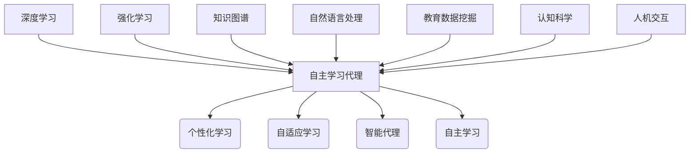
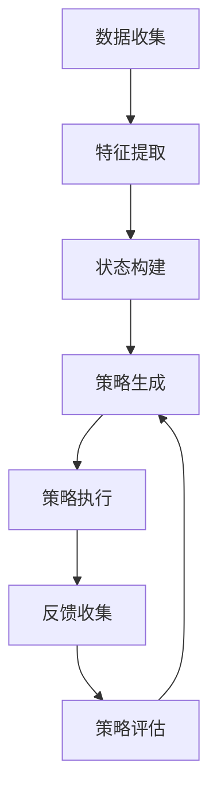

好的,我会尽力按照您的要求,以专业的技术语言撰写这篇博客文章。下面是正文部分:

# AI人工智能深度学习算法:在教育培训中运用自主学习代理

## 1. 背景介绍

### 1.1 问题的由来

在当今快节奏的数字时代,教育培训面临着前所未有的挑战。传统的教学模式已经难以满足学习者个性化、互动性和高效率的需求。同时,教育资源的不平等分布也加剧了这一问题。因此,迫切需要一种创新的教育方法来应对这些挑战。

自主学习代理(Autonomous Learning Agent)作为人工智能领域的一个新兴概念,为解决上述问题提供了一种全新的思路。它结合了深度学习、强化学习等先进算法,能够根据学习者的个体特征、知识水平和学习偏好,动态调整教学内容、节奏和方式,从而实现个性化和自适应学习。

### 1.2 研究现状  

近年来,自主学习代理在教育领域的应用研究日益受到重视。一些先驱性的工作已经展示了该技术的巨大潜力,如:

- 卡内基梅隆大学的研究人员开发了一个基于强化学习的智能教tutorr系统,能够根据学生的表现动态调整教学策略。
- 斯坦福大学的学者提出了一种多智能体强化学习框架,用于个性化的在线课程推荐。
- 微软研究院则将注意力放在了利用深度学习分析学习者的情感状态,从而优化教学体验。

然而,目前的研究仍处于初级阶段,自主学习代理在教育领域的实际应用还面临诸多挑战,例如算法的可解释性、隐私保护、公平性等问题有待进一步探讨和解决。

### 1.3 研究意义

自主学习代理有望从根本上改变当前教育培训的模式,为实现真正的因材施教、个性化学习、高效率学习提供有力支撑。具体来说,它的意义主要体现在:

1. **个性化学习体验**:能够根据每个学习者的特点,量身定制适合的教学内容、进度和方式,提高学习效率和体验。

2. **释放教师能力**:减轻教师的工作强度,使其能专注于教学设计、答疑解惑等高价值工作,充分发挥人机结合的优势。

3. **促进教育公平**:通过智能技术弥补资源不均衡问题,确保每个学习者都能获得优质的教育资源和个性化指导。

4. **推动教育创新**:为教育领域带来全新的人工智能驱动的教与学模式,有望成为教育变革的重要驱动力。

### 1.4 本文结构

本文将全面介绍自主学习代理在教育培训领域的应用。首先阐述其核心概念及与其他技术的关联;然后深入探讨算法原理、数学模型和具体实现;接着分析实际应用场景;最后总结发展趋势并指出面临的主要挑战。文章旨在为读者提供一个系统的认识,并启发相关领域的创新思路。

## 2. 核心概念与联系

自主学习代理(Autonomous Learning Agent)是一种基于人工智能技术的智能系统,它能够根据学习者的个体特征、知识水平、学习偏好等信息,自主地规划和调整教学策略,实现个性化和自适应学习。

其核心概念主要包括:

1. **智能代理**(Intelligent Agent):一种能够感知环境、作出决策并采取行动的自主系统。在教育场景中,它扮演着"智能教师"的角色。

2. **自主学习**(Autonomous Learning):系统能够基于反馈,自主地调整学习策略和参数,以达到最优学习效果。

3. **个性化学习**(Personalized Learning):根据每个学习者的独特特征,提供量身定制的教学内容和方式。

4. **自适应学习**(Adaptive Learning):根据学习者的实时表现,动态调整教学策略和难度,确保学习处于最佳"区域"。

自主学习代理的实现离不开多种人工智能技术的支持,主要包括:

- **深度学习**(Deep Learning):用于从学习者的历史数据中提取特征,构建个性化学习模型。
- **强化学习**(Reinforcement Learning):智能代理通过不断尝试和学习,优化教学策略,实现自主学习。
- **知识图谱**(Knowledge Graph):组织结构化的课程知识,支持智能化的知识点规划和推理。
- **自然语言处理**(NLP):分析学习者的反馈和提问,实现人机自然交互。

此外,自主学习代理还与教育数据挖掘、认知科学、人机交互等多个领域密切相关。

## 3. 核心算法原理及具体操作步骤  

### 3.1 算法原理概述

自主学习代理的核心算法原理主要基于**强化学习**和**深度学习**两大技术。

**强化学习**使得智能代理能够通过不断尝试、获得反馈并调整策略,逐步优化教学决策,实现自主学习。其中,代理的行为决策过程可以建模为**马尔可夫决策过程**(Markov Decision Process, MDP)。

**深度学习**则用于从学习者的历史数据(如学习行为、测试成绩等)中提取特征,构建个性化的学习模型,为智能代理的决策提供依据。常用的模型包括**递归神经网络**(RNN)、**注意力机制**(Attention Mechanism)等。

此外,**知识图谱**和**自然语言处理**技术也发挥着重要作用:

- 知识图谱组织结构化的课程知识,支持智能化的知识点规划和推理。
- 自然语言处理技术能够分析学习者的反馈和提问,实现人机自然交互。

### 3.2 算法步骤详解

自主学习代理的工作流程可概括为以下几个主要步骤:

1. **数据收集**:从学习者的历史行为、测试结果、反馈等渠道收集相关数据。

2. **特征提取**:使用深度学习模型(如RNN、Attention等)从原始数据中提取学习者的知识状态、学习偏好等特征。

3. **状态构建**:将提取的特征与知识图谱相结合,构建当前的学习状态,作为强化学习过程的输入。

4. **策略生成**:智能代理根据当前状态,通过强化学习算法(如Q-Learning、Policy Gradient等)生成教学策略,决定下一步的教学行为。

5. **策略执行**:执行所生成的教学策略,如调整课程内容、教学节奏、练习难度等。

6. **反馈收集**:收集学习者在新策略下的学习表现、反馈等数据。

7. **策略评估**:评估新策略的效果,作为下一轮强化学习的奖励信号。

8. **循环迭代**:重复上述步骤,持续优化教学策略,实现自主学习。

该过程还包括一些关键技术,如探索与利用权衡(Exploration-Exploitation Trade-off)、奖励函数设计等,需要根据具体场景进行调整和优化。

### 3.3 算法优缺点

自主学习代理算法的主要优点包括:

1. **个性化和自适应**:能够根据每个学习者的特点提供量身定制的教学方案,提高学习效率。

2. **持续优化**:通过不断的尝试、反馈和学习,教学策略会不断优化,实现长期自主学习。

3. **人机结合**:发挥人工智能的数据处理优势,同时保留人工教师的创造力和洞察力。

4. **可扩展性**:智能系统能够同时服务大量学习者,扩大优质教育资源的覆盖面。

但同时也存在一些缺点和挑战:

1. **算法可解释性**:强化学习和深度学习算法往往是黑箱操作,其决策过程缺乏透明度。

2. **隐私和公平性**:如何保护学习者的隐私,避免算法带来的潜在偏见和不公平,需要格外关注。

3. **数据质量依赖**:算法的性能很大程度上依赖于训练数据的质量和数量。

4. **人机交互挑战**:实现自然、高效的人机交互并非易事,需要多学科的支持。

### 3.4 算法应用领域

自主学习代理算法可以应用于教育培训的多个场景,包括但不限于:

1. **在线教育平台**:为学习者推荐个性化的课程、调整学习路径。

2. **智能教学系统**:作为虚拟教师,提供一对一的个性化辅导。

3. **教育管理系统**:评估学习者的知识状态,为教学决策提供依据。

4. **教师辅助系统**:分析学生的学习数据,为教师提供反馈和建议。

5. **课程设计优化**:通过模拟和试验,优化课程的内容编排和教学策略。

此外,该算法在企业培训、职业教育、特殊教育等领域也有广阔的应用前景。

## 4. 数学模型和公式及详细讲解与举例说明

### 4.1 数学模型构建

自主学习代理算法的数学模型主要基于**马尔可夫决策过程**(Markov Decision Process, MDP)。MDP由一个五元组(S, A, P, R, \gamma)组成:

- S是所有可能状态的集合
- A是所有可能行动的集合  
- P是状态转移概率,P(s'|s,a)表示在状态s下执行行动a后,转移到状态s'的概率
- R是即时奖励函数,R(s,a)表示在状态s下执行行动a所获得的奖励
- \gamma \in [0,1]是折现因子,它决定了当前奖励对未来的影响程度

在教育场景中:

- 状态s可以是学习者当前的知识状态、情绪状态等特征的综合
- 行动a是智能代理可以采取的各种教学行为,如调整课程内容、练习难度等
- 状态转移概率P(s'|s,a)表示在当前状态s下执行行动a后,学习者转移到新状态s'的概率
- 奖励R(s,a)通常与学习效果、学习体验等指标相关,需要专门设计

目标是找到一个最优策略π*,使得按照该策略执行时,预期的累积折现奖励最大:

$$\pi^* = \arg\max_\pi \mathbb{E}_\pi \left[ \sum_{t=0}^\infty \gamma^t R(s_t, a_t) \right]$$

其中,t表示时间步长,π是智能代理的策略,即一个从状态到行动的映射函数。

### 4.2 公式推导过程

为了求解最优策略π*,我们可以定义**状态值函数**V(s)和**状态-行动值函数**Q(s,a):

$$V(s) = \max_\pi \mathbb{E}_\pi \left[ \sum_{t=0}^\infty \gamma^t R(s_t, a_t) | s_0 = s \right]$$

$$Q(s, a) = \mathbb{E}_\pi \left[ \sum_{t=0}^\infty \gamma^t R(s_t, a_t) | s_0 = s, a_0 = a \right]$$

V(s)表示在状态s下执行最优策略可获得的预期累积奖励,Q(s,a)则表示在状态s下执行行动a,之后再执行最优策略可获得的预期累积奖励。

通过**贝尔曼方程**,可以将V(s)和Q(s,a)相互表示: