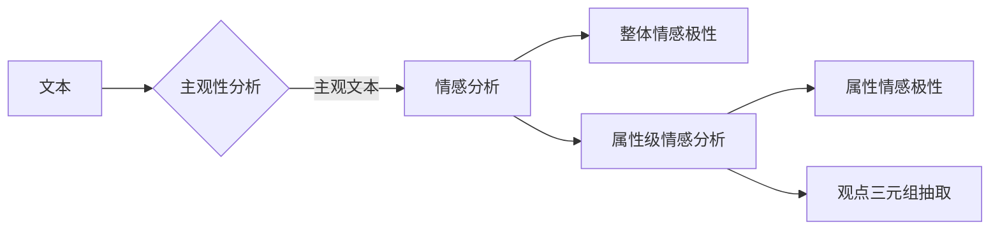
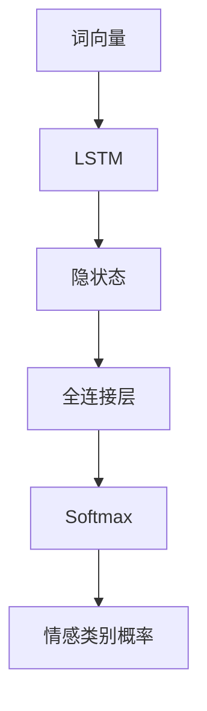

# AI人工智能深度学习算法：在文本情绪分析中的应用

关键词：人工智能, 深度学习, 文本情感分析, 情绪分类, LSTM, Transformer, BERT

## 1. 背景介绍

### 1.1 问题的由来
随着互联网和社交媒体的快速发展,每天都会产生海量的用户生成内容(User Generated Content, UGC),如评论、微博、论坛帖子等。这些UGC蕴含着丰富的用户情感和观点信息。对UGC进行情感分析,可以洞察用户对事物的情感倾向,挖掘舆情动向,为企业决策、产品优化、个性化推荐等提供数据支持。传统的情感分析方法主要基于词典和规则,但面对海量、非结构化的文本数据,其效率和准确性都受到限制。近年来,深度学习在NLP领域取得了突破性进展,为文本情感分析带来了新的契机。

### 1.2 研究现状
目前,深度学习在文本情感分析任务上已经超越了传统机器学习方法,成为主流技术路线。一些经典的深度学习模型如CNN、RNN、LSTM等,在情感分类任务上取得了不错的效果[1]。随着Transformer、BERT等预训练语言模型的出现,文本情感分析的性能进一步提升[2]。一些最新的研究尝试将对抗学习、迁移学习、元学习等前沿技术引入情感分析,以进一步提高模型的鲁棒性和泛化性[3]。

### 1.3 研究意义
文本情感分析在舆情监测、客户服务、个性化推荐等领域有广泛应用前景。研究深度学习在该任务上的应用,一方面可以提升情感分析的效果,另一方面也有助于推动深度学习技术的发展。文本情感分析是NLP的一个基础任务,相关研究成果可以为其他NLP任务如观点挖掘、对话情绪识别等提供借鉴。

### 1.4 本文结构
本文将系统梳理深度学习在文本情感分析中的应用。第2部分介绍情感分析的核心概念。第3部分重点讲解几种主流的深度学习算法。第4部分阐述相关的数学原理。第5部分通过代码实例演示如何实现一个基于深度学习的情感分类器。第6部分总结深度情感分析的应用场景。第7部分推荐相关学习资源。第8部分对全文进行总结并探讨未来研究方向。

## 2. 核心概念与联系

文本情感分析的目标是自动判断一段文本所表达的情感倾向,如积极、消极、中性等。它包含两个核心概念:

- 情感极性(Sentiment Polarity):指情感的正负向程度,一般分为积极(Positive)、消极(Negative)、中性(Neutral)三类。有的工作也使用更细粒度的情感分类,如非常积极、积极、中性、消极、非常消极等。

- 情感强度(Sentiment Intensity):指情感表达的强弱程度。比如"好"和"非常好"都是积极情感,但后者的情感强度更高。

除了整体的情感倾向,还可以分析文本中各个方面(Aspect)的情感。如分析一条手机评论时,可以判断用户对手机的外观、性能、电池等方面的情感倾向。这就引出了另外两个相关概念:

- 属性级情感分析(Aspect-Level Sentiment Analysis):对文本各个属性的情感进行判断。需要首先识别出属性词,然后判断属性情感倾向。

- 观点三元组抽取(Opinion Triplet Extraction):抽取出(属性,情感词,情感极性)三元组。如(电池,耐用,正面)。

文本情感分析与主观性分析关系密切。主观性分析判断文本是客观陈述还是主观观点。只有主观文本才有情感倾向,因此主观性分析常作为情感分析的前置步骤。

总的来说,文本情感分析、属性级情感分析、观点抽取的关系如下图所示:

## 3. 核心算法原理 & 具体操作步骤

### 3.1 算法原理概述
深度学习模型可以自动学习文本的语义特征,挖掘隐含的情感模式。相比传统方法,深度学习的优势在于:

1) 不需要手工设计特征,端到端学习
2) 可以学习到深层次的语义特征
3) 特征学习和情感分类可以联合优化 
4) 模型有更强的表达能力和泛化性

目前主流的深度情感分析模型有:CNN、RNN、LSTM、Transformer、BERT等。

### 3.2 算法步骤详解

以LSTM模型为例,其基本步骤如下:

1) 将文本输入表示为词向量序列。可以使用Word2Vec、GloVe等预训练词向量,也可以随机初始化并在训练中端到端学习。

2) 词向量序列输入LSTM网络。LSTM通过门控机制,可以有效捕捉文本中的长距离依赖关系,学习到整个文本的语义表示。

3) 将LSTM最后一个时间步的隐状态或各个时间步的隐状态池化,作为整个文本的特征表示。

4) 将文本特征送入全连接层,通过 softmax 函数输出各个情感类别的概率。

5) 以交叉熵为损失函数,用反向传播算法优化模型参数。

模型结构如下图所示:

除了 LSTM,还可以使用 Transformer、BERT 等更高级的语言模型。它们通过注意力机制建模文本内部的依赖关系,并在大规模语料上进行预训练,可以更好地理解文本语义,具有更强的迁移能力。使用时,我们可以在这些预训练模型的基础上,针对情感分析任务进行微调。

### 3.3 算法优缺点

深度学习算法的优点包括:

- 特征学习能力强,可以端到端学习,不需要繁琐的特征工程
- 模型复杂度高,可以建模文本中的深层语义和依赖关系  
- 通过预训练,可以更好地理解文本语义,具备迁移能力

缺点包括:

- 模型参数多,训练耗时较长,需要GPU加速
- 需要大量标注数据进行训练,对低资源语言支持不足
- 模型可解释性不强,难以分析情感判断的原因
- 对语言的理解能力仍有限,难以处理复杂推理

### 3.4 算法应用领域

深度情感分析在很多领域有应用,如:

- 舆情监控:分析社交媒体的用户情感,把握舆论导向
- 推荐系统:根据用户历史评论的情感,进行情感感知的个性化推荐 
- 客服系统:分析用户反馈的情感,优化客户服务流程
- 金融投资:根据金融新闻、评论的情感,预测市场动向
- 医疗健康:分析病人反馈、医疗记录等的情感,改善就医体验

## 4. 数学模型和公式 & 详细讲解 & 举例说明

### 4.1 数学模型构建

设训练集为 $D=\{(x_1,y_1),...,(x_N,y_N)\}$,其中 $x_i$ 为第 $i$ 个文本,$y_i$ 为其情感标签。我们要学习一个情感分类模型 $f$,使得 $f(x)\rightarrow y$。

模型 $f$ 由词嵌入层、LSTM层、全连接层组成。设文本 $x$ 包含 $n$ 个词,词嵌入矩阵为 $E\in \mathbb{R}^{m\times d}$,其中 $m$ 为词表大小,$d$ 为词向量维度。$x$ 经词嵌入层变换为:

$$X=E[x]=\begin{bmatrix}
x_1\\ 
\vdots\\
x_n
\end{bmatrix},X\in \mathbb{R}^{n\times d}$$

$X$ 依次输入LSTM的各时间步。设 $t$ 时刻LSTM的输入门、遗忘门、输出门、候选记忆细胞分别为 $i_t,f_t,o_t,\tilde{c}_t$,隐状态和记忆细胞为 $h_t,c_t$,则:

$$
\begin{aligned}
i_t&=\sigma(W_i\cdot[h_{t-1},x_t]+b_i)\\
f_t&=\sigma(W_f\cdot[h_{t-1},x_t]+b_f)\\
o_t&=\sigma(W_o\cdot[h_{t-1},x_t]+b_o)\\
\tilde{c}_t&=\tanh(W_c\cdot[h_{t-1},x_t]+b_c)\\
c_t&=f_t\odot c_{t-1}+i_t\odot \tilde{c}_t\\
h_t&=o_t\odot\tanh(c_t)
\end{aligned}
$$

其中 $W_i,W_f,W_o,W_c$ 为权重矩阵,$b_i,b_f,b_o,b_c$ 为偏置项,$\sigma$ 为 sigmoid 函数,$\odot$ 为按元素乘。LSTM最后一步的隐状态 $h_n$ 即为整个文本的特征表示,记为 $z$。

$z$ 通过全连接层和 softmax 函数,得到情感类别的概率分布:

$$\hat{y}=\mathrm{softmax}(Wz+b),\hat{y}\in \mathbb{R}^k$$

其中 $k$ 为情感类别数。以交叉熵为损失函数:

$$J(\theta)=-\frac{1}{N}\sum_{i=1}^N\sum_{j=1}^ky_i^j\log \hat{y}_i^j$$

其中 $y_i^j$ 为第 $i$ 个样本的第 $j$ 个类别的真实标签,$\theta$ 为模型参数。目标是最小化损失函数:

$$\theta^*=\arg\min_\theta J(\theta)$$

### 4.2 公式推导过程

LSTM 中门控单元的公式可以这样推导:

设 $t$ 时刻的输入为 $x_t$,上一时刻的隐状态为 $h_{t-1}$,候选记忆细胞为 $\tilde{c}_t$,记忆细胞为 $c_t$。我们需要设计一种机制,来控制当前输入 $x_t$ 和过去记忆 $c_{t-1}$ 对当前记忆 $c_t$ 的影响。

首先,我们用一个输入门 $i_t$ 来控制当前输入 $x_t$ 对记忆细胞的影响:

$$i_t=\sigma(W_i\cdot[h_{t-1},x_t]+b_i)$$

$i_t$ 通过对 $[h_{t-1},x_t]$ 做线性变换并过 sigmoid 函数,将值映射到 0 到 1 之间。$i_t$ 越大,当前输入 $x_t$ 对记忆细胞的影响越大。

类似地,我们用一个遗忘门 $f_t$ 来控制过去记忆 $c_{t-1}$ 对当前记忆的影响:

$$f_t=\sigma(W_f\cdot[h_{t-1},x_t]+b_f)$$

$f_t$ 控制了过去记忆能够保留到当前时刻的程度。

有了输入门和遗忘门,我们就可以定义当前时刻的记忆细胞 $c_t$:

$$c_t=f_t\odot c_{t-1}+i_t\odot \tilde{c}_t$$

即当前记忆 $c_t$ 由两部分组成:过去记忆 $c_{t-1}$ 按遗忘门 $f_t$ 的比例保留的部分,和当前输入 $x_t$ 在候选记忆细胞 $\tilde{c}_t$ 和输入门 $i_t$ 控制下形成的新记忆。

最后,我们再通过一个输出门 $o_t$ 来控制当前记忆 $c_t$ 对隐