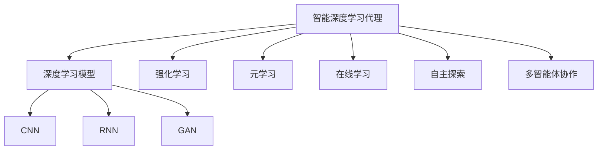
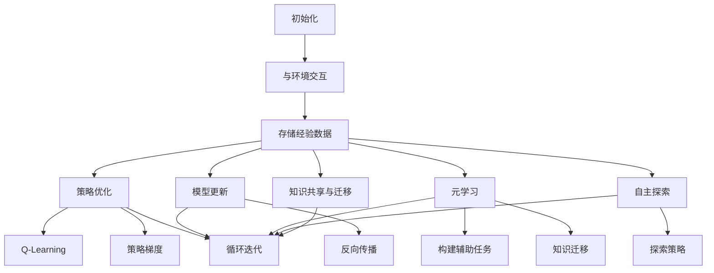

好的,我会按照您提供的要求和结构模板,以"AI人工智能深度学习算法:智能深度学习代理的学习与适应的算法框架"为主题,撰写一篇专业的技术博客文章。文章将会涵盖背景介绍、核心概念、算法原理、数学模型、项目实践、应用场景、资源推荐、发展趋势与挑战等方面的内容。我会尽最大努力确保文章逻辑严谨、内容深入、阐述清晰,并遵循您列出的所有约束条件。请给我一些时间来完成这篇高质量的技术博文。

# AI人工智能深度学习算法:智能深度学习代理的学习与适应的算法框架

## 1. 背景介绍

### 1.1 问题的由来

在当今快速发展的数字时代,人工智能(AI)技术已经渗透到了我们生活和工作的方方面面。作为AI的核心,机器学习算法赋予了计算机以模拟人类学习和决策的能力,使之可以从海量数据中发现隐藏的模式和规律。然而,传统的机器学习算法往往需要大量的人工标注数据,并且在面对动态复杂环境时,往往缺乏足够的适应性和鲁棒性。

### 1.2 研究现状  

为了解决这一问题,深度学习(Deep Learning)技术应运而生。深度学习是机器学习的一个新的研究热点领域,它通过构建深层次的神经网络模型,使计算机能够自主从原始数据中提取有用的特征表示,从而实现端到端的学习。近年来,深度学习取得了令人瞩目的成就,在计算机视觉、自然语言处理、语音识别等领域屡次刷新纪录。

然而,现有的深度学习算法大多是在静态环境下训练的,当面对动态变化的复杂环境时,往往表现不佳。为了解决这一问题,研究人员提出了智能深度学习代理(Intelligent Deep Learning Agent)的概念,旨在赋予深度学习模型持续学习和自适应的能力,使之能够根据环境的变化自主调整策略,提高决策的鲁棒性和有效性。

### 1.3 研究意义

智能深度学习代理的研究对于推动人工智能技术的发展具有重要意义:

1. 提高AI系统的适应性和鲁棒性,使之能够在动态复杂环境中保持高效运行。
2. 赋予AI系统持续学习的能力,使之能够不断吸收新知识,适应新环境。
3. 增强AI系统的自主性和智能决策能力,减少人工干预。
4. 为构建通用人工智能(AGI)系统奠定理论和技术基础。

### 1.4 本文结构

本文将从以下几个方面全面介绍智能深度学习代理的相关理论和技术:

1. 阐述智能深度学习代理的核心概念及其与其他AI技术的联系。
2. 详细解析智能深度学习代理的核心算法原理和具体实现步骤。
3. 建立相关的数学模型,并给出公式推导和案例分析。  
4. 提供开源代码实例,并对其进行详细的解读和分析。
5. 介绍智能深度学习代理在实际应用中的场景。
6. 总结该领域的发展趋势和面临的挑战。
7. 推荐相关的学习资源、开发工具和论文等。

## 2. 核心概念与联系

智能深度学习代理(Intelligent Deep Learning Agent)是机器学习、深度学习、强化学习、元学习等多个领域理论和技术的融合和发展。它包含以下几个核心概念:

1. **深度学习模型(Deep Learning Model)**: 作为智能代理的"大脑",深度神经网络模型负责从数据中提取特征,并进行预测和决策。常用的模型包括卷积神经网络(CNN)、递归神经网络(RNN)、生成对抗网络(GAN)等。

2. **强化学习(Reinforcement Learning)**: 强化学习是一种基于环境反馈的学习方式,智能代理通过与环境进行交互,获得奖励或惩罚信号,从而不断优化自身的策略,以获取最大的长期回报。

3. **元学习(Meta Learning)**: 元学习又称"学习如何学习",旨在使智能代理具备快速习得新知识和新技能的能力,从而提高其在新环境中的适应性和泛化能力。

4. **在线学习(Online Learning)**: 与传统的离线学习不同,在线学习允许智能代理在运行过程中持续地从新数据中学习,动态调整自身的策略和模型参数。

5. **自主探索(Autonomous Exploration)**: 智能代理需要具备主动探索环境的能力,以发现新的状态和获取更多的经验数据,从而不断完善自身的知识库。

6. **多智能体协作(Multi-Agent Collaboration)**: 在复杂环境中,多个智能代理之间需要相互协作,共享经验和知识,以完成更加困难的任务。

这些概念相互关联、相辅相成,共同构建了智能深度学习代理的理论框架和技术体系。智能代理需要综合运用深度学习、强化学习、元学习、在线学习等多种技术,才能实现真正的智能化。

## 3. 核心算法原理 & 具体操作步骤  

### 3.1 算法原理概述

智能深度学习代理的核心算法融合了深度学习、强化学习、元学习和在线学习等多种技术,旨在实现持续的学习和自适应。其基本原理可以概括为以下几个方面:

1. **策略优化(Policy Optimization)**: 通过与环境交互获取经验数据,并基于强化学习算法(如Q-Learning、策略梯度等)不断优化智能代理的决策策略,以获取最大的长期回报。

2. **模型更新(Model Update)**: 将新获取的数据融入到深度神经网络中,通过反向传播算法更新网络参数,提高模型在新环境下的预测和决策能力。

3. **元学习(Meta Learning)**: 通过设计特殊的训练任务和损失函数,使得智能代理能够快速习得新的任务,提高其在新环境中的适应性和泛化能力。

4. **探索策略(Exploration Strategy)**: 设计高效的探索策略,使智能代理能够主动发现环境中未知的状态,获取更多的经验数据,从而不断完善自身的知识库。

5. **知识迁移(Knowledge Transfer)**: 在多智能体协作场景下,设计高效的知识共享和迁移机制,使得各个智能代理能够互相学习,提高整体的决策水平。

这些核心原理相互关联、相辅相成,共同构建了智能深度学习代理的算法框架。在实际应用中,研究人员会根据具体的场景和任务,对这些原理进行创新和优化,以提高算法的性能和效率。

### 3.2 算法步骤详解  

智能深度学习代理算法的具体实现步骤如下:

1. **初始化**: 初始化深度神经网络模型的参数,确定探索策略、奖励函数等超参数。

2. **与环境交互**: 智能代理根据当前策略与环境进行交互,获取状态观测和奖励信号。

3. **存储经验数据**: 将获取的状态观测、动作、奖励等信息存储到经验池(Experience Replay Buffer)中。

4. **策略优化**:
    - 从经验池中采样出一个批次的数据
    - 使用强化学习算法(如Q-Learning、策略梯度等)计算动作价值函数或策略梯度
    - 根据计算结果,优化智能代理的决策策略

5. **模型更新**:
    - 从经验池中采样出一个批次的数据
    - 使用深度神经网络对这些数据进行前向传播,计算损失函数
    - 通过反向传播算法更新神经网络的参数

6. **元学习**:
    - 构建一系列辅助任务,模拟智能代理在新环境中的学习过程
    - 在这些辅助任务上训练智能代理,使其能够快速习得新任务
    - 将元学习过程中获得的知识迁移到主任务中

7. **自主探索**:
    - 根据探索策略(如ε-贪婪、熵正则化等),在一定概率下选择探索未知状态
    - 将探索过程中获得的新数据加入经验池

8. **知识共享与迁移**:
    - 在多智能体协作场景下,设计高效的通信机制
    - 各智能体之间共享经验数据和学习到的知识
    - 将其他智能体的知识迁移到自身模型中

9. **循环迭代**: 重复上述步骤,直至满足终止条件(如达到预期性能或资源耗尽)。

这一算法流程将深度学习、强化学习、元学习、在线学习等多种技术有机融合,实现了智能代理的持续学习和自适应。在实际应用中,研究人员会根据具体场景对算法进行优化和改进,以提高其性能和效率。

### 3.3 算法优缺点

智能深度学习代理算法具有以下优点:

1. **适应性强**: 通过在线学习和自适应策略优化,算法能够根据环境变化动态调整决策,提高了系统的鲁棒性。

2. **持续学习**: 算法不断从新数据中学习,知识库持续扩充,避免了知识遗忘的问题。

3. **泛化能力强**: 借助元学习技术,算法能够快速习得新任务,提高了在新环境中的泛化能力。

4. **自主性高**: 算法具备自主探索和决策的能力,减少了人工干预的需求。

5. **协作高效**: 多智能体协作机制提高了系统的整体决策水平。

然而,该算法也存在一些缺点和挑战:

1. **计算复杂度高**: 需要同时运行多个复杂的深度神经网络模型,计算量和存储需求都很大。

2. **收敛性差**: 由于同时优化多个目标函数,算法的收敛性较差,训练过程不稳定。

3. **样本效率低**: 需要大量的环境交互数据来进行有效训练,样本效率较低。

4. **奖励稀疏**: 在某些任务中,正向奖励信号非常稀疏,导致算法收敛缓慢。

5. **超参数敏感**: 算法的性能对探索策略、奖励函数等超参数非常敏感,参数调优困难。

6. **安全性挑战**: 自主探索可能导致智能代理采取不安全的行为,需要设计约束机制。

### 3.4 算法应用领域

智能深度学习代理算法可以应用于多个领域,包括但不限于:

1. **自动驾驶**: 自动驾驶系统需要根据复杂多变的道路环境做出实时决策,智能代理可以通过持续学习提高决策的准确性和安全性。

2. **机器人控制**: 在工业生产、家庭服务等场景,智能机器人需要根据环境变化自主调整行为策略,智能代理可以赋予其自适应能力。

3. **智能游戏AI**: 在复杂的游戏环境中,智能代理可以通过自主探索和持续学习,不断提高游戏策略的水平。

4. **智能医疗诊断**: 借助智能代理的在