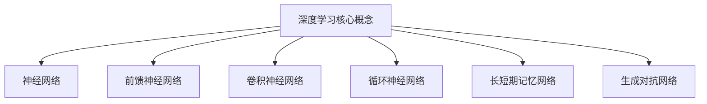

以下是根据您的要求撰写的技术博客文章正文内容：

# AI人工智能深度学习算法：设计深度学习任务处理流程

## 1. 背景介绍

### 1.1 问题的由来

随着大数据时代的到来，海量的数据被广泛应用于各个领域。传统的机器学习算法由于受到算力、存储和数据规模等因素的限制，在处理这些大规模、高维、多样化的数据时遇到了瓶颈。深度学习(Deep Learning)作为一种全新的机器学习范式应运而生,它通过对数据建模,自动学习数据特征,从而极大地提高了机器对复杂数据的处理能力。

### 1.2 研究现状  

近年来,深度学习在计算机视觉、自然语言处理、语音识别等领域取得了突破性的进展,在图像分类、目标检测、机器翻译等任务上表现优异,甚至超越了人类水平。随着算力的不断提升和训练数据的日益丰富,深度学习模型也在不断发展和完善。目前,卷积神经网络(CNN)、循环神经网络(RNN)、长短期记忆网络(LSTM)、门控循环单元(GRU)等深度神经网络模型被广泛应用于各种任务中。

### 1.3 研究意义

尽管深度学习取得了令人瞩目的成就,但其仍存在一些挑战和局限性,如需要大量的训练数据、存在黑盒操作、可解释性差等。因此,深入研究深度学习算法的原理和实现流程,对于提高模型的性能、可解释性和泛化能力具有重要意义。本文将系统地介绍深度学习任务处理的整体流程,阐述核心算法原理,分析数学模型,并给出代码实例,旨在为读者提供全面的理解和实践指导。

### 1.4 本文结构

本文首先介绍深度学习的核心概念和相关技术,然后详细阐述常用的深度学习算法原理和具体操作步骤。接下来,探讨深度学习的数学模型和公式推导,并结合案例进行分析讲解。之后,提供一个完整的项目实践,包括开发环境搭建、源代码实现和运行结果展示。最后,讨论深度学习在实际应用中的场景,介绍相关工具和学习资源,并对未来发展趋势和挑战进行展望。

## 2. 核心概念与联系

深度学习是机器学习的一个新的领域,它模仿人脑的机制来处理数据。与传统的机器学习算法不同,深度学习可以自动从数据中学习特征表示,而无需人工设计特征。深度学习算法主要包括以下几个核心概念:

1. **神经网络(Neural Network)**: 深度学习的基础模型,由多层神经元组成,每层通过权重矩阵连接。
2. **前馈神经网络(Feedforward Neural Network)**: 信息只从输入层单向传递到输出层的神经网络。
3. **卷积神经网络(Convolutional Neural Network, CNN)**: 在图像、视频等领域表现卓越,通过卷积和池化操作提取特征。
4. **循环神经网络(Recurrent Neural Network, RNN)**: 适用于序列数据,内部有循环连接,能够处理变长输入。
5. **长短期记忆网络(Long Short-Term Memory, LSTM)**: 改进的RNN,解决了梯度消失和爆炸问题。
6. **生成对抗网络(Generative Adversarial Network, GAN)**: 由生成网络和判别网络组成,用于生成式建模。

这些核心概念相互关联,共同构建了深度学习的理论和应用体系。下面将详细介绍深度学习任务处理的核心算法原理和具体实现步骤。

## 3. 核心算法原理与具体操作步骤

### 3.1 算法原理概述

深度学习算法的核心思想是通过构建多层神经网络模型,并使用大量数据对模型进行训练,从而学习到数据的内在特征表示。在训练过程中,输入数据经过多层神经网络的非线性变换,最终输出所需的结果。通过反向传播算法调整网络权重,使模型输出与期望输出之间的误差最小化。

深度学习算法可以分为有监督学习和无监督学习两大类。有监督学习算法需要提供带标签的训练数据,通过学习输入和标签之间的映射关系来进行预测或分类。常见的有监督学习算法包括卷积神经网络、循环神经网络等。无监督学习算法则不需要标签数据,通过从数据中发现内在结构和模式来进行特征学习或数据压缩,典型算法有自编码器、生成对抗网络等。

### 3.2 算法步骤详解

以下是深度学习算法的一般处理步骤:

1. **数据预处理**: 对原始数据进行清洗、标准化、归一化等预处理,以满足模型输入要求。
2. **构建网络模型**: 根据任务需求选择合适的网络结构,如CNN、RNN等,并确定超参数设置。
3. **初始化网络权重**: 通常采用随机初始化或预训练权重的方式。
4. **输入数据并前向传播**: 将预处理后的数据输入网络,计算每层的输出。
5. **计算损失函数**: 比较模型输出与标签之间的差异,计算损失函数值。
6. **反向传播**: 根据损失函数值,使用优化算法(如梯度下降)计算每层权重的梯度。
7. **更新网络权重**: 根据梯度值更新网络权重,使损失函数值最小化。
8. **重复训练**: 重复执行步骤4-7,直至模型收敛或达到指定的训练轮数。
9. **模型评估**: 在测试数据集上评估模型性能,计算指标如准确率、精确率、召回率等。
10. **模型部署**: 将训练好的模型应用于实际任务中,进行预测或决策。

### 3.3 算法优缺点

深度学习算法具有以下优点:

- 自动学习特征表示,无需人工设计特征
- 能够处理高维、非线性、多样化的数据
- 在计算机视觉、自然语言处理等领域表现出色
- 具有很强的泛化能力,可以应用于多种任务

但同时也存在一些缺点和局限性:

- 需要大量的训练数据和计算资源
- 训练过程复杂,需要调整多个超参数
- 存在黑盒操作,模型内部过程难以解释
- 容易过拟合,泛化能力会受到影响
- 对异常数据和对抗样本敏感

### 3.4 算法应用领域  

深度学习算法已被广泛应用于多个领域,主要包括:

1. **计算机视觉**: 图像分类、目标检测、语义分割、图像生成等
2. **自然语言处理**: 机器翻译、文本生成、情感分析、问答系统等
3. **语音识别**: 自动语音识别、语音合成、说话人识别等
4. **推荐系统**: 个性化推荐、内容推荐、协同过滤等
5. **金融**: 金融风险评估、欺诈检测、股票预测等
6. **医疗健康**: 医学图像分析、疾病诊断、药物发现等
7. **游戏AI**: 游戏策略生成、人机对战等
8. **其他领域**: 机器人控制、无人驾驶、天文学等

## 4. 数学模型和公式详细讲解举例说明

### 4.1 数学模型构建

深度学习算法的数学模型主要基于神经网络。一个典型的神经网络可以表示为一个由多层组成的函数组合:

$$
f(x) = f^{(N)}(f^{(N-1)}(...f^{(2)}(f^{(1)}(x))))
$$

其中 $x$ 为输入数据, $f^{(i)}$ 为第 $i$ 层的函数映射,通常包含线性变换(权重矩阵与输入的乘积)和非线性激活函数。

对于有监督学习任务,我们需要最小化损失函数 $L(y, \hat{y})$,其中 $y$ 为真实标签, $\hat{y}$ 为模型输出。常用的损失函数包括均方误差、交叉熵等。通过反向传播算法计算每层权重矩阵 $W^{(i)}$ 的梯度:

$$
\frac{\partial L}{\partial W^{(i)}} = \frac{\partial L}{\partial \hat{y}} \frac{\partial \hat{y}}{\partial f^{(N)}} \cdots \frac{\partial f^{(i+1)}}{\partial W^{(i)}}
$$

然后使用优化算法(如梯度下降)更新权重:

$$
W^{(i)} \leftarrow W^{(i)} - \eta \frac{\partial L}{\partial W^{(i)}}
$$

其中 $\eta$ 为学习率。通过不断迭代,使损失函数值最小化,从而得到最优的模型参数。

### 4.2 公式推导过程

以下是一个简单的前馈神经网络模型的公式推导过程:

假设输入为 $x \in \mathbb{R}^{n}$,隐藏层神经元个数为 $m$,输出层神经元个数为 $l$。令隐藏层的权重矩阵为 $W^{(1)} \in \mathbb{R}^{m \times n}$,偏置向量为 $b^{(1)} \in \mathbb{R}^{m}$,激活函数为 $\sigma(\cdot)$,则隐藏层的输出为:

$$
h = \sigma(W^{(1)}x + b^{(1)})
$$

同理,令输出层的权重矩阵为 $W^{(2)} \in \mathbb{R}^{l \times m}$,偏置向量为 $b^{(2)} \in \mathbb{R}^{l}$,则输出层的输出为:

$$
\hat{y} = W^{(2)}h + b^{(2)}
$$

对于回归任务,我们可以使用均方误差作为损失函数:

$$
L(y, \hat{y}) = \frac{1}{2} \|y - \hat{y}\|^2
$$

通过反向传播算法计算梯度:

$$
\begin{aligned}
\frac{\partial L}{\partial W^{(2)}} &= \frac{\partial L}{\partial \hat{y}} \frac{\partial \hat{y}}{\partial W^{(2)}} = (\hat{y} - y) h^T \\
\frac{\partial L}{\partial b^{(2)}} &= \frac{\partial L}{\partial \hat{y}} \frac{\partial \hat{y}}{\partial b^{(2)}} = \hat{y} - y \\
\frac{\partial L}{\partial W^{(1)}} &= \frac{\partial L}{\partial \hat{y}} \frac{\partial \hat{y}}{\partial h} \frac{\partial h}{\partial W^{(1)}} = (W^{(2)})^T (\hat{y} - y) \odot \sigma'(W^{(1)}x + b^{(1)}) x^T \\
\frac{\partial L}{\partial b^{(1)}} &= \frac{\partial L}{\partial \hat{y}} \frac{\partial \hat{y}}{\partial h} \frac{\partial h}{\partial b^{(1)}} = (W^{(2)})^T (\hat{y} - y) \odot \sigma'(W^{(1)}x + b^{(1)})
\end{aligned}
$$

其中 $\odot$ 表示元素wise乘积,  $\sigma'(\cdot)$ 为激活函数的导数。通过上述公式,我们可以计算每层权重的梯度,并使用梯度下降法进行更新。

### 4.3 案例分析与讲解

以下是一个使用多层感知机(MLP)进行手写数字识别的案例分析:

假设我们有一个 $28 \times 28$ 像素的手写数字图像,将其展开为 $784$ 维的向量作为输入。我们构建一个三层的MLP模型,其中隐藏层神经元个数为 $512$,输出层神经元个数为 $10$ (对应 $0-9$ 这 $10$ 个数字类别)。

1. 输入层到隐藏层的映射:

$$
h = \sigma(W^