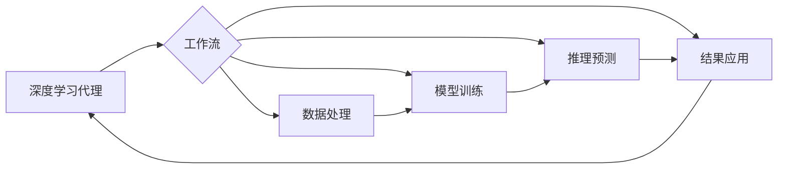

# AI人工智能深度学习算法：面向未来的深度学习代理与工作流研究方向

作者：禅与计算机程序设计艺术 / Zen and the Art of Computer Programming

## 1. 背景介绍

### 1.1 问题的由来

随着人工智能技术的飞速发展,深度学习算法已经在各个领域取得了令人瞩目的成就。然而,当前的深度学习算法仍然存在一些局限性,如可解释性差、泛化能力不足、缺乏灵活性等问题。为了进一步提升深度学习的性能和应用范围,亟需探索新的研究方向。

### 1.2 研究现状

目前,深度学习代理(Deep Learning Agents)和工作流(Workflows)是深度学习领域的两个前沿研究方向。深度学习代理旨在构建具有自主学习和决策能力的智能体,使其能够在复杂环境中自适应地完成任务。工作流则聚焦于将深度学习模型与业务流程相结合,实现端到端的智能化应用。这两个方向的研究成果有望突破传统深度学习的瓶颈,开辟全新的应用场景。

### 1.3 研究意义

深入研究深度学习代理和工作流,对于推动人工智能技术的进步和产业化应用具有重要意义:

1. 提升深度学习的智能化水平,使其能够更好地适应现实世界的复杂性和不确定性。
2. 拓展深度学习的应用边界,促进其与各行各业的深度融合,催生出更多创新性的应用场景和解决方案。
3. 加速人工智能技术的产业化进程,为经济社会发展注入新的动力。

### 1.4 本文结构

本文将围绕深度学习代理和工作流这两个研究方向展开论述,内容安排如下:

- 第2部分: 介绍深度学习代理和工作流的核心概念及二者之间的联系
- 第3部分: 重点阐述深度学习代理的核心算法原理和具体操作步骤
- 第4部分: 建立深度学习代理的数学模型,给出详细的公式推导和案例分析
- 第5部分: 提供深度学习工作流的代码实例和详细解释说明
- 第6部分: 探讨深度学习代理和工作流的实际应用场景及未来应用前景
- 第7部分: 推荐相关的学习资源、开发工具和文献资料
- 第8部分: 总结全文,展望深度学习代理和工作流的未来发展趋势与挑战
- 第9部分: 梳理常见问题,给出专业解答

## 2. 核心概念与联系

深度学习代理(Deep Learning Agents)是一类基于深度学习模型构建的智能Agent,其核心特点是具备感知、推理、决策、执行等认知能力,能够主动适应环境变化,自主完成既定任务。与传统的深度学习模型相比,深度学习代理更加注重端到端的系统性设计和训练,强调感知-决策-执行的闭环反馈机制,从而实现更高水平的智能。

工作流(Workflow)是一种基于业务流程的任务协同模式,通过将不同的任务单元按照一定的逻辑关系和执行顺序组织起来,实现端到端的自动化作业。在人工智能领域,工作流的概念被引入深度学习系统的设计中,形成了深度学习工作流(Deep Learning Workflow)的新范式。深度学习工作流旨在将深度学习模型无缝集成到业务流程中,打通数据处理、模型训练、推理预测、结果应用等各个环节,从而实现深度学习的端到端应用。

深度学习代理和工作流这两个概念之间存在紧密的内在联系。一方面,深度学习代理可以作为工作流中的关键组件,承担核心的计算和决策任务,提升工作流的智能化水平。另一方面,工作流为深度学习代理的训练和部署提供了完整的应用场景和数据支撑,使其能够在真实环境中不断优化和进化。二者的结合,将极大地拓展深度学习的应用空间,催生出一系列全新的技术方案和商业模式。

下面是一个简要的示意图,描述了深度学习代理和工作流的关系:

## 3. 核心算法原理 & 具体操作步骤

### 3.1 算法原理概述

深度学习代理的核心算法主要包括深度强化学习(Deep Reinforcement Learning)和深度元学习(Deep Meta Learning)两大类。

深度强化学习通过将深度神经网络引入强化学习框架,使Agent能够在复杂环境中通过试错不断优化策略,最终学会执行特定任务。其基本原理可以用下面的公式表示:

$$Q(s,a) = r + \gamma \max_{a'} Q(s',a')$$

其中,$Q(s,a)$表示在状态$s$下采取动作$a$的价值,$r$为即时奖励,$\gamma$为折扣因子,$\max_{a'} Q(s',a')$为下一状态$s'$下所有可能动作的最大Q值。通过不断更新Q值,Agent最终学会采取最优策略。

深度元学习则是一种基于元学习(Meta Learning)思想的深度学习范式,旨在学习如何学习(Learning to Learn),从而实现快速适应和泛化。其核心是通过设计两个层次的学习过程:内循环(Inner Loop)和外循环(Outer Loop)。内循环负责在特定任务上进行快速学习和适应,外循环负责从多个任务中提取共性知识,指导内循环的学习过程。这种层次化的学习机制可以显著提升深度学习代理的学习效率和泛化能力。

### 3.2 算法步骤详解

以深度强化学习为例,其具体算法步骤如下:

1. 初始化深度神经网络参数$\theta$,用于近似Q函数。
2. 初始化经验回放池(Experience Replay Buffer)$D$。
3. for episode = 1 to M do
   1. 初始化环境状态$s_1$。
   2. for t = 1 to T do
      1. 根据当前策略$\pi_{\theta}(a|s)$(如$\epsilon$-贪婪策略)选择动作$a_t$。
      2. 执行动作$a_t$,观察奖励$r_t$和新状态$s_{t+1}$。
      3. 将转移样本$(s_t,a_t,r_t,s_{t+1})$存入经验回放池$D$。
      4. 从$D$中随机采样一个批次的转移样本$(s_i,a_i,r_i,s_{i+1})$。
      5. 计算Q值目标$y_i$:
         - 若$s_{i+1}$为终止状态,则$y_i=r_i$。
         - 否则,$y_i=r_i+\gamma \max_{a'} Q(s_{i+1},a';\theta^-)$。其中$\theta^-$为目标网络的参数。
      6. 最小化损失函数:$L(\theta)=\mathbb{E}_{(s,a,r,s')\sim D}[(y_i-Q(s_i,a_i;\theta))^2]$,更新$\theta$。
      7. 每隔$C$步,将$\theta^-$更新为$\theta$。
   3. end for
4. end for

其中,内层循环代表一个Episode内的智能体与环境的交互过程,通过采样并训练Q网络来更新策略。外层循环代表多个Episode的迭代优化过程,最终得到一个性能良好的策略。

### 3.3 算法优缺点

深度强化学习的主要优点包括:

1. 端到端的学习范式,无需人工设计特征,自适应性强。
2. 通过试错探索和即时反馈,能够在连续状态-动作空间中学习到接近最优的策略。
3. 采用深度神经网络作为函数逼近器,具有强大的表征和泛化能力。

其缺点包括:

1. 样本效率低,需要大量的环境交互数据,训练成本高。
2. 对奖励函数的设计和调优要求较高,容易出现欠定义或稀疏奖励问题。
3. 难以适应非平稳环境,面对环境突变时,训练好的策略可能会失效。

### 3.4 算法应用领域

深度强化学习和深度元学习已在多个领域取得了重要进展,主要应用场景包括:

1. 游戏AI。如Atari视频游戏、围棋、德州扑克等,通过深度强化学习,AI已经能够达到甚至超越人类玩家的水平。
2. 机器人控制。深度强化学习为机器人的感知、规划、控制提供了新的解决方案,使其能够在复杂环境下自主完成装配、搬运、导航等任务。
3. 推荐系统。深度强化学习可以建模用户与推荐系统的长期交互过程,动态调整推荐策略,显著提升用户体验。
4. 自然语言处理。深度元学习在低资源语言的快速适配、跨语言迁移等任务中表现出色。
5. 自动驾驶。深度强化学习和深度元学习为自动驾驶中的感知、决策、规划等模块提供了新的思路和方法。

## 4. 数学模型和公式 & 详细讲解 & 举例说明

### 4.1 数学模型构建

以深度强化学习中的DQN(Deep Q-Network)算法为例,我们构建如下数学模型:

1. 状态空间$\mathcal{S}$:所有可能的环境状态$s$的集合。
2. 动作空间$\mathcal{A}$:所有可能的动作$a$的集合。
3. 转移概率$\mathcal{P}$:定义为状态-动作对$(s,a)$转移到下一状态$s'$的条件概率,即$\mathcal{P}_{ss'}^a=P(s'|s,a)$。
4. 奖励函数$\mathcal{R}$:定义为状态-动作对$(s,a)$到下一状态$s'$所获得的即时奖励,即$\mathcal{R}_s^a=\mathbb{E}[R|s,a]$。
5. 折扣因子$\gamma \in [0,1]$:表示未来奖励的衰减程度,折扣因子越大,越重视长期收益。
6. 策略$\pi(a|s)$:在状态$s$下选择动作$a$的概率分布。
7. 状态-动作值函数$Q^{\pi}(s,a)$:在策略$\pi$下,状态-动作对$(s,a)$的期望累积奖励,即$Q^{\pi}(s,a)=\mathbb{E}_{\pi}[\sum_{t=0}^{\infty} \gamma^t R_{t+1}|S_t=s,A_t=a]$。

DQN的目标是学习一个最优的Q函数$Q^*(s,a)$,使得在该Q函数指导下的贪婪策略$\pi^*(a|s)=\arg\max_a Q^*(s,a)$为最优策略。

### 4.2 公式推导过程

根据Bellman最优方程,最优Q函数$Q^*(s,a)$满足如下关系:

$$Q^*(s,a)=\mathbb{E}_{s'\sim \mathcal{P}_{ss'}^a}[R_s^a+\gamma \max_{a'} Q^*(s',a')]$$

即最优Q值等于即时奖励与下一状态最优Q值的折扣和的期望。

DQN通过深度神经网络$Q(s,a;\theta)$来近似最优Q函数,其中$\theta$为网络参数。在训练过程中,DQN采用如下的损失函数:

$$L(\theta)=\mathbb{E}_{(s,a,r,s')\sim D}[(r+\gamma \max_{a'} Q(s',a';\theta^-)-Q(s,a;\theta))^2]$$

其中,$(s,a,r,s')\sim D$表示从经验回放池$D$中采样的转移样本,$\theta^-$为目标网络的参数,用于计算Q值目标。

通过最小化损失函数$L(\theta)$,DQN不断更新Q网络参数$\theta$,使其逼近最优Q函数$Q^*(s,a)$。同时,DQN采用经验回放和目标网络等技巧,以提高训练的稳定