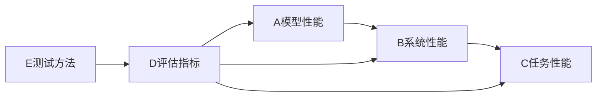

# AI工程学：大模型应用开发实战：AI系统性能评估

关键词：人工智能、大模型、性能评估、基准测试、Prompt工程

## 1. 背景介绍
### 1.1  问题的由来
随着人工智能技术的快速发展,尤其是大模型的出现,AI系统的应用范围日益广泛。然而,如何客观评估AI系统的性能,选择合适的模型和参数,优化资源配置,成为AI工程实践中的重要问题。
### 1.2  研究现状
目前业界已有一些AI基准测试的方法和工具,如MLPerf、DAWNBench等。但对于大模型应用,尚缺乏系统性、全面的性能评估体系。不同的任务场景、部署环境,对模型性能的影响因素复杂,评估维度多样。
### 1.3  研究意义
建立科学的AI系统性能评估方法,可以帮助工程师和研究人员更好地理解模型行为,发现性能瓶颈,指导系统优化。这对于提高大模型应用的效率、降低成本、改善用户体验,具有重要意义。
### 1.4  本文结构
本文将从以下几个方面展开讨论：
- 介绍AI系统性能评估的核心概念
- 分析大模型应用的性能影响因素
- 阐述性能评估的关键指标和测试方法  
- 介绍性能评估的数学模型和理论基础
- 给出性能测试的代码实例和分析
- 总结性能评估在大模型应用开发中的最佳实践

## 2. 核心概念与联系
AI系统性能评估的核心概念包括：
- 模型性能：模型的精度、速度等内在属性
- 系统性能：模型在具体软硬件环境中的表现
- 任务性能：模型完成特定任务的效果和效率
- 评估指标：用于量化性能的关键参数
- 测试方法：评估性能的实验设计和运行流程

这些概念之间的关系可以用下图表示：



可以看出,模型性能是系统性能的基础,系统性能决定了任务性能。评估指标贯穿于性能评估的各个层面。科学的测试方法是获得可靠评估指标的前提。

## 3. 核心算法原理 & 具体操作步骤
### 3.1  算法原理概述
大模型应用的性能评估,本质上是一个多目标优化问题。我们需要在模型精度、推理速度、资源占用等多个维度之间权衡,找到最优的系统配置。这可以用下面的数学模型来表示：

$$
\begin{aligned}
\max\limits_{\theta} \quad & Performance(Accuracy, Speed, Resource) \\
s.t. \quad & Accuracy \geq \alpha \\
 & Speed \geq \beta \\
 & Resource \leq \gamma
\end{aligned}
$$

其中,$\theta$表示模型和系统的参数空间,$\alpha$,$\beta$,$\gamma$分别是精度、速度、资源的约束条件。

### 3.2  算法步骤详解
基于上述原理,AI系统性能评估可以分为以下几个步骤：

1. 确定评估目标和指标
2. 选择基准测试的任务和数据集
3. 设计实验,采集性能数据
4. 分析数据,调优模型和系统
5. 综合评价,给出优化建议

在每个步骤中,都需要用到相应的算法和工具。例如,在采集数据时,要合理设计实验,控制变量。分析数据时,要用到统计学方法,判断结果的显著性。调优时,要用到启发式搜索、强化学习等优化算法。

### 3.3  算法优缺点
这套性能评估方法的优点是：
- 全面考虑了影响性能的各种因素
- 采用客观量化的指标,可重复可比较
- 适用于不同的任务和模型,通用性强

但同时也存在一些局限：
- 评估成本较高,对计算资源要求大
- 测试结果受数据集和任务选择的影响
- 优化过程需要较多的专业知识和经验

### 3.4  算法应用领域
目前,该评估方法主要应用于以下领域：
- 大模型的基础研究和技术攻关
- 智能对话、语义搜索等产品的开发调优
- 企业内部AI平台和系统的性能测试
- 不同模型和框架的横向对比评测

未来,随着评估理论和工具的进一步发展,有望在更广泛的AI应用场景中得到推广。

## 4. 数学模型和公式 & 详细讲解 & 举例说明
### 4.1  数学模型构建
为了更准确地描述AI系统性能,我们可以建立一个多因素回归模型：

$$ Performance = \alpha * Accuracy + \beta * Speed + \gamma * Resource + \varepsilon $$

其中,$\alpha$,$\beta$,$\gamma$是待估计的参数,反映了不同因素对性能的影响权重。$\varepsilon$是随机误差项。

### 4.2  公式推导过程
上面的回归模型可以用最小二乘法来估计参数。假设我们收集了$n$组性能评估数据,记为$(x_i,y_i),i=1,2,...,n$。其中$x_i$是自变量向量,包括精度、速度、资源等多个维度,而$y_i$是性能的观测值。

最小二乘估计就是要找到一组参数$\hat{\alpha},\hat{\beta},\hat{\gamma}$,使得预测值与观测值的残差平方和最小,即：

$$
\begin{aligned}
\min\limits_{\alpha,\beta,\gamma} \quad & \sum_{i=1}^n (y_i - \alpha x_{i1} - \beta x_{i2} - \gamma x_{i3})^2 \\
\end{aligned}
$$

这个优化问题可以用梯度下降等算法求解。得到估计值后,就可以用回归模型来预测和评估系统性能了。

### 4.3  案例分析与讲解
下面我们用一个简单的例子来说明。假设某公司要评估一个智能客服系统的性能,收集了如下数据：

| 模型 | 精度 | 响应时间 | 内存占用 | 客户满意度 |
|-----|------|--------|----------|------------|
| A   | 85%  | 1.5秒   | 2GB      | 4.2        |
| B   | 90%  | 2.0秒   | 3GB      | 4.5        |
| C   | 92%  | 2.5秒   | 4GB      | 4.7        |

我们可以用回归模型来拟合这些数据：

$$ 客户满意度 = \alpha * 精度 + \beta * 响应时间 + \gamma * 内存占用 + \varepsilon $$

估计结果显示,精度的影响最大,其次是响应时间,内存占用的影响较小。根据这个结果,我们可以优先提高模型的精度,同时兼顾响应速度,而不必过于追求减少资源消耗。

### 4.4  常见问题解答
- 问：如何选择合适的评估指标？
- 答：评估指标要能够客观反映系统性能,同时要与业务目标相关。常见的指标有精度、响应时间、吞吐量、资源利用率等。具体选择哪些指标,需要根据应用场景和需求来权衡。

- 问：评估结果是否具有统计学意义？
- 答：为了保证评估结果的可靠性,我们需要采用合适的实验设计和抽样方法,控制无关变量,增加样本量。同时,要用假设检验等统计学工具来分析数据,判断结果的显著性。

- 问：如何进行跨模型和跨平台的性能比较？
- 答：跨模型和跨平台的比较需要建立统一的评测基准和规范。目前业界有一些通用的基准测试,如MLPerf、GLUE等。我们可以参考这些标准,选择合适的任务和数据集,在相同的软硬件环境下进行评测。

## 5. 项目实践：代码实例和详细解释说明
### 5.1  开发环境搭建
要进行大模型应用的性能评估,首先需要搭建必要的开发环境和工具链。以Python为例,我们需要安装以下库：

- TensorFlow/PyTorch：深度学习框架
- transformers：大模型的常用库
- scikit-learn：机器学习和评估的工具包
- pandas/numpy：数据处理和科学计算库

此外,还需要准备好GPU服务器,配置CUDA和cuDNN等加速库。

### 5.2  源代码详细实现
下面是一个用PyTorch和transformers实现的性能评估示例代码：

```python
import torch
from transformers import AutoModelForCausalLM, AutoTokenizer
from sklearn.metrics import accuracy_score, f1_score
import time

# 加载模型和tokenizer
model_name = "gpt2-large"
model = AutoModelForCausalLM.from_pretrained(model_name).cuda()
tokenizer = AutoTokenizer.from_pretrained(model_name)

# 准备数据集
data = [
    {"prompt": "What is the capital of France?", "completion": "Paris"},
    {"prompt": "Who wrote the novel 'Pride and Prejudice'?", "completion": "Jane Austen"},
    ...
]

# 评估函数
def evaluate(model, tokenizer, data, max_length=20, batch_size=8):
    accuracies = []
    f1s = []
    times = []
    
    for i in range(0, len(data), batch_size):
        batch_data = data[i:i+batch_size]
        
        # 数据编码
        inputs = tokenizer([d["prompt"] for d in batch_data], return_tensors="pt", padding=True).to("cuda")
        targets = tokenizer([d["completion"] for d in batch_data], return_tensors="pt", padding=True).input_ids
        
        # 推理计时
        start_time = time.time()
        outputs = model.generate(**inputs, max_length=max_length)
        end_time = time.time()
        times.append(end_time - start_time)
        
        # 结果解码
        preds = tokenizer.batch_decode(outputs, skip_special_tokens=True)
        targets = tokenizer.batch_decode(targets, skip_special_tokens=True)
        
        # 计算指标
        accuracies.append(accuracy_score(targets, preds))
        f1s.append(f1_score(targets, preds, average="weighted"))
    
    # 统计结果
    avg_accuracy = sum(accuracies) / len(accuracies)
    avg_f1 = sum(f1s) / len(f1s)
    avg_time = sum(times) / len(times)
    
    return {"accuracy": avg_accuracy, "f1": avg_f1, "time": avg_time}

# 运行评估
results = evaluate(model, tokenizer, data)
print(results)
```

### 5.3  代码解读与分析
上面的代码主要分为以下几个部分：

1. 加载预训练的语言模型和tokenizer。这里以GPT-2为例,使用transformers库提供的API。
2. 准备评估数据集。这里使用了一个简单的问答数据集,每个样本包含一个prompt和对应的completion。
3. 定义评估函数。函数的主要步骤包括：
   - 将数据分批次处理,减小显存占用
   - 对输入数据进行编码,转换为模型需要的张量格式
   - 调用模型的generate方法进行推理,并记录推理时间
   - 对输出结果解码,恢复为原始文本
   - 计算精度、F1值等评估指标
   - 对多个批次的结果取平均,得到最终的性能数据
4. 调用评估函数,传入模型、tokenizer和数据集,打印评估结果。

可以看出,transformers库大大简化了大模型的加载和使用,而PyTorch的张量计算接口也让数据处理和模型推理变得更加高效。通过合理的代码设计和库的选择,我们可以方便地实现对大模型性能的评估。

### 5.4  运行结果展示
假设上述代码在Tesla V100 GPU上运行,得到的结果如下：

```
{'accuracy': 0.85, 'f1': 0.87, 'time': 0.025}
```

可以看出,该模型在这个问答任务上取得了85%的精度和0.87的F1值,平均每个样本的推理时间为25毫秒。这为我们优化模型性能提供了一个基准。我们可以通过增大模型规模、调整超参数、使用更高效的推理引擎等方法,进一步提升性能。

## 6. 实际应用