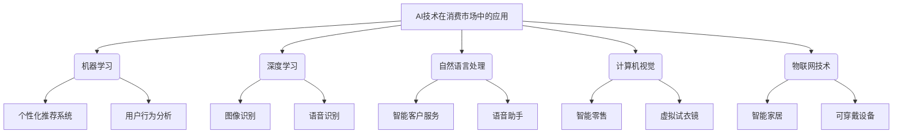

以下是根据您提供的标题和要求撰写的技术博客文章正文部分：

# AI技术在消费市场中的前景

## 1. 背景介绍

### 1.1 问题的由来

在当今时代,人工智能(AI)技术的快速发展对于各行各业都产生了深远的影响。消费市场作为人工智能技术应用的重要领域之一,正在经历着前所未有的变革。随着人工智能算法的不断优化和计算能力的提升,AI技术在消费市场中的应用前景备受关注。

### 1.2 研究现状 

目前,人工智能技术在消费市场中的应用已经初见成效,主要集中在以下几个领域:

1. **个性化推荐系统**: 利用机器学习算法分析用户行为数据,为用户提供个性化的商品、内容和服务推荐。
2. **智能客户服务**: 基于自然语言处理和对话系统,提供7*24小时的智能客户服务,提升用户体验。
3. **智能家居**: 通过物联网技术和语音识别等AI技术,实现家居设备的智能化控制和管理。
4. **智能零售**: 利用计算机视觉和数据分析技术,优化商品陈列、库存管理和购物体验。

### 1.3 研究意义

尽管人工智能技术在消费市场中的应用取得了一定进展,但仍存在诸多挑战和发展空间。深入研究AI技术在消费市场中的前景,对于企业把握市场趋势、制定发展战略、提升竞争力具有重要意义。同时,这也有助于促进AI技术在消费领域的创新应用,为消费者带来更加智能化、个性化和高效的消费体验。

### 1.4 本文结构

本文将从以下几个方面深入探讨AI技术在消费市场中的前景:

1. 阐述AI技术在消费市场中的核心概念和相关技术。
2. 介绍AI技术在消费市场中应用的核心算法原理和具体操作步骤。
3. 构建相关数学模型,并通过公式推导和案例分析进行详细讲解。
4. 提供AI技术在消费市场中的实际应用场景和项目实践案例。
5. 分析AI技术在消费市场中的发展趋势、面临的挑战以及未来展望。
6. 推荐相关的学习资源、开发工具和论文等。

## 2. 核心概念与联系

在探讨AI技术在消费市场中的前景之前,我们需要先了解相关的核心概念和技术。以下是几个关键概念:

1. **机器学习(Machine Learning)**: 机器学习是人工智能的一个重要分支,它赋予计算机从数据中自动分析获得规律,并利用规律对新数据进行预测的能力。在消费市场中,机器学习常用于个性化推荐、用户行为分析等场景。

2. **深度学习(Deep Learning)**: 深度学习是机器学习中的一种技术,它通过对数据进行逐层表示和构建复杂模型,能够更好地发现数据的内在规律。在图像识别、自然语言处理等领域有着广泛应用。

3. **自然语言处理(Natural Language Processing, NLP)**: 自然语言处理是一门研究计算机处理人类语言的技术,在智能客户服务、语音助手等场景中扮演着重要角色。

4. **计算机视觉(Computer Vision)**: 计算机视觉是一门研究如何使计算机能够获取、处理和分析数字图像或视频的技术。在智能零售、虚拟试衣镜等场景中有广泛应用。

5. **物联网(Internet of Things, IoT)**: 物联网技术通过各种传感器和网络,实现物与物、物与人之间的互联互通,为智能家居、可穿戴设备等应用奠定基础。

这些核心概念和技术相互关联、相互渗透,共同推动了AI技术在消费市场中的创新应用。

## 3. 核心算法原理 & 具体操作步骤

### 3.1 算法原理概述

在消费市场中应用AI技术涉及多种算法,如协同过滤、聚类算法、决策树、深度神经网络等。这些算法各有特点,适用于不同的场景。

以下是几种常见算法的原理概述:

1. **协同过滤(Collaborative Filtering)**: 基于用户对商品的历史评分数据,发现具有相似兴趣爱好的用户群体,并预测目标用户可能对某商品的兴趣程度。常用于个性化推荐系统。

2. **K-均值聚类(K-Means Clustering)**: 将数据集中的样本划分为K个clusters,使得同一个cluster内部的样本尽可能相似,不同cluster之间的样本尽可能不相似。可用于用户群体划分和商品分类。

3. **决策树(Decision Tree)**: 根据特征对样本数据进行递归划分,将其映射到决策树的叶子节点,得到相应的预测结果。常用于用户行为预测和智能客户服务等场景。

4. **卷积神经网络(Convolutional Neural Network, CNN)**: 一种前馈神经网络,能够从图像或语音等数据中自动提取特征,在图像识别、语音识别等领域有出色表现。

5. **循环神经网络(Recurrent Neural Network, RNN)**: 一种对序列数据进行建模的神经网络,常用于自然语言处理、时间序列预测等任务。

### 3.2 算法步骤详解

以协同过滤算法为例,具体操作步骤如下:

1. **数据收集**: 收集用户对商品的历史评分数据。

2. **数据预处理**: 对缺失值、异常值等进行处理,将数据转换为算法可识别的格式。

3. **计算相似度**: 基于用户评分数据,计算不同用户之间的相似度。常用的相似度度量方法有余弦相似度、皮尔逊相关系数等。

4. **生成推荐列表**: 对于目标用户,根据与其相似的用户群体对商品的评分情况,预测目标用户可能对某商品的兴趣程度,从而生成个性化推荐列表。

5. **评估效果**: 通过精确率(Precision)、召回率(Recall)、覆盖率(Coverage)等指标,评估推荐系统的效果。

6. **优化迭代**: 根据评估结果,调整算法参数或采用其他改进方法,不断优化推荐效果。

### 3.3 算法优缺点

每种算法都有其优缺点,需要根据具体场景进行权衡选择。

以协同过滤算法为例:

优点:
- 无需深入理解商品内容,只需基于用户历史行为数据即可产生推荐结果。
- 能够发现用户的潜在兴趣爱好,提供意料之外但恰当的推荐。

缺点:
- 对于新用户或新商品,由于缺乏历史数据,难以生成准确推荐。
- 算法复杂度较高,对于大规模数据集的计算效率有一定影响。
- 存在"过度狭窄化"的风险,即推荐结果过于相似,缺乏多样性。

### 3.4 算法应用领域

不同的算法适用于消费市场中的不同场景,以下是一些典型应用:

1. **个性化推荐系统**: 协同过滤、基于内容的推荐等算法
2. **用户行为分析**: 聚类算法、决策树等
3. **智能客户服务**: 自然语言处理算法、对话系统等
4. **图像识别**: 卷积神经网络等深度学习模型
5. **语音识别**: 循环神经网络、注意力机制等
6. **需求预测**: 时间序列分析算法
7. **定价优化**: 强化学习算法
8. **欺诈检测**: 异常检测算法

## 4. 数学模型和公式 & 详细讲解 & 举例说明

### 4.1 数学模型构建

在应用AI算法之前,我们需要将问题形式化为数学模型。以协同过滤算法为例,我们可以构建如下数学模型:

假设有 $m$ 个用户 $U = \{u_1, u_2, \cdots, u_m\}$,  $n$ 个商品 $I = \{i_1, i_2, \cdots, i_n\}$。用 $R$ 表示 $m \times n$ 的评分矩阵,其中 $R_{ij}$ 表示用户 $u_i$ 对商品 $i_j$ 的评分。

我们的目标是预测目标用户 $u$ 对商品 $i$ 的评分 $\hat{R}_{ui}$,从而为该用户生成个性化推荐列表。

### 4.2 公式推导过程

协同过滤算法的核心思想是基于用户之间的相似度,利用相似用户对商品的评分情况来预测目标用户的评分。

具体来说,我们可以使用如下公式计算预测评分:

$$\hat{R}_{ui} = \overline{R_u} + \frac{\sum\limits_{v \in S(u,i)}(R_{vi} - \overline{R_v})w(u,v)}{\sum\limits_{v \in S(u,i)}|w(u,v)|}$$

其中:
- $\overline{R_u}$ 表示用户 $u$ 的平均评分
- $S(u,i)$ 表示对商品 $i$ 有评分的、与用户 $u$ 相似的用户集合
- $w(u,v)$ 表示用户 $u$ 和 $v$ 之间的相似度
- $R_{vi}$ 表示用户 $v$ 对商品 $i$ 的评分
- $\overline{R_v}$ 表示用户 $v$ 的平均评分

常用的相似度计算方法有:

1. **余弦相似度**:

$$w(u,v) = \frac{\sum\limits_{i \in I_{uv}}R_{ui}R_{vi}}{\sqrt{\sum\limits_{i \in I_u}R_{ui}^2}\sqrt{\sum\limits_{i \in I_v}R_{vi}^2}}$$

2. **皮尔逊相关系数**:

$$w(u,v) = \frac{\sum\limits_{i \in I_{uv}}(R_{ui} - \overline{R_u})(R_{vi} - \overline{R_v})}{\sqrt{\sum\limits_{i \in I_u}(R_{ui} - \overline{R_u})^2}\sqrt{\sum\limits_{i \in I_v}(R_{vi} - \overline{R_v})^2}}$$

其中 $I_{uv}$ 表示用户 $u$ 和 $v$ 都对其评分的商品集合。

### 4.3 案例分析与讲解

假设有 5 个用户 $\{u_1, u_2, u_3, u_4, u_5\}$,  4 个商品 $\{i_1, i_2, i_3, i_4\}$,评分矩阵 $R$ 如下:

$$
R = \begin{bmatrix}
5 & 3 & 0 & 1\\
4 & 0 & 0 & 3\\
0 & 4 & 0 & 3\\
5 & 0 & 0 & 0\\
0 & 0 & 5 & 4
\end{bmatrix}
$$

现在,我们要预测用户 $u_1$ 对商品 $i_3$ 的评分 $\hat{R}_{13}$。

首先计算用户 $u_1$ 的平均评分:
$$\overline{R_{u_1}} = \frac{5 + 3 + 1}{3} = 3$$

然后计算用户 $u_1$ 与其他用户的相似度(以余弦相似度为例):

$$
\begin{aligned}
w(u_1, u_2) &= \frac{5 \times 4 + 3 \times 0 + 1 \times 3}{\sqrt{5^2 + 3^2 + 1^2} \sqrt{4^2 + 0^2 + 3^2}} = 0.67\\
w(u_1, u_3) &= \