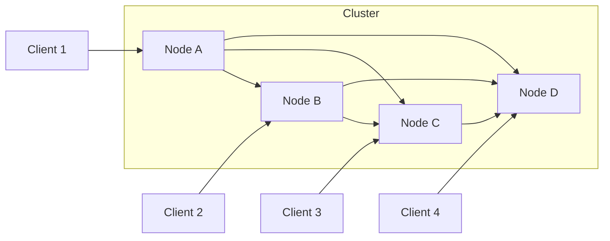
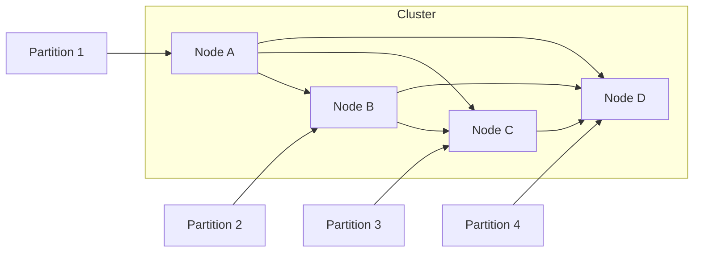
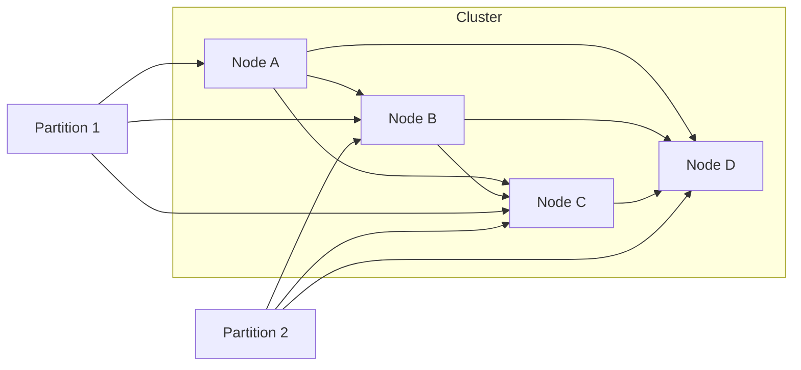
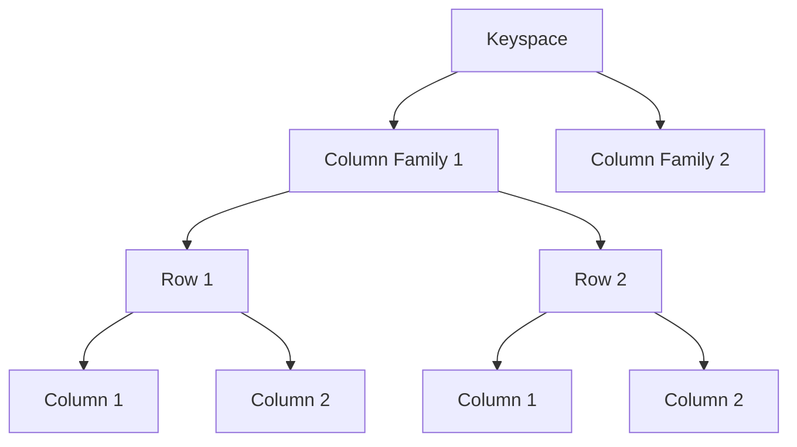
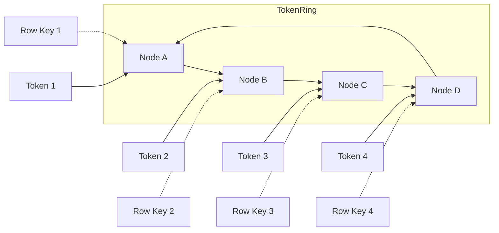
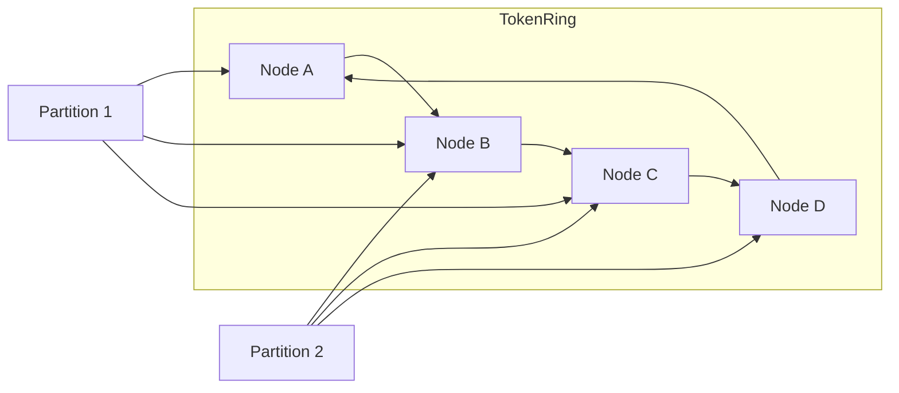

# AI系统Cassandra原理与代码实战案例讲解

## 1. 背景介绍

### 1.1 问题的由来

在当今大数据时代，海量数据的存储和管理成为了一个巨大的挑战。传统的关系型数据库系统在处理大规模数据时往往会遇到性能瓶颈和可扩展性问题。为了解决这一问题,NoSQL(Not Only SQL)数据库应运而生,它们提供了高度可扩展、高可用性和高性能的数据存储和管理能力。

Apache Cassandra是一种分布式、高可用、高性能的NoSQL数据库,它被设计用于处理大规模数据集。Cassandra最初由Facebook开发,后来被Apache软件基金会接手并开源。它的主要目标是处理大规模结构化数据,并提供高可用性和无单点故障。

### 1.2 研究现状

Cassandra已经被许多大型公司广泛采用,如Netflix、Instagram、Uber等。它具有以下主要特点:

1. **分布式架构**: Cassandra采用分布式架构,可以在多台服务器上运行,提供高可用性和容错能力。
2. **高性能**: Cassandra使用内存结构化存储引擎,提供低延迟和高吞吐量。
3. **可扩展性**: Cassandra可以通过简单地添加更多节点来线性扩展,无需停机或重新分片。
4. **数据模型**: Cassandra使用列族存储模型,类似于Google的BigTable,可以存储结构化和半结构化数据。
5. **复制和故障恢复**: Cassandra提供了数据复制和自动故障恢复机制,确保数据的高可用性。

尽管Cassandra具有许多优点,但它也面临一些挑战,如查询语言的局限性、缺乏事务支持以及数据一致性问题等。因此,深入研究Cassandra的原理和实现细节对于充分利用其优势和解决其缺陷至关重要。

### 1.3 研究意义

本文旨在深入探讨Cassandra的核心原理、算法和实现细节,以及如何在实际项目中应用和优化Cassandra。通过对Cassandra的全面剖析和实战案例分析,读者可以获得以下收获:

1. 掌握Cassandra的核心概念和数据模型,了解其工作原理和设计理念。
2. 学习Cassandra的核心算法和数学模型,理解其内部实现机制。
3. 掌握Cassandra的开发和部署技巧,包括环境搭建、代码实现和性能优化。
4. 了解Cassandra在实际应用场景中的使用案例和最佳实践。
5. 获取Cassandra相关的学习资源、工具和论文推荐,为进一步学习和研究奠定基础。

### 1.4 本文结构

本文将从以下几个方面全面剖析Cassandra:

1. 背景介绍:介绍Cassandra的由来、研究现状和意义。
2. 核心概念与联系:阐述Cassandra的核心概念和数据模型。
3. 核心算法原理与具体操作步骤:深入探讨Cassandra的核心算法和实现细节。
4. 数学模型和公式详细讲解举例说明:介绍Cassandra中使用的数学模型和公式,并通过案例进行详细讲解。
5. 项目实践:代码实例和详细解释说明:提供Cassandra的实际代码实现,并进行详细解读和分析。
6. 实际应用场景:介绍Cassandra在各种场景下的应用案例和最佳实践。
7. 工具和资源推荐:推荐Cassandra相关的学习资源、开发工具和论文等。
8. 总结:未来发展趋势与挑战:总结Cassandra的研究成果,展望未来发展趋势并分析面临的挑战。
9. 附录:常见问题与解答:解答Cassandra使用过程中的常见问题。

## 2. 核心概念与联系

在深入探讨Cassandra的核心算法和实现细节之前,我们需要先了解Cassandra的一些核心概念和数据模型。这些概念为后续内容奠定了基础,对于理解Cassandra的工作原理至关重要。

### 2.1 分布式系统

Cassandra是一个分布式数据库系统,它由多个节点组成,这些节点在逻辑上构成了一个集群。每个节点都是对等的,没有主从关系,可以承担相同的工作负载。这种架构提供了高可用性和容错能力,因为即使某些节点发生故障,其他节点仍然可以继续工作,确保整个系统的正常运行。

### 2.2 数据分区

为了实现高度的可扩展性,Cassandra采用了数据分区(Data Partitioning)的策略。数据根据分区键(Partition Key)进行分区,每个分区被分配给集群中的一个节点,称为副本。这样,不同的数据分布在不同的节点上,从而实现了数据的分布式存储。

### 2.3 数据复制

为了提高数据的可用性和容错能力,Cassandra采用了数据复制(Data Replication)策略。每个分区的数据会被复制到多个节点上,这些节点被称为副本节点。当某个节点发生故障时,其他副本节点可以继续提供服务,确保数据的可用性。

### 2.4 一致性级别

由于数据被复制到多个节点,因此需要确保数据在不同节点之间的一致性。Cassandra提供了多种一致性级别(Consistency Level),允许用户在数据一致性和可用性之间进行权衡。一致性级别越高,数据一致性越强,但可用性会降低;反之亦然。

常见的一致性级别包括:

- `ONE`: 只需要一个副本节点响应即可。
- `QUORUM`: 需要半数以上的副本节点响应。
- `ALL`: 需要所有副本节点都响应。

### 2.5 数据模型

Cassandra采用了一种类似于Google的BigTable的数据模型,称为"列族存储模型"(Column Family Store Model)。它由以下几个主要组件组成:

- **键空间(Keyspace)**: 类似于关系数据库中的数据库,用于逻辑上组织数据。
- **列族(Column Family)**: 类似于关系数据库中的表,用于存储相关的数据。
- **行(Row)**: 每个行由一个行键(Row Key)唯一标识,类似于关系数据库中的主键。
- **列(Column)**: 每个列由一个列名(Column Name)和一个列值(Column Value)组成,类似于关系数据库中的字段。
- **超级列族(Super Column Family)**: 一种特殊的列族,可以将列进一步组织为超级列(Super Column)。

通过这种数据模型,Cassandra可以灵活地存储结构化、半结构化和非结构化数据,并提供高性能的数据访问和查询能力。

## 3. 核心算法原理与具体操作步骤

在了解了Cassandra的核心概念和数据模型之后,我们将深入探讨Cassandra的核心算法原理和具体实现细节。这些算法和实现机制是Cassandra实现高性能、高可用性和可扩展性的关键所在。

### 3.1 算法原理概述

Cassandra的核心算法主要包括以下几个方面:

1. **数据分区算法**: 用于将数据分散到不同的节点上,实现数据的分布式存储。
2. **数据复制算法**: 用于将数据复制到多个节点上,提高数据的可用性和容错能力。
3. **一致性协议**: 用于确保数据在不同节点之间的一致性,并在一致性和可用性之间进行权衡。
4. **故障检测和恢复算法**: 用于检测节点故障并自动进行数据恢复,确保系统的高可用性。
5. **负载均衡算法**: 用于在多个节点之间平衡负载,提高系统的整体性能。
6. **数据压缩算法**: 用于压缩存储的数据,减小存储空间占用并提高读写性能。

### 3.2 算法步骤详解

#### 3.2.1 数据分区算法

Cassandra采用了一种基于一致性哈希(Consistent Hashing)的分区算法,将数据分散到不同的节点上。具体步骤如下:

1. 为每个节点分配一个令牌(Token),令牌的范围为0到2^127-1。
2. 对于每个行键(Row Key),计算其哈希值,并将其映射到令牌环上。
3. 将行键分配给令牌环上顺时针方向的第一个节点。

这种算法可以确保数据在节点之间均匀分布,并且在节点加入或离开时只需要重新分配少量数据,从而实现了高度的可扩展性。

#### 3.2.2 数据复制算法

为了提高数据的可用性和容错能力,Cassandra采用了数据复制策略。具体步骤如下:

1. 为每个键空间(Keyspace)配置复制因子(Replication Factor),指定数据应该被复制的副本数量。
2. 在令牌环上,为每个分区选择顺时针方向的N个不同节点作为副本节点,其中N等于复制因子。
3. 将数据写入所有副本节点。
4. 读取数据时,根据一致性级别从副本节点获取响应。

这种复制策略可以提高数据的可用性和容错能力,因为即使某些节点发生故障,其他副本节点仍然可以提供服务。同时,通过调整复制因子,可以在数据可用性和存储开销之间进行权衡。

#### 3.2.3 一致性协议

由于数据被复制到多个节点,因此需要确保数据在不同节点之间的一致性。Cassandra采用了一种基于Paxos协议的变体,称为"Gossip协议"(Gossip Protocol)。具体步骤如下:

1. 每个节点定期与其他节点进行"闲聊"(Gossip),交换节点状态信息。
2. 当节点发生变化(如加入、离开或故障)时,通过"闲聊"将这些变化传播到整个集群。
3. 根据一致性级别,确定需要从多少个副本节点获取响应才能执行读写操作。
4. 如果某些副本节点