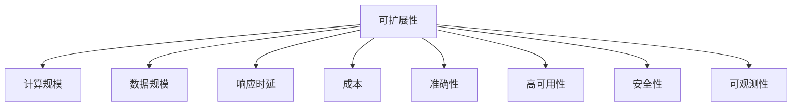
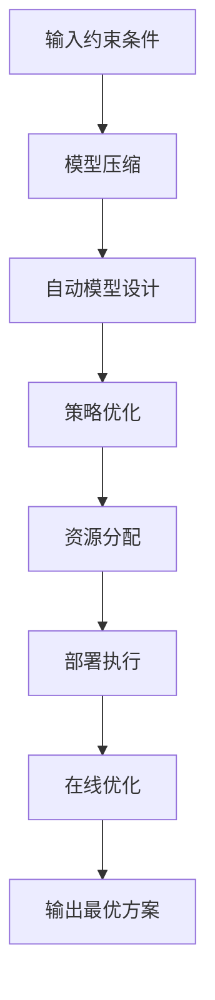

好的,我明白了您的要求。以下是按照您提供的大纲和要求,撰写的技术博客文章《AI系统可扩展性原理与代码实战案例讲解》的正文内容:

# AI系统可扩展性原理与代码实战案例讲解

## 1. 背景介绍

### 1.1 问题的由来

随着人工智能(AI)系统在各行各业的广泛应用,可扩展性已经成为AI系统设计和部署的一个关键挑战。可扩展性指的是系统能够适应不断增长的工作负载、数据量和用户请求的能力,而不会导致性能下降或系统瓶颈。

在传统的软件系统中,可扩展性主要关注计算资源(CPU、内存等)的扩展。但对于AI系统而言,除了计算资源之外,模型训练数据、推理请求等也都是影响可扩展性的重要因素。如何在保证AI系统精度和时延要求的前提下,实现高效、经济的可扩展性,是当前亟待解决的问题。

### 1.2 研究现状  

目前,学术界和工业界都在积极探索AI系统可扩展性的解决方案,主要包括以下几个方面:

- 模型压缩和加速技术,如剪枝、量化、知识蒸馏等,旨在减小模型尺寸,降低计算和存储开销。
- 分布式训练和推理技术,通过数据并行、模型并行等策略,在多机多卡环境下加速训练和推理过程。
- 自动化扩缩容技术,根据实际需求动态调配计算资源,提高资源利用效率。
- 异构计算加速技术,如GPU、TPU等加速硬件的使用,显著提升了AI计算性能。

但这些技术大多聚焦于单个环节的优化,缺乏端到端的系统级可扩展性解决方案。此外,不同场景的可扩展性需求有所差异,通用的可扩展性框架和原则仍有待总结和归纳。

### 1.3 研究意义

提升AI系统的可扩展性,不仅可以支撑更大规模的应用部署,还能显著降低AI系统的运维成本,提高资源利用效率。可扩展的AI系统还能为未来的智能应用奠定基础,如自动驾驶、智能医疗等场景都对系统的实时性、可靠性和可扩展性有着极高的要求。

因此,研究AI系统可扩展性原理,建立通用的可扩展性框架和最佳实践,并给出实战案例指导,对于推动AI技术的产业化应用至关重要。本文将系统阐述AI系统可扩展性的核心理论和实现方法,为读者提供全面的解决思路。

### 1.4 本文结构

本文首先介绍AI系统可扩展性的核心概念,并分析可扩展性与其他系统属性之间的关系。接下来重点阐述可扩展性的设计原则和实现技术路线,包括模型设计、系统架构、资源管理等多个层面。

然后通过数学建模,量化分析不同可扩展性策略的性能和成本,为技术选型提供依据。文章还将给出一个端到端的AI系统可扩展性实战案例,包括代码实现和性能评测,帮助读者更好地掌握可扩展性优化的具体方法。

最后,本文总结AI系统可扩展性的发展趋势和面临的挑战,并对未来的研究方向进行展望。

## 2. 核心概念与联系

可扩展性(Scalability)是衡量一个系统应对不断增长的工作负载能力的指标。对于AI系统而言,可扩展性的定义需要从以下几个维度来综合考虑:

1. **计算规模可扩展性**:指AI模型训练和推理过程能够高效利用增加的计算资源(如CPU/GPU/TPU等)来提升计算吞吐量。

2. **数据规模可扩展性**:指AI系统能够处理日益增长的训练数据集和推理请求数据,而不会导致效率和精度的显著下降。

3. **响应时延可扩展性**:指AI系统能够在工作负载增加的情况下,保持对请求的响应时延在可接受的范围内。

4. **成本可扩展性**:指在实现上述可扩展性的同时,系统的扩展成本(包括硬件、软件、人力等)能够保持在经济合理的水平。

可扩展性与AI系统的其他关键属性也存在紧密联系:

- **准确性(Accuracy)**: 模型精度是AI系统的根本目标,可扩展性优化不能以牺牲准确性为代价。
- **高可用性(High Availability)**: 可扩展系统应具备故障自动转移、负载均衡等高可用机制。
- **安全性(Security)**: 分布式部署和资源共享会带来新的安全风险,需要相应的安全防护措施。
- **可观测性(Observability)**: 实现可扩展性需要对系统状态、资源利用等数据进行全面监控和分析。

因此,AI系统可扩展性的设计需要在上述多个维度进行权衡和优化,并与其他系统属性相互配合,才能构建一个真正的高效、可靠、经济的智能系统。

## 3. 核心算法原理 & 具体操作步骤

### 3.1 算法原理概述

实现AI系统可扩展性的核心算法思路是:根据不同的资源约束条件,自动选择合适的模型结构、训练/推理策略和资源调度方式,以达到最优的性能/成本比。该过程可以建模为一个约束优化问题:

$$
\begin{aligned}
\max\limits_{M,S,R} &\quad \text{Performance}(M,S,R) \\
\text{s.t.} &\quad \text{Cost}(M,S,R) \le C \\
             &\quad \text{Constraints}(M,S,R) \le 0
\end{aligned}
$$

其中:
- $M$表示AI模型的结构和参数
- $S$表示训练/推理策略的配置,如并行策略、调度策略等
- $R$表示可用的硬件资源,如CPU/GPU/TPU数量、内存大小等
- $\text{Performance}$是性能指标函数,如吞吐量、时延等
- $\text{Cost}$是成本函数,包括硬件、软件、能耗等成本
- $\text{Constraints}$是一系列约束条件,如精度要求、时延上限等

通过优化以上目标函数,可以得到在给定资源约束下,实现最优性能的模型、策略和资源配置方案。

这是一个多目标、高维、非线性的组合优化问题,需要综合多种优化算法和策略来高效求解,包括:

1. **模型压缩与加速算法**:剪枝、量化、知识蒸馏等,用于降低模型计算量。
2. **自动模型结构搜索算法**:基于强化学习、进化算法等,自动设计高效的模型架构。
3. **自动策略搜索算法**:如强化学习、贝叶斯优化等,自动搜索最优的并行、调度策略。
4. **资源管理与调度算法**:基于工作负载预测,动态分配硬件资源,提高利用效率。

以上各类算法相互配合,在模型、策略和资源三个层面协同优化,从而获得端到端的可扩展性解决方案。

### 3.2 算法步骤详解

AI系统可扩展性优化的具体算法流程如下:

1. **输入**:给定AI任务类型、数据集、硬件资源池、精度/时延/成本等约束条件。

2. **模型压缩**:对初始模型进行压缩,降低计算量和存储开销,主要包括:
    - 剪枝:基于权重重要性评分,裁剪掉非关键的模型参数
    - 量化:将高精度参数(FP32)量化为低精度(INT8等),减小存储空间
    - 知识蒸馏:使用教师模型(Teacher)指导训练一个更小的学生模型(Student)

3. **自动模型设计**:基于压缩后的模型,使用强化学习、进化算法等方法,自动搜索更高效的模型架构。

4. **策略优化**:
    - 并行策略优化:确定数据并行、模型并行、流水线并行等并行策略及配比
    - 调度策略优化:确定批处理、优先级调度等调度策略及参数配置

5. **资源分配**:根据工作负载预测,动态分配CPU/GPU/TPU等硬件资源。

6. **部署执行**:将优化后的模型、策略和资源配置方案部署到目标环境,执行训练或推理任务。

7. **在线优化**:持续监控系统状态,根据实际性能表现,在线微调模型、策略和资源配置。

8. **输出**:获得在给定约束条件下,实现最优可扩展性的AI系统方案。

该算法流程结合了模型压缩、自动机器学习、在线学习等多种技术手段,能够自动化地生成高效的可扩展AI系统。

### 3.3 算法优缺点

上述可扩展性优化算法的主要优点包括:

- 自动化程度高,减轻了人工设计的工作量
- 端到端的全流程优化,提升了系统整体效率
- 融合了多种优化技术,优化效果显著
- 支持在线优化,能够适应动态变化的工作负载

但同时也存在一些缺陷和挑战:

- 优化问题的搜索空间巨大,求解复杂度高
- 需要大量的试验数据来指导优化过程
- 缺乏通用的优化框架,每个场景需要专门配置
- 在线优化会引入额外的时延和资源开销

未来仍需在算法的高效性、通用性和自动化程度等方面继续深入研究和创新。

### 3.4 算法应用领域

可扩展性优化算法可以广泛应用于各种AI系统的设计和优化,主要包括:

- 计算机视觉任务:如图像分类、目标检测、语义分割等
- 自然语言处理任务:如机器翻译、文本生成、对话系统等  
- 推荐系统:个性化推荐、广告推荐等
- 金融风控系统:欺诈检测、风险评估等
- 智能安防系统:视频监控、入侵检测等
- 工业智能系统:视觉检测、预测维护等

特别是对于一些对实时性和可靠性要求极高的应用场景,如自动驾驶、智能医疗等,可扩展性优化技术可以为这些系统提供坚实的技术保障。

## 4. 数学模型和公式 & 详细讲解 & 举例说明

### 4.1 数学模型构建

为了量化分析AI系统的可扩展性,我们需要建立相应的数学模型。假设系统中有$N$个计算节点,每个节点有$C_i$个计算单元(如CPU核心、GPU等),其计算能力为$P_i$,则总的计算能力为:

$$\sum_{i=1}^N C_i P_i$$

对于给定的AI模型,其计算量为$W$,训练数据量为$D$。如果采用数据并行的策略,将数据均匀分布到$N$个节点,则每个节点需要处理$\frac{D}{N}$的数据量,对应的计算时间为:

$$T_\text{data} = \frac{W}{\sum C_iP_i} \cdot \frac{D}{N}$$

如果同时采用模型并行的策略,将模型按层或按特征分割到不同节点,则需要考虑通信开销。假设模型并行导致的额外通信时间为$T_\text{comm}$,则总的训练时间为:

$$T = T_\text{data} + T_\text{comm}$$

我们的目标