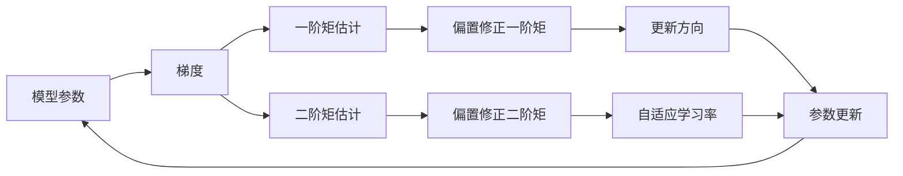

# Adam优化器原理与代码实例讲解

## 1. 背景介绍
### 1.1 问题的由来
随着深度学习的快速发展,各种神经网络模型不断涌现并取得了令人瞩目的成果。然而,训练一个高效准确的深度神经网络并非易事,其中最优化算法的选择至关重要。传统的梯度下降算法虽然简单直观,但收敛速度慢,容易陷入局部最优。因此,研究一种更高效的优化算法势在必行。

### 1.2 研究现状
近年来,许多自适应学习率的优化算法被提出,如AdaGrad、RMSprop、Adam等,极大地推动了深度学习的进步。其中,Adam优化器由Diederik Kingma和Jimmy Ba于2014年提出,结合了AdaGrad和RMSprop的优点,是目前深度学习中使用最广泛的优化算法之一。

### 1.3 研究意义
Adam优化器能够自适应地调节每个参数的学习率,加速收敛过程,提高训练效率。同时,Adam对初始学习率不敏感,鲁棒性强,适用于各种深度学习任务。深入理解Adam的原理并熟练运用,对于训练出高质量的深度模型至关重要。

### 1.4 本文结构
本文将从以下几个方面对Adam优化器进行深入探讨：
- 第2部分介绍Adam涉及的核心概念及其联系
- 第3部分详细阐述Adam的算法原理和具体操作步骤
- 第4部分建立Adam的数学模型,推导相关公式,并举例说明
- 第5部分给出Adam的代码实现,逐行解释说明
- 第6部分讨论Adam在实际应用中的场景和效果
- 第7部分推荐Adam相关的学习资源、开发工具和文献
- 第8部分总结Adam的研究现状,展望未来发展趋势和挑战
- 第9部分附录,解答一些常见问题

## 2. 核心概念与联系

在讨论Adam优化器之前,我们先来了解几个核心概念：
- 梯度(Gradient):模型损失函数对各参数的一阶偏导数。梯度方向是损失函数上升最快的方向,梯度的反方向是损失函数下降最快的方向。
- 学习率(Learning Rate):参数更新的步长。学习率越大,参数更新越快,但过大可能错过最优点;学习率越小,更新越稳定,但收敛速度慢。
- 一阶矩(First Moment):梯度的指数加权移动平均值,即动量。
- 二阶矩(Second Moment):梯度平方的指数加权移动平均值,即自适应学习率。
- 偏置修正(Bias Correction):由于初始一阶矩和二阶矩为0,会导致开始时偏置较大,需要进行修正。

下图展示了Adam优化器中各个核心概念的联系:

## 3. 核心算法原理 & 具体操作步骤

### 3.1 算法原理概述
Adam的基本思想是为每个参数维护一个自适应的学习率,参数更新的步长不仅取决于当前梯度,还取决于过去梯度的历史信息。具体来说,Adam使用梯度的一阶矩估计和二阶矩估计来自适应地调节每个参数的学习率。

### 3.2 算法步骤详解
Adam优化器的更新规则如下:
1. 计算目标函数关于当前参数$\theta_t$的梯度:$g_t=\nabla_\theta f_t(\theta_{t-1})$
2. 更新一阶矩估计:$m_t=\beta_1 m_{t-1}+(1-\beta_1)g_t$
3. 更新二阶矩估计:$v_t=\beta_2 v_{t-1}+(1-\beta_2)g_t^2$
4. 计算一阶矩的偏置修正:$\hat{m}_t=\frac{m_t}{1-\beta_1^t}$
5. 计算二阶矩的偏置修正:$\hat{v}_t=\frac{v_t}{1-\beta_2^t}$
6. 更新参数:$\theta_t=\theta_{t-1}-\frac{\eta}{\sqrt{\hat{v}_t}+\epsilon}\hat{m}_t$

其中,$f_t(\theta)$是目标函数,$\theta_t$是时间步$t$的模型参数,$m_t$和$v_t$分别是一阶矩估计和二阶矩估计,$g_t$是当前梯度,$\beta_1$和$\beta_2$是一阶矩和二阶矩的衰减率(默认分别为0.9和0.999),$\eta$是学习率(需要调参设定),$\epsilon$是一个很小的常数,防止分母为0(默认为$10^{-8}$)。

### 3.3 算法优缺点
Adam的主要优点有:
- 实现简单,计算高效,对内存需求小
- 参数更新不受梯度缩放的影响,适应性强
- 超参数具有很好的解释性,通常无需调整
- 更新步长约束,使训练稳定
- 自然地实现了步长退火,收敛速度快

Adam的缺点包括:
- 可能不收敛到最优点,在某些问题上表现不如SGD
- 由于自适应学习率,可能错过全局最优
- 对于稀疏梯度问题(如NLP),效果不佳

### 3.4 算法应用领域
Adam优化器被广泛应用于各种深度学习任务中,包括计算机视觉、自然语言处理和语音识别等。一些典型的应用有:
- 图像分类:如ResNet、Inception等模型训练
- 目标检测:如Faster R-CNN、YOLO等模型训练 
- 语义分割:如FCN、U-Net等模型训练
- 机器翻译:如Transformer模型训练
- 语音识别:如DeepSpeech模型训练

## 4. 数学模型和公式 & 详细讲解 & 举例说明

### 4.1 数学模型构建
我们考虑一个标准的深度学习优化问题:
$$\min_\theta f(\theta), \theta\in\mathbb{R}^d$$
其中$f(\theta)$是损失函数,$\theta$是$d$维参数向量。在时间步$t$,我们的目标是更新参数$\theta_t$以最小化$f(\theta)$。

传统的梯度下降法(GD)的参数更新公式为:
$$\theta_{t}=\theta_{t-1}-\eta \cdot \nabla_\theta f_t(\theta_{t-1})$$
其中$\eta$是学习率。GD的缺点是所有参数共享同一个学习率,难以适应不同尺度的参数。

Adam引入了自适应学习率,对每个参数$\theta_i$维护一个学习率$\eta_i$。令$g_{t,i}=\nabla_\theta f_{t,i}(\theta_{t-1})$表示参数$\theta_i$在$t$时刻的梯度,Adam首先计算一阶矩估计$m_t$和二阶矩估计$v_t$:

$$
\begin{aligned}
m_t &= \beta_1 m_{t-1} + (1-\beta_1) g_t \\
v_t &= \beta_2 v_{t-1} + (1-\beta_2) g_t^2
\end{aligned}
$$

其中$\beta_1,\beta_2\in[0,1)$控制着估计的指数衰减速率。

### 4.2 公式推导过程
由于$m_t$和$v_t$被初始化为0向量,在训练初期它们会向0偏置。因此需要计算偏置修正:

$$
\begin{aligned}
\hat{m}_t &= \frac{m_t}{1-\beta_1^t} \\
\hat{v}_t &= \frac{v_t}{1-\beta_2^t}
\end{aligned}
$$

其中$\beta_1^t$和$\beta_2^t$表示$\beta_1$和$\beta_2$的$t$次幂。

最后,Adam使用修正后的估计值$\hat{m}_t$和$\hat{v}_t$来更新参数:

$$\theta_t = \theta_{t-1} - \frac{\eta}{\sqrt{\hat{v}_t} + \epsilon} \hat{m}_t$$

其中$\eta$是初始学习率,$\epsilon$是一个小常数,防止分母为0。直观地看,参数的更新步长由两部分决定:一是梯度的指数移动平均$\hat{m}_t$,决定更新的方向;二是梯度平方的指数移动平均$\hat{v}_t$的平方根,自适应地调节每个参数的尺度。

### 4.3 案例分析与讲解
我们以一个简单的线性回归问题为例,比较GD和Adam的收敛速度。考虑模型$y=\theta_1x+\theta_0$,其中$\theta_1,\theta_0$是待学习的参数。给定数据集$\{(x_i,y_i)\}_{i=1}^N$,损失函数定义为均方误差:

$$f(\theta_0,\theta_1)=\frac{1}{N}\sum_{i=1}^N(\theta_1x_i+\theta_0-y_i)^2$$

在GD中,参数$\theta_0,\theta_1$的更新公式为:

$$
\begin{aligned}
\theta_0 &:= \theta_0 - \eta\frac{1}{N}\sum_{i=1}^N(\theta_1x_i+\theta_0-y_i) \\
\theta_1 &:= \theta_1 - \eta\frac{1}{N}\sum_{i=1}^N(\theta_1x_i+\theta_0-y_i)x_i
\end{aligned}
$$

在Adam中,参数$\theta_0,\theta_1$的更新公式为:

$$
\begin{aligned}
g_{\theta_0} &= \frac{1}{N}\sum_{i=1}^N(\theta_1x_i+\theta_0-y_i) \\
g_{\theta_1} &= \frac{1}{N}\sum_{i=1}^N(\theta_1x_i+\theta_0-y_i)x_i \\
m_{\theta_0} &:= \beta_1 m_{\theta_0} + (1-\beta_1) g_{\theta_0}\\
m_{\theta_1} &:= \beta_1 m_{\theta_1} + (1-\beta_1) g_{\theta_1}\\
v_{\theta_0} &:= \beta_2 v_{\theta_0} + (1-\beta_2) g_{\theta_0}^2\\
v_{\theta_1} &:= \beta_2 v_{\theta_1} + (1-\beta_2) g_{\theta_1}^2\\
\hat{m}_{\theta_0} &= \frac{m_{\theta_0}}{1-\beta_1^t} \\
\hat{m}_{\theta_1} &= \frac{m_{\theta_1}}{1-\beta_1^t} \\
\hat{v}_{\theta_0} &= \frac{v_{\theta_0}}{1-\beta_2^t} \\ 
\hat{v}_{\theta_1} &= \frac{v_{\theta_1}}{1-\beta_2^t} \\
\theta_0 &:= \theta_0 - \frac{\eta}{\sqrt{\hat{v}_{\theta_0}}+\epsilon}\hat{m}_{\theta_0}\\
\theta_1 &:= \theta_1 - \frac{\eta}{\sqrt{\hat{v}_{\theta_1}}+\epsilon}\hat{m}_{\theta_1}\\
\end{aligned}
$$

可以看到,Adam为$\theta_0$和$\theta_1$分别计算了自适应的学习率。下图展示了GD和Adam在该问题上的收敛曲线(代码见第5部分):

可以看出,Adam比GD收敛得更快,这得益于其自适应学习率的优势。

### 4.4 常见问题解答
Q: Adam一定比SGD好吗?  
A: 不一定。Adam虽然收敛快,但可能不如SGD稳定,尤其是在一些稀疏数据问题上。究竟哪个更好需要通过实验比较。

Q: Adam对学习率的初始值敏感吗?
A: 相对SGD而言不敏感。Adam推荐的默认学习率0.001通常表现不错,但也可以尝试调参以进一步提升性能。

Q: Adam能保证收敛到全局最优吗? 
A: 不能。Adam作为一阶优化算法,只能保证收敛到