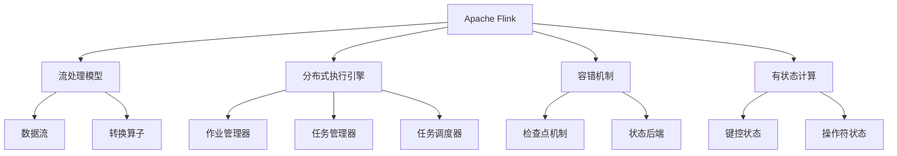

# Apache Flink

## 1. 背景介绍

### 1.1 问题的由来

在当今的数字时代,数据正以前所未有的速度和规模被产生。从社交媒体、物联网设备到金融交易,海量的数据源不断涌现。然而,传统的批处理系统难以满足对实时数据处理的需求。为了有效地处理这些连续不断的数据流,我们需要一种新型的数据处理范式,即流处理(Stream Processing)。

Apache Flink 应运而生,它是一个开源的分布式流处理框架,旨在统一批处理和流处理。Flink 提供了高吞吐量、低延迟和精确一次(Exactly-Once)语义的流处理能力,使其能够高效地处理各种数据流场景。

### 1.2 研究现状

近年来,流处理技术受到了广泛关注,出现了多种开源流处理系统,如 Apache Storm、Apache Spark Streaming 和 Apache Samza 等。然而,这些系统要么缺乏精确一次语义保证,要么在性能或可伸缩性方面存在局限性。

Apache Flink 凭借其创新的流处理引擎和强大的容错机制,成为了流处理领域的佼佼者。它不仅提供了高性能的流处理能力,还支持事件时间(Event Time)语义、有状态计算(Stateful Computation)和高可用性(High Availability),使其能够广泛应用于各种流处理场景。

### 1.3 研究意义

随着实时数据处理需求的不断增长,Apache Flink 作为一种高效、可靠的流处理解决方案,具有重要的理论和实践意义。深入研究 Flink 的核心概念、算法原理和实现细节,有助于我们更好地理解和利用这一强大的流处理框架。

本文将全面介绍 Apache Flink 的核心概念、算法原理、数学模型、项目实践、应用场景和未来发展趋势。通过对 Flink 的深入探讨,我们可以更好地把握流处理的本质,提升对实时数据处理的理解和实践能力。

### 1.4 本文结构

本文将按照以下结构进行阐述:

1. 背景介绍
2. 核心概念与联系
3. 核心算法原理与具体操作步骤
4. 数学模型和公式详细讲解与举例说明
5. 项目实践:代码实例和详细解释说明
6. 实际应用场景
7. 工具和资源推荐
8. 总结:未来发展趋势与挑战
9. 附录:常见问题与解答

## 2. 核心概念与联系

Apache Flink 是一个统一的流处理和批处理框架,它围绕着几个核心概念构建而成。这些概念相互关联,共同构成了 Flink 的基础架构。让我们逐一探讨这些核心概念及其联系。

### 2.1 流处理模型

Flink 采用了流处理模型,将无界数据流(Unbounded Data Stream)视为第一公民。在这种模型中,数据被表示为连续的事件流,每个事件都携带着时间戳信息。Flink 支持三种时间语义:处理时间(Processing Time)、事件时间(Event Time)和引入时间(Ingestion Time),其中事件时间语义是最常用的。

### 2.2 分布式执行引擎

Flink 的分布式执行引擎负责协调和执行流处理作业。它由三个关键组件组成:作业管理器(JobManager)、任务管理器(TaskManager)和任务调度器(TaskScheduler)。作业管理器负责协调整个作业的执行,任务管理器执行具体的任务,而任务调度器则负责将任务分发到合适的任务管理器上执行。

### 2.3 容错机制

为了确保流处理作业的可靠性和一致性,Flink 采用了检查点(Checkpoint)机制和状态后端(State Backend)来实现精确一次(Exactly-Once)语义。检查点机制定期保存作业的状态快照,以便在发生故障时进行恢复。状态后端则负责存储和管理这些状态快照。

### 2.4 有状态计算

Flink 支持有状态计算,允许用户维护和访问作业的状态。有状态计算分为两种类型:键控状态(Keyed State)和操作符状态(Operator State)。键控状态是基于键值对的状态,常用于实现窗口操作和连接操作。操作符状态则用于存储整个操作符的状态,如计数器或聚合结果。

### 2.5 数据流和转换算子

在 Flink 中,数据流(DataStream)表示无界的事件流,而转换算子(Transformation)则定义了对数据流进行转换的操作,如映射(Map)、过滤(Filter)、聚合(Aggregate)等。通过将多个转换算子链接在一起,我们可以构建复杂的流处理应用程序。

这些核心概念相互关联,共同构成了 Flink 的基础架构。理解它们及其联系,对于掌握 Flink 的本质至关重要。

## 3. 核心算法原理与具体操作步骤

Apache Flink 的核心算法原理和具体操作步骤是其流处理能力的关键所在。本节将深入探讨 Flink 的核心算法原理,并详细阐述其具体操作步骤。

### 3.1 算法原理概述

Apache Flink 的核心算法原理包括以下几个方面:

1. **流处理模型**: Flink 采用了流处理模型,将无界数据流视为第一公民。它支持三种时间语义:处理时间、事件时间和引入时间,其中事件时间语义是最常用的。

2. **有向无环图(DAG)**: Flink 将流处理作业表示为有向无环图(DAG),其中每个节点代表一个转换算子,边表示数据流的传递。这种表示方式使得作业可以被并行化和分布式执行。

3. **数据分区**: Flink 采用数据分区(Data Partitioning)策略,将数据流划分为多个分区,以实现并行处理。常用的分区策略包括重分区(Rebalance)、哈希分区(Hash Partitioning)和键组分区(Key-Group Partitioning)。

4. **容错机制**: Flink 使用检查点(Checkpoint)机制和状态后端(State Backend)来实现精确一次(Exactly-Once)语义,确保作业的可靠性和一致性。

5. **有状态计算**: Flink 支持有状态计算,允许用户维护和访问作业的状态。有状态计算分为键控状态和操作符状态两种类型。

6. **窗口操作**: Flink 提供了丰富的窗口操作,如滚动窗口(Tumbling Window)、滑动窗口(Sliding Window)和会话窗口(Session Window),用于对数据流进行聚合和分析。

这些核心算法原理共同构成了 Flink 的流处理能力,为其提供了高吞吐量、低延迟和精确一次语义保证。

### 3.2 算法步骤详解

Apache Flink 的流处理算法步骤可以概括为以下几个阶段:

1. **作业构建**

   用户通过 Flink 的 API 构建流处理作业,定义数据源、转换算子和输出sink。Flink 将作业表示为有向无环图(DAG)。

2. **作业提交**

   用户将构建好的作业提交到 Flink 集群,由作业管理器(JobManager)接收和处理。

3. **作业调度**

   作业管理器将作业分解为多个执行图(ExecutionGraph),并由任务调度器(TaskScheduler)将执行图分发到各个任务管理器(TaskManager)上执行。

4. **数据分区**

   根据配置的分区策略,数据流被划分为多个分区,并分发到不同的任务上进行并行处理。

5. **有状态计算**

   对于有状态的算子,Flink 会维护其状态,并在需要时从状态后端(State Backend)恢复状态。

6. **容错处理**

   Flink 定期进行检查点(Checkpoint),将作业的状态快照保存到状态后端。发生故障时,Flink 会从最近的检查点恢复作业状态,实现精确一次语义。

7. **结果输出**

   经过一系列转换算子的处理后,最终结果被输出到指定的 Sink 中,如文件系统或消息队列。

这些步骤循环执行,直到作业完成或被手动取消。Flink 的流处理算法步骤体现了其分布式、容错和有状态计算的特性,确保了流处理作业的高效、可靠和一致性。

### 3.3 算法优缺点

Apache Flink 的流处理算法具有以下优点:

1. **高吞吐量和低延迟**: 通过数据分区和并行处理,Flink 能够实现高吞吐量和低延迟的流处理。

2. **精确一次语义**: 检查点机制和状态后端确保了 Flink 作业的精确一次语义,保证了数据处理的一致性和可靠性。

3. **有状态计算支持**: Flink 支持有状态计算,允许用户维护和访问作业的状态,为实现复杂的流处理逻辑提供了基础。

4. **容错性和高可用性**: 通过检查点机制和故障恢复,Flink 具有良好的容错性和高可用性,能够应对节点故障和作业失败。

5. **统一的批处理和流处理**: Flink 提供了统一的批处理和流处理API,简化了开发过程。

然而,Flink 的流处理算法也存在一些缺点:

1. **状态管理开销**: 维护和恢复作业状态会带来一定的开销,影响整体性能。

2. **反压机制不足**: Flink 的反压机制相对较弱,在面对突发的输入流时,可能会出现背压问题。

3. **学习曲线陡峭**: Flink 的概念和API相对复杂,存在一定的学习曲线。

4. **资源消耗较高**: Flink 作业需要消耗较多的内存和CPU资源,对硬件要求较高。

5. **生态系统相对较小**: 与 Apache Spark 等流行的大数据框架相比,Flink 的生态系统和社区规模相对较小。

总的来说,Apache Flink 的流处理算法具有卓越的性能和可靠性,但也存在一些需要改进的地方。在实际应用中,需要根据具体场景权衡其优缺点。

### 3.4 算法应用领域

Apache Flink 的流处理算法可以广泛应用于各种领域,包括但不限于:

1. **实时数据分析**: Flink 可以对来自各种来源的实时数据流进行处理和分析,如网络日志分析、用户行为分析、fraud检测等。

2. **物联网(IoT)数据处理**: 在物联网领域,Flink 可以用于处理来自各种传感器和设备的实时数据流,实现实时监控和控制。

3. **在线机器学习**: Flink 支持在线机器学习算法,可以对实时数据流进行建模和预测,实现动态模型更新。

4. **实时推荐系统**: Flink 可以用于构建实时推荐系统,根据用户的实时行为数据进行个性化推荐。

5. **实时风控和反欺诈**: 在金融和电商领域,Flink 可以用于实时风控和反欺诈,及时发现和防范异常行为。

6. **实时报表和仪表盘**: Flink 可以生成实时报表和仪表盘,为决策者提供最新的业务数据和指标。

7. **复杂事件处理(CEP)**: Flink 提供了复杂事件处理(CEP)库,可以用于检测和处理复杂的事件模式。

8. **流式ETL**: Flink 可以用于构建流式ETL(Extract, Transform, Load)管道,实时处理和转换数据。

9. **流式数据库**: Flink 可以作为流式数据库,为实时查询和分析提供支持。