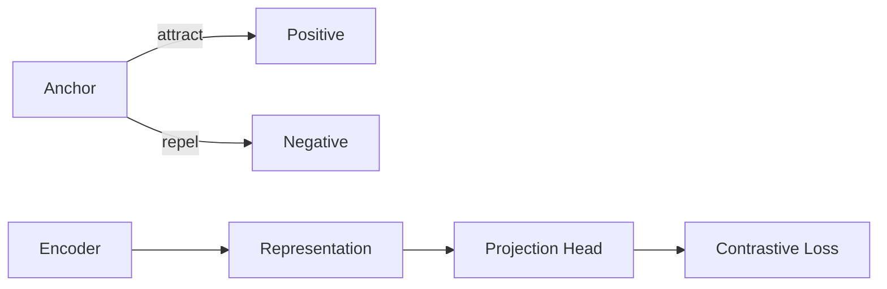

# Contrastive Learning原理与代码实例讲解

## 1. 背景介绍
### 1.1 问题的由来
在机器学习领域,尤其是计算机视觉和自然语言处理领域,监督学习一直是主流的学习范式。监督学习需要大量的标注数据,而人工标注数据非常耗时耗力,成本很高。如何利用大量的无标注数据进行学习,成为了一个亟待解决的问题。无监督表示学习旨在学习数据的一个低维表示,使得在下游任务上可以获得较好的性能。近年来,Contrastive Learning(对比学习)作为一种新兴的无监督表示学习方法受到了广泛关注。

### 1.2 研究现状 
对比学习最早由Hadsell等人[1]在2006年提出,其核心思想是拉近相似样本的表示,推开不相似样本的表示。近年来,对比学习在计算机视觉领域取得了显著的进展。Oord等人[2]提出了InfoNCE损失,将对比学习与互信息最大化建立了联系。He等人[3]提出了MoCo(Momentum Contrast)算法,引入动量编码器提高了对比学习的效果。Chen等人[4]提出了SimCLR算法,实现了在ImageNet数据集上仅使用无标注数据就可以获得与监督学习相媲美的分类性能。对比学习也被应用到了自然语言处理领域,如CERT[5]算法。

### 1.3 研究意义
对比学习的研究意义主要体现在以下几个方面:

1. 降低标注成本:对比学习可以利用大量无标注数据进行预训练,减少了对标注数据的依赖,降低了人工标注的成本。 

2. 提高模型泛化性:通过对比学习得到的数据表示对下游任务有更好的适应性,提高了模型的泛化能力。

3. 探索机器学习新范式:对比学习为无监督表示学习提供了新的思路,为探索机器学习的新范式提供了重要的参考。

### 1.4 本文结构
本文将全面介绍对比学习的原理与应用。第2节介绍对比学习的核心概念。第3节详细阐述对比学习的核心算法原理与具体操作步骤。第4节给出对比学习涉及的数学模型与公式推导。第5节通过代码实例讲解对比学习的实现细节。第6节总结对比学习的实际应用场景。第7节推荐对比学习相关的工具和资源。第8节对对比学习的研究现状进行总结,并对未来发展趋势与挑战进行展望。第9节附录了常见问题与解答。

## 2. 核心概念与联系
对比学习的核心概念包括:

1. Anchor(锚点):学习的参考样本。在对比学习中,每个样本都可以作为一个anchor。

2. Positive(正样本):与anchor属于同一类别的样本。对比学习的目标是拉近anchor与positive的表示。

3. Negative(负样本):与anchor属于不同类别的样本。对比学习的目标是推开anchor与negative的表示。 

4. Encoder(编码器):将输入样本映射为低维表示向量的神经网络。编码器一般采用卷积神经网络或Transformer等结构。

5. Projection Head(投影头):在编码器之后,对表示向量进行非线性变换的多层感知机网络。投影头可以提高表示的质量。

6. Contrastive Loss(对比损失):用于优化编码器和投影头参数的损失函数。对比损失使得正样本的表示相似,负样本的表示不相似。常用的对比损失包括InfoNCE损失和NTXent损失等。

对比学习的核心是通过最小化对比损失,学习到一个好的表示空间。在这个表示空间中,相似样本的表示接近,不相似样本的表示远离。下图展示了对比学习的核心概念之间的联系。

## 3. 核心算法原理 & 具体操作步骤
### 3.1 算法原理概述
对比学习的核心算法可以概括为以下步骤:

1. 对每个样本进行随机数据增强,得到两个不同的视图。

2. 用编码器对两个视图进行编码,得到表示向量。

3. 用投影头对表示向量进行非线性变换。 

4. 基于对比损失优化编码器和投影头的参数,使得同一样本的两个视图表示相似,不同样本的表示不相似。

5. 去掉投影头,使用编码器提取样本的表示用于下游任务。

### 3.2 算法步骤详解

1. 数据增强:对比学习需要对每个样本生成不同的视图。常见的数据增强方法有随机裁剪、颜色失真、高斯模糊等。设计合适的数据增强方法是对比学习的关键。

2. 编码器:编码器将输入样本映射为低维表示向量。编码器一般采用卷积神经网络如ResNet,或者Transformer结构如ViT。编码器的结构和参数是对比学习的主要优化对象。

3. 投影头:投影头将编码器输出的表示向量进行非线性变换,提高表示质量。投影头一般是一个2层的多层感知机,中间使用ReLU激活函数。

4. 对比损失:对比损失用于优化编码器和投影头的参数。给定一个anchor,对比损失使其与positive的表示相似,与一批negative的表示不相似。常用的对比损失有InfoNCE损失:
$$
\mathcal{L}_{q,k^+,\{k^-\}}=-\log \frac{\exp(q\cdot k^+/\tau)}{\exp(q\cdot k^+/\tau)+\sum_{k^-}\exp(q\cdot k^-/\tau)}
$$
其中$q$是anchor的表示,$k^+$是positive的表示,$k^-$是negative的表示,$\tau$是温度超参数。InfoNCE损失可以看作是一个$K+1$路的softmax分类器。

5. 下游任务:去掉投影头,使用编码器提取样本的表示。在下游任务的训练集上训练一个线性分类器,即可得到样本的预测标签。对比学习得到的表示可以很好地适应下游任务。

### 3.3 算法优缺点

对比学习的优点包括:
- 可以利用大量无标注数据进行预训练,减少对标注数据的依赖。
- 学习得到的表示对下游任务有更好的适应性,模型泛化性更好。
- 可以与多种编码器结构相结合,如CNN、Transformer等,应用范围广。

对比学习的缺点包括:  
- 对数据增强方法敏感,需要针对不同任务仔细设计数据增强。
- 负样本的选择对性能影响大,需要较大的批次大小,训练时的内存占用高。
- 学习得到的表示与下游任务的相关性不够直接,需要进行fine-tuning。

### 3.4 算法应用领域

对比学习可以应用于多个领域,包括:

- 计算机视觉:图像分类、目标检测、语义分割等。
- 自然语言处理:句子表示学习、文本分类、命名实体识别等。
- 语音识别:说话人识别、语音分类等。
- 图学习:节点分类、图分类等。
- 多模态学习:视听语言表示学习等。

对比学习提供了一种通用的无监督表示学习范式,可以广泛应用于各种不同的任务和领域。

## 4. 数学模型和公式 & 详细讲解 & 举例说明
### 4.1 数学模型构建
对比学习可以从互信息的角度来解释。给定两个随机变量$X$和$Y$,它们的互信息定义为:
$$
I(X;Y)=\int_{X,Y} p(x,y)\log \frac{p(x,y)}{p(x)p(y)}dxdy
$$
互信息衡量了两个变量之间的相关性。对比学习的目标就是最大化同一样本两个视图的互信息,最小化不同样本视图的互信息。

令$x_i$表示第$i$个样本,$x_i^1$和$x_i^2$表示它的两个视图。对比学习优化以下损失函数:
$$
\mathcal{L}=\sum_i \Big(-I(z_i^1;z_i^2)+\lambda \cdot I(z_i^1;z_{/i}^2)\Big)
$$
其中$z_i^1$和$z_i^2$分别表示$x_i^1$和$x_i^2$的编码表示,$z_{/i}^2$表示除$x_i$以外其他样本的编码表示。$\lambda$为平衡两项的权重系数。

直接优化互信息是难以实现的,因为需要知道编码表示的概率分布。对比学习采用InfoNCE损失来近似互信息,将互信息最大化转化为一个$K+1$路的softmax分类问题。

### 4.2 公式推导过程
InfoNCE损失定义为:
$$
\mathcal{L}_{q,k^+,\{k^-\}}=-\log \frac{\exp(q\cdot k^+/\tau)}{\exp(q\cdot k^+/\tau)+\sum_{k^-}\exp(q\cdot k^-/\tau)}
$$
其中$q$是anchor的表示,$k^+$是positive的表示,$k^-$是negative的表示,$\tau$是温度超参数。这里的内积可以替换为其他的相似度度量,如欧氏距离等。

我们可以将InfoNCE损失与互信息联系起来:
$$
I(z_i^1;z_i^2)=\mathbb{E}_{p(z_i^1,z_i^2)}\Big[\log\frac{p(z_i^2|z_i^1)}{p(z_i^2)}\Big] \\
=\mathbb{E}_{p(z_i^1)}\mathbb{E}_{p(z_i^2|z_i^1)}\Big[\log\frac{p(z_i^2|z_i^1)}{p(z_i^2)}\Big] \\
\geq \mathbb{E}_{p(z_i^1)}\mathbb{E}_{p(z_i^2|z_i^1)}\Big[\log\frac{f(z_i^2|z_i^1)}{p(z_i^2)}\Big] \\
=\mathbb{E}_{p(z_i^1)}\mathbb{E}_{p(z_i^2|z_i^1)}\Big[\log\frac{f(z_i^2|z_i^1)}{\frac{1}{K}\sum_{j=1}^K f(z_j^2|z_i^1)}\Big] \\
=-\mathbb{E}_{p(z_i^1)}\Big[\mathcal{L}_{z_i^1,z_i^2,\{z_j^2\}_{j\neq i}}\Big]
$$
其中$f$是一个近似$p(z_i^2|z_i^1)$的非负函数,$\{z_j^2\}_{j\neq i}$是从$p(z_i^2)$中采样的$K$个负样本。不等式是根据Jensen不等式得到的下界。因此最小化InfoNCE损失等价于最大化互信息的下界。

### 4.3 案例分析与讲解
下面我们以一个简单的例子来说明对比学习的过程。假设我们有一个包含4类动物图像(狗、猫、兔子和鸡)的无标注数据集,每一类有1000张图片。我们的目标是学习一个好的图像表示,使得在下游的分类任务上可以达到较高的准确率。

首先,我们从数据集中随机采样一个batch的图像,每张图像生成两个视图,例如:
- 狗1视图1,狗1视图2
- 猫1视图1,猫1视图2  
- 兔子1视图1,兔子1视图2
- 鸡1视图1,鸡1视图2

然后,我们用编码器对每个视图提取特征,再通过投影头得到最终的表示向量,例如:
- 狗1视图1表示向量: $z_{dog1}^1$ 
- 狗1视图2表示向量: $z_{dog1}^2$
- 猫1视图1表示向量: $z_{cat1}^1$
- 猫1视图2表示向量: $z_{cat1}^2$
- ...

接下来,我们计算InfoNCE损失。以$z_{dog1}^1$为例,它的positive是$z_{dog1}^2$,negative是其他6个表示向量。损失函数为: