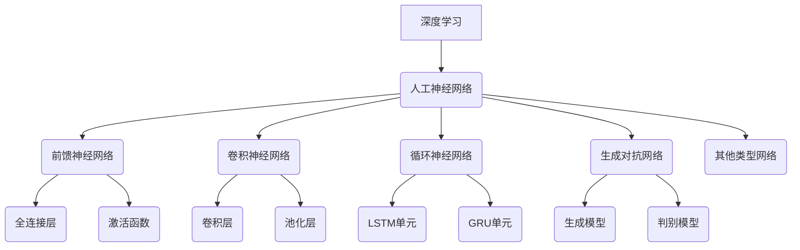
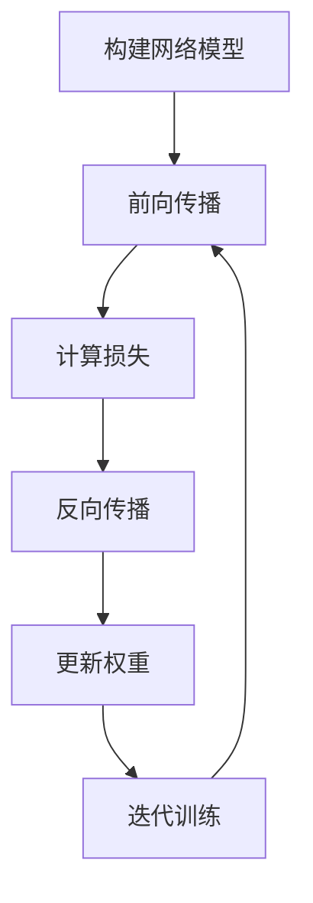

好的，我会按照您的要求，以"Deep Learning原理与代码实例讲解"为主题，撰写一篇深入全面的技术博客文章。文章将遵循逻辑严谨、结构紧凑、语言专业的风格，确保内容深入易懂，并包含核心概念原理解析、数学模型推导、算法步骤讲解、代码实例分析等关键部分。同时，我会尽最大努力插入Mermaid流程图来直观展示架构原理。请稍等，我需要一些时间进行充分的研究和撰写。

# Deep Learning原理与代码实例讲解

## 1. 背景介绍

### 1.1 问题的由来

随着大数据时代的到来，海量的数据不断涌现,传统的机器学习算法在处理复杂任务时显现出了一些缺陷和瓶颈。深度学习(Deep Learning)作为一种全新的机器学习范式应运而生,它能够自主从庞大的数据中挖掘出有价值的特征模式,从而更好地解决诸如计算机视觉、自然语言处理、语音识别等复杂任务。

### 1.2 研究现状  

深度学习的核心是构建有多层非线性变换的神经网络模型,通过对大量数据的学习,自动获取数据的高层次抽象特征,从而实现对复杂问题的预测和决策。近年来,随着算力的飞速提升、训练数据的爆炸式增长以及新的优化算法的不断涌现,深度学习取得了突破性进展,在多个领域达到甚至超越人类的水平,成为当前人工智能研究的核心和热点方向。

### 1.3 研究意义

深度学习技术具有广阔的应用前景,在计算机视觉、自然语言处理、语音识别、推荐系统、医疗诊断、无人驾驶等诸多领域发挥着不可替代的作用。掌握深度学习的原理和实践能力,将为我们打开无限的想象空间,推动人工智能技术的创新发展。本文将系统性地介绍深度学习的核心概念、数学模型、算法原理、代码实现等关键内容,为读者提供一个全面深入的学习途径。

### 1.4 本文结构

本文将从以下几个方面全面解析深度学习:

1. 核心概念与联系
2. 核心算法原理与具体操作步骤 
3. 数学模型与公式推导
4. 项目实践:代码实例与详细解释
5. 实际应用场景
6. 工具与学习资源推荐
7. 总结:未来发展趋势与挑战
8. 附录:常见问题与解答

## 2. 核心概念与联系

深度学习(Deep Learning)是机器学习(Machine Learning)的一个子领域,它的核心思想是通过构建具有多层非线性变换的人工神经网络(Artificial Neural Networks, ANNs)模型,对输入数据进行特征表示学习和模式识别。

人工神经网络是深度学习模型的基础,主要分为以下几种类型:

1. **前馈神经网络**(Feedforward Neural Networks)是最基本的神经网络形式,由输入层、隐藏层和输出层组成,数据在网络中按单向传播。全连接层(Fully Connected Layer)和激活函数(Activation Function)是前馈网络的关键组成部分。

2. **卷积神经网络**(Convolutional Neural Networks, CNNs)在图像、视频等领域有着广泛应用,其核心是卷积层(Convolutional Layer)和池化层(Pooling Layer),能够有效地捕获数据的局部相关性和空间不变性。

3. **循环神经网络**(Recurrent Neural Networks, RNNs)擅长处理序列数据,如自然语言、语音等。常用的循环单元包括LSTM(Long Short-Term Memory)和GRU(Gated Recurrent Unit)。

4. **生成对抗网络**(Generative Adversarial Networks, GANs)由生成模型(Generator)和判别模型(Discriminator)组成,通过对抗训练的方式学习数据分布,在图像生成、语音合成等领域表现出色。

5. 此外,还有其他一些新兴的网络结构,如注意力机制(Attention Mechanism)、图神经网络(Graph Neural Networks)等。

这些不同类型的神经网络模型为解决不同的问题提供了强大的工具,它们之间也存在一些联系和共性,如反向传播算法、梯度下降优化等。掌握这些核心概念对于深入理解深度学习至关重要。

## 3. 核心算法原理与具体操作步骤

### 3.1 算法原理概述

深度学习算法的核心原理是通过构建多层神经网络模型,利用大量训练数据对网络进行有监督或无监督的学习,自动获取数据的高层次抽象特征表示,从而对新的输入数据进行预测和决策。这个过程主要包括以下几个关键步骤:

1. **网络模型构建**: 根据问题的特点,选择合适的网络结构(如前馈网络、卷积网络或循环网络等),并初始化网络的权重参数。

2. **前向传播**: 将输入数据通过网络层层传递,经过线性变换和非线性激活,最终得到输出结果。

3. **损失计算**: 将网络输出与真实标签进行比较,计算损失函数的值,衡量模型的预测误差。

4. **反向传播**: 利用链式法则,计算损失函数相对于每个权重的梯度,得到网络参数的梯度信息。

5. **权重更新**: 根据梯度下降优化算法(如SGD、Adam等),沿着梯度的反方向更新网络的权重参数。

6. **迭代训练**: 重复上述步骤,不断优化网络参数,使得模型在训练数据上的损失函数值最小化。

通过上述过程,神经网络模型就能够从大量数据中自动学习到有用的特征表示,从而对新的输入数据做出准确的预测和决策。

### 3.2 算法步骤详解

接下来,我们将详细解析深度学习算法的具体操作步骤:

1. **构建网络模型**

根据任务的特点,选择合适的网络结构,如前馈网络、卷积网络或循环网络等。初始化网络权重参数,通常采用小的随机值。

2. **前向传播**

   - 输入层将数据输入到网络中。
   - 隐藏层对输入数据进行线性变换和非线性激活,得到新的特征表示。

$$
h = \phi(W^Tx + b)
$$

其中,$h$是隐藏层的输出,$\phi$是非线性激活函数(如ReLU、Sigmoid等),$W$和$b$分别是权重和偏置参数。

   - 输出层根据隐藏层的输出,计算最终的预测结果。对于分类任务,常用Softmax函数将输出值映射到(0,1)之间。

$$
y = \text{softmax}(W^Th + b) = \frac{e^{W_i^Th + b_i}}{\sum_j e^{W_j^Th + b_j}}
$$

3. **计算损失**

将网络输出$y$与真实标签$\hat{y}$进行比较,计算损失函数的值,如交叉熵损失:

$$
J(W,b) = -\frac{1}{m}\sum_{i=1}^m\sum_{j=1}^k\hat{y}_j^{(i)}\log y_j^{(i)}
$$

其中,$m$是训练样本数量,$k$是输出类别数。

4. **反向传播**

利用链式法则,计算损失函数$J$相对于每个权重参数的梯度:

$$
\frac{\partial J}{\partial W} = \frac{\partial J}{\partial y}\frac{\partial y}{\partial W}
$$

通过反向传播算法,从输出层开始,逐层计算每个参数的梯度。

5. **更新权重**

根据梯度下降优化算法,沿着梯度的反方向更新网络权重参数:

$$
W \leftarrow W - \eta \frac{\partial J}{\partial W}
$$

其中,$\eta$是学习率,控制每次更新的步长。

6. **迭代训练**

重复上述过程,使用训练数据集对网络进行多次迭代训练,直到模型在验证集上的性能不再提升为止。

通过上述算法步骤,神经网络就能够从大量数据中自动学习获取有用的特征表示,从而对新的输入数据做出准确的预测。

### 3.3 算法优缺点

**优点**:

- 强大的非线性建模能力,能够学习复杂的数据模式。
- 通过层次结构自动提取数据的高层次抽象特征。
- 端到端的学习方式,无需人工设计特征。
- 在大数据场景下表现出色,性能随数据量增加而提高。

**缺点**:

- 需要大量的训练数据和计算资源。
- 模型训练过程是黑箱操作,缺乏可解释性。
- 存在梯度消失/爆炸、过拟合等训练问题。
- 对异常数据和对抗样本缺乏鲁棒性。

### 3.4 算法应用领域

深度学习算法由于其强大的特征学习能力,在诸多领域展现出卓越的性能:

- **计算机视觉**: 图像分类、目标检测、语义分割等。
- **自然语言处理**: 机器翻译、文本生成、情感分析等。
- **语音识别**: 自动语音识别、语音合成等。
- **推荐系统**: 个性化推荐、用户行为预测等。
- **医疗健康**: 医学影像分析、疾病诊断、药物发现等。
- **无人驾驶**: 环境感知、决策规划、行为控制等。
- **金融**: 金融风险管理、欺诈检测等。
- **其他领域**: 如游戏AI、机器人控制、天文学等。

可以预见,未来深度学习技术将在更多领域发挥重要作用,推动人工智能的创新发展。

## 4. 数学模型和公式详细讲解与举例说明

### 4.1 数学模型构建

深度学习的核心数学模型是人工神经网络,它是一种受生物神经元启发的数学模型。神经网络由多层神经元组成,每个神经元接收来自上一层的输入,经过线性变换和非线性激活函数的处理,产生新的输出传递给下一层。

一个典型的前馈神经网络可以表示为:

$$
y = f(W_Lh_L + b_L)\\
h_L = \phi(W_{L-1}h_{L-1} + b_{L-1})\\
\cdots\\
h_1 = \phi(W_0x + b_0)
$$

其中:
- $x$是输入数据
- $y$是最终输出
- $h_i$是第$i$层的隐藏层输出
- $W_i$和$b_i$分别是第$i$层的权重和偏置参数
- $\phi$是非线性激活函数,如ReLU、Sigmoid等

通过构建这种多层神经网络模型,并利用大量训练数据对网络参数进行学习,就能够自动从原始数据中提取出有用的特征表示,从而对新的输入数据做出准确的预测和决策。

### 4.2 公式推导过程

接下来,我们将详细推导一些深度学习中常用的公式和算法。

**1. 前向传播**

前向传播是神经网络的基本运算过程,它将输入数据通过网络层层传递,最终得到输出结果。对于单层神经网络,前向传播过程如下:

$$
h = \phi(W^Tx + b)
$$

其中,$h$是隐藏层的输出,$\