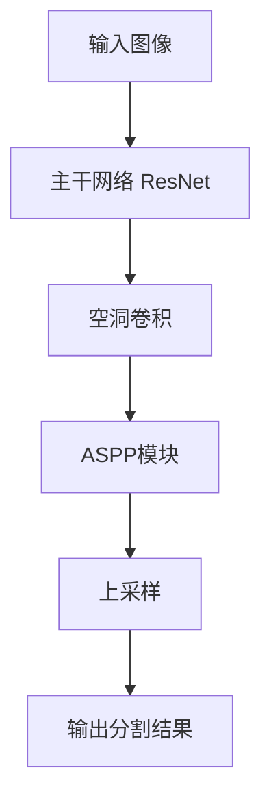

# DeepLab系列原理与代码实例讲解

## 1. 背景介绍
### 1.1 问题的由来
随着人工智能技术的快速发展,计算机视觉领域取得了巨大的进步。其中,图像语义分割是计算机视觉中的一个核心问题,旨在对图像中的每个像素进行分类,从而实现对图像的像素级理解。传统的语义分割方法主要基于手工设计的特征,如纹理、颜色等,然后使用分类器对像素进行分类。这类方法的性能受限于手工设计特征的表达能力。

近年来,随着深度学习的兴起,基于深度卷积神经网络的语义分割方法逐渐成为主流。DeepLab系列算法就是其中的代表性工作,在学术界和工业界都产生了广泛的影响。DeepLab算法充分利用了深度学习的强大表示能力,通过设计新颖的网络结构和引入先进的技术,如空洞卷积(Atrous Convolution)、条件随机场(CRF)后处理等,在多个数据集上取得了state-of-the-art的性能,推动了语义分割技术的发展。

### 1.2 研究现状
自DeepLabv1提出以来,DeepLab系列算法经历了数次迭代更新,不断刷新语义分割任务的性能:

- DeepLabv1 (2014): 首次将深度卷积神经网络引入语义分割,提出了空洞卷积和全连接CRF后处理,在当时取得了最优性能。

- DeepLabv2 (2016): 提出了空洞空间金字塔池化(ASPP)模块,能够在多尺度上提取特征,提升了性能。同时还研究了将ResNet作为主干网络的方案。  

- DeepLabv3 (2017): 改进了ASPP模块,提出了级联和并行的ASPP结构。将修改后的Xception作为骨干网络,进一步提升性能。

- DeepLabv3+ (2018): 在DeepLabv3的基础上引入编码器-解码器结构,在解码器部分利用低层次特征优化分割结果,尤其是在物体边界处。

除了DeepLab系列,其他一些语义分割算法也取得了很好的效果,如PSPNet、RefineNet等。总的来说,这些工作主要聚焦于以下几个方面:特征提取网络的改进、多尺度特征的融合、上下文信息的建模、分割精度和速度的平衡等。当前,语义分割仍然是一个活跃的研究领域,存在许多待解决的问题和挑战。

### 1.3 研究意义
语义分割在许多领域都有重要的应用价值,如无人驾驶、医学影像分析、遥感图像解译、增强现实等。研究高精度、高效率的语义分割算法,对于推动这些领域的发展具有重要意义:

- 无人驾驶:语义分割能够帮助无人车识别道路、车辆、行人等关键元素,是实现场景理解的关键。

- 医学影像分析:语义分割可用于器官、肿瘤的自动标注,辅助医生进行诊断。 

- 遥感图像解译:语义分割能够自动对遥感影像进行土地利用分类、变化检测等。

- 增强现实:语义分割是实现虚拟物体与真实场景无缝融合的基础。

可以看到,推动语义分割技术的发展,对于解决现实世界问题、促进人工智能应用落地都具有重要的意义。而DeepLab系列算法作为其中的代表性工作,研究其原理和实现,有助于我们深入理解语义分割的技术演进和最新进展。

### 1.4 本文结构
本文将重点介绍DeepLab系列语义分割算法的原理和代码实现。内容安排如下:

- 第2部分介绍语义分割的一些核心概念和DeepLab算法的整体思路。 
- 第3部分详细讲解DeepLab算法的原理,包括空洞卷积、ASPP等关键技术点。
- 第4部分阐述DeepLab算法涉及的数学模型和公式,并给出直观的案例讲解。  
- 第5部分提供DeepLab算法的代码实例,并对关键代码进行注释分析。
- 第6部分讨论DeepLab算法的一些典型应用场景。
- 第7部分推荐一些学习DeepLab和语义分割的资源,包括论文、教程、开源代码等。
- 第8部分对全文进行总结,并对语义分割的未来发展趋势和挑战进行展望。
- 第9部分收集了一些常见问题,并给出了解答。

通过本文的学习,读者将对DeepLab系列算法形成比较系统和深入的理解,并能够掌握其代码实现,为进一步研究和应用语义分割技术打下基础。

## 2. 核心概念与联系
在正式介绍DeepLab算法之前,我们先来了解一下语义分割中的一些核心概念:

- 像素级分类:语义分割的目标是对图像的每个像素进行分类。这是一个密集预测的过程,要求分割结果与原图有相同的分辨率。相比图像级分类,语义分割能够提供更加精细的图像理解。

- 全卷积网络:传统的CNN网络最后通常会接全连接层进行分类,但这对于语义分割是不适用的,因为全连接层会丢失空间信息。全卷积网络使用卷积层和上采样层替代了全连接层,能够实现端到端的密集预测。

- 编码器-解码器:语义分割网络通常采用编码器-解码器结构。编码器负责提取图像的高层语义特征,解码器负责恢复空间分辨率。两者相结合,既能捕获全局上下文,又能生成精细的分割结果。

- 空洞卷积:为了在编码器部分获得更大的感受野,DeepLab引入了空洞卷积。它在标准卷积的基础上引入了空洞率参数,可以在不增加参数量的情况下指数级扩大感受野。

- 多尺度特征:物体在图像中的尺度差异很大,仅仅依靠单一尺度的特征难以准确分割。因此,如何融合多尺度的上下文信息是语义分割的一个关键问题。

- 条件随机场:语义分割是一个结构化预测问题,像素的类别标签之间存在空间相关性。条件随机场是一种常用的结构化预测模型,可以对分割结果进行空间正则化,提升分割精度。

DeepLab系列算法正是围绕这些核心概念展开的。它们的基本思路是:使用主干网络(如ResNet)作为特征编码器,然后通过空洞卷积、多尺度特征聚合等技术增强特征的表达能力,最后使用简单的解码器生成分割结果。此外,还可以利用条件随机场进行后处理优化。

下面这张流程图直观地展示了DeepLabv3的整体架构:

可以看到,输入图像首先经过主干网络提取特征,然后使用空洞卷积进一步增大感受野,并通过ASPP模块聚合多尺度信息,最后经过上采样得到与原图分辨率相同的分割结果。

这只是一个简单的示意图,完整的DeepLab算法还有许多细节需要考虑,我们将在后面的章节中详细展开。

## 3. 核心算法原理 & 具体操作步骤
### 3.1 算法原理概述
DeepLab系列算法的核心是如何在卷积神经网络中增强特征的表达能力,以得到更精准的分割结果。其主要采用了以下几种技术手段:

1. 空洞卷积(Atrous Convolution):通过在卷积核中引入空洞,在不增加参数量和计算量的情况下扩大感受野。

2. 空洞空间金字塔池化(ASPP):并行地采用不同空洞率的空洞卷积,融合多尺度的上下文信息。

3. 编码器-解码器(Encoder-Decoder):使用主干网络(如ResNet)作为编码器提取特征,然后通过简单的解码器恢复空间分辨率。

4. 条件随机场(CRF)后处理:利用条件随机场对CNN的分割结果进行细化,尤其是在物体边界处。

下面我们对每个部分进行更详细的讲解。

### 3.2 算法步骤详解

#### 3.2.1 空洞卷积
传统的卷积神经网络通过叠加卷积层和池化层逐步扩大感受野,但这也导致了特征图分辨率的下降。为了在保持特征图分辨率的同时获得更大的感受野,DeepLab引入了空洞卷积。

空洞卷积在标准卷积的基础上引入了一个称为空洞率(dilation rate)的参数。空洞率控制了卷积核内部的空洞大小。以一维卷积为例:
- 当空洞率为1时,空洞卷积等价于标准卷积。
- 当空洞率为2时,卷积核的感受野为7,但只有4个参数。
- 当空洞率为4时,卷积核的感受野进一步扩大到15,但参数量仍然是4个。

通过调整空洞率,我们可以灵活地控制感受野的大小,而不引入额外的参数和计算量。在实际使用时,我们通常用多个不同空洞率的空洞卷积层串联,以捕获不同尺度的上下文信息。

#### 3.2.2 空洞空间金字塔池化
尽管空洞卷积能够扩大感受野,但单一尺度的感受野仍然难以适应图像中尺度变化很大的物体。为此,DeepLabv2提出了空洞空间金字塔池化(ASPP)模块。

ASPP模块并行地使用了多个不同空洞率的空洞卷积层,然后将它们的输出特征图拼接在一起。通常,ASPP会采用4个并行的空洞卷积层,空洞率分别为(6, 12, 18, 24)。这样,ASPP就能够在不同尺度上捕获上下文信息。

在DeepLabv3中,ASPP模块得到了进一步的改进。除了并行的空洞卷积层外,还引入了一个全局平均池化层,以捕获图像级别的上下文。同时,将所有分支的输出通过1x1卷积进行融合,以减少特征图的通道数。

#### 3.2.3 编码器-解码器
DeepLab算法采用了编码器-解码器结构。编码器负责提取图像的高层语义特征,解码器负责恢复特征图的空间分辨率。

在DeepLabv3及之前的版本中,编码器采用了ResNet等经典的卷积神经网络。在主干网络的顶部,通过级联多个空洞卷积层(如ASPP)来捕获多尺度上下文。而解码器部分则非常简单,仅使用一个上采样层将低分辨率的特征图恢复到原始图像的分辨率。

在DeepLabv3+中,编码器部分采用了更强大的Xception模型,并在其顶部使用了改进后的ASPP模块。同时,解码器部分也得到了增强。具体而言,解码器并行地利用编码器的高层特征和低层特征。其中,高层特征经过ASPP模块处理,以捕获多尺度上下文;低层特征则用于恢复物体边界的细节。最后,将两种特征图拼接在一起,并通过一系列的卷积和上采样层得到最终的分割结果。

#### 3.2.4 条件随机场后处理
条件随机场(CRF)是一种常用的结构化预测模型,能够考虑像素标签之间的空间相关性。在DeepLab算法中,CRF主要用于后处理阶段,以细化CNN的分割结果。

通常,我们将CNN的输出作为CRF的输入,然后通过最大化CRF的能量函数来推断每个像素的最优标签。CRF的能量函数通常包括两项:
- 单像素项:表示将像素分配到某一类