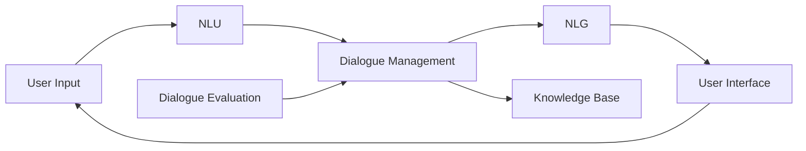

# Dialogue Systems原理与代码实例讲解

## 1. 背景介绍
### 1.1 问题的由来
对话系统(Dialogue Systems)是人工智能领域一个非常重要且充满挑战的研究方向。随着人工智能技术的飞速发展,尤其是自然语言处理、知识图谱等技术的成熟,让计算机能够像人一样进行自然流畅的对话成为可能。对话系统的应用场景非常广泛,从客服聊天机器人、智能语音助手、教育培训系统,到复杂的商业谈判、医疗诊断等高端领域。构建一个智能、自然、高效的对话系统是当前学术界和工业界共同的目标。

### 1.2 研究现状
目前对话系统的研究主要集中在以下几个方面:
1. 任务型对话系统:面向特定垂直领域,完成特定任务,如订餐、订票等。主要采用Pipeline式的系统架构,通过语言理解、对话管理、语言生成等模块实现。代表系统有微软的Cortana、苹果的Siri等。
2. 开放域对话系统:以开放聊天为目标,涉及话题广泛。主要采用数据驱动的端到端学习方法,通过海量对话数据训练对话模型。代表系统有微软的小冰、OpenAI的GPT-3等。
3. 问答系统:以知识库为基础,根据用户的问题给出准确答案。涉及信息检索、机器阅读理解等技术。代表系统有IBM的Watson。
4. 多模态对话系统:融合语音、图像、视频等多种模态信息,实现更自然的人机交互。如通过人脸表情、手势等分析用户情绪。代表系统有微软的Xiaolce。

总的来说,对话系统研究已经取得了长足进展,但离人类水平的对话还有不小差距,如常识推理、因果分析、情感交互等方面的能力仍然较弱。未来对话系统将向多模态、个性化、高度智能化的方向发展。

### 1.3 研究意义
对话系统的研究具有重大理论意义和应用价值:

1. 推动人工智能新进展。对话是人类智能的重要体现,对话系统是实现通用人工智能的关键。研究对话系统有助于揭示人类语言交互的奥秘,促进认知科学、脑科学等学科发展。

2. 改变人机交互方式。传统人机交互以"人找机器"为主,使用键鼠、触控等操作。对话系统则让机器主动理解人的需求,大大降低人机交互门槛,为普通用户打开智能时代的大门。

3. 创造巨大商业价值。对话系统可应用于客服、销售、办公助手等领域,提升工作效率,优化资源配置。据预测,2025年全球对话式AI市场规模将达到157亿美元。

4. 服务社会民生需求。如老人陪护、儿童教育、心理咨询等,对话系统可以提供7x24小时的贴心服务,解决人力资源紧缺问题,促进社会和谐发展。

### 1.4 本文结构
本文将全面系统地介绍对话系统的原理、架构与算法,并给出详细的代码实例。内容涵盖:

- 对话系统的背景与研究现状
- 对话系统的核心概念与模块联系 
- 对话系统的关键算法原理与实现步骤
- 对话系统涉及的数学模型与公式推导
- 对话系统的代码实例与详细解读
- 对话系统的实际应用场景与案例分析
- 对话系统的开发工具与学习资源推荐
- 对话系统的未来发展趋势与挑战展望

## 2. 核心概念与联系

对话系统涉及的核心概念包括:

- **用户输入(User Input)**:用户以文本、语音等形式向系统提问或表达需求,是对话的触发点。

- **自然语言理解(NLU)**:分析用户输入的语义、意图、情感等信息,将自然语言转化为计算机可理解的结构化表示。核心任务有:
  - 意图识别(Intent Detection):判断用户输入的目的,如查询、预定等。
  - 槽位填充(Slot Filling):提取输入中的关键信息,如时间、地点等。
  - 命名实体识别(NER):识别输入中的特定类型实体,如人名、地名等。
  - 情感分析(Sentiment Analysis):判断输入的情感倾向,如正面、负面、中性。

- **对话管理(Dialogue Management)**:根据当前对话状态与用户意图,决策下一步系统动作,控制对话流程。核心任务有:
  - 对话状态跟踪(Dialogue State Tracking):记录对话历史,解决指代消解等问题。
  - 对话策略学习(Dialogue Policy Learning):学习最优的系统动作策略,提高对话效率。

- **知识库(Knowledge Base)**:存储对话所需的各种结构化、非结构化知识,供系统查询、推理使用。

- **自然语言生成(NLG)**:将系统动作转换成自然语言文本,包括:
  - 内容选择(Content Selection):决定响应的关键信息。
  - 句子规划(Sentence Planning):组织响应内容的表达结构。  
  - 表面实现(Surface Realization):生成最终的自然语言文本。

- **用户交互(User Interface)**:实现用户与系统的多轮、多模态交互。

- **对话评估(Dialogue Evaluation)**:评价对话系统的性能,包括任务完成度、交互质量等指标。

这些概念环环相扣,共同构成了对话系统的核心架构:

可见,对话系统是一个复杂的智能系统,涉及自然语言处理、知识表示、机器学习等多个人工智能子领域。不同模块间紧密配合,共同完成与用户的智能对话。

## 3. 核心算法原理 & 具体操作步骤

### 3.1 算法原理概述

对话系统的核心算法主要包括:

1. **意图识别与槽位填充**:常用算法有:
   - 基于规则的模板匹配
   - 传统的机器学习分类器,如朴素贝叶斯、支持向量机等
   - 深度学习方法,如CNN、RNN、BERT等
   
2. **对话管理**:常用算法有:
   - 有限状态机
   - 基于规则的推理系统
   - 基于深度强化学习的对话策略优化
   
3. **自然语言生成**:常用算法有:  
   - 基于模板的文本生成
   - 基于语法规则的文本生成
   - 基于深度学习的端到端文本生成,如Seq2Seq、Transformer等

4. **对话评估**:常用算法有:
   - 基于人工评分的对话质量评估  
   - 基于无监督学习的对话连贯性评估
   - 基于强化学习的对话奖励函数学习

### 3.2 算法步骤详解

下面以基于深度学习的意图识别与槽位填充为例,详细介绍其算法步骤。

输入:用户话语 $u=w_1,w_2,...,w_n$
输出:意图标签 $I$,槽位序列 $s=<s_1,s_2,...,s_n>$

1. 话语表示:将话语中的词转换为分布式词向量 $e=<e_1,e_2,...,e_n>$
   - one-hot编码
   - word2vec/glove预训练词向量
   - BERT句编码器

2. 意图识别:
   - 将话语表示 $e$ 输入意图分类器,计算每个意图标签的概率分布 $p(I_k|u)$
     - CNN/RNN分类器
     - 注意力机制增强的分类器
   - 选择概率最大的意图作为最终意图 $I=\mathop{\arg\max}_kp(I_k|u)$

3. 槽位填充:
   - 将话语表示 $e$ 输入槽位序列标注模型,计算每个词对应槽位标签的概率分布 $p(s_i|w_i,u)$
     - BiLSTM-CRF
     - Transformer+CRF
   - 解码得到概率最大的槽位序列 $s=\mathop{\arg\max}_{s}p(s|u)$

4. 联合意图槽位学习:
   - 将意图识别和槽位填充任务作为多任务学习,共享底层话语编码层
   - 联合损失函数: $L=\alpha*L_{intent}+(1-\alpha)*L_{slot}$

5. 模型训练:
   - 输入:意图槽位标注语料 $D=\{(u_i,I_i,s_i)\}$
   - 参数学习:随机梯度下降等优化算法,最小化损失函数 $L$
   - 正则化:$L_2$ 范数,Dropout等避免过拟合

6. 模型评估:
   - 意图识别:精确率、召回率、F1值
   - 槽位填充:精确率、召回率、F1值,时间槽、数字槽等特定槽位的性能

### 3.3 算法优缺点

基于深度学习的意图槽位识别算法具有以下优点:
- 端到端学习,减少人工特征工程
- 利用词向量、语言模型预训练,减少标注数据需求
- 注意力机制、Transformer等提升话语理解能力
- 多任务学习有效提升意图槽位识别联合性能

同时也存在一些不足:
- 对低资源语言、领域适应能力不足
- 缺乏对话上下文信息利用
- 可解释性差,难以修正错误
- 对噪声、ASR错误敏感

### 3.4 算法应用领域

意图槽位识别算法是对话系统NLU的核心,在很多领域有重要应用:
- 任务型对话:如订餐、订票、导航等场景下准确理解用户需求
- 智能客服:快速识别用户意图,提供精准服务
- 语音助手:通过识别意图槽位,执行用户语音指令
- 情感对话:结合情感意图分析,实现更加贴心的关怀

未来还将在更多垂直领域得到应用,如金融、法律、医疗等。

## 4. 数学模型和公式 & 详细讲解 & 举例说明

### 4.1 数学模型构建

对话系统的数学建模可以基于概率图模型。设 $U$ 为用户话语,$S$ 为对话状态,$A$ 为系统动作,则一个对话过程可表示为:

$$P(U_1,S_1,A_1,...,U_T,S_T,A_T)=\prod_{t=1}^{T}P(U_t|S_{t-1})P(S_t|S_{t-1},A_{t-1})P(A_t|S_t)$$

其中 $P(U_t|S_{t-1})$ 对应NLU模型,$P(S_t|S_{t-1},A_{t-1})$ 对应对话状态跟踪(DST)模型,$P(A_t|S_t)$ 对应对话策略优化模型。

以NLU中的意图识别为例,给定话语 $u$,意图 $I$ 的后验概率为:

$$P(I|u)=\frac{P(u|I)P(I)}{P(u)}$$

$P(u|I)$ 为话语 $u$ 在意图 $I$ 上的类条件概率(似然), $P(I)$ 为意图的先验概率。

进一步,意图识别可建模为监督分类问题。设意图标签集合为 $\mathcal{I}$,分类器参数为 $\theta$,则意图分类模型为:

$$P(I|u;\theta)=softmax(W\cdot f(u)+b)$$

其中 $f(u)$ 为话语 $u$ 的特征表示,可以通过CNN、RNN等神经网络学习。$W,b$ 为分类器参数。模型训练时最小化交叉熵损失函数:

$$L(\theta)=-\sum_{(u,I)\in \mathcal{D}}\log P(I|u;\theta)$$

$\mathcal{D}$ 为标注训练语料。预测时选择后验概率最大的意图:

$$I^*=\mathop{\arg\max}_{I\in\mathcal{I}}P(I|u;\theta)$$

### 4.2 公式推导过程

下面推导意