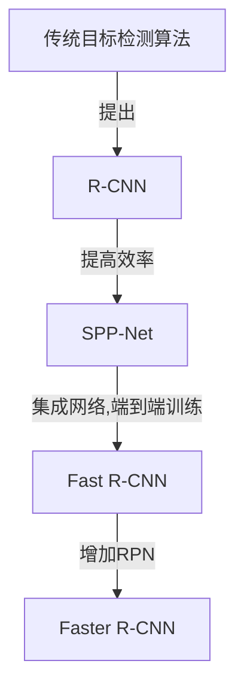
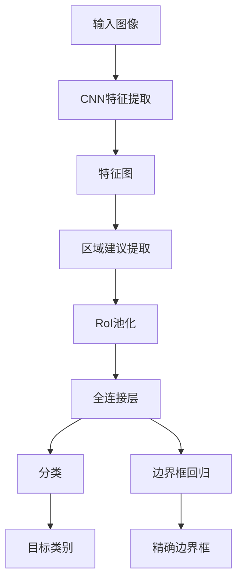

# Fast R-CNN原理与代码实例讲解

## 1. 背景介绍

### 1.1 问题的由来

在计算机视觉领域中,目标检测是一项基础且重要的任务。目标检测旨在从图像或视频中找出感兴趣的目标,并为每个目标生成一个精确的边界框。传统的目标检测算法通常分为两个阶段:首先使用底层描述符(如HOG、SIFT等)生成候选区域,然后在这些候选区域中运行分类器以识别目标。这种方法虽然可行,但是效率低下,因为生成候选区域和分类是分开的,无法共享计算资源。

### 1.2 研究现状

为了提高目标检测的效率,研究人员提出了基于深度学习的目标检测算法。其中,R-CNN(Region-based Convolutional Neural Networks)是第一个将深度学习应用于目标检测的算法。R-CNN首先使用选择性搜索算法生成约2000个区域建议,然后使用预先训练的CNN对每个区域建议进行分类。尽管R-CNN取得了不错的性能,但它的速度很慢,因为需要对每个区域建议单独进行CNN前向传播。

为了加速R-CNN,SPP-Net(Spatial Pyramid Pooling Network)和Fast R-CNN被提出。SPP-Net通过在CNN之后添加一个空间金字塔池化层,使得只需要对整个图像进行一次CNN前向传播,从而大大提高了速度。Fast R-CNN在SPP-Net的基础上进行了改进,它将整个检测网络集成到一个统一的网络中,使用多任务损失函数同时学习分类和边界框回归,从而进一步提高了速度和精度。

### 1.3 研究意义

尽管Fast R-CNN比R-CNN快了9倍,但它仍然需要使用选择性搜索算法生成区域建议,这个过程是独立于网络的,因此无法进行端到端的训练。为了解决这个问题,Faster R-CNN被提出,它在Fast R-CNN的基础上增加了一个区域建议网络(Region Proposal Network,RPN),使得整个网络可以进行端到端的训练。

Faster R-CNN不仅在精度上超过了之前的算法,而且在速度上也有了大幅提升。它已经成为目标检测领域的主流算法之一,在许多应用场景中得到了广泛应用。本文将重点介绍Fast R-CNN的原理和实现细节,为读者深入理解Faster R-CNN打下基础。

### 1.4 本文结构

本文首先介绍Fast R-CNN的核心概念和与其他算法的联系,然后详细阐述Fast R-CNN的算法原理和具体操作步骤,包括算法的优缺点和应用领域。接下来,我们将构建Fast R-CNN的数学模型,推导公式并通过案例进行讲解。在项目实践部分,我们将搭建开发环境,展示源代码实现细节并解读代码,最后运行代码并展示结果。此外,本文还将介绍Fast R-CNN在实际应用中的场景,推荐相关的学习资源、开发工具和论文。最后,我们将总结Fast R-CNN的研究成果,展望未来发展趋势并分析面临的挑战。

## 2. 核心概念与联系

Fast R-CNN是目标检测领域的一种重要算法,它基于R-CNN和SPP-Net,并对它们进行了改进和优化。Fast R-CNN的核心思想是:

1. **区域建议共享计算**:与R-CNN不同,Fast R-CNN只需要对整个图像进行一次CNN前向传播,然后在CNN特征图上提取区域建议的特征,从而大大提高了计算效率。

2. **单一网络端到端训练**:Fast R-CNN将整个检测网络集成到一个统一的网络中,使用多任务损失函数同时学习分类和边界框回归,可以进行端到端的训练。

3. **锚框(Anchor)机制**:Fast R-CNN引入了锚框的概念,在每个位置生成多个不同比例和尺度的锚框,用于匹配不同大小和形状的目标。

4. **区域建议网络(RPN)**:虽然Fast R-CNN比R-CNN快了9倍,但它仍然需要使用选择性搜索算法生成区域建议。为了解决这个问题,Faster R-CNN在Fast R-CNN的基础上增加了一个区域建议网络(RPN),使得整个网络可以进行端到端的训练。

Fast R-CNN与其他目标检测算法的关系如下所示:

Fast R-CNN在精度和速度上都有了显著提升,为后续的目标检测算法奠定了基础。它的核心思想不仅在目标检测领域产生了深远影响,也为其他计算机视觉任务提供了借鉴。

## 3. 核心算法原理 & 具体操作步骤

### 3.1 算法原理概述

Fast R-CNN的核心思想是:首先使用卷积神经网络(CNN)对整个输入图像进行一次前向传播,得到一个特征图(feature map);然后在这个特征图上提取区域建议(region proposals)的特征,并将其输入到两个并行的全连接层,分别用于分类(classification)和边界框回归(bounding box regression)。

Fast R-CNN的整体流程如下所示:

1. 输入一张图像,使用预训练的CNN(如VGG-16、ResNet等)提取整张图像的特征,得到一个特征图(feature map)。
2. 在特征图上使用选择性搜索算法提取区域建议(region proposals)。
3. 对每个区域建议使用RoI(Region of Interest)池化层提取固定长度的特征向量。
4. 将RoI池化层的输出分别输入到两个并行的全连接层,一个用于分类(classification),另一个用于边界框回归(bounding box regression)。
5. 分类全连接层输出该区域建议属于哪个类别(包括背景类);边界框回归全连接层输出该区域建议的精确边界框坐标。

Fast R-CNN的关键点在于:

- 只需要对整个图像进行一次CNN前向传播,然后在特征图上提取区域建议的特征,从而大大提高了计算效率。
- 将整个检测网络集成到一个统一的网络中,使用多任务损失函数同时学习分类和边界框回归,可以进行端到端的训练。
- 引入了锚框(Anchor)机制,在每个位置生成多个不同比例和尺度的锚框,用于匹配不同大小和形状的目标。

### 3.2 算法步骤详解

Fast R-CNN算法的具体步骤如下:

#### 3.2.1 CNN特征提取

1. 使用预训练的CNN(如VGG-16、ResNet等)对输入图像进行前向传播,得到一个特征图(feature map)。
2. 特征图的每个位置对应于原始图像上的一个区域,特征图的大小通常比原始图像小很多(如VGG-16的特征图大小为原始图像的1/16)。

#### 3.2.2 区域建议提取

1. 在特征图上使用选择性搜索算法提取约2000个区域建议(region proposals)。
2. 每个区域建议对应于原始图像上的一个矩形区域,可能包含感兴趣的目标。

#### 3.2.3 RoI池化

1. 对于每个区域建议,使用RoI(Region of Interest)池化层从特征图上提取一个固定长度的特征向量。
2. RoI池化层首先将区域建议投影到特征图上,然后使用最大池化操作将投影区域内的特征图划分为一个固定大小的特征图(如7x7)。
3. 最后,将这个固定大小的特征图展平成一个固定长度的特征向量(如7x7x512=25088)。

#### 3.2.4 分类和边界框回归

1. 将RoI池化层的输出分别输入到两个并行的全连接层,一个用于分类(classification),另一个用于边界框回归(bounding box regression)。
2. 分类全连接层输出该区域建议属于哪个类别(包括背景类)。
3. 边界框回归全连接层输出该区域建议的精确边界框坐标,通过对锚框(Anchor)进行调整得到。

#### 3.2.5 损失函数和训练

Fast R-CNN使用多任务损失函数同时学习分类和边界框回归:

$$
L(p, t^u, t^v, v) = L_{cls}(p, u) + \lambda[u \geq 1]L_{reg}(t^u, v)
$$

其中:
- $L_{cls}$是分类损失,通常使用交叉熵损失。
- $L_{reg}$是边界框回归损失,通常使用平滑L1损失。
- $p$是预测的类别概率分布。
- $u$是真实的类别标签,如果为0则表示背景类。
- $v$是预测的边界框坐标。
- $t^u$是真实的边界框坐标。
- $\lambda$是平衡分类和回归损失的权重系数。

Fast R-CNN使用反向传播算法和随机梯度下降法优化上述损失函数,实现端到端的训练。

### 3.3 算法优缺点

**优点:**

1. **高效计算**:Fast R-CNN只需要对整个图像进行一次CNN前向传播,然后在特征图上提取区域建议的特征,大大提高了计算效率。
2. **端到端训练**:Fast R-CNN将整个检测网络集成到一个统一的网络中,使用多任务损失函数同时学习分类和边界框回归,可以进行端到端的训练,提高了检测精度。
3. **锚框机制**:引入了锚框机制,在每个位置生成多个不同比例和尺度的锚框,用于匹配不同大小和形状的目标,提高了检测的鲁棒性。

**缺点:**

1. **区域建议生成**:Fast R-CNN仍然需要使用选择性搜索算法生成区域建议,这个过程是独立于网络的,因此无法进行端到端的训练。
2. **速度瓶颈**:尽管Fast R-CNN比R-CNN快了9倍,但生成区域建议的过程仍然是速度瓶颈。
3. **锚框设计**:锚框的设计需要人工经验,不同的数据集可能需要不同的锚框设置,缺乏自适应性。

### 3.4 算法应用领域

Fast R-CNN及其改进版本Faster R-CNN已经在多个领域得到了广泛应用,包括但不限于:

1. **目标检测**:Fast R-CNN是目标检测领域的重要算法,在通用目标检测、行人检测、车辆检测等任务中表现出色。
2. **实例分割**:将Fast R-CNN与分割算法(如FCN)结合,可以实现实例分割任务,即同时检测目标和分割目标的精确边界。
3. **视频目标检测**:利用视频的时间连续性,Fast R-CNN可以在视频目标检测任务中取得不错的性能。
4. **弱监督目标检测**:Fast R-CNN可以用于弱监督目标检测,即只需要图像级别的标注,而不需要精确的边界框标注。
5. **其他任务**:Fast R-CNN的思想也被应用到其他计算机视觉任务中,如人体姿态估计、3D目标检测等。

## 4. 数学模型和公式 & 详细讲解 & 举例说明

### 4.1 数学模型构建

Fast R-CNN的数学模型主要包括两个部分:分类模型和边界框回归模型。

#### 4.1.1 分类模型

分类模型的目标是为每个区域建议预测一个类别标签。我们使用softmax分类器,将RoI池化层的输出特征向量 $\boldsymbol{x}$ 映射到类别概率分布 $\boldsymbol{p}$:

$$
\boldsymbol{p} = \text{softmax}(\boldsymbol{W}^T\boldsymbol{x} + \boldsymbol{b})
$$