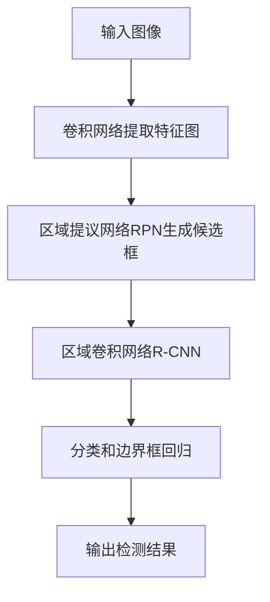

# Fast R-CNN原理与代码实例讲解

## 1. 背景介绍

### 1.1 问题的由来

在计算机视觉领域中,目标检测是一项极具挑战的任务。它旨在定位图像中的目标对象,并对它们进行分类。传统的目标检测方法通常是采用滑动窗口的方式在图像上进行密集采样,然后使用分类器对每个候选框进行分类。这种方法计算量巨大,效率低下。

### 1.2 研究现状

近年来,受深度学习技术的推动,目标检测算法取得了长足的进步。其中,基于区域提议的两阶段目标检测器(Two-Stage Object Detector)成为主流方法,代表算法有R-CNN、Fast R-CNN、Faster R-CNN等。这些算法通过首先生成候选区域,然后对这些区域进行分类和边界框回归,从而实现目标检测。

### 1.3 研究意义

Fast R-CNN是R-CNN系列算法中的一个重要里程碑,它将整个检测流程统一到了深度神经网络中,大幅提高了检测速度和精度。深入理解Fast R-CNN的原理和实现细节,对于掌握目标检测的核心思想和进一步优化算法性能具有重要意义。

### 1.4 本文结构

本文将从以下几个方面全面介绍Fast R-CNN:
1. 核心概念与联系
2. 算法原理及具体操作步骤
3. 数学模型和公式推导
4. 项目实践:代码实例和详细解释
5. 实际应用场景
6. 相关工具和学习资源推荐
7. 总结未来发展趋势与挑战
8. 常见问题解答

## 2. 核心概念与联系

Fast R-CNN继承了R-CNN的两阶段目标检测思路,但在网络结构和训练方式上进行了重大改进。它的核心思想是:

1. **区域提议网络(Region Proposal Network,RPN)**: 用于生成候选目标边界框(Region Proposals)。
2. **区域卷积网络(Region-based Convolutional Network,R-CNN)**: 对候选框进行分类和边界框回归。

Fast R-CNN将RPN和R-CNN两个网络共享大部分卷积层,从而实现了高效的特征提取和端到端的联合训练。这种设计大大降低了计算复杂度,提高了检测速度。

## 3. 核心算法原理 & 具体操作步骤  

### 3.1 算法原理概述

Fast R-CNN的算法流程如下:

1. 输入图像经过卷积网络提取特征图(Feature Map)。
2. 区域提议网络(RPN)在特征图上滑动窗口,生成候选目标边界框(Region Proposals)。
3. 对于每个候选框,区域卷积网络(R-CNN)从特征图上截取对应区域,进行特征提取和编码。
4. R-CNN网络对编码后的特征进行分类和边界框回归,得到最终的目标类别和精确边界框。

### 3.2 算法步骤详解

#### 3.2.1 特征提取

Fast R-CNN使用卷积神经网络(如VGG16、ResNet等)从输入图像中提取特征图。特征图保留了原始图像的空间信息,用于后续的区域提议和目标检测。

#### 3.2.2 区域提议网络(RPN)

RPN是Fast R-CNN中一个关键创新,它在特征图上滑动窗口,为每个位置生成多个不同尺度和比例的候选框(Region Proposals)。

RPN由两个全连接层组成:

1. **分类层(cls layer)**: 判断当前候选框是否包含目标对象。
2. **回归层(reg layer)**: 对候选框的位置和大小进行调整,获得更精确的边界框。

通过对分类层和回归层的输出进行整合,RPN可以生成高质量的候选框,为后续的目标检测提供良好初始值。

#### 3.2.3 区域卷积网络(R-CNN)

对于每个候选框,R-CNN从特征图上截取对应区域,并使用RoI Pooling层将其映射到固定尺寸,以便输入到全连接层进行特征编码。

编码后的特征被并行输入到两个全连接层:

1. **分类层(cls layer)**: 对目标进行分类,得到类别概率。
2. **回归层(reg layer)**: 对候选框的位置和大小进行精细调整,获得最终的精确边界框。

通过softmax和边界框回归,R-CNN可以输出目标的类别和精确位置。

### 3.3 算法优缺点

**优点**:

1. 端到端训练,提高了检测精度。
2. 共享卷积特征,降低了计算复杂度。
3. RPN生成高质量候选框,提高了检测效率。

**缺点**:

1. 仍然是两阶段结构,速度上有待提高。
2. 对小目标的检测效果较差。
3. 训练过程复杂,需要对多个损失函数进行权衡。

### 3.4 算法应用领域

Fast R-CNN及其改进版本广泛应用于以下领域:

- 目标检测: 如行人检测、车辆检测等。
- 实例分割: 结合分割算法,实现像素级目标检测。
- 弱监督目标检测: 利用图像级别标注训练目标检测器。
- 小目标检测: 通过特征金字塔网络等改进,提高小目标检测能力。

## 4. 数学模型和公式 & 详细讲解 & 举例说明

### 4.1 数学模型构建

Fast R-CNN的损失函数由两部分组成:RPN的损失函数和R-CNN的损失函数。

#### 4.1.1 RPN损失函数

RPN损失函数包括两项:

1. 分类损失(Classification Loss): 用于判断候选框是否包含目标对象。
2. 回归损失(Regression Loss): 用于调整候选框的位置和大小。

分类损失使用交叉熵损失函数,回归损失使用平滑L1损失函数。RPN损失函数可表示为:

$$L_{RPN}(p_i, t_i) = \frac{1}{N_{cls}}\sum_iL_{cls}(p_i, p_i^*) + \lambda\frac{1}{N_{reg}}\sum_iL_{reg}(t_i, t_i^*)$$

其中:

- $p_i$是第i个候选框被分为前景的预测概率
- $p_i^*$是第i个候选框的实际标签(0或1)
- $t_i$是第i个候选框的预测边界框坐标
- $t_i^*$是第i个候选框的实际边界框坐标
- $L_{cls}$是分类损失函数(如交叉熵损失)
- $L_{reg}$是回归损失函数(如平滑L1损失)
- $N_{cls}$和$N_{reg}$分别是归一化项
- $\lambda$是平衡分类损失和回归损失的权重系数

#### 4.1.2 R-CNN损失函数

R-CNN损失函数与RPN损失函数类似,也包括分类损失和回归损失:

$$L_{R-CNN}(c_i, v_i) = \frac{1}{N_{cls}}\sum_iL_{cls}(c_i, c_i^*) + \lambda\frac{1}{N_{reg}}\sum_iL_{reg}(v_i, v_i^*)$$

其中:

- $c_i$是第i个候选框的预测类别概率
- $c_i^*$是第i个候选框的实际类别标签
- $v_i$是第i个候选框的预测边界框坐标
- $v_i^*$是第i个候选框的实际边界框坐标
- $L_{cls}$和$L_{reg}$分别是分类损失函数和回归损失函数
- $N_{cls}$和$N_{reg}$是归一化项
- $\lambda$是平衡分类损失和回归损失的权重系数

### 4.2 公式推导过程

#### 4.2.1 平滑L1损失函数

平滑L1损失函数用于边界框回归,它是L1损失和L2损失的组合,可以避免L2损失函数对outlier过度惩罚的缺点。

平滑L1损失函数的定义如下:

$$L_\text{smooth_L1}(x) = \begin{cases}
0.5x^2 & \text{if }|x| < 1 \\
|x| - 0.5 & \text{otherwise}
\end{cases}$$

其中$x$是预测值与真实值之间的残差。

当残差较小时,平滑L1损失函数近似于L2损失,具有较好的数值稳定性。当残差较大时,平滑L1损失函数近似于L1损失,对outlier的惩罚较小,从而提高了模型的鲁棒性。

#### 4.2.2 RPN分类损失推导

RPN分类损失使用交叉熵损失函数,对于二分类问题,交叉熵损失函数可表示为:

$$L_{cls}(p, p^*) = -(p^*\log(p) + (1-p^*)\log(1-p))$$

其中$p$是预测的前景概率,$p^*$是实际标签(0或1)。

对于一个批次中的所有候选框,RPN分类损失可表示为:

$$L_{cls}^{RPN} = \frac{1}{N_{cls}}\sum_i L_{cls}(p_i, p_i^*)$$

其中$N_{cls}$是归一化项,用于平均所有候选框的损失。

### 4.3 案例分析与讲解

让我们通过一个具体案例来更好地理解Fast R-CNN的工作原理。

假设我们有一张图像,需要检测其中的人脸。我们将使用预训练的VGG16网络作为特征提取器,并在其基础上构建Fast R-CNN模型。

1. **特征提取**:
   
   输入图像经过VGG16网络的卷积层和池化层,得到一个特征图(Feature Map)。特征图保留了原始图像的空间信息,用于后续的区域提议和目标检测。

2. **区域提议网络(RPN)**:
   
   RPN在特征图上滑动窗口,为每个位置生成多个不同尺度和比例的候选框。对于每个候选框,RPN会输出两个值:一个是该框是否包含人脸的分数,另一个是调整该框位置和大小的回归值。

   通过设置合适的阈值,我们可以筛选出高质量的人脸候选框。

3. **区域卷积网络(R-CNN)**:
   
   对于每个候选框,R-CNN从特征图上截取对应区域,并使用RoI Pooling层将其映射到固定尺寸,以便输入到全连接层进行特征编码。

   编码后的特征被并行输入到两个全连接层:一个用于人脸分类,另一个用于边界框回归。通过softmax和边界框回归,R-CNN可以输出最终的人脸类别和精确位置。

4. **结果可视化**:
   
   将R-CNN的输出结果映射回原始图像,我们可以在图像上绘制出检测到的人脸及其边界框。

通过这个案例,我们可以更直观地理解Fast R-CNN的工作流程,以及各个模块之间的协同关系。

### 4.4 常见问题解答

1. **为什么Fast R-CNN比R-CNN更快?**
   
   Fast R-CNN将特征提取和区域提议网络(RPN)合并到一个统一的网络中,避免了R-CNN中重复计算卷积特征的问题,从而大幅提高了计算效率。

2. **RPN和R-CNN网络是如何共享特征的?**
   
   Fast R-CNN中,RPN和R-CNN共享大部分卷积层,只有最后几层是分开的。这种设计使得两个网络可以在同一个特征图上工作,避免了重复计算特征的开销。

3. **为什么需要RoI Pooling层?**
   
   RoI Pooling层的作用是将不同大小的候选框区域映射到固定尺寸的特征向量,以便输入到全连接层进行特征编码。这种操作保留了候选框的空间信息,同时确保了后续层的输入维度一致。

4. **Fast R-CNN的训练过程是如何进行的?**
   
   Fast R-CNN采用了一种多任务损失函数,同时优化RPN的分类损失、回归损失,以及R-CNN的分类