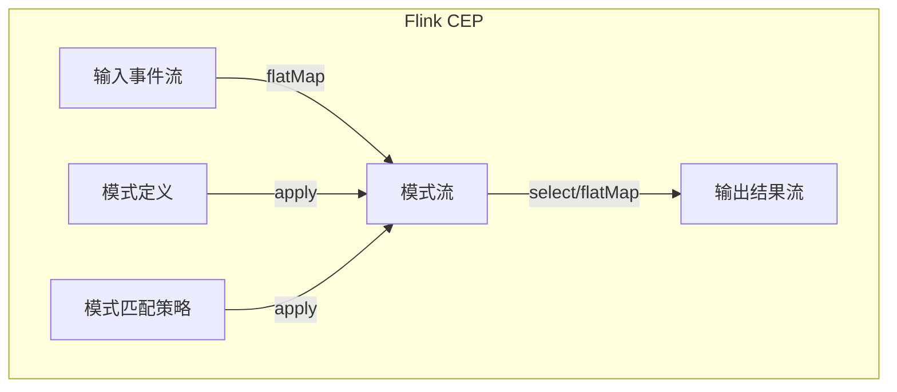

# Flink CEP原理与代码实例讲解

## 1. 背景介绍

### 1.1 问题的由来

在当今快速发展的数字时代，实时数据处理已成为各行业的关键需求。传统的批处理系统无法满足实时性和低延迟的要求。因此，针对连续到来的事件流进行复杂事件处理(Complex Event Processing, CEP)变得越来越重要。CEP旨在从大量的简单事件流中发现复杂的事件模式,并对其进行实时响应和处理。

### 1.2 研究现状

Apache Flink是一个开源的分布式大数据处理引擎,支持有状态计算和精确一次(Exactly-Once)语义。Flink提供了CEP库,允许开发人员在无限事件流上进行模式匹配,从而检测出复杂的事件序列。Flink CEP库基于复杂事件处理和流处理两种范式,可以高效地处理各种复杂的事件模式。

### 1.3 研究意义

掌握Flink CEP的原理和使用方法,对于构建实时事件驱动应用程序至关重要。通过CEP,我们可以从海量事件流中提取有价值的信息,并基于检测到的复杂事件模式触发相应的操作。这在诸如网络安全监控、物联网设备监控、金融交易监控等领域都有广泛的应用。

### 1.4 本文结构

本文将全面介绍Flink CEP的核心概念、原理和实现细节。首先阐述CEP的基本概念和Flink CEP的架构设计。然后深入探讨CEP的核心算法原理,包括模式匹配、窗口操作等。接着通过数学模型和公式详细说明CEP的工作机制。之后,我们将提供一个完整的代码示例,并对其进行逐步解释。最后,讨论CEP的实际应用场景、未来发展趋势和面临的挑战。

## 2. 核心概念与联系

在探讨Flink CEP的核心概念之前,我们先了解一下CEP的基本术语:

- **事件(Event)**: 事件是系统中发生的一个原子操作或状态变化,可以携带一些相关数据。
- **事件流(Event Stream)**: 事件流是一个按时间顺序排列的事件序列。
- **模式(Pattern)**: 模式定义了我们想要在事件流中查找的条件或约束。它由一个或多个事件流组件组成,这些组件通过一些逻辑运算符(如与、或、次序等)连接在一起。
- **复杂事件(Complex Event)**: 复杂事件是指满足特定模式的事件序列。

Flink CEP库的核心思想是在无限的事件流上进行模式匹配,以发现符合给定模式的复杂事件。它基于以下三个关键概念:

1. **模式流(Pattern Stream)**: 模式流是一个虚拟的流,其中的每个元素都是检测到的复杂事件。
2. **模式(Pattern)**: 模式用于描述我们想要查找的复杂事件序列。Flink CEP支持各种模式组合,如严格连续、非严格连续、停止模式等。
3. **模式策略(Pattern Strategy)**: 模式策略定义了如何将输入事件流与给定的模式进行匹配。Flink CEP支持多种策略,如贪婪策略和非贪婪策略。

Flink CEP库的架构设计如下所示:

该架构体现了Flink CEP的核心工作流程:

1. 输入事件流经过`flatMap`转换为模式流。
2. 模式定义和模式匹配策略被应用到模式流上,以检测出符合条件的复杂事件。
3. 检测到的复杂事件可以通过`select`或`flatMap`操作进行进一步处理,生成输出结果流。

## 3. 核心算法原理 & 具体操作步骤

### 3.1 算法原理概述

Flink CEP库的核心算法是一种有效的模式匹配算法,用于在无限事件流上发现符合给定模式的复杂事件序列。该算法的基本思路是维护一个部分匹配的状态机(Partial Match State Machine),用于跟踪每个输入事件与模式的匹配情况。

当一个新事件到来时,算法会更新状态机中的部分匹配,并输出完全匹配的复杂事件。这个过程通过以下三个主要步骤实现:

1. **事件编码(Event Coding)**: 将输入事件映射到一个唯一的事件类型标识符。
2. **非确定性有限自动机(Non-deterministic Finite Automaton, NFA)**: 使用NFA来表示给定的模式,并根据输入事件更新NFA的状态。
3. **版本控制(Version Control)**: 为每个部分匹配分配一个唯一的版本号,以跟踪其生命周期。

### 3.2 算法步骤详解

Flink CEP算法的具体步骤如下:

1. **初始化**: 根据给定的模式构建一个NFA,并创建一个空的部分匹配状态机。
2. **事件编码**: 为每个输入事件分配一个唯一的事件类型标识符。
3. **状态机更新**:
   a. 对于每个新到达的事件,将其与状态机中的每个部分匹配进行匹配。
   b. 如果匹配成功,则根据NFA的转移规则更新部分匹配的状态。
   c. 如果部分匹配达到NFA的接受状态,则输出一个完全匹配的复杂事件。
4. **版本控制**:
   a. 为每个新创建的部分匹配分配一个唯一的版本号。
   b. 当部分匹配被更新时,将其版本号递增。
   c. 当部分匹配被丢弃时,将其从状态机中移除。
5. **输出结果**: 将检测到的复杂事件序列输出为结果流。

### 3.3 算法优缺点

Flink CEP算法的优点包括:

- **高效**: 通过NFA和版本控制机制,算法能够有效地处理大量的事件流,并保证正确性。
- **可扩展**: 算法可以处理各种复杂的模式,包括严格连续、非严格连续、停止模式等。
- **低延迟**: 算法采用增量式处理,能够在事件到达时立即进行匹配,从而实现低延迟的复杂事件检测。

然而,该算法也存在一些缺点:

- **状态空间开销**: 在处理复杂模式时,部分匹配状态机可能会占用大量内存。
- **计算开销**: 对于每个新事件,算法需要与所有部分匹配进行匹配,计算开销可能较高。
- **有界窗口限制**: 算法目前只支持有界窗口,无法处理无界的模式匹配。

### 3.4 算法应用领域

Flink CEP算法可以广泛应用于各种需要实时处理事件流的领域,包括但不限于:

- **网络安全监控**: 检测网络入侵行为、异常流量模式等。
- **物联网设备监控**: 监控传感器数据,发现异常事件序列。
- **金融交易监控**: 识别欺诈交易模式,预防金融风险。
- **业务活动监控**: 跟踪业务流程中的关键事件,确保流程正常执行。
- **预测性维护**: 根据设备状态数据预测故障,提前进行维护。

## 4. 数学模型和公式 & 详细讲解 & 举例说明

### 4.1 数学模型构建

为了更好地理解Flink CEP算法的工作原理,我们可以将其形式化为一个数学模型。首先,我们定义一些基本概念:

- 事件流 $S = \{e_1, e_2, \dots, e_n\}$ 是一个有序事件序列,其中 $e_i$ 表示第 $i$ 个事件。
- 事件类型函数 $\tau: S \rightarrow \Sigma$ 将每个事件映射到一个事件类型标识符,其中 $\Sigma$ 是所有可能的事件类型集合。
- 模式 $P$ 是一个正则表达式,用于描述我们想要查找的复杂事件序列。它由事件类型和一些逻辑运算符(如连续、并行等)组成。

接下来,我们定义一个非确定性有限自动机(NFA) $M = (Q, \Sigma, \delta, q_0, F)$ 来表示模式 $P$,其中:

- $Q$ 是 NFA 的状态集合
- $\Sigma$ 是输入事件的事件类型集合
- $\delta: Q \times \Sigma \rightarrow 2^Q$ 是 NFA 的转移函数
- $q_0 \in Q$ 是 NFA 的初始状态
- $F \subseteq Q$ 是 NFA 的接受状态集合

NFA 的工作过程可以用一个五元组 $(q, v, e, q', v')$ 来表示,其中:

- $q \in Q$ 是 NFA 的当前状态
- $v$ 是当前部分匹配的版本号
- $e \in S$ 是输入事件
- $q' \in \delta(q, \tau(e))$ 是 NFA 根据输入事件 $e$ 转移到的新状态
- $v'$ 是更新后的部分匹配版本号

如果 $q' \in F$,则表示检测到一个完全匹配的复杂事件序列。

### 4.2 公式推导过程

现在,我们来推导 Flink CEP 算法的数学表达式。假设在时间 $t$ 有一个新事件 $e_t$ 到达,我们需要更新部分匹配状态机。

首先,我们定义一个函数 $\gamma_t: Q \times \mathbb{N} \rightarrow 2^{Q \times \mathbb{N}}$ 来表示状态机的转移:

$$\gamma_t(q, v) = \{(q', v') | \exists (q, v, e_t, q', v')\}$$

其中 $(q, v)$ 表示当前的部分匹配状态和版本号,而 $(q', v')$ 表示根据输入事件 $e_t$ 转移到的新状态和版本号。

接下来,我们定义一个函数 $\Gamma_t: 2^{Q \times \mathbb{N}} \rightarrow 2^{Q \times \mathbb{N}}$ 来更新整个部分匹配状态机:

$$\Gamma_t(X) = \bigcup_{(q, v) \in X} \gamma_t(q, v)$$

其中 $X$ 表示时间 $t$ 之前的部分匹配状态集合。

最后,我们可以定义一个函数 $\mathcal{M}_t: 2^{Q \times \mathbb{N}} \rightarrow 2^{S^*}$ 来输出完全匹配的复杂事件序列:

$$\mathcal{M}_t(X) = \{w \in S^* | \exists (q, v) \in X, q \in F, w \text{ 是导致 } (q, v) \text{ 的事件序列}\}$$

其中 $S^*$ 表示所有可能的事件序列集合,而 $w$ 是一个满足模式 $P$ 的复杂事件序列。

综上所述,Flink CEP 算法的数学表达式可以写成:

$$X_{t+1} = \Gamma_t(X_t)$$
$$Y_t = \mathcal{M}_t(X_t)$$

其中 $X_t$ 表示时间 $t$ 的部分匹配状态集合,而 $Y_t$ 表示时间 $t$ 输出的完全匹配的复杂事件序列集合。

### 4.3 案例分析与讲解

为了更好地理解 Flink CEP 算法的工作原理,我们来分析一个具体的案例。假设我们需要在一个网络流量事件流中检测可疑的端口扫描行为。

我们定义一个模式 $P$,用于描述端口扫描的特征:

$$P = (\text{SYN}_{\text{src}=*,\text{dst}=h_1,\text{dstPort}=p_1}) \;
      (\text{SYN}_{\text{src}=*,\text{dst}=h_1,\text{dstPort}!=p_1})^{+} \;
      (\text{SYN}_{\text{src}=*,\text{dst}!=h_1})^{?}$$

该模式表示: