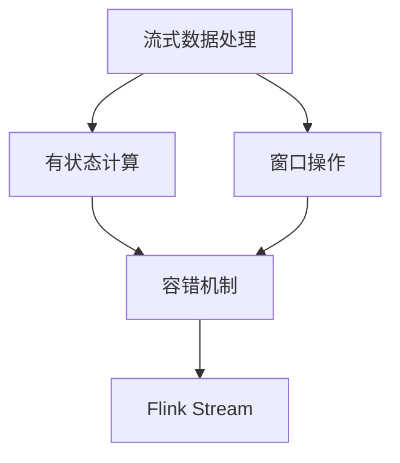

# Flink Stream原理与代码实例讲解

## 1. 背景介绍

### 1.1 问题的由来

在当今快速发展的数字时代，实时数据处理已经成为许多应用程序的核心需求。传统的批处理系统无法满足低延迟和高吞吐量的需求,因此出现了流式数据处理的概念。Apache Flink 作为一种新兴的开源流处理框架,凭借其低延迟、高吞吐量和容错能力,已经被广泛应用于各种领域,如金融风险监控、网络安全分析、物联网数据处理等。

### 1.2 研究现状

Apache Flink 是一个开源的分布式流处理框架,它结合了流处理和批处理的优点,提供了统一的流批一体化处理模型。Flink 基于流处理引擎,支持有状态计算,并且具有高吞吐量、低延迟和高容错性等优势。目前,Flink 已经被许多知名公司和组织采用,如 Alibaba、Netflix、Uber 等。

### 1.3 研究意义

深入理解 Flink Stream 的原理对于开发高性能、低延迟的流式应用程序至关重要。本文将全面解析 Flink Stream 的核心概念、算法原理和数学模型,并通过代码实例和实际应用场景,帮助读者掌握 Flink Stream 的使用方法和最佳实践。

### 1.4 本文结构

本文将从以下几个方面详细阐述 Flink Stream:

1. 核心概念与联系
2. 核心算法原理与具体操作步骤
3. 数学模型和公式详细讲解与举例说明
4. 项目实践:代码实例和详细解释说明
5. 实际应用场景
6. 工具和资源推荐
7. 总结:未来发展趋势与挑战
8. 附录:常见问题与解答

## 2. 核心概念与联系

在深入探讨 Flink Stream 的原理之前,我们需要了解一些核心概念。

### 2.1 流式数据处理

流式数据处理(Stream Processing)是一种处理持续不断产生的数据流的计算范式。与传统的批处理不同,流式处理系统需要在数据到达时就开始处理,而不是等待所有数据都到达后再处理。这种处理方式能够提供低延迟和高吞吐量,适用于实时数据处理场景。

### 2.2 有状态计算

有状态计算(Stateful Computation)是指在处理数据流时,系统需要维护一些内部状态,并根据这些状态进行计算。例如,在计算移动平均值时,需要记录历史数据以计算新的平均值。有状态计算使得流式处理系统能够处理更复杂的业务逻辑。

### 2.3 窗口操作

窗口操作(Window Operation)是流式处理中一种常见的操作模式。它将无限的数据流划分为有限的"窗口",然后对每个窗口中的数据进行计算。窗口可以基于时间(如每隔5秒)或数据条数(如每1000条记录)来定义。窗口操作使得我们能够在无限数据流上执行有限的计算。

### 2.4 容错机制

容错机制(Fault Tolerance)是流式处理系统中一个关键的特性。由于数据流是持续不断的,任何中断或故障都可能导致数据丢失或计算结果不正确。因此,流式处理系统需要具备容错能力,能够在发生故障时自动恢复并保证计算的一致性。

### 2.5 核心概念关系

上述核心概念相互关联,共同构建了 Flink Stream 的基础架构。有状态计算和窗口操作为流式数据处理提供了强大的计算能力,而容错机制则确保了计算的可靠性和一致性。这些概念的有机结合使得 Flink Stream 能够高效地处理实时数据流。

## 3. 核心算法原理与具体操作步骤

### 3.1 算法原理概述

Flink Stream 的核心算法是基于有向无环图(Directed Acyclic Graph, DAG)的数据流模型。在这个模型中,每个算子(Operator)都是一个节点,数据以流的形式在算子之间传递。算子可以对流数据进行各种转换操作,如过滤、映射、聚合等。

Flink 采用了基于流的执行模型,即每个算子都是一个独立的任务,可以并行执行。当数据流经过一个算子时,该算子会对数据进行处理,然后将结果传递给下游算子。这种模型具有良好的容错性和可扩展性,能够充分利用分布式系统的计算资源。

### 3.2 算法步骤详解

Flink Stream 的执行过程可以分为以下几个步骤:

1. **构建执行计划**

   用户通过编写 Flink 程序,定义数据源、转换操作和sink。Flink 会将这些操作转换为一个有向无环图,即执行计划。

2. **任务链优化**

   Flink 会对执行计划进行优化,将一些算子合并为一个任务链(Task Chain),以减少数据在算子之间的传输开销。

3. **资源分配**

   Flink 会根据集群资源情况,为每个任务链分配执行资源,即 Task Slot。

4. **数据传输**

   当数据源开始产生数据时,数据会沿着执行计划中的路径流动,每个算子都会对数据进行相应的处理。

5. **容错机制**

   如果某个任务出现故障,Flink 会根据检查点(Checkpoint)和重播日志(Replay Log)进行故障恢复,保证计算的一致性。

6. **结果输出**

   经过一系列转换后,最终结果会输出到指定的 Sink 中,如文件系统或消息队列。

### 3.3 算法优缺点

Flink Stream 算法的优点包括:

- **低延迟**:基于流式处理模型,能够实现毫秒级的低延迟。
- **高吞吐量**:可以充分利用分布式集群资源,实现高吞吐量的数据处理。
- **容错性强**:通过检查点和重播日志机制,能够在发生故障时自动恢复,保证计算的一致性。
- **统一批流处理**:支持批处理和流处理的统一处理模型,简化了开发流程。

不过,Flink Stream 算法也存在一些缺点:

- **学习成本较高**:由于涉及分布式系统、流式处理等多个领域的知识,学习曲线较陡峭。
- **资源消耗较大**:为了保证低延迟和高吞吐量,Flink 需要消耗较多的计算资源。
- **调优复杂度高**:为了获得最佳性能,需要对 Flink 进行大量的参数调优和优化。

### 3.4 算法应用领域

Flink Stream 算法可以应用于以下领域:

- **实时数据分析**:如网络日志分析、用户行为分析等。
- **实时监控系统**:如金融风险监控、网络安全监控等。
- **实时推荐系统**:如个性化推荐、广告投放等。
- **物联网数据处理**:如传感器数据处理、车联网数据处理等。
- **在线机器学习**:如实时模型训练、在线预测等。

## 4. 数学模型和公式详细讲解与举例说明

### 4.1 数学模型构建

为了更好地理解 Flink Stream 的原理,我们可以构建一个数学模型来描述流式数据处理过程。

假设有一个无限的数据流 $S = \{s_1, s_2, s_3, \ldots\}$,其中 $s_i$ 表示第 i 个数据元素。我们需要对这个数据流进行某种转换操作 $f$,得到一个新的数据流 $S' = \{s'_1, s'_2, s'_3, \ldots\}$,其中 $s'_i = f(s_i)$。

在实际应用中,转换操作 $f$ 可能是一个复杂的函数,包含多个子操作。我们可以将其表示为一系列函数的组合:

$$f(s_i) = f_n \circ f_{n-1} \circ \ldots \circ f_2 \circ f_1(s_i)$$

其中,每个 $f_j$ 表示一个子操作,如过滤、映射、聚合等。

为了实现有状态计算,我们需要引入状态变量 $\sigma$。状态变量随着数据流的处理而不断更新,并影响后续的计算结果。我们可以将有状态计算表示为:

$$\begin{align}
s'_i &= f(s_i, \sigma_{i-1}) \\
\sigma_i &= g(s_i, \sigma_{i-1})
\end{align}$$

其中,函数 $g$ 用于更新状态变量 $\sigma$。

对于窗口操作,我们可以将数据流划分为多个窗口 $W_1, W_2, W_3, \ldots$,每个窗口包含一定范围内的数据元素。然后,我们对每个窗口内的数据进行聚合操作 $h$,得到窗口结果 $r_1, r_2, r_3, \ldots$:

$$r_i = h(W_i)$$

窗口操作可以基于时间或数据条数来定义,例如:

- 时间窗口: $W_i = \{s_j | t_i \leq t(s_j) < t_i + w\}$
- 计数窗口: $W_i = \{s_j | (i-1)c < j \leq ic\}$

其中,$t(s_j)$ 表示数据元素 $s_j$ 的时间戳,$w$ 表示窗口大小,$c$ 表示窗口包含的数据条数。

通过上述数学模型,我们可以更好地理解 Flink Stream 的核心概念和算法原理。

### 4.2 公式推导过程

在实际应用中,我们经常需要对数据流进行各种统计和聚合操作,如计算移动平均值、top-k等。这些操作都可以通过数学公式来描述和推导。

以计算移动平均值为例,假设我们有一个数据流 $S = \{s_1, s_2, s_3, \ldots\}$,其中每个 $s_i$ 表示一个数值。我们需要计算最近 $n$ 个数值的移动平均值。

首先,我们定义一个状态变量 $\sigma_i$,表示前 $i$ 个数值的和:

$$\sigma_i = \sum_{j=1}^i s_j$$

那么,第 $i$ 个数值的移动平均值可以表示为:

$$\overline{s}_i = \begin{cases}
\frac{\sigma_i}{i}, & \text{if } i < n \\
\frac{\sigma_i - \sigma_{i-n}}{n}, & \text{if } i \geq n
\end{cases}$$

我们可以递推地计算状态变量 $\sigma_i$:

$$\sigma_i = \sigma_{i-1} + s_i$$

将其代入移动平均值公式,我们得到:

$$\overline{s}_i = \begin{cases}
\frac{\sigma_{i-1} + s_i}{i}, & \text{if } i < n \\
\frac{\sigma_{i-1} + s_i - \sigma_{i-n}}{n}, & \text{if } i \geq n
\end{cases}$$

这个公式描述了如何基于前一个状态变量 $\sigma_{i-1}$ 和当前数据 $s_i$ 来计算新的移动平均值 $\overline{s}_i$。

通过类似的方式,我们可以推导出其他统计和聚合操作的公式,如中位数、top-k等。这些公式为 Flink Stream 的实现提供了数学基础。

### 4.3 案例分析与讲解

为了更好地理解数学模型和公式的应用,我们以一个实际案例进行分析和讲解。

假设我们需要开发一个实时网络流量监控系统,用于检测网络攻击和异常流量。我们可以使用 Flink Stream 来处理网络流量数据,并应用一些统计和聚合操作来检测异常情况。

具体来说,我们可以定义一个滑动窗口,包含最近 $n$ 秒内的网络流量数据。对于每个窗口,我们计算以下指标:

1. 总流量 $T$
2. 