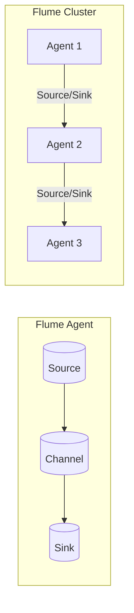

# Flume原理与代码实例讲解

## 1. 背景介绍

### 1.1 问题的由来

在当今大数据时代，数据的采集和传输是整个数据处理流程的关键环节。随着数据量的不断增长和数据源的多样化,传统的日志收集方式已经无法满足现代分布式系统的需求。因此,需要一种高效、可靠、灵活的数据采集和传输工具,来确保数据的实时性和完整性。

Apache Flume 应运而生,它是一个分布式、可靠、高可用的海量日志采集、聚合和传输的系统,旨在高效地收集、聚合和移动大量的日志数据。Flume 可以从不同的数据源采集数据,经过简单的处理后,将数据传输到不同的目的地,如 HDFS、HBase、Solr 等。

### 1.2 研究现状

Apache Flume 作为流行的日志采集系统,已经在许多大型互联网公司和企业中广泛使用,如 Facebook、Twitter、Yahoo 等。同时,也有许多研究机构和个人对 Flume 进行了深入的研究和探索,提出了一些改进方案和最佳实践。

然而,由于 Flume 的复杂性和灵活性,很多初学者和开发人员在学习和使用 Flume 时仍然存在一些困难和疑问。因此,对 Flume 的原理、架构、配置和代码实现进行深入的解析和讲解,对于提高开发者的理解和应用能力是非常有必要的。

### 1.3 研究意义

本文旨在全面、深入地剖析 Apache Flume 的原理、架构和代码实现,帮助读者更好地理解和掌握 Flume 的工作机制和使用方法。通过对 Flume 核心概念、算法原理、数学模型、代码实例等方面的详细讲解,读者可以获得以下收获:

1. 深入理解 Flume 的设计思想和架构原理,掌握其工作流程和数据传输机制。
2. 掌握 Flume 的核心算法原理和数学模型,了解其背后的理论基础。
3. 通过代码实例和详细解释,熟悉 Flume 的实现细节和编程技巧。
4. 了解 Flume 在实际应用场景中的使用方式和最佳实践。
5. 获取 Flume 相关的学习资源、开发工具和论文推荐,拓展知识视野。
6. 把握 Flume 的未来发展趋势和面临的挑战,为后续的学习和实践做好准备。

### 1.4 本文结构

本文将从以下几个方面全面讲解 Apache Flume:

1. 背景介绍: 阐述 Flume 的由来、研究现状和研究意义。
2. 核心概念与联系: 介绍 Flume 的核心概念及其之间的关系。
3. 核心算法原理与具体操作步骤: 深入剖析 Flume 的核心算法原理,并详细讲解算法的具体操作步骤。
4. 数学模型和公式详细讲解与举例说明: 构建 Flume 相关的数学模型,推导公式,并通过案例分析加深理解。
5. 项目实践:代码实例和详细解释说明: 提供 Flume 的代码实例,并进行详细的解释和分析,帮助读者掌握实现细节。
6. 实际应用场景: 介绍 Flume 在实际场景中的应用,并展望未来的应用前景。
7. 工具和资源推荐: 推荐 Flume 相关的学习资源、开发工具、论文等,为读者提供进一步学习的途径。
8. 总结:未来发展趋势与挑战: 总结 Flume 的研究成果,展望未来的发展趋势,并分析可能面临的挑战。
9. 附录:常见问题与解答: 列出一些常见的问题并给出解答,帮助读者排除疑难。

## 2. 核心概念与联系

Apache Flume 是一个分布式、可靠、高可用的海量日志采集、聚合和传输的系统,它由多个组件协同工作,形成一个数据流水线。下面介绍 Flume 的核心概念及其之间的关系:

1. **Event(事件)**: Event 是 Flume 数据传输的基本单元,它由头部(Header)和负载体(Body)两部分组成。头部用于存储一些元数据,如时间戳、主机等;负载体则存储实际的数据内容,如日志信息。

2. **Source(源头)**: Source 是数据进入 Flume 的入口,它从外部数据源(如服务器日志文件、网络流量等)获取数据,并将其封装为 Event,然后将 Event 传递给 Channel。Flume 支持多种类型的 Source,如 Avro Source、Syslog Source 等。

3. **Channel(通道)**: Channel 是 Flume 的内存缓冲区,用于临时存储 Source 传递过来的 Event,并将 Event 传递给 Sink。Channel 可以缓解 Source 和 Sink 之间的速率不匹配问题,确保数据的可靠传输。Flume 提供了多种 Channel 实现,如 Memory Channel、File Channel 等。

4. **Sink(目的地)**: Sink 是 Flume 数据传输的出口,它从 Channel 中获取 Event,并将其传输到下一个目的地,如 HDFS、HBase、Kafka 等。Flume 支持多种类型的 Sink,如 HDFS Sink、Kafka Sink 等。

5. **Agent(代理)**: Agent 是 Flume 的基本单元,它由一个 Source、一个 Channel 和一个或多个 Sink 组成。Agent 负责从 Source 接收 Event,将其临时存储在 Channel 中,然后将 Event 传递给 Sink。

6. **Flume 集群**: 一个 Flume 集群由多个 Agent 组成,它们协同工作,形成一个完整的数据流水线。Agent 之间可以通过 Source 和 Sink 进行数据交换,实现数据的多级传输和聚合。

上图展示了 Flume 的核心概念及其之间的关系。一个 Flume Agent 由 Source、Channel 和 Sink 组成,Source 将数据源中的数据封装为 Event,并将 Event 传递给 Channel;Channel 则临时存储 Event,并将 Event 传递给 Sink;Sink 将 Event 传输到下一个目的地。多个 Agent 可以组成一个 Flume 集群,通过 Source 和 Sink 实现数据的多级传输和聚合。

## 3. 核心算法原理与具体操作步骤

### 3.1 算法原理概述

Apache Flume 的核心算法原理主要包括以下几个方面:

1. **事件驱动架构**: Flume 采用事件驱动架构,整个系统由事件(Event)驱动,各个组件通过生产和消费 Event 实现数据的采集和传输。

2. **流水线模型**: Flume 将数据采集和传输过程抽象为一个流水线模型,数据从 Source 进入,经过 Channel 缓冲,最终由 Sink 输出到目的地。

3. **可靠性机制**: Flume 通过多种机制保证数据传输的可靠性,如事务机制、故障转移机制、重试机制等。

4. **负载均衡和故障转移**: Flume 支持多个 Sink,可以实现负载均衡和故障转移,提高系统的可用性和容错能力。

5. **数据转换和拦截**: Flume 支持对数据进行转换和拦截,可以在数据传输过程中进行过滤、格式化等操作。

6. **可扩展性**: Flume 具有良好的可扩展性,可以通过添加新的 Source、Channel 和 Sink 来支持新的数据源和目的地。

### 3.2 算法步骤详解

Flume 的核心算法步骤可以概括为以下几个步骤:

1. **数据采集**:

   - Source 从外部数据源(如日志文件、网络流量等)采集数据。
   - Source 将采集到的数据封装为 Event,并将 Event 传递给 Channel。

2. **数据缓冲**:

   - Channel 接收来自 Source 的 Event,并将其临时存储在内存或磁盘中。
   - Channel 采用事务机制保证数据的可靠性,防止数据丢失或重复。

3. **数据传输**:

   - Sink 从 Channel 中获取 Event。
   - Sink 可以对 Event 进行转换或拦截操作。
   - Sink 将 Event 传输到下一个目的地,如 HDFS、HBase、Kafka 等。

4. **负载均衡和故障转移**:

   - 如果配置了多个 Sink,Flume 会根据负载均衡策略将 Event 分发给不同的 Sink。
   - 如果某个 Sink 发生故障,Flume 会自动将 Event 转移到其他可用的 Sink。

5. **重试机制**:

   - 如果数据传输失败,Flume 会根据重试策略进行重试。
   - 重试次数和重试间隔时间可配置。

6. **扩展性**:

   - Flume 支持添加新的 Source、Channel 和 Sink 组件,以支持新的数据源和目的地。
   - 用户可以根据需求开发自定义的 Source、Channel 和 Sink。

上述算法步骤保证了 Flume 能够高效、可靠地采集和传输海量数据,并具有良好的扩展性和容错能力。

### 3.3 算法优缺点

Flume 的核心算法具有以下优点:

1. **高效性**: 采用事件驱动架构和流水线模型,能够高效地采集和传输海量数据。

2. **可靠性**: 通过事务机制、故障转移机制和重试机制,保证数据传输的可靠性。

3. **高可用性**: 支持负载均衡和故障转移,提高系统的可用性和容错能力。

4. **灵活性**: 支持多种数据源和目的地,可以通过添加新的组件进行扩展。

5. **可扩展性**: 具有良好的可扩展性,可以通过添加新的 Agent 来扩展系统的处理能力。

但 Flume 的算法也存在一些缺点:

1. **复杂性**: Flume 的配置和部署相对复杂,需要一定的学习成本。

2. **实时性**: 虽然 Flume 能够实现近乎实时的数据传输,但仍存在一定的延迟。

3. **资源消耗**: Flume 需要一定的内存和磁盘空间来缓冲数据,资源消耗较高。

4. **单点故障**: 虽然 Flume 支持故障转移,但单个 Agent 仍可能存在单点故障的风险。

5. **数据安全性**: Flume 在数据传输过程中需要注意数据的安全性和隐私保护。

### 3.4 算法应用领域

Flume 的核心算法适用于以下领域:

1. **日志采集**: Flume 最初的设计目标就是用于采集和传输海量日志数据,如服务器日志、应用程序日志等。

2. **数据采集**: 除了日志数据,Flume 也可以用于采集其他类型的数据,如网络流量数据、传感器数据等。

3. **数据传输**: Flume 可以将采集到的数据传输到不同的目的地,如 HDFS、HBase、Kafka 等,为后续的数据处理和分析提供支持。

4. **数据集成**: Flume 可以作为数据集成平台的一部分,将来自不同源的数据采集并传输到统一的目的地。

5. **实时数据处理**: Flume 可以与其他大数据框架(如 Spark Streaming、Flink 等)结合,实现实时数据处理和分析。

6. **物联网数据采集**: Flume 可以用于采集和传输来自物联网设备的海量数据,为物联网数据分析提供支持。

总的来说,Flume 的核心算法适用于需要高效、可靠地采集和传输海量数据的场景,尤其是在大数据、物联网、实时数据处理等领