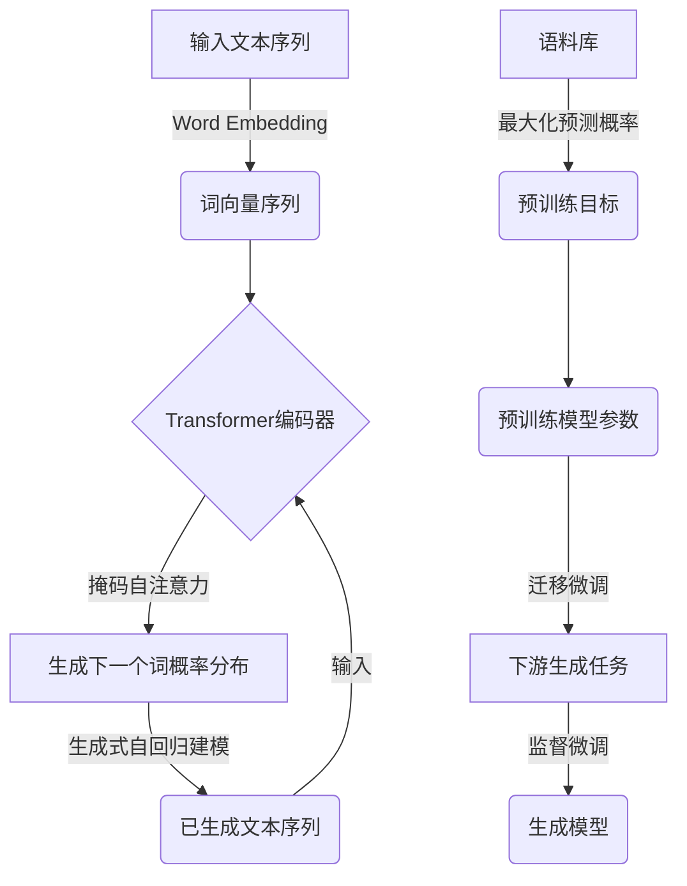

以下是对《GPT:生成式自回归模型》这一主题的技术博客文章:

# GPT:生成式自回归模型

## 1. 背景介绍

### 1.1 问题的由来

在自然语言处理(NLP)领域中,机器生成高质量、连贯的人类语言一直是一个巨大的挑战。传统的语言模型通常基于n-gram统计方法,只能捕捉局部的语义关联,难以生成长篇大论的流畅文本。而最近兴起的基于深度学习的语言模型,例如循环神经网络(RNN)和长短期记忆网络(LSTM),虽然在捕捉长程语义依赖方面有所改进,但仍然存在困难,并且在生成长文本时往往会出现前后矛盾、语义漂移等问题。

### 1.2 研究现状

为了解决上述问题,OpenAI于2018年提出了生成式预训练转移器(Generative Pre-trained Transformer,GPT)模型。GPT是第一个将自注意力(Self-Attention)机制应用于语言生成任务的大型预训练语言模型。它通过在大规模无标注语料上进行预训练,学习语言的深层次表示,从而获得强大的生成能力。GPT在多项自然语言生成任务上取得了卓越的表现,为自然语言生成领域带来了新的突破。

### 1.3 研究意义

GPT模型的提出不仅在技术层面上实现了突破,更重要的是它开启了大型预训练语言模型的新时代。GPT展示了通过自监督学习方式预训练大型语言模型,再将其迁移到下游任务的强大潜力。这种范式极大地推动了NLP技术的发展。此后,BERT、XLNet、RoBERTa等一系列基于Transformer的预训练语言模型相继问世,在各种NLP任务上取得了卓越的成绩,推动了整个NLP领域的飞速发展。

### 1.4 本文结构

本文将全面介绍GPT模型的核心概念、算法原理、数学模型、项目实践、应用场景等多个方面。内容安排如下:首先阐述GPT模型的核心概念和与其他模型的联系;其次深入解析GPT的算法原理和数学模型推导过程;然后通过实际代码实例讲解GPT的项目实践;接着探讨GPT在实际应用中的场景;最后总结GPT的发展趋势和面临的挑战。

## 2. 核心概念与联系

GPT模型的核心思想是利用Transformer的自注意力机制,对大规模无标注语料进行自监督预训练,获得通用的语言表示能力。预训练后的模型可以直接fine-tune到各种自然语言生成任务上,大幅减少了从头训练的数据需求和计算资源。

GPT的自注意力机制允许模型在生成每个新词时,直接关注到输入序列中的任何位置,捕捉长程依赖关系。与RNN/LSTM等顺序模型相比,这种并行计算方式更高效,也更易于学习复杂的语义模式。

另一个关键创新是GPT采用了全新的语言模型训练目标:给定前文,模型需要预测下一个词的概率分布。这种生成式自回归(Generative Auto-Regressive)建模方式,使得预训练目标与下游生成任务高度一致,大大提升了模型的迁移能力。

GPT的核心思想不仅影响了后续BERT等模型,也为通过无监督学习获取通用知识表示、再迁移到下游任务奠定了基础。这种预训练-微调范式已成为NLP领域的主流范式。

## 3. 核心算法原理与具体操作步骤

### 3.1 算法原理概述

GPT的核心算法是基于Transformer自注意力机制的生成式自回归语言模型。算法主要包括以下几个关键部分:

1. **输入表示**:将输入文本序列转化为词向量序列,作为Transformer的输入。

2. **Transformer编码器**:由多层自注意力和前馈网络组成,对输入进行编码,捕捉长程依赖关系。

3. **掩码自注意力**:在自注意力计算中,对未来位置的词向量进行掩码,确保每个位置的词只能关注之前的词,符合自回归语言模型的特点。

4. **生成式自回归建模**:最后一层是线性层和Softmax,输出下一个词的概率分布。模型根据已生成的部分,自回归地预测下一个词。

5. **预训练目标**:最大化语料库中所有位置的词的预测概率,通过自监督学习获取通用语言表示。

6. **微调阶段**:将预训练模型的参数迁移到下游生成任务,通过监督微调获得针对特定任务的语言生成模型。

### 3.2 算法步骤详解

1. **输入表示**:将输入文本序列 $X=\{x_1,x_2,...,x_n\}$ 通过词嵌入矩阵映射为词向量序列 $\{e(x_1),e(x_2),...,e(x_n)\}$。

2. **Transformer编码器**:词向量序列作为Transformer编码器的输入,经过 $N$ 层编码器层的自注意力和前馈网络变换,产生对应的上下文表示 $\{h_1,h_2,...,h_n\}$:

$$h_i=TransformerEncoder(e(x_1),...,e(x_n))$$

3. **掩码自注意力**:在自注意力计算中,对每个位置的词向量 $h_i$ 进行掩码,使其只能关注之前的词向量 $\{h_1,...,h_{i-1}\}$,符合自回归语言模型的特点。

4. **生成式自回归建模**:最后一层是线性层和Softmax,将上下文表示 $h_i$ 映射为下一个词 $x_{i+1}$ 的概率分布 $P(x_{i+1}|x_1,...,x_i)$:

$$P(x_{i+1}|x_1,...,x_i)=\text{softmax}(W_oh_i+b_o)$$

5. **预训练目标**:对语料库中所有位置的词的预测概率取对数求和作为目标函数,通过最大化目标函数进行自监督预训练:

$$\mathcal{L}=-\sum_{i=1}^n\log P(x_i|x_1,...,x_{i-1})$$

6. **微调阶段**:将预训练得到的模型参数迁移到下游生成任务,在有监督数据上进行微调,获得针对特定任务的语言生成模型。

### 3.3 算法优缺点

**优点**:

1. 自注意力机制能有效捕捉长程依赖,生成质量更好。
2. 预训练-微调范式大幅减少下游任务的数据需求。
3. 自回归建模目标与生成任务高度一致,迁移效果好。
4. 并行计算,训练和生成效率高。

**缺点**:

1. 训练数据量需求大,对计算资源要求高。
2. 生成速度较慢,每生成一个词都需要重新计算注意力。
3. 生成偏差累积问题,生成长文本容易语义漂移。
4. 无法有效利用双向上下文信息。

### 3.4 算法应用领域

GPT模型及其变体广泛应用于各种自然语言生成任务,包括:

- 文本生成:新闻、小说、诗歌、对话等长文本生成
- 机器翻译:将源语言文本翻译成目标语言
- 问答系统:根据问题上下文生成自然语言回答
- 文本摘要:自动生成文本的摘要
- 代码生成:根据需求描述生成程序代码
- 等等

总的来说,GPT模型家族为自然语言生成任务带来了革命性的突破,推动了整个NLP领域的发展。

## 4. 数学模型和公式详细讲解与举例说明

### 4.1 数学模型构建

GPT模型的数学模型基于生成式自回归语言模型和Transformer的自注意力机制。给定一个长度为 $n$ 的文本序列 $X=\{x_1,x_2,...,x_n\}$,目标是学习条件概率分布 $P(x_i|x_1,...,x_{i-1})$,即给定前 $i-1$ 个词,预测第 $i$ 个词的概率。

具体来说,GPT模型将输入序列 $X$ 映射为词向量序列 $\{e(x_1),e(x_2),...,e(x_n)\}$,然后通过 $N$ 层Transformer编码器层获得对应的上下文表示 $\{h_1,h_2,...,h_n\}$:

$$h_i=TransformerEncoder(e(x_1),...,e(x_n))$$

每一层Transformer编码器由多头自注意力(Multi-Head Attention)和前馈网络(Feed-Forward Network)组成。

在自注意力计算中,对每个位置 $i$ 的词向量 $h_i$ 进行掩码,使其只能关注之前的词向量 $\{h_1,...,h_{i-1}\}$,符合自回归语言模型的特点。

最后一层是线性层和Softmax,将上下文表示 $h_i$ 映射为下一个词 $x_{i+1}$ 的概率分布:

$$P(x_{i+1}|x_1,...,x_i)=\text{softmax}(W_oh_i+b_o)$$

其中 $W_o$ 和 $b_o$ 是可训练参数。

模型的目标是最大化语料库中所有位置的词的预测概率的对数似然:

$$\mathcal{L}=-\sum_{i=1}^n\log P(x_i|x_1,...,x_{i-1})$$

通过最大化目标函数 $\mathcal{L}$ 进行自监督预训练,获得通用的语言表示能力。

### 4.2 公式推导过程

以下是GPT模型中多头自注意力(Multi-Head Attention)的公式推导过程:

单头自注意力(Scaled Dot-Product Attention)定义为:

$$\text{Attention}(Q,K,V)=\text{softmax}(\frac{QK^T}{\sqrt{d_k}})V$$

其中 $Q$、$K$、$V$ 分别为 Query、Key 和 Value,它们都是通过线性映射从输入获得的; $d_k$ 是 Query 和 Key 向量的维度,用于对点积进行缩放,防止过大的值导致 softmax 函数梯度较小。

多头自注意力(Multi-Head Attention)的计算过程如下:

1. 线性映射将输入 $X$ 分别映射为 Query、Key 和 Value:

$$\begin{aligned}
Q &=XW_Q \\
K &=XW_K \\
V &=XW_V
\end{aligned}$$

其中 $W_Q$、$W_K$、$W_V$ 为可训练参数。

2. 将 $Q$、$K$、$V$ 分别分头(Split)成 $h$ 个头:

$$\begin{aligned}
Q &=\text{concat}(Q_1,Q_2,...,Q_h) \\
K &=\text{concat}(K_1,K_2,...,K_h) \\
V &=\text{concat}(V_1,V_2,...,V_h)
\end{aligned}$$

3. 对每个头进行缩放点积注意力计算:

$$\text{head}_i=\text{Attention}(Q_i,K_i,V_i)$$

4. 将所有头的结果拼接(Concat)后,再进行线性变换:

$$\text{MultiHead}(Q,K,V)=\text{concat}(\text{head}_1,...,\text{head}_h)W_O$$

其中 $W_O$ 为可训练参数。

通过多头自注意力,模型可以从不同的子空间捕捉不同的关注模式,提高了表达能力。

### 4.3 案例分析与讲解

以下是一个使用GPT模型生成文本的案例分析:

**输入提示**:
"在一个阳光明媚的日子,一位老人正在公园里..."

**模型输