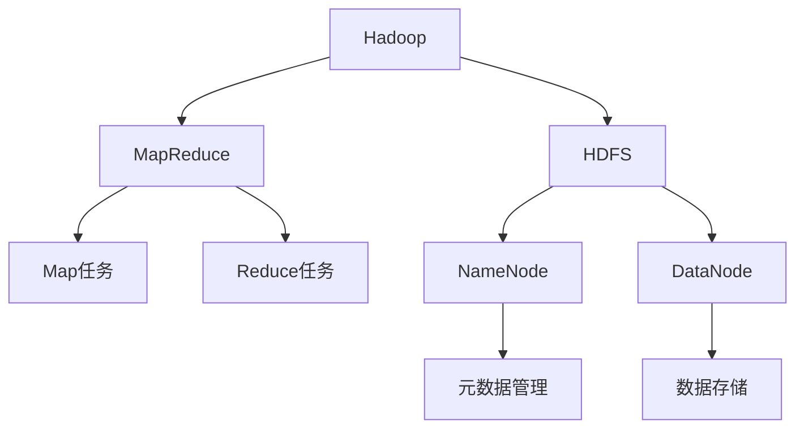
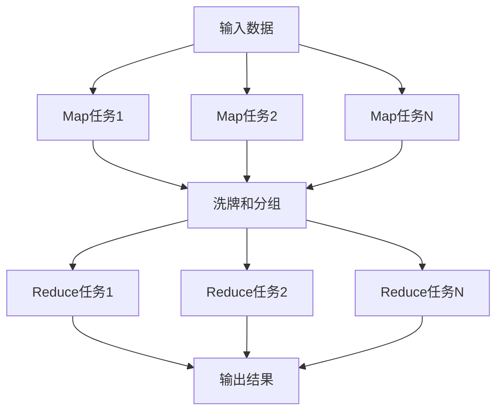

# Hadoop原理与代码实例讲解

## 1. 背景介绍

### 1.1 问题的由来

随着数据量的快速增长和多样化,传统的数据处理方式已经无法满足现代大数据应用的需求。大数据时代的到来,对于存储、管理和处理海量数据提出了新的挑战。在这种背景下,Hadoop作为一种分布式系统基础架构,应运而生。

### 1.2 研究现状  

Hadoop是Apache软件基金会的一个开源项目,最初由Doug Cutting等人领导开发。它借鉴了Google的MapReduce和Google File System(GFS)的思想,为大数据处理提供了一种可靠、高效的解决方案。目前,Hadoop已经成为大数据处理领域事实上的标准,被众多知名公司和组织广泛采用。

### 1.3 研究意义

掌握Hadoop的原理和实践技能,对于从事大数据相关工作至关重要。本文将深入探讨Hadoop的核心概念、架构设计、算法实现,并通过代码示例帮助读者更好地理解和运用Hadoop技术。

### 1.4 本文结构

本文首先介绍Hadoop的背景和核心概念,然后详细阐述MapReduce编程模型和HDFS分布式文件系统的原理和实现。接下来,我们将通过代码示例,解释如何开发和部署Hadoop应用程序。最后,我们将探讨Hadoop的实际应用场景、工具资源,并展望其未来发展趋势和挑战。

## 2. 核心概念与联系



Hadoop是一个开源的分布式系统基础架构,主要由两个核心组件构成:MapReduce和HDFS(Hadoop分布式文件系统)。

**MapReduce**是Hadoop的数据处理引擎,它将大规模并行计算分解为两个主要阶段:Map和Reduce。Map任务负责对输入数据进行过滤和转换,而Reduce任务则负责对Map输出的中间结果进行汇总和聚合。

**HDFS**是Hadoop的分布式文件系统,它为MapReduce提供了可靠的数据存储服务。HDFS由一个NameNode(名称节点)和多个DataNode(数据节点)组成。NameNode负责管理文件系统的元数据,而DataNode则负责实际存储数据块。

MapReduce和HDFS紧密协作,共同实现了大规模数据的高效处理和存储。MapReduce任务可以并行运行在多个节点上,充分利用集群的计算能力。同时,HDFS提供了高容错性和高吞吐量的数据存储服务,确保了数据的可靠性和可用性。

## 3. 核心算法原理 & 具体操作步骤  

### 3.1 算法原理概述

MapReduce编程模型的核心思想是将大规模计算任务拆分为两个阶段:Map和Reduce。

**Map阶段**:输入数据被分割成多个数据块,每个数据块由一个Map任务处理。Map任务将输入数据转换为一系列的键值对(key-value pairs),并输出中间结果。

**Reduce阶段**:MapReduce框架会对Map输出的中间结果进行洗牌和分组,将具有相同键的值集合传递给同一个Reduce任务。Reduce任务将这些值集合进行汇总或聚合操作,并输出最终结果。

### 3.2 算法步骤详解

1. **输入数据分割**:Hadoop将输入数据划分为固定大小的数据块(通常为64MB或128MB),并将这些数据块分发给不同的Map任务进行处理。

2. **Map任务执行**:每个Map任务读取一个数据块,对其进行解析和转换,生成键值对序列作为中间结果。中间结果会被临时存储在本地磁盘上。

3. **洗牌和分组**:MapReduce框架会对Map输出的中间结果进行洗牌(根据键对记录进行重新分组)和分组(将具有相同键的值集合在一起)操作。

4. **Reduce任务执行**:每个Reduce任务读取一个分组后的键值对集合,对值集合进行聚合或其他计算,并输出最终结果。

5. **输出结果收集**:MapReduce框架将Reduce任务的输出结果收集并写入HDFS。



### 3.3 算法优缺点

**优点**:

- 高度可扩展性:MapReduce可以在大规模集群上并行执行,充分利用计算资源。
- 高容错性:MapReduce能够自动处理任务失败和数据丢失等错误情况。
- 简单编程模型:MapReduce提供了简单的编程接口,开发人员只需关注Map和Reduce函数的实现。

**缺点**:

- 不适合实时计算:MapReduce更适合于批处理作业,对于需要低延迟的实时计算场景可能不太合适。
- 中间数据开销:MapReduce需要将中间结果写入磁盘,可能会导致额外的I/O开销。
- 迭代计算低效:对于需要多次迭代的算法,MapReduce可能会产生较高的开销。

### 3.4 算法应用领域

MapReduce编程模型适用于许多大数据处理场景,包括但不限于:

- 网页索引和搜索引擎
- 日志分析和数据挖掘
- 机器学习和数据分析
- 生物信息学和科学计算
- 图形处理和多媒体处理

## 4. 数学模型和公式 & 详细讲解 & 举例说明

### 4.1 数学模型构建

在MapReduce中,我们可以将计算任务建模为一个函数:

$$
f(input) = reduce(\bigcup_{i=1}^{n}map(input_i))
$$

其中:

- $input$是输入数据集
- $input_i$是输入数据集的第$i$个分区
- $map$是Map函数,将输入数据转换为中间键值对
- $reduce$是Reduce函数,对具有相同键的值集合进行聚合或其他操作

Map和Reduce函数的具体实现取决于应用程序的需求。

### 4.2 公式推导过程

我们可以将MapReduce计算过程表示为以下步骤:

1. 输入数据集$input$被划分为$n$个分区$\{input_1, input_2, \dots, input_n\}$。

2. 对每个分区$input_i$,执行Map函数:
   $$
   map(input_i) = \{(k_1, v_1), (k_2, v_2), \dots, (k_m, v_m)\}
   $$
   其中$(k_j, v_j)$是Map输出的键值对。

3. 对所有Map输出的键值对进行洗牌和分组,得到$\{(k_1, \{v_{11}, v_{12}, \dots\}), (k_2, \{v_{21}, v_{22}, \dots\}), \dots\}$。

4. 对每个键及其对应的值集合,执行Reduce函数:
   $$
   reduce(k_i, \{v_{i1}, v_{i2}, \dots\}) = output_i
   $$

5. 最终结果是所有Reduce输出的并集:
   $$
   f(input) = \bigcup_{i=1}^{n}output_i = reduce(\bigcup_{i=1}^{n}map(input_i))
   $$

### 4.3 案例分析与讲解

假设我们需要统计一个文本文件中每个单词出现的次数。我们可以将这个任务建模为MapReduce作业:

**Map函数**:

```python
def map(line):
    words = line.split()
    for word in words:
        yield (word, 1)
```

Map函数将每一行文本拆分为单词,并为每个单词输出一个(word, 1)的键值对。

**Reduce函数**:

```python
def reduce(word, counts):
    total = sum(counts)
    yield (word, total)
```

Reduce函数将具有相同单词的计数值求和,输出(word, total_count)作为最终结果。

通过执行MapReduce作业,我们可以得到每个单词在文件中出现的总次数。

### 4.4 常见问题解答

**Q: MapReduce是否适合实时计算?**

A: MapReduce更适合于批处理作业,而不是实时计算。由于MapReduce需要将中间结果写入磁盘,并进行洗牌和分组操作,因此会引入一定的延迟。对于需要低延迟的实时计算场景,可以考虑使用其他大数据处理框架,如Apache Spark或Apache Flink。

**Q: 如何优化MapReduce作业的性能?**

A: 优化MapReduce作业性能的一些技巧包括:

- 减少不必要的数据传输和I/O操作
- 合理设置Map和Reduce任务的数量
- 利用数据本地性原则,将计算任务调度到存储数据的节点上
- 使用合适的数据压缩方式
- 优化Map和Reduce函数的实现,避免不必要的计算

**Q: MapReduce是否支持迭代计算?**

A: MapReduce本身不太适合迭代计算,因为每次迭代都需要重新启动MapReduce作业,会产生较高的开销。对于需要多次迭代的算法,可以考虑使用Apache Spark等支持迭代计算的框架。

## 5. 项目实践:代码实例和详细解释说明

### 5.1 开发环境搭建

在开始编写Hadoop MapReduce程序之前,我们需要先设置开发环境。以下是主要步骤:

1. 安装Java开发环境(JDK)。
2. 下载并解压Hadoop发行版。
3. 配置Hadoop环境变量。
4. 启动Hadoop集群(包括HDFS和YARN)。

对于单机开发和测试,我们可以使用Hadoop的伪分布式模式。在这种模式下,HDFS和YARN都运行在本地机器上。

### 5.2 源代码详细实现

下面是一个WordCount示例程序,用于统计文本文件中每个单词出现的次数。

**WordCount.java**

```java
import java.io.IOException;
import java.util.StringTokenizer;

import org.apache.hadoop.conf.Configuration;
import org.apache.hadoop.fs.Path;
import org.apache.hadoop.io.IntWritable;
import org.apache.hadoop.io.Text;
import org.apache.hadoop.mapreduce.Job;
import org.apache.hadoop.mapreduce.Mapper;
import org.apache.hadoop.mapreduce.Reducer;
import org.apache.hadoop.mapreduce.lib.input.FileInputFormat;
import org.apache.hadoop.mapreduce.lib.output.FileOutputFormat;

public class WordCount {

    public static class TokenizerMapper
            extends Mapper<Object, Text, Text, IntWritable> {

        private final static IntWritable one = new IntWritable(1);
        private Text word = new Text();

        public void map(Object key, Text value, Context context)
                throws IOException, InterruptedException {
            StringTokenizer itr = new StringTokenizer(value.toString());
            while (itr.hasMoreTokens()) {
                word.set(itr.nextToken());
                context.write(word, one);
            }
        }
    }

    public static class IntSumReducer
            extends Reducer<Text, IntWritable, Text, IntWritable> {
        private IntWritable result = new IntWritable();

        public void reduce(Text key, Iterable<IntWritable> values,
                           Context context)
            throws IOException, InterruptedException {
            int sum = 0;
            for (IntWritable val : values) {
                sum += val.get();
            }
            result.set(sum);
            context.write(key, result);
        }
    }

    public static void main(String[] args) throws Exception {
        Configuration conf = new Configuration();
        Job job = Job.getInstance(conf, "word count");
        job.setJarByClass(WordCount.class);
        job.setMapperClass(TokenizerMapper.class);
        job.setCombinerClass(IntSumReducer.class);
        job.setReducerClass(IntSumReducer.class);
        job.setOutputKeyClass(Text.class);
        job.setOutputValueClass(IntWritable.class);
        FileInputFormat.addInputPath(job, new Path(args[0]));
        FileOutputFormat.setOutputPath(job, new Path(args[1]));
        System.exit(job.waitForCompletion(true) ? 0 : 1);
    }
}
```

**代码解读**:

1. `TokenizerMapper`是Map类的实现,它将输入文本拆分为单词,并