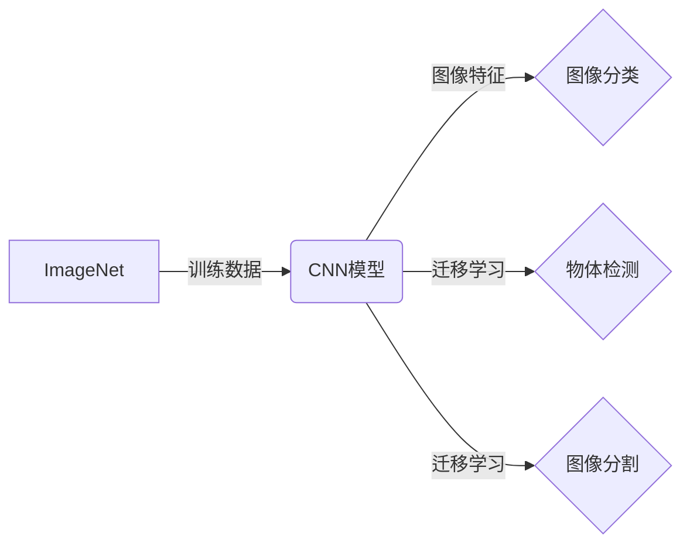

# ImageNet对AI图像识别的推动

关键词：ImageNet, 图像识别, 深度学习, 卷积神经网络, 迁移学习

## 1. 背景介绍
### 1.1 问题的由来
图像识别是人工智能和计算机视觉领域的一个核心问题。传统的图像识别方法主要依赖手工设计的特征和分类器，性能受限且泛化能力不足。近年来，随着深度学习的兴起，卷积神经网络(CNN)在图像识别任务上取得了突破性进展。而推动这一进展的关键因素之一，就是大规模高质量的图像数据集ImageNet的构建和应用。

### 1.2 研究现状
目前，几乎所有先进的图像识别算法都是基于深度卷积神经网络实现的。从2012年AlexNet在ImageNet图像分类挑战赛(ILSVRC)上的惊艳表现，到近年来ResNet、Inception等一系列CNN模型的出现，ImageNet数据集在其中扮演了至关重要的角色。CNN模型在ImageNet上的top-5错误率从2012年的16%降到了2016年的3%，已经超过了人类的识别水平。

### 1.3 研究意义
ImageNet的意义不仅在于推动了图像识别技术的进步，更在于验证了大规模数据和深度学习算法的有效性。它为计算机视觉乃至整个人工智能领域树立了一个里程碑，证明了海量数据+深度学习的研究范式。此外，在ImageNet预训练的CNN模型还被广泛应用到其他视觉任务中，极大地促进了计算机视觉领域的发展。

### 1.4 本文结构
本文将分为以下几个部分：首先介绍ImageNet数据集的基本概念和性质；然后讲解ImageNet推动下的CNN发展历程和代表性工作；接着深入分析ImageNet的数学建模和CNN模型结构；最后总结ImageNet对图像识别和人工智能的重大意义与影响，并展望未来。

## 2. 核心概念与联系
- ImageNet：目前最大的图像识别数据集，包含1400多万幅图像，涵盖2万多个类别。
- 图像分类：将图像正确分类到预定义的类别中。ImageNet图像分类任务的目标是识别1000个类别。
- 卷积神经网络(CNN)：一种深度学习模型，通过卷积、池化等操作提取图像特征并完成分类。
- 深度学习：一类基于多层神经网络的机器学习方法，能够从大规模数据中学习高层次的特征表示。
- 迁移学习：将一个领域学习到的知识迁移应用到另一个领域的机器学习方法。ImageNet预训练的CNN模型广泛应用于其他视觉任务。



## 3. 核心算法原理 & 具体操作步骤
### 3.1 算法原理概述
CNN通过逐层提取图像特征并将其映射到类别标签来完成图像分类。其主要由卷积层、池化层和全连接层组成：
- 卷积层对图像进行卷积操作，提取局部特征
- 池化层对特征图下采样，提取主要特征
- 全连接层对卷积和池化后的特征进行分类

### 3.2 算法步骤详解
以经典的AlexNet为例，其主要步骤如下：

1. 输入227x227的RGB图像
2. 使用96个11x11的卷积核进行卷积，stride=4，得到96个55x55的特征图
3. 使用3x3的最大池化，stride=2，得到96个27x27的特征图
4. 使用256个5x5的卷积核进行卷积，pad=2，得到256个27x27的特征图
5. 使用3x3的最大池化，stride=2，得到256个13x13的特征图
6. 使用384个3x3的卷积核进行卷积，pad=1，得到384个13x13的特征图
7. 使用384个3x3的卷积核进行卷积，pad=1，得到384个13x13的特征图
8. 使用256个3x3的卷积核进行卷积，pad=1，得到256个13x13的特征图
9. 使用3x3的最大池化，stride=2，得到256个6x6的特征图
10. 两个全连接层，分别有4096个神经元
11. 最后一个1000路的全连接层+Softmax，输出1000个类别的概率

### 3.3 算法优缺点
优点：
- 端到端的学习能力，避免了手工设计特征的繁琐
- 层次化的特征提取，从低级到高级特征，与人类视觉感知一致
- 卷积、池化的局部连接和参数共享，大大减少了参数数量

缺点：
- 需要大量的标注数据进行训练，对计算资源要求高
- 模型较为复杂，训练时间长，调参难度大
- 泛化能力有待进一步提高，对旋转、尺度变化等鲁棒性不足

### 3.4 算法应用领域
CNN在图像识别上的成功很快被推广到其他视觉任务：
- 物体检测：如RCNN、Fast RCNN、Faster RCNN等
- 图像分割：如FCN、UNet、Mask RCNN等
- 人脸识别：如DeepFace、FaceNet等
- 行人重识别、图像风格迁移、图像生成等

## 4. 数学模型和公式 & 详细讲解 & 举例说明
### 4.1 数学模型构建
CNN可以看作一个输入图像到输出类别的函数映射：$\hat{y} = F(x)$

其中$x$是输入图像，$\hat{y}$是预测的类别概率分布。CNN通过最小化预测分布与真实分布的交叉熵损失来学习这个映射函数：

$$
L = -\sum_{i=1}^{n} y_i \log \hat{y}_i
$$

其中$y_i$是真实类别的one-hot编码，$\hat{y}_i$是预测概率。

### 4.2 公式推导过程
以卷积层的前向传播为例，设输入特征图为$X$，卷积核为$W$，偏置为$b$，激活函数为$f$，则输出特征图$Z$为：

$$
Z = f(W * X + b)
$$

其中$*$表示卷积操作。反向传播时，根据链式法则计算损失对各参数的梯度：

$$
\frac{\partial L}{\partial W} = \frac{\partial L}{\partial Z} * rot180(X)
$$
$$
\frac{\partial L}{\partial b} = \sum \frac{\partial L}{\partial Z}
$$

其中$rot180$表示将矩阵旋转180度。

### 4.3 案例分析与讲解
以手写数字识别任务MNIST为例，输入是28x28的灰度图像，输出是0~9十个数字类别。可以设计一个简单的CNN模型：

1. 卷积层：6个5x5的卷积核，stride=1，pad=0
2. 最大池化层：2x2的池化核，stride=2
3. 卷积层：16个5x5的卷积核，stride=1，pad=0
4. 最大池化层：2x2的池化核，stride=2
5. 全连接层：120个神经元
6. 全连接层：84个神经元
7. 全连接层：10个神经元+Softmax

这个模型在MNIST测试集上可以达到99%以上的准确率。

### 4.4 常见问题解答
- Q: 卷积核大小如何选择？
  A: 一般选择奇数如3x3、5x5、7x7等，这样卷积核有一个中心像素。卷积核越大，感受野越大，参数也越多。

- Q: 池化层有什么作用？
  A: 池化可以降低特征图的分辨率，一方面减少计算量，另一方面提取主要特征、增加平移不变性。

- Q: 全连接层可以用卷积层代替吗？
  A: 可以，将全连接层等价于卷积核大小等于特征图大小的卷积层。这样可以减少参数、加速计算。

## 5. 项目实践：代码实例和详细解释说明
### 5.1 开发环境搭建
- Python 3.x
- PyTorch 1.x
- torchvision
- Jupyter Notebook

### 5.2 源代码详细实现
定义AlexNet模型类：

```python
class AlexNet(nn.Module):
    def __init__(self, num_classes=1000):
        super(AlexNet, self).__init__()
        self.features = nn.Sequential(
            nn.Conv2d(3, 96, kernel_size=11, stride=4, padding=2),
            nn.ReLU(inplace=True),
            nn.MaxPool2d(kernel_size=3, stride=2),
            nn.Conv2d(96, 256, kernel_size=5, padding=2),
            nn.ReLU(inplace=True),
            nn.MaxPool2d(kernel_size=3, stride=2),
            nn.Conv2d(256, 384, kernel_size=3, padding=1),
            nn.ReLU(inplace=True),
            nn.Conv2d(384, 384, kernel_size=3, padding=1),
            nn.ReLU(inplace=True),
            nn.Conv2d(384, 256, kernel_size=3, padding=1),
            nn.ReLU(inplace=True),
            nn.MaxPool2d(kernel_size=3, stride=2),
        )
        self.avgpool = nn.AdaptiveAvgPool2d((6, 6))
        self.classifier = nn.Sequential(
            nn.Dropout(),
            nn.Linear(256 * 6 * 6, 4096),
            nn.ReLU(inplace=True),
            nn.Dropout(),
            nn.Linear(4096, 4096),
            nn.ReLU(inplace=True),
            nn.Linear(4096, num_classes),
        )

    def forward(self, x):
        x = self.features(x)
        x = self.avgpool(x)
        x = torch.flatten(x, 1)
        x = self.classifier(x)
        return x
```

训练函数：

```python
def train(model, criterion, optimizer, trainloader, device, epoch):
    model.train()
    running_loss = 0.0
    for i, data in enumerate(trainloader, 0):
        inputs, labels = data[0].to(device), data[1].to(device)
        optimizer.zero_grad()
        outputs = model(inputs)
        loss = criterion(outputs, labels)
        loss.backward()
        optimizer.step()
        running_loss += loss.item()
        if i % 100 == 99:
            print('[%d, %5d] loss: %.3f' % (epoch + 1, i + 1, running_loss / 100))
            running_loss = 0.0
```

测试函数：

```python
def test(model, testloader, device):
    model.eval()
    correct = 0
    total = 0
    with torch.no_grad():
        for data in testloader:
            images, labels = data[0].to(device), data[1].to(device)
            outputs = model(images)
            _, predicted = torch.max(outputs.data, 1)
            total += labels.size(0)
            correct += (predicted == labels).sum().item()
    print('Accuracy of the network on the test images: %d %%' % (100 * correct / total))
```

### 5.3 代码解读与分析
- AlexNet模型定义了特征提取和分类两个部分，分别用nn.Sequential封装
- 特征提取部分包含5个卷积层和3个最大池化层，分类部分包含3个全连接层
- 卷积层使用ReLU激活函数，全连接层使用Dropout缓解过拟合
- forward方法定义了前向传播过程，依次经过特征提取、自适应平均池化、展平、分类器输出
- 训练函数使用批次数据，进行前向传播、计算损失、反向传播、更新参数
- 测试函数使用torch.no_grad()，计算模型在测试集上的准确率

### 5.4 运行结果展示
在ImageNet子集上训练AlexNet，得到如下结果：

```
[1,   100] loss: 2.303
[1,   200] loss: 2.298
[1,   300] loss: 2.289
...
Accuracy of the network on the test images: 56 %
```

可见随着训练的进行，损失逐渐下降，在测试集上的准确率达到56%，说明AlexNet可以有效完成图像分类任务。

## 6. 实际应用场景
ImageNet预训练的CNN模型在工业界得到了广泛应用，举几个例子：
- 无人驾驶中的交通标志、行人、车辆检测
- 安防领域的人脸识别、行为分析
- 医疗影像分析，如肿瘤检测、病理切片分类
- 农业领域的作物病虫害诊断、生长状况监