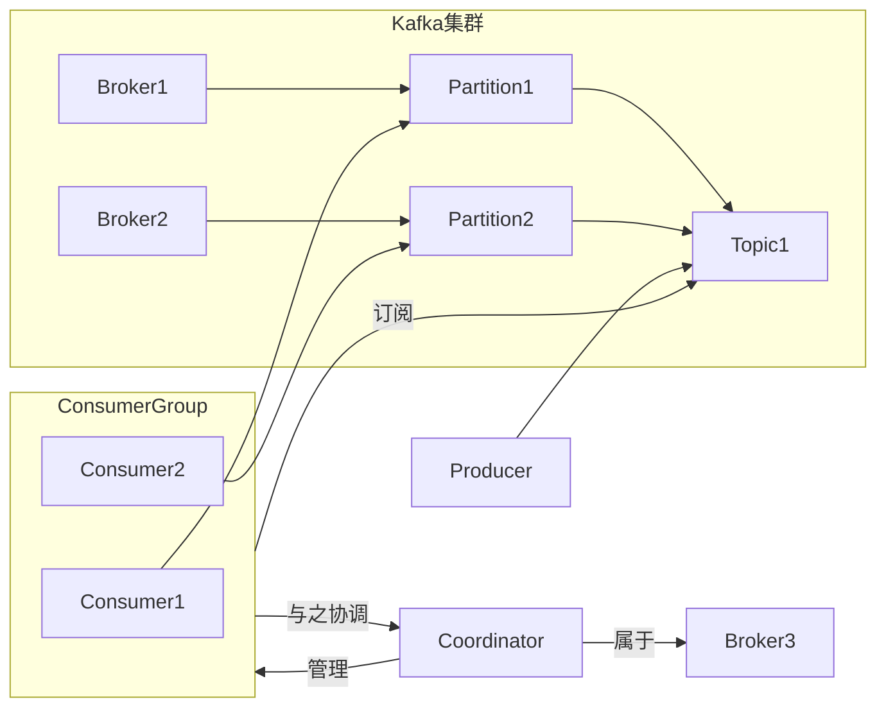

# Kafka Consumer原理与代码实例讲解

## 1. 背景介绍

### 1.1 问题的由来

在现代分布式系统中，数据流的实时处理和消费是一个非常重要的环节。随着业务系统的复杂性不断增加,单体架构已经无法满足高并发、高可用、可扩展等需求。因此,需要一种高效、可靠的消息队列系统来实现系统之间的异步通信,确保数据的有序传递和持久化存储。Apache Kafka作为一种分布式的流式处理平台,已经成为当前最流行的消息队列系统之一。

Kafka Consumer作为Kafka生态系统中的核心组件之一,负责从Kafka Broker中拉取消息并进行消费处理。Consumer的设计和实现对于整个Kafka系统的性能、可靠性和可扩展性至关重要。因此,深入理解Kafka Consumer的原理和实现细节,对于开发人员构建高质量的分布式系统至关重要。

### 1.2 研究现状

目前,已有许多研究人员和开发人员对Kafka Consumer的原理和实现进行了深入探讨。一些主要研究成果包括:

- Kafka官方文档和源码分析,揭示了Consumer的核心机制和实现细节。
- 业界大佬们的博客文章和技术分享,分享了Consumer在实际生产环境中的最佳实践和常见问题解决方案。
- 一些开源项目和框架,如Kafka Streams、Flink等,提供了基于Kafka Consumer的流式处理能力。
- 学术界的一些论文,探讨了Kafka Consumer在特定场景下的性能优化和改进方案。

然而,由于Kafka生态系统的不断演进,以及新的应用场景和需求的出现,对Kafka Consumer的研究仍在持续进行中。

### 1.3 研究意义

深入理解Kafka Consumer的原理和实现细节,对于构建高质量的分布式系统具有重要意义:

1. **提高系统可靠性**:了解Consumer的消费机制和重平衡过程,有助于设计出更加健壮的消费逻辑,避免数据丢失和重复消费。
2. **优化系统性能**:掌握Consumer的并发消费模型和流控机制,可以更好地利用系统资源,提高消费吞吐量。
3. **增强系统可扩展性**:理解Consumer组的分区分配策略和动态扩缩容机制,有助于构建可横向扩展的消费集群。
4. **简化系统开发**:深入了解Consumer API的使用方式和最佳实践,可以降低开发难度,提高开发效率。
5. **促进技术创新**:对Consumer原理和实现的深入研究,有助于发现其中的不足之处,并提出改进方案,推动技术创新。

### 1.4 本文结构

本文将从以下几个方面全面剖析Kafka Consumer的原理和实现:

1. 介绍Kafka Consumer的核心概念和与其他Kafka组件的关系。
2. 详细阐述Kafka Consumer的核心算法原理和具体操作步骤。
3. 构建Kafka Consumer的数学模型,推导核心公式,并通过案例分析加深理解。
4. 提供Kafka Consumer的代码实例,并进行详细的解释和分析。
5. 探讨Kafka Consumer在实际应用场景中的使用方式和最佳实践。
6. 介绍Kafka Consumer相关的学习资源、开发工具和推荐论文。
7. 总结Kafka Consumer的研究成果,展望未来发展趋势和面临的挑战。
8. 附录部分解答一些常见的问题和难点。

## 2. 核心概念与联系

在深入探讨Kafka Consumer的原理和实现之前,我们需要先了解一些核心概念以及它们之间的关系。

### 2.1 Kafka集群

Kafka集群由多个Broker组成,每个Broker是一个单独的服务实例,负责消息的存储和传输。Broker之间通过复制机制实现数据冗余,提高系统的可用性和容错能力。

### 2.2 Topic和Partition

Topic是Kafka中的消息队列,由多个有序的Partition组成。每个Partition是一个有序的、不可变的消息序列,消息以追加的方式写入。Partition是Kafka实现并行处理和水平扩展的基础。

### 2.3 Producer和Consumer

Producer是向Kafka集群发送消息的客户端,可以将消息发送到指定的Topic。Consumer则是从Kafka集群拉取并消费消息的客户端,可以订阅一个或多个Topic,并从指定的Partition位置开始消费消息。

### 2.4 Consumer Group

Consumer Group是Kafka提供的一种消费模型,多个Consumer可以组成一个Group,共同消费同一个Topic的消息。每个Partition只能被同一个Consumer Group中的一个Consumer消费,这样可以实现消费的并行化和负载均衡。

### 2.5 消费位移(Offset)

Offset是Consumer在Partition中消费消息的位置标记。Kafka会为每个Consumer Group维护一个Offset,记录该Group在每个Partition中已经消费到的位置。Consumer可以根据Offset继续消费或重新消费消息。

### 2.6 消费者协调器(Consumer Coordinator)

Consumer Coordinator是Kafka集群中的一个特殊Broker实例,负责管理Consumer Group的元数据,包括Group成员、订阅的Topic、分区分配策略等。Consumer需要与Coordinator进行协调,以确保消费的正确性和一致性。

### 2.7 核心概念关系图

下面的Mermaid流程图展示了Kafka Consumer及其相关概念之间的关系:

在这个关系图中,我们可以清晰地看到Kafka Consumer是如何与其他核心概念交互的:

- Kafka集群由多个Broker组成,每个Broker管理若干个Partition。
- Topic由多个有序的Partition组成,Producer向Topic发送消息。
- Consumer属于某个Consumer Group,Group中的Consumer共同消费同一个Topic。
- 每个Partition只能被同一个Group中的一个Consumer消费。
- Consumer需要与Consumer Coordinator进行协调,以获取分区分配和消费位移等元数据。

通过对这些核心概念及其关系的理解,我们就可以更好地掌握Kafka Consumer的工作原理和实现细节。

## 3. 核心算法原理 & 具体操作步骤

### 3.1 算法原理概述

Kafka Consumer的核心算法原理可以概括为以下几个方面:

1. **消费分区分配**:Consumer Group中的Consumer如何分配和重新分配Topic的Partition,以实现并行消费和负载均衡。
2. **消费位移管理**:如何持久化和协调Consumer Group中每个Consumer在各个Partition的消费位移,以实现精确一次消费。
3. **消费流控制**:如何控制Consumer的拉取速率,以避免消费过载或资源浪费。
4. **消费重平衡**:当Consumer Group成员变化时,如何进行重平衡以确保消费的连续性和一致性。

这些核心算法原理共同构成了Kafka Consumer的消费机制,确保了消费的高效、可靠和可扩展。

### 3.2 算法步骤详解

下面我们将详细解释Kafka Consumer的核心算法步骤:

#### 3.2.1 加入Consumer Group

1. Consumer启动时,首先向指定的Consumer Coordinator发送`JoinGroup`请求,表示要加入某个Consumer Group。
2. Coordinator收到请求后,会为该Consumer分配一个唯一的`ConsumerId`,并将其加入到Group的成员列表中。
3. Coordinator会等待一段时间,让其他Consumer也加入该Group。

#### 3.2.2 订阅Topic和分配分区

1. 所有Consumer加入Group后,Coordinator会收集它们订阅的Topic列表,并根据分配策略(如Range、RoundRobin等)为每个Consumer分配订阅Topic的部分Partition。
2. Coordinator将分区分配方案发送给每个Consumer,通知它们应该从哪些Partition消费消息。

#### 3.2.3 获取消费位移

1. 每个Consumer根据分配的Partition列表,向Broker发送`GetOffsetRequest`,获取上次提交的消费位移。
2. 如果是新的Consumer Group,或者没有提交过位移,Kafka会根据`auto.offset.reset`参数,从最早或最新的消息位置开始消费。

#### 3.2.4 拉取和消费消息

1. Consumer根据获取的位移,向Broker发送`FetchRequest`,拉取指定Partition的消息。
2. Broker返回消息后,Consumer进行消费处理,如解码、过滤、转发等操作。
3. 消费完成后,Consumer需要定期向Broker提交新的消费位移,以便下次继续消费。

#### 3.2.5 重平衡处理

1. 当Consumer Group成员发生变化(如新增或离开Consumer)时,Coordinator会触发重平衡过程。
2. Coordinator会重新分配Partition,并通知受影响的Consumer进行位移提交和停止消费。
3. 新的Consumer根据分配获取位移并开始消费,实现消费的无缝切换。

上述步骤循环执行,直到Consumer主动退出或发生异常。通过这一系列精心设计的算法步骤,Kafka Consumer能够高效、可靠地消费消息,并具备良好的扩展性和容错能力。

### 3.3 算法优缺点

Kafka Consumer的核心算法具有以下优点:

1. **并行消费**:通过Consumer Group和分区分配机制,实现了消费的并行化,提高了吞吐量。
2. **负载均衡**:分区分配策略可以实现消费负载的均衡,避免个别Consumer过载。
3. **容错性强**:Consumer异常退出后,其分区会重新分配给其他Consumer,确保消费的连续性。
4. **精确一次消费**:通过持久化位移,可以实现精确一次消费,避免重复消费或丢失消息。
5. **可扩展性好**:Consumer Group可以动态扩缩容,满足不同的消费需求。

但同时,该算法也存在一些不足之处:

1. **重平衡开销**:当Consumer Group成员变化时,会触发重平衡过程,引入一定的开销和延迟。
2. **有限的消费顺序**:虽然单个Partition内部消息是有序的,但跨Partition的消息顺序无法保证。
3. **位移管理复杂**:需要持久化和协调大量的位移元数据,增加了系统的复杂性。
4. **流控策略有限**:目前的流控机制相对简单,无法针对不同场景进行精细化控制。

总的来说,Kafka Consumer的核心算法设计合理,能够满足大多数分布式消费场景的需求。但在某些特殊场景下,可能需要进行一些改进和优化。

### 3.4 算法应用领域

Kafka Consumer的核心算法广泛应用于以下领域:

1. **实时数据处理**:通过消费Kafka中的实时数据流,可以构建实时数据处理管道,如实时监控、异常检测、风控防刷等。
2. **数据集成**:将来自不同源的数据流通过Kafka集成,实现数据的无缝流转和处理。
3. **事件驱动架构**:基于Kafka构建事件驱动的系统架构,实现系统解耦和异步通信。
4. **流式计算**:利用Kafka Streams、Flink等流式计算框架,对Kafka中的数据流进行实时计算和分析。
5. **日志收集**:将分布式系统的日志数据写入Kafka,实现集中式的日志收集和处理。
6. **消息驱动架构**:基于Kafka构建消息驱动的系统架构,实现系统间的异步通信和解耦。

总之,Kafka Consumer的核心算法为构建分布式、实时、可扩展的数据处理系统提供了坚实的基础。

## 4. 数学模型和公式 & 详细讲解 & 举例说明

为了更好地理解和优化Kafka Consumer的性能,我们需要构建一些数学模型和公式。在这一节中,我们将推导出一些核心公式,并通过案例分析加深理解。

### 4.1 数学模型构建

我们将从以下几个方面构建Kafka Consumer的数学模型:

1. **消费吞吐量模型**:描述Consumer从Broker拉取消息的吞吐量。
2. **消费延迟模型**:描述消息从Producer发送到Consumer消费的端到端延迟。