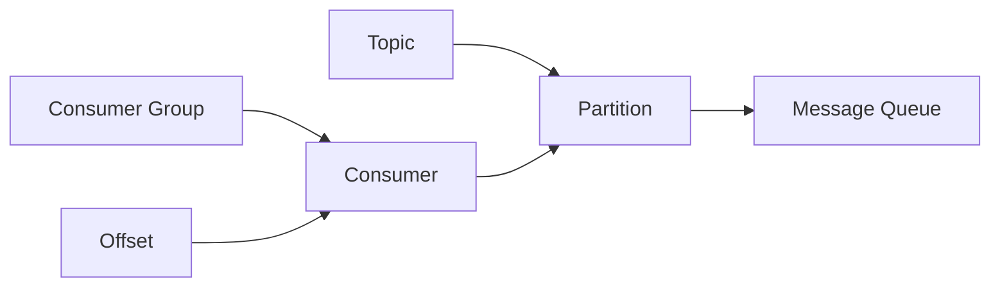

# Kafka Offset原理与代码实例讲解

## 1. 背景介绍
### 1.1 问题的由来
在大数据时代，数据的实时处理和分析变得越来越重要。Kafka作为一个分布式的流处理平台，在实时数据处理领域扮演着举足轻重的角色。而Kafka中的offset机制是保证数据不丢失、不重复消费的关键。深入理解Kafka offset的原理，对于开发高质量的流处理应用至关重要。

### 1.2 研究现状
目前业界对Kafka的研究较多，但大多集中在Kafka的整体架构、使用方法等方面。而对于Kafka中offset的原理和实现，研究相对较少，现有的资料也不够深入和系统。这导致很多开发者在使用Kafka时，对offset的理解比较肤浅，难以开发出健壮的流处理应用。

### 1.3 研究意义
深入研究Kafka offset的原理和实现，有助于开发者加深对Kafka内部机制的理解，提高开发Kafka应用的能力。同时，对offset机制的深入理解，也有助于我们设计和优化自己的流处理架构，提高系统的可靠性和性能。

### 1.4 本文结构
本文将从以下几个方面对Kafka offset进行深入探讨：

1. Kafka offset的核心概念和作用
2. Offset的存储方式和同步机制  
3. 消费者组的rebalance过程和offset的处理
4. 自定义offset管理的方法和代码实例
5. Offset在实际项目中的最佳实践
6. 总结Kafka offset的特点和未来的发展方向

## 2. 核心概念与联系

在Kafka中，offset是用来记录消费者消费进度的一个关键概念。每个消费者都有自己的offset，表示它当前消费到了partition的哪个位置。Offset可以看作是一个不断递增的整数，随着消息的消费而不断前进。

Offset与以下几个概念紧密相关：

- Topic：Kafka中的消息都由发布到topic中，每个topic可以有多个partition。
- Partition：Topic的分区，一个topic可以分为多个partition，提高并行度。每个partition内部是一个有序的消息队列。
- Consumer Group：多个消费者实例可以组成一个消费者组，同一个消费者组里的消费者协调消费topic的所有partition，并且每个partition只能被一个消费者消费。
- Rebalance：当消费者组内的成员发生变更（有消费者加入或退出）时，就会触发rebalance，重新分配partition的消费权。rebalance过程中会处理offset的同步。

下图展示了Kafka offset相关概念之间的关系：



从图中可以看出，offset是与消费者实例绑定的，用于记录该消费者在每个partition上的消费进度。Partition保存了实际的消息队列，而消费者组协调多个消费者实例对partition的消费。

## 3. 核心算法原理 & 具体操作步骤
### 3.1 算法原理概述
Kafka中offset的管理涉及到几个关键算法和步骤，主要包括：

1. Offset的存储：Kafka把offset保存在内部的topic `__consumer_offsets`中，以(group, topic, partition)作为key，offset作为value。
2. Offset的更新：消费者在消费完一条消息后，立即更新内存中的offset。但并不是每次都将offset同步到Kafka，而是根据一定的策略定期同步。
3. Offset的同步：有两种方式，一种是自动提交，一种是手动提交。自动提交会按照固定的时间间隔将offset同步到Kafka；而手动提交由应用程序自己控制同步时机。
4. Rebalance时的offset处理：Rebalance时，Coordinator会将partition的消费权重新分配给消费者，并将offset同步到Kafka，然后消费者从之前提交的offset位置继续消费。

### 3.2 算法步骤详解

1. 消费者启动后，先去Kafka的`__consumer_offsets`中获取之前提交的offset：
   
   ```
   (group, topic, partition) -> offset
   ```
   如果没有找到offset，则根据消费者的配置，从最新或最老的消息开始消费。

2. 消费者从指定的offset位置开始消费partition的消息，每消费完一条消息，就将内存中的offset加1：
   
   ```
   consumer_offset[partition] += 1
   ```

3. 根据消费者的配置，定期自动将内存中的offset提交到Kafka，或者由应用程序手动控制提交。提交时会将offset发送给Kafka的Coordinator：
   
   ```
   Coordinator.commitOffset(group, topic, partition, offset)
   ```
   Coordinator会将offset写入`__consumer_offsets`中。

4. 当Rebalance发生时，Coordinator会做以下操作：
   - 等待所有消费者提交当前的offset
   - 在`__consumer_offsets`中保存每个partition最新的offset  
   - 重新分配partition给消费者
   - 将新的分配方案和offset发给各个消费者
   
   消费者收到Rebalance的响应后，根据新的分配方案，从指定的offset位置开始消费。

### 3.3 算法优缺点

Kafka offset管理的主要优点有：

- 可靠性高：offset保存在Kafka的topic中，而不是依赖于消费者的状态，这样可以避免消费者崩溃导致offset丢失的问题。
- 灵活性好：支持自动提交和手动提交两种方式，可以根据不同的业务需求选择不同的提交策略。
- 可扩展性强：支持消费者组的Rebalance，动态调整消费者数量，提高消费的吞吐量。

同时也有一些需要注意的地方：

- 提交offset的及时性：如果offset同步的频率太低，可能会导致消息重复消费；如果频率太高，又会影响消费的吞吐量。需要根据具体的业务场景权衡。
- Rebalance的代价：Rebalance发生时，所有消费者都要停止消费，等待Rebalance完成。如果Rebalance过于频繁，会影响消费的实时性。
- 消费者崩溃的影响：虽然offset保存在Kafka中，但如果消费者在offset提交之前崩溃，仍然可能会导致少量消息重复消费。

### 3.4 算法应用领域

Kafka offset的管理机制广泛应用于各种流处理和消息队列的场景，主要包括：

- 日志收集和分析：将分布式系统的日志收集到Kafka，然后通过消费者进行实时或离线分析。
- 数据管道和ETL：将不同来源的数据实时导入到Kafka，然后通过消费者进行清洗、转换和加载。
- 事件驱动的微服务架构：将微服务的事件发布到Kafka，然后由不同的消费者订阅和处理。
- 实时数据处理和分析：将实时产生的数据（如点击流、传感器数据）发布到Kafka，然后通过消费者进行实时计算和分析。

## 4. 数学模型和公式 & 详细讲解 & 举例说明
### 4.1 数学模型构建
我们可以用一个简单的数学模型来描述Kafka offset的更新过程。假设有一个消费者C，消费的是主题T的分区P，当前的offset为O，那么有：

$$
O_{t+1} = O_t + N_t
$$

其中，$O_t$表示第t次消费时的offset，$N_t$表示第t次消费的消息数量。这个模型表示，每次消费后，offset就会增加消费的消息数量。

### 4.2 公式推导过程
上面的模型可以进一步推广到整个消费过程。假设消费者一共消费了M次，每次消费的消息数量分别为$N_1, N_2, ..., N_M$，初始的offset为$O_0$，那么最终的offset $O_M$为：

$$
O_M = O_0 + \sum_{i=1}^M N_i
$$

这个公式表示，最终的offset等于初始offset加上每次消费的消息数量之和。

### 4.3 案例分析与讲解
举个例子，假设一个消费者从offset=100的位置开始消费，第一次消费了50条消息，第二次消费了30条消息，第三次消费了20条消息。那么每次消费后的offset变化如下：

- 第一次消费后：offset = 100 + 50 = 150
- 第二次消费后：offset = 150 + 30 = 180
- 第三次消费后：offset = 180 + 20 = 200

最终的offset为200，即下一次消费将从第201条消息开始。

### 4.4 常见问题解答

1. offset是否可以回退？
   
   Kafka支持offset的回退，即将offset调整到之前的位置，重新消费一部分消息。但是需要注意，如果在offset回退期间，有新的消息写入，那么回退后重新消费时，可能会漏掉一部分新写入的消息。

2. offset的提交有什么注意事项？
   
   offset的提交频率需要根据具体的业务场景权衡。提交得太频繁，会影响消费的吞吐量；提交得太少，可能会导致消息重复消费。一般建议根据消息的重要程度和消费者的可靠性来决定提交频率。

3. 如何避免offset的重复提交？
   
   Kafka的每个消费者实例会在内存中维护自己的offset，同时定期将offset同步到Kafka。如果同一个消费者重复启动，就可能会导致offset的重复提交。避免这种情况的方法是为每个消费者实例分配一个唯一的ID，以ID作为offset的key，这样即使重复启动，也不会覆盖之前的offset。

## 5. 项目实践：代码实例和详细解释说明
### 5.1 开发环境搭建
要开发Kafka的消费者应用，需要先搭建好开发环境。这里我们以Java为例，介绍如何搭建Kafka消费者的开发环境。

1. 安装JDK：Kafka消费者的开发需要JDK 8或更高版本。可以从Oracle官网下载安装。

2. 安装Kafka：可以从Kafka官网下载最新版本的Kafka，解压到本地目录。

3. 引入Kafka依赖：在Java项目中，通过Maven或Gradle引入Kafka的依赖。例如在Maven中添加以下依赖：
   
   ```xml
   <dependency>
       <groupId>org.apache.kafka</groupId>
       <artifactId>kafka-clients</artifactId>
       <version>2.8.0</version>
   </dependency>
   ```

4. 启动Kafka：在Kafka解压目录下，依次启动Zookeeper和Kafka服务：
   
   ```bash
   bin/zookeeper-server-start.sh config/zookeeper.properties
   bin/kafka-server-start.sh config/server.properties
   ```

至此，Kafka消费者的开发环境就搭建好了。

### 5.2 源代码详细实现

下面是一个简单的Kafka消费者的Java代码实现，主要演示了如何自动提交offset：

```java
public class SimpleConsumer {
    
    private static final String TOPIC = "my-topic";
    private static final String GROUP_ID = "my-group";
    
    public static void main(String[] args) {
        Properties props = new Properties();
        props.put("bootstrap.servers", "localhost:9092");
        props.put("group.id", GROUP_ID);
        props.put("enable.auto.commit", "true");
        props.put("auto.commit.interval.ms", "1000");
        props.put("key.deserializer", "org.apache.kafka.common.serialization.StringDeserializer");
        props.put("value.deserializer", "org.apache.kafka.common.serialization.StringDeserializer");
        
        KafkaConsumer<String, String> consumer = new KafkaConsumer<>(props);
        consumer.subscribe(Arrays.asList(TOPIC));
        
        while (true) {
            ConsumerRecords<String, String> records = consumer.poll(Duration.ofMillis(100));
            for (ConsumerRecord<String, String> record : records) {
                System.out.printf("offset = %d, key = %s, value = %s%n", record.offset(), record.key(), record.value());
            }
        }
    }
}
```

这个例子中，我们首先创建了一个`KafkaConsumer`实例，配置了Kafka的地址、消费者组ID、是否自动提交offset、自动提交的时间间隔等参数。然后订阅了一个名为`my-topic`的主题。

在消费循环中，不断调用`consumer.poll()`方法拉取消息，并打印出每条消息的offset、key和value。这里设置了自动提交offset，Kafka会在后台每隔1秒钟自动将offset提交到服务端。

### 5.3 代码解读与分析

1. 配置消费者参