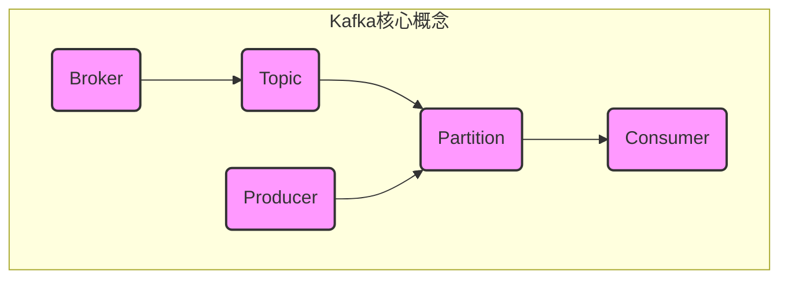
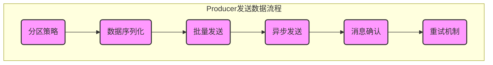

# Kafka Producer原理与代码实例讲解

## 1. 背景介绍

### 1.1 问题的由来

在现代分布式系统中，数据处理和传输是一个关键的环节。随着数据量的快速增长和业务需求的不断扩展,传统的消息队列系统已经无法满足高吞吐量、高可靠性和高扩展性等需求。Apache Kafka作为一种分布式流处理平台,被广泛应用于大数据领域,成为了解决大规模数据处理问题的有力工具。

Kafka Producer作为Kafka的核心组件之一,负责将数据发布到Kafka集群中。它的设计和实现直接影响了Kafka系统的性能和可靠性。因此,深入理解Kafka Producer的原理和实现细节,对于构建高效、可靠的分布式系统至关重要。

### 1.2 研究现状

目前,已有许多研究文献和技术资料探讨了Kafka Producer的设计和实现。这些资料主要集中在以下几个方面:

1. **Producer发送数据的流程**:介绍了Producer如何将数据发送到Kafka集群,包括分区策略、数据序列化、批量发送等机制。
2. **可靠性保证**:阐述了Producer如何确保数据传输的可靠性,包括消息确认机制、重试机制等。
3. **性能优化**:探讨了提高Producer吞吐量的各种技术,如批量发送、压缩、异步发送等。
4. **配置参数**:分析了影响Producer性能和可靠性的关键配置参数。

然而,这些资料大多只涉及了某一个特定方面,缺乏对Kafka Producer整体架构和实现细节的全面解读。另外,随着Kafka版本的不断更新,一些新特性和优化也需要被深入探讨。

### 1.3 研究意义

深入理解Kafka Producer的原理和实现细节,对于以下几个方面具有重要意义:

1. **系统设计和优化**:了解Producer的工作原理,有助于设计高效、可靠的分布式系统,并对现有系统进行优化。
2. **问题排查和调优**:掌握Producer的实现细节,可以更好地分析和解决生产环境中遇到的各种问题,并对Producer进行精准调优。
3. **技术选型和评估**:对比Kafka Producer与其他消息队列系统的优缺点,有助于进行合理的技术选型和评估。
4. **知识积累和传播**:系统地梳理和总结Kafka Producer的原理和实现,有助于知识的积累和传播,推动相关技术的发展。

### 1.4 本文结构

本文将全面解读Kafka Producer的原理和实现细节,内容安排如下:

1. 介绍Kafka Producer的核心概念和架构设计。
2. 详细阐述Producer发送数据的核心算法原理和具体操作步骤。
3. 构建数学模型,推导公式,并结合实例进行讲解。
4. 提供完整的代码实例,并对关键代码进行解读和分析。
5. 探讨Kafka Producer在实际场景中的应用。
6. 推荐相关学习资源、开发工具和论文。
7. 总结Kafka Producer的发展趋势和面临的挑战。
8. 附录常见问题解答。

## 2. 核心概念与联系

在深入探讨Kafka Producer的原理和实现之前,我们需要先了解一些核心概念和它们之间的联系。

1. **Broker**: Kafka集群由一个或多个Broker组成,每个Broker是一个独立的Kafka服务实例。
2. **Topic**: 一个Topic可以被认为是一个逻辑上的数据流,Producer向Topic发送数据,Consumer从Topic消费数据。
3. **Partition**: 每个Topic又被进一步划分为多个Partition,每个Partition在物理上对应一个文件,数据被持久化存储在这些文件中。
4. **Producer**: 负责向Kafka集群发送数据的客户端组件。
5. **Consumer**: 负责从Kafka集群消费数据的客户端组件。

Producer将数据发送到Topic的特定Partition中,Consumer则从这些Partition中消费数据。Kafka通过这种设计,实现了高吞吐量、高可靠性和高扩展性。

## 3. 核心算法原理 & 具体操作步骤

### 3.1 算法原理概述

Kafka Producer发送数据的核心算法原理可以概括为以下几个关键点:

1. **分区策略**: 确定将数据发送到哪个Partition。
2. **数据序列化**: 将数据序列化为字节数组,便于网络传输。
3. **批量发送**: 将多条数据组成一个批次进行发送,提高吞吐量。
4. **异步发送**: 采用异步发送机制,提高并发能力。
5. **消息确认**: 确保数据被成功写入Kafka集群。
6. **重试机制**: 在发送失败时,自动重试发送。

这些关键点相互配合,共同实现了高吞吐量和高可靠性的数据发送。

### 3.2 算法步骤详解

1. **分区策略**

   Producer需要确定将数据发送到哪个Partition。Kafka提供了多种分区策略,用户可以根据需求进行选择和配置。常见的分区策略包括:

   - 随机分区策略: 随机选择一个Partition进行发送。
   - 键分区策略: 根据数据的键(Key)计算出一个哈希值,并将相同键的数据发送到同一个Partition。
   - 自定义分区策略: 用户可以实现自己的分区策略,根据特定的业务规则进行分区。

2. **数据序列化**

   Producer需要将待发送的数据序列化为字节数组,便于网络传输。Kafka提供了多种序列化器(Serializer),用户可以根据需求进行选择和配置。常见的序列化器包括:

   - 字符串序列化器: 将字符串序列化为字节数组。
   - Java对象序列化器: 将Java对象序列化为字节数组。
   - Avro序列化器: 使用Avro进行序列化,支持跨语言和跨平台。

3. **批量发送**

   为了提高吞吐量,Producer会将多条数据组成一个批次进行发送,而不是一条一条地发送。批量发送的关键参数包括:

   - `batch.size`: 一个批次中包含的最大字节数。
   - `linger.ms`: 等待更多数据加入批次的最长时间。
   - `compression.type`: 批次数据的压缩算法,可以减小网络传输的数据量。

4. **异步发送**

   为了提高并发能力,Producer采用异步发送机制。Producer将数据发送到一个缓冲区,由专门的发送线程从缓冲区取出数据,并将其发送到Kafka集群。异步发送的关键参数包括:

   - `buffer.memory`: 发送缓冲区的总大小。
   - `max.block.ms`: 当缓冲区已满时,阻塞等待发送的最长时间。
   - `max.in.flight.requests.per.connection`: 允许同时发送的最大未完成请求数。

5. **消息确认**

   为了确保数据被成功写入Kafka集群,Producer需要等待Broker的确认响应。Kafka提供了三种确认模式:

   - `acks=0`: 不等待任何确认响应,最快但最不可靠。
   - `acks=1`: 等待Leader副本的确认响应,中等可靠性。
   - `acks=all`: 等待所有副本的确认响应,最可靠但最慢。

6. **重试机制**

   在发送失败时,Producer会自动重试发送。重试机制的关键参数包括:

   - `retries`: 重试次数,默认为Integer.MAX_VALUE,即无限重试。
   - `retry.backoff.ms`: 重试之间的等待时间。
   - `max.in.flight.requests.per.connection`: 允许同时发送的最大未完成请求数,影响重试的并发度。

### 3.3 算法优缺点

Kafka Producer发送数据的核心算法具有以下优点:

1. **高吞吐量**: 通过批量发送、异步发送和数据压缩等机制,大幅提高了数据发送的吞吐量。
2. **高可靠性**: 通过消息确认和重试机制,确保了数据传输的可靠性。
3. **高扩展性**: 通过分区策略,实现了数据的自动分片和负载均衡,提高了系统的扩展性。
4. **高并发性**: 采用异步发送机制,提高了并发能力,能够充分利用多核CPU资源。

同时,该算法也存在一些缺点:

1. **延迟**: 为了提高吞吐量,Producer会积累一定数量的数据后再进行发送,这会导致一定的延迟。
2. **内存占用**: 异步发送机制需要维护一个发送缓冲区,在高负载情况下,可能会占用较多内存。
3. **配置复杂**: Kafka Producer有许多配置参数,需要根据实际场景进行调优,配置复杂度较高。
4. **有限重试**: 虽然支持重试机制,但重试次数有限,在极端情况下仍可能导致数据丢失。

### 3.4 算法应用领域

Kafka Producer发送数据的核心算法广泛应用于以下领域:

1. **日志收集**: 将分布式系统中的各种日志数据发送到Kafka集群,实现日志的集中存储和处理。
2. **流处理**: 将各种数据源(如数据库、传感器等)的数据发送到Kafka,作为流式处理的输入源。
3. **消息队列**: 将Kafka作为分布式消息队列系统,Producer发送消息,Consumer消费消息。
4. **事件驱动架构**: 将各种事件数据发送到Kafka,作为事件驱动架构的事件源。
5. **数据管道**: 将Kafka作为数据管道,Producer发送数据,Consumer从Kafka消费数据,进行下游的数据处理和分析。

## 4. 数学模型和公式 & 详细讲解 & 举例说明

### 4.1 数学模型构建

为了更好地理解和优化Kafka Producer的性能,我们可以构建一个简化的数学模型。该模型将Producer的吞吐量(Throughput)作为目标函数,并考虑以下几个关键因素:

1. 批量发送大小(Batch Size)
2. 网络延迟(Network Latency)
3. 数据压缩率(Compression Ratio)
4. 消息确认延迟(Ack Latency)

我们定义以下符号:

- $T$: 吞吐量(Throughput),单位为字节/秒
- $B$: 批量发送大小,单位为字节
- $L_n$: 网络延迟,单位为秒
- $C$: 数据压缩率,取值范围为 $(0, 1]$
- $L_a$: 消息确认延迟,单位为秒
- $R$: 重试率,即发送失败需要重试的比例,取值范围为 $[0, 1)$

则吞吐量 $T$ 可以表示为:

$$T = \frac{B}{L_n + L_a + R \times (L_n + L_a)} \times \frac{1}{C}$$

这个公式反映了以下几个关键点:

1. 批量发送