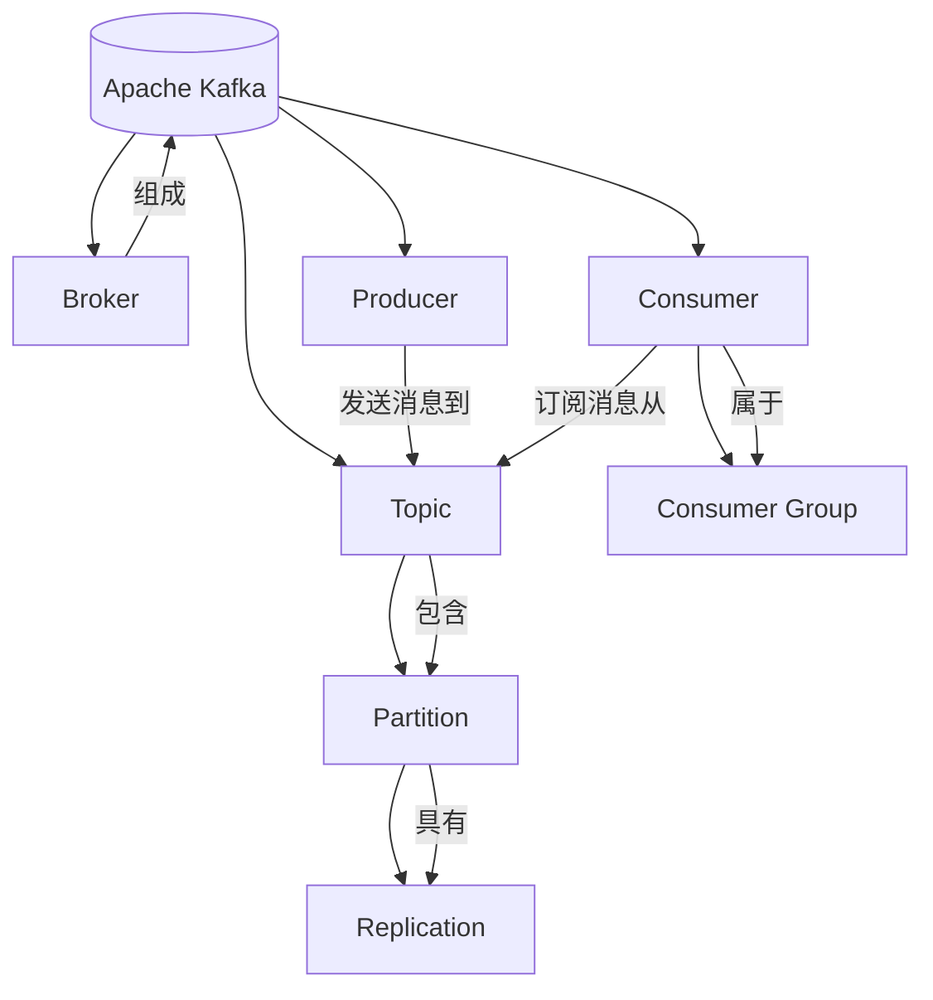

# Kafka原理与代码实例讲解

## 1. 背景介绍

### 1.1 问题的由来

在当今数据密集型应用程序的世界中，实时数据处理和事件驱动架构变得越来越重要。传统的消息队列系统往往无法满足大规模分布式系统对可靠性、吞吐量和水平扩展性的需求。Apache Kafka作为一种分布式流处理平台,旨在解决这些挑战,为大数据实时处理提供了一种高效、可靠和可扩展的解决方案。

随着大数据和实时数据处理需求的不断增长,企业需要一种能够高效处理大量数据流的系统。传统的消息队列系统在处理大规模数据流时存在一些限制,例如:

- **可扩展性**:传统消息队列系统通常采用集中式架构,难以水平扩展以满足不断增长的数据量。
- **吞吐量**:由于架构限制,传统消息队列系统的吞吐量通常有限。
- **持久性**:传统消息队列系统通常依赖于磁盘存储,在处理大量数据流时可能会遇到性能瓶颈。
- **容错性**:传统消息队列系统在发生故障时可能会丢失数据,无法提供足够的容错能力。

为了解决这些问题,Apache Kafka应运而生,它提供了一种分布式、分区、冗余和容错的消息传递系统,旨在实现高吞吐量、可靠性和水平扩展性。

### 1.2 研究现状

Apache Kafka是一个开源的分布式流处理平台,最初由LinkedIn公司开发,后来捐赠给Apache软件基金会。自2011年首次发布以来,Kafka已经成为大数据生态系统中广泛使用的关键组件之一。

Kafka已经被许多知名公司采用,用于构建实时数据管道、日志收集、流处理和事件驱动架构等场景。例如,Netflix使用Kafka进行事件监控和操作数据处理,Uber使用Kafka构建实时数据管道,LinkedIn使用Kafka进行活动数据收集和处理。

除了在企业级应用中的广泛应用,Kafka也受到了学术界和开源社区的广泛关注。许多研究人员和开发者一直在探索Kafka的新功能和应用场景,例如与机器学习、人工智能和物联网等领域的集成。同时,Kafka也在不断发展和完善,新的版本不断推出,以提供更多功能和改进性能。

### 1.3 研究意义

Apache Kafka作为一种分布式流处理平台,在大数据和实时数据处理领域扮演着重要角色。深入研究Kafka的原理和实现对于以下几个方面具有重要意义:

1. **理解分布式系统设计**:Kafka的设计体现了分布式系统的多个核心概念,如分区、复制、容错等,研究Kafka有助于加深对分布式系统设计原理的理解。

2. **掌握实时数据处理技术**:随着实时数据处理需求的不断增长,掌握Kafka等实时数据处理技术将成为必备技能。研究Kafka有助于掌握实时数据处理的核心概念和实践经验。

3. **构建事件驱动架构**:Kafka是构建事件驱动架构的关键组件之一,研究Kafka有助于理解事件驱动架构的设计和实现。

4. **提高系统可靠性和扩展性**:Kafka的设计目标之一是提供高可靠性和水平扩展性,研究Kafka有助于了解如何构建高可靠和可扩展的分布式系统。

5. **促进大数据生态系统发展**:作为大数据生态系统中的关键组件,深入研究Kafka有助于推动整个大数据生态系统的发展和创新。

总的来说,深入研究Kafka的原理和实现不仅有助于提高个人的技术能力,还有利于推动分布式系统、实时数据处理和大数据生态系统的发展。

### 1.4 本文结构

本文将全面介绍Apache Kafka的原理、架构和实现细节,并提供代码实例进行详细讲解。文章的主要结构如下:

1. **背景介绍**:介绍Kafka的由来、研究现状和意义,为后续内容做铺垫。

2. **核心概念与联系**:阐述Kafka的核心概念,如Topic、Partition、Broker、Producer、Consumer等,并解释它们之间的关系。

3. **核心算法原理与具体操作步骤**:深入探讨Kafka的核心算法原理,包括分区策略、复制机制、消息传递协议等,并详细解释各个算法的具体操作步骤。

4. **数学模型和公式详细讲解与举例说明**:介绍Kafka中涉及的数学模型和公式,如一致性哈希、水位线等,并通过具体案例进行详细讲解和举例说明。

5. **项目实践:代码实例和详细解释说明**:提供Kafka的代码实例,包括Producer、Consumer、Stream等,并对关键代码进行详细解释和分析。

6. **实际应用场景**:介绍Kafka在实际生产环境中的应用场景,如日志收集、实时数据处理、事件驱动架构等,并探讨未来的应用展望。

7. **工具和资源推荐**:推荐Kafka相关的学习资源、开发工具、论文等,为读者提供进一步学习和研究的参考。

8. **总结:未来发展趋势与挑战**:总结Kafka的研究成果,并展望未来的发展趋势和面临的挑战,为后续研究提供方向。

9. **附录:常见问题与解答**:列出Kafka使用过程中的常见问题,并给出解答和建议,帮助读者解决实际问题。

通过全面而深入的介绍,本文旨在为读者提供对Apache Kafka的深入理解,并为实际应用和未来研究提供参考和指导。

## 2. 核心概念与联系

Apache Kafka是一个分布式流处理平台,它具有高吞吐量、可靠性、可扩展性和容错性等特点。为了实现这些目标,Kafka引入了一些核心概念,这些概念相互关联,共同构建了Kafka的整体架构。本节将详细介绍这些核心概念及其关系。

### 2.1 Broker

Broker是Kafka集群中的单个服务器实例。一个Kafka集群通常由多个Broker组成,这些Broker相互协作,共同存储和处理数据。每个Broker负责维护一部分分区(Partition)的数据,并响应客户端的读写请求。

Broker之间通过Zookeeper进行协调,以确保集群的一致性和可靠性。当一个Broker加入或离开集群时,Zookeeper会通知其他Broker,以便进行必要的调整和重新平衡。

### 2.2 Topic

Topic是Kafka中的核心概念之一,它是一个逻辑上的数据流,用于存储和传输消息。每个Topic可以被分成多个Partition,每个Partition又可以被复制到多个Broker上,以实现冗余和容错。

消息生产者(Producer)向Topic发送消息,而消费者(Consumer)从Topic中消费消息。Topic的设计使得消息可以被持久化存储,并且可以被多个消费者订阅和消费。

### 2.3 Partition

Partition是Topic的物理分区,用于实现水平扩展和并行处理。一个Topic可以被分成多个Partition,每个Partition在物理上是一个有序的、不可变的消息序列。

Partition的引入有以下几个好处:

1. **水平扩展**:将Topic分成多个Partition,可以将消息存储和处理分散到多个Broker上,从而实现水平扩展。
2. **并行处理**:消费者可以并行消费同一个Topic的多个Partition,提高了消费速度。
3. **顺序保证**:每个Partition内部的消息是有序的,但不同Partition之间的消息顺序无法保证。

Partition的数量可以在创建Topic时指定,也可以在运行时动态调整。每个Partition都有一个从0开始的编号,用于标识和访问。

### 2.4 Replication

Replication(复制)是Kafka实现容错和高可用性的关键机制。每个Partition都可以被复制到多个Broker上,形成一个Replication Group。在一个Replication Group中,有一个Broker被选举为Leader,其他Broker为Follower。

所有的写操作都由Leader处理,然后将消息复制到所有的Follower。只有当所有的Follower都成功复制了消息后,Leader才会向Producer确认写入成功。如果Leader出现故障,其中一个Follower会被选举为新的Leader,从而确保系统的可用性。

Replication的引入不仅提高了Kafka的容错能力,还增强了数据的持久性和一致性。通过配置合适的复制因子,可以在可用性和存储开销之间进行权衡。

### 2.5 Producer

Producer是向Kafka集群发送消息的客户端。Producer可以选择将消息发送到指定的Topic和Partition,也可以让Kafka自动为消息选择Partition。

Producer在发送消息时,会先将消息缓存在内存中的批次(Batch)中,然后周期性地将Batch发送到Broker。这种批量发送的方式可以提高吞吐量和效率。

Producer还提供了可靠性保证,如消息确认机制和重试机制,以确保消息不会丢失。同时,Producer也支持压缩和加密等高级功能。

### 2.6 Consumer

Consumer是从Kafka集群消费消息的客户端。Consumer可以订阅一个或多个Topic,并从这些Topic中消费消息。

Consumer通常会组成一个Consumer Group,每个Consumer Group中的Consumer只会消费Topic中某些Partition的消息,从而实现了消费的并行化。Consumer Group中的每个Consumer都会被分配一个或多个Partition,并独立消费这些Partition中的消息。

Consumer还提供了消费位移(Offset)管理机制,用于跟踪消费进度。当Consumer重新启动时,它可以从上次的位移继续消费,确保消息不会丢失或重复消费。

### 2.7 Consumer Group

Consumer Group是Kafka中的一个逻辑概念,用于实现消费的并行化和负载均衡。一个Consumer Group由多个Consumer组成,每个Consumer都属于一个特定的Consumer Group。

Kafka将每个Topic的Partition分配给Consumer Group中的不同Consumer,从而实现了消费的并行化。每个Partition只会被Consumer Group中的一个Consumer消费,但一个Consumer可以消费多个Partition。

当一个新的Consumer加入Consumer Group时,它会从当前最新的位移开始消费。如果一个Consumer离开了Consumer Group,它之前消费的Partition会被重新分配给其他Consumer。这种设计确保了消费的高可用性和容错性。

## 3. 核心算法原理与具体操作步骤

Apache Kafka的核心算法原理涉及多个方面,包括分区策略、复制机制、消息传递协议等。这些算法原理共同构建了Kafka的高吞吐量、可靠性和可扩展性。本节将详细探讨这些核心算法原理及其具体操作步骤。

### 3.1 算法原理概述

#### 3.1.1 分区策略

Kafka采用分区(Partition)的设计,将Topic分成多个Partition,每个Partition在物理上是一个有序的、不可变的消息序列。这种设计带来了以下好处:

1. **水平扩展**:将Topic分成多个Partition,可以将消息存储和处理分散到多个Broker上,从而实现水平扩展。
2. **并行处理**:消费者可以并行消费同一个Topic的多个Partition,提高了消费速度。
3. **顺序保证**:每个Partition内部的消息是有序的,但不同Partition之间的消息顺序无法保证。

Kafka提供了多种分区策略,如范围分区(Range Partitioning)、哈希分区(Hash Partitioning)和按键分区(Key Partitioning)等。用户可以根据实际需求选择合适的分区策略。

#### 3.1.2 复制机制

Kafka采用复制(Replication)机制来实现容错和