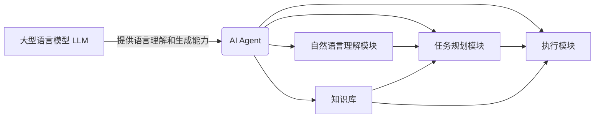

以下是关于"LLM在AI Agent中的角色"的技术博客文章正文内容：

# LLM在AI Agent中的角色

## 1. 背景介绍

### 1.1 问题的由来

随着人工智能技术的快速发展,大型语言模型(LLM)已经成为推动智能系统发展的关键驱动力。LLM具有强大的自然语言理解和生成能力,可以处理复杂的语言任务,并为人工智能代理(AI Agent)提供智能化的语言交互支持。

然而,如何有效地将LLM集成到AI Agent中,并充分发挥其潜力,仍然是一个具有挑战性的问题。AI Agent需要能够理解用户的自然语言输入,并提供相关和有意义的响应,同时还需要具备执行各种任务的能力。将LLM与其他AI组件(如规划、推理和决策模块)无缝集成,是实现高度智能化AI Agent的关键。

### 1.2 研究现状

目前,已有一些研究探索了将LLM集成到AI Agent中的方法。一些常见的方法包括:

1. 基于对话的方法:LLM被用作对话系统的核心组件,用于理解用户的自然语言输入并生成响应。
2. 基于任务的方法:LLM被用作任务理解和规划模块,用于将自然语言指令转换为可执行的任务计划。
3. 混合方法:将LLM与其他AI组件(如知识库、规划器和执行器)集成,形成一个综合的智能系统。

然而,这些方法仍然存在一些局限性,例如:

- 缺乏上下文理解和记忆能力,导致AI Agent难以维持连贯的对话或任务执行。
- 难以将LLM与其他AI组件无缝集成,导致系统效率低下或出现不一致的行为。
- 缺乏对LLM输出的控制和约束,可能导致不合理或不安全的输出。

### 1.3 研究意义

有效地将LLM集成到AI Agent中,对于构建真正智能的人工智能系统具有重要意义。通过充分利用LLM的语言理解和生成能力,AI Agent可以实现更自然、更流畅的人机交互,提高用户体验。同时,将LLM与其他AI组件相结合,可以赋予AI Agent更强大的任务执行能力,扩展其应用范围。

此外,研究LLM在AI Agent中的角色和集成方法,也有助于推动人工智能领域的理论和技术进步,为构建通用人工智能(AGI)系统奠定基础。

### 1.4 本文结构

本文将从以下几个方面深入探讨LLM在AI Agent中的角色:

1. 介绍LLM和AI Agent的核心概念,以及它们之间的关系。
2. 分析LLM在AI Agent中的核心算法原理,包括自然语言理解、任务规划和执行等方面。
3. 阐述LLM与AI Agent其他组件集成的数学模型和公式,并给出详细的案例分析。
4. 提供一个基于LLM的AI Agent项目实践,包括代码实现和运行结果展示。
5. 探讨LLM在AI Agent中的实际应用场景,以及未来的发展趋势和挑战。
6. 推荐相关的学习资源、开发工具和论文,为读者提供进一步学习和研究的支持。

## 2. 核心概念与联系

在深入探讨LLM在AI Agent中的角色之前,我们先来介绍一些核心概念及它们之间的关系。

1. **大型语言模型(LLM)**:LLM是一种基于深度学习的自然语言处理模型,具有强大的语言理解和生成能力。它可以处理各种形式的自然语言输入(如文本、语音等),并生成相应的自然语言输出。常见的LLM包括GPT、BERT、XLNet等。

2. **AI Agent**:AI Agent是一种智能系统,能够感知环境、理解任务、制定计划并执行相应的操作。它通常由多个模块组成,如自然语言理解模块、任务规划模块、知识库和执行模块等。

3. **自然语言理解模块**:该模块负责理解用户的自然语言输入,将其转换为机器可理解的表示形式。LLM可以为该模块提供语言理解的能力。

4. **任务规划模块**:该模块根据自然语言理解的结果,制定执行任务的具体计划。LLM可以为该模块提供任务理解和规划的支持。

5. **知识库**:知识库存储了AI Agent所需的各种知识,包括领域知识、常识知识等。LLM可以从知识库中获取相关知识,以支持语言理解和任务规划。

6. **执行模块**:该模块负责执行任务规划模块制定的计划,完成具体的任务操作。LLM可以为执行模块提供自然语言交互的支持,例如解释执行结果等。

LLM在AI Agent中扮演着核心的角色,为各个模块提供语言理解和生成的能力,支持自然语言交互和任务执行。同时,LLM也需要与其他模块紧密集成,才能发挥最大的作用。

## 3. 核心算法原理 & 具体操作步骤

### 3.1 算法原理概述

将LLM集成到AI Agent中,需要解决以下几个关键问题:

1. **自然语言理解**:如何准确地理解用户的自然语言输入,将其转换为机器可理解的表示形式。
2. **任务规划**:如何根据自然语言理解的结果,制定执行任务的具体计划。
3. **知识融合**:如何将LLM与知识库相结合,为语言理解和任务规划提供必要的知识支持。
4. **执行控制**:如何基于LLM的输出,控制AI Agent的执行行为,确保执行结果的合理性和安全性。

为解决这些问题,研究人员提出了多种算法和方法,包括:

1. **基于注意力机制的自然语言理解算法**:利用注意力机制捕捉输入序列中的重要信息,提高语言理解的准确性。
2. **基于规划算法的任务规划方法**:将自然语言指令转换为可执行的任务计划,并利用规划算法进行优化。
3. **基于知识图谱的知识融合方法**:将知识库中的知识表示为知识图谱,并与LLM进行融合,提高语言理解和任务规划的效果。
4. **基于约束优化的执行控制算法**:在LLM的输出中引入约束条件,通过优化算法生成合理且安全的执行行为。

### 3.2 算法步骤详解

以下是将LLM集成到AI Agent中的一般步骤:

1. **自然语言输入处理**:对用户的自然语言输入进行预处理,包括分词、词性标注、命名实体识别等。

2. **自然语言理解**:利用基于注意力机制的语言模型(如BERT、XLNet等)对预处理后的输入进行编码,获得语义表示。

3. **任务理解**:将语义表示输入到任务理解模块,识别出用户的意图和任务目标。

4. **知识融合**:根据任务目标,从知识库中检索相关知识,并与语义表示进行融合。

5. **任务规划**:利用规划算法(如启发式搜索、层次规划等)根据融合后的表示,生成执行任务的具体计划。

6. **执行控制**:将任务计划输入到执行控制模块,通过约束优化算法生成合理且安全的执行指令。

7. **执行操作**:AI Agent根据执行指令执行相应的操作,完成任务。

8. **结果反馈**:利用LLM对执行结果进行自然语言解释,并与用户进行交互,获取反馈。

9. **持续学习**:根据用户反馈,对LLM和其他模块进行持续优化和学习,提高系统的性能。

### 3.3 算法优缺点

上述算法和方法具有以下优点:

1. 利用LLM的强大语言能力,实现了自然语言与机器之间的无缝交互。
2. 将LLM与其他AI组件(如规划、推理和决策模块)相结合,赋予了AI Agent强大的任务执行能力。
3. 通过知识融合,充分利用了知识库中的丰富知识,提高了语言理解和任务规划的效果。
4. 引入了执行控制机制,确保了AI Agent的执行行为的合理性和安全性。

但同时也存在一些缺点和挑战:

1. LLM本身存在一定的偏差和不确定性,可能导致语言理解和生成的错误。
2. 不同AI组件之间的集成存在一定的困难,需要解决模型之间的不一致性和冲突问题。
3. 知识融合过程复杂,需要解决知识表示、检索和融合的挑战。
4. 执行控制算法的设计和优化存在一定的难度,需要权衡执行效率和安全性。

### 3.4 算法应用领域

将LLM集成到AI Agent中的算法和方法可以应用于多个领域,包括但不限于:

1. **智能助手**:构建具有自然语言交互能力的智能助手,为用户提供信息查询、任务执行等服务。
2. **智能家居**:开发智能家居系统,实现语音控制家电、智能管家等功能。
3. **智能教育**:构建智能教学助手,提供个性化的学习指导和答疑解惑。
4. **智能医疗**:开发智能医疗助手,协助医生进行诊断、治疗方案制定等工作。
5. **智能客服**:构建智能客服系统,提供自动化的客户咨询和问题解答服务。
6. **智能机器人**:开发具有自然语言交互能力的智能机器人,用于各种场景的任务执行。

## 4. 数学模型和公式 & 详细讲解 & 举例说明

### 4.1 数学模型构建

为了将LLM与AI Agent其他组件(如任务规划模块、知识库等)进行有效集成,我们需要构建一个统一的数学模型。该模型应能够表示自然语言输入、任务目标、知识库信息,并支持它们之间的融合和优化。

我们定义一个元组 $\mathcal{M} = (X, Y, K, f_{\text{enc}}, f_{\text{dec}}, f_{\text{plan}}, f_{\text{exec}})$ 来表示该模型,其中:

- $X$ 表示自然语言输入序列,如用户的指令或问题。
- $Y$ 表示期望的输出序列,如任务执行结果或回答。
- $K$ 表示知识库,包含了AI Agent所需的各种知识。
- $f_{\text{enc}}$ 是一个编码器函数,将输入 $X$ 编码为语义表示 $\mathbf{z}_X$。
- $f_{\text{dec}}$ 是一个解码器函数,将语义表示 $\mathbf{z}$ 解码为输出序列 $Y$。
- $f_{\text{plan}}$ 是一个任务规划函数,根据语义表示 $\mathbf{z}_X$ 和知识库 $K$,生成任务计划 $\pi$。
- $f_{\text{exec}}$ 是一个执行函数,根据任务计划 $\pi$ 执行相应的操作,产生输出 $Y$。

我们的目标是学习这些函数的参数,使得模型能够最大化输出序列 $Y$ 的条件概率 $P(Y|X, K)$。具体来说,我们可以将该目标表示为最小化以下损失函数:

$$\mathcal{L}(\theta) = -\mathbb{E}_{(X, Y, K) \sim \mathcal{D}}\left[\log P(Y|X, K; \theta)\right]$$

其中 $\theta$ 表示模型参数,包括编码器、解码器、任务规划模块和执行模块的参数。$\mathcal{D}$ 表示训练数据的分布。

在实际优化过程中,我们可以采用基于梯度的优化算法(如随机梯度下降)来最小化损失函数,同时引入一些正则化