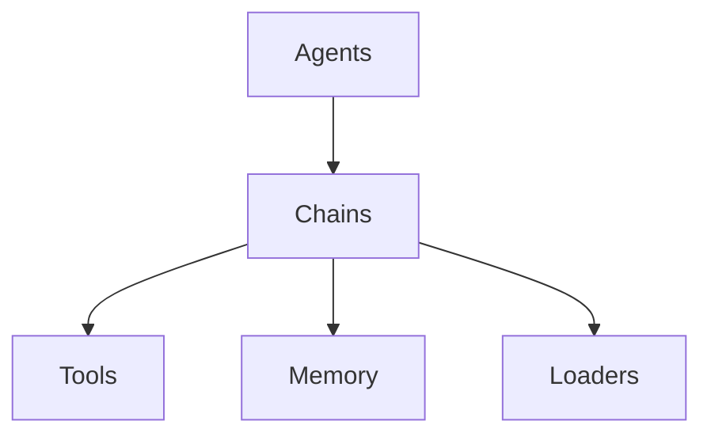

# LangChain 101

## 1. 背景介绍

### 1.1 问题的由来

在当今数据驱动的世界中，人工智能(AI)和机器学习(ML)已经成为各行各业的关键技术。然而，构建和部署AI/ML系统并非易事,往往需要处理大量的数据、集成多个组件,并确保整个系统的可靠性和可维护性。这就导致了AI/ML工程中的一个重要问题:如何高效地构建、管理和扩展AI/ML应用程序?

传统的AI/ML工作流程通常涉及多个独立的步骤,如数据收集、预处理、模型训练、模型评估和模型部署。每个步骤都需要编写大量的样板代码,这不仅耗时耗力,而且容易出错。此外,当需要更新或扩展系统时,需要修改多个组件,这增加了系统的复杂性和维护成本。

### 1.2 研究现状

为了解决这些挑战,近年来出现了一些AI/ML框架和库,旨在简化AI/ML应用程序的构建和部署过程。然而,这些框架和库通常专注于特定的任务或领域,如计算机视觉、自然语言处理或推荐系统。当需要构建涉及多个领域的复杂AI/ML系统时,开发人员仍然需要手动集成多个框架和库,这可能会导致代码重复、不一致性和可维护性问题。

### 1.3 研究意义

LangChain是一个新兴的Python库,旨在提供一种统一的方式来构建AI/ML应用程序。它提供了一种抽象层,使开发人员能够轻松地组合和管理各种AI/ML组件,如语言模型、知识库、检索器和代理。通过LangChain,开发人员可以快速构建和部署AI/ML应用程序,而无需过多关注底层细节。

LangChain的核心思想是将AI/ML系统视为一系列可组合的"链"。每个链代表一个特定的任务或功能,如问答、文本生成或数据处理。这些链可以组合在一起形成更复杂的应用程序,并且可以轻松地替换、扩展或重用。

通过研究LangChain,我们可以更好地理解如何构建可扩展、可维护和可重用的AI/ML系统。这不仅有助于提高开发效率,还可以促进AI/ML技术在各个领域的应用和创新。

### 1.4 本文结构

本文将全面介绍LangChain,包括其核心概念、架构、算法原理、数学模型、实际应用场景和未来发展趋势。文章结构如下:

1. 背景介绍
2. 核心概念与联系
3. 核心算法原理与具体操作步骤
4. 数学模型和公式详细讲解与举例说明
5. 项目实践:代码实例和详细解释说明
6. 实际应用场景
7. 工具和资源推荐
8. 总结:未来发展趋势与挑战
9. 附录:常见问题与解答

## 2. 核心概念与联系

LangChain的核心概念包括代理(Agents)、链(Chains)、工具(Tools)、内存(Memory)和加载器(Loaders)。这些概念相互关联,共同构建了LangChain的基础架构。

### 2.1 代理(Agents)

代理是LangChain中最高层次的抽象,代表一个具有特定目标和能力的智能实体。代理可以执行复杂的任务,如问答、文本生成或决策制定。代理通过组合和协调各种链(Chains)来实现其目标。

### 2.2 链(Chains)

链是LangChain的核心构建块,代表一系列有序的步骤或操作。每个链都有一个特定的目的,如问答、文本摘要或数据处理。链可以包含其他链,从而形成更复杂的功能。

### 2.3 工具(Tools)

工具是LangChain中的基本单元,代表特定的功能或API,如Wikipedia查询、数学计算或文本翻译。代理和链可以利用这些工具来执行各种任务。

### 2.4 内存(Memory)

内存用于存储和检索代理或链在执行过程中产生的中间数据和结果。内存可以是短期的(如会话内存)或长期的(如数据库)。

### 2.5 加载器(Loaders)

加载器用于从各种来源(如文件、网页或数据库)加载数据,并将其转换为LangChain可以处理的格式。加载器支持多种文件格式和数据源。

通过将这些核心概念组合在一起,LangChain提供了一种灵活且可扩展的方式来构建AI/ML应用程序。开发人员可以专注于定义高级目标和任务,而LangChain则负责管理底层的组件和数据流。

## 3. 核心算法原理与具体操作步骤

### 3.1 算法原理概述

LangChain的核心算法原理是基于代理-工具范式(Agent-Tool Paradigm)。该范式将智能系统划分为两个主要部分:代理(Agent)和工具(Tool)。

代理是一个具有特定目标和决策能力的实体。它负责规划和协调各种操作,以实现预期的目标。代理可以利用各种工具来执行特定的任务。

工具则是一组具有特定功能的组件,如查询知识库、进行数学计算或生成文本。工具通常是专门设计的,可以高效地完成特定的任务。

在LangChain中,代理和工具通过链(Chains)进行交互和协作。链定义了一系列有序的步骤,指导代理如何利用工具来完成特定的任务。

该算法的核心思想是将复杂的任务分解为一系列较小的子任务,并利用适当的工具来完成每个子任务。代理负责协调这些子任务的执行顺序和方式,以实现最终目标。

### 3.2 算法步骤详解

LangChain的算法可以概括为以下步骤:

1. **定义目标和任务**:首先,需要明确定义代理的目标和需要完成的任务。这可以是一个具体的问题、决策或操作。

2. **选择合适的链**:根据目标和任务的性质,选择一个或多个合适的链。链定义了完成任务所需的一系列步骤。

3. **识别所需的工具**:分析链中的每个步骤,识别出需要使用哪些工具来完成这些步骤。工具可以是知识库、API或其他功能组件。

4. **加载数据和资源**:使用加载器从各种来源加载所需的数据和资源,如文本文件、网页或数据库。

5. **执行链**:代理开始执行链中定义的步骤。在每个步骤中,代理利用相应的工具来完成特定的任务,如查询知识库、进行计算或生成文本。

6. **管理中间状态和结果**:在执行链的过程中,代理可以利用内存来存储和检索中间状态和结果。这有助于保持上下文信息和跟踪执行进度。

7. **决策和反馈**:根据执行链的结果,代理可以做出相应的决策或采取行动。同时,代理也可以接收反馈,以改进未来的执行。

8. **迭代和优化**:根据需要,可以重复上述步骤,调整链、工具或参数,以优化系统的性能和结果。

该算法的优点在于它提供了一种模块化和可扩展的方式来构建AI/ML系统。通过组合不同的链和工具,可以快速构建各种应用程序,而无需从头开始编写大量代码。此外,该算法还支持灵活的决策和反馈机制,有助于系统的持续改进和优化。

### 3.3 算法优缺点

**优点**:

1. **模块化和可扩展**:LangChain的算法采用模块化设计,允许开发人员轻松组合和扩展各种组件,如链、工具和内存。这提高了系统的灵活性和可维护性。

2. **简化开发过程**:通过抽象出常见的AI/ML任务,LangChain简化了应用程序的开发过程。开发人员可以专注于定义高级目标和任务,而无需关注底层细节。

3. **可重用性**:LangChain中的组件(如链和工具)可以在多个应用程序中重用,从而提高开发效率和代码一致性。

4. **支持多种数据源和格式**:LangChain提供了多种加载器,支持从各种来源(如文件、网页或数据库)加载数据,并支持多种文件格式。

5. **灵活的决策和反馈机制**:算法支持灵活的决策和反馈机制,允许代理根据执行结果做出相应的决策或采取行动,并接收反馈以改进未来的执行。

**缺点**:

1. **性能开销**:LangChain的抽象层和模块化设计可能会引入一定的性能开销,特别是在处理大量数据或执行复杂任务时。

2. **依赖于第三方组件**:LangChain依赖于各种第三方工具和API,如语言模型、知识库和计算服务。这可能会带来一些风险,如供应商锁定、API变更或服务中断。

3. **学习曲线**:虽然LangChain旨在简化AI/ML应用程序的开发,但掌握其核心概念和使用方式仍然需要一定的学习曲线。

4. **可解释性挑战**:由于LangChain系统涉及多个组件和复杂的交互,理解系统的决策过程和结果可能具有一定的挑战。

5. **安全性和隐私问题**:在处理敏感数据或与外部服务集成时,需要特别注意安全性和隐私问题。

总的来说,LangChain的算法为构建AI/ML应用程序提供了一种灵活和可扩展的方式。但同时也需要权衡其优缺点,并根据具体的应用场景和需求进行评估和优化。

### 3.4 算法应用领域

LangChain的算法可以应用于各种AI/ML领域,包括但不限于:

1. **自然语言处理(NLP)**:LangChain可用于构建各种NLP应用程序,如问答系统、文本摘要、情感分析和机器翻译。

2. **知识管理和检索**:通过集成各种知识库和检索工具,LangChain可用于构建智能知识管理和检索系统。

3. **决策支持系统**:LangChain可用于构建各种决策支持系统,如医疗诊断、金融风险评估和供应链优化。

4. **教育和学习辅助**:LangChain可用于构建智能教育和学习辅助系统,如个性化学习路径规划、自动作业评分和知识问答。

5. **科研和发现**:LangChain可用于支持科学研究和发现,如文献检索、数据分析和假设生成。

6. **创意和内容生成**:LangChain可用于构建各种创意和内容生成应用程序,如故事创作、广告copywriting和社交媒体内容生成。

7. **客户服务和支持**:LangChain可用于构建智能客户服务和支持系统,如聊天机器人、常见问题解答和个性化推荐。

8. **物联网和智能系统**:LangChain可用于构建各种物联网和智能系统,如家庭自动化、智能城市管理和预测性维护。

总的来说,LangChain的算法提供了一种通用的方式来构建各种AI/ML应用程序。它的模块化设计和可扩展性使其适用于广泛的领域和场景。

## 4. 数学模型和公式详细讲解与举例说明

虽然LangChain主要是一个基于规则和流程的框架,但它也可以与各种数学模型和算法相结合,以增强其功能和性能。本节将介绍一些与LangChain相关的数学模型和公式,并提供详细的讲解和示例。

### 4.1 数学模型构建

在LangChain中,数学模型通常用于支持特定的任务或功能,如文本相似度计算、主题建模或推荐系统。这些模型可以与LangChain的其他组件(如链、工具和内存)集成,以构建更复杂的应用程序。

一个常见的数学模型是基于向量空间模型(Vector Space Model)的文本相似度计算。在这种