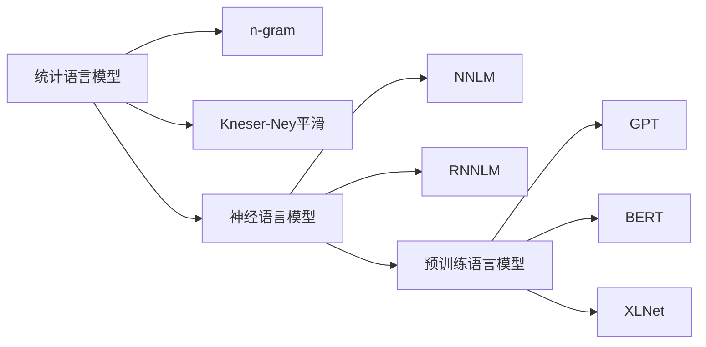
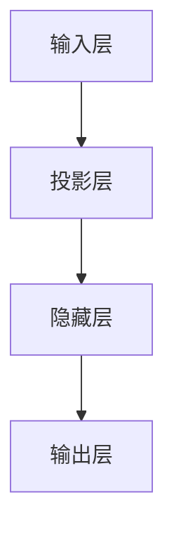
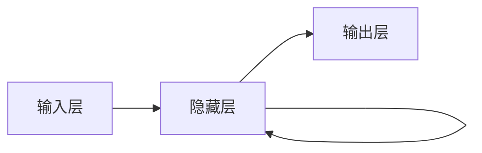

# Language Models 原理与代码实战案例讲解

作者：禅与计算机程序设计艺术 / Zen and the Art of Computer Programming

## 1. 背景介绍
### 1.1 问题的由来
近年来，随着深度学习技术的快速发展，自然语言处理(Natural Language Processing, NLP)领域取得了突破性的进展。其中，语言模型(Language Models)作为NLP的核心技术之一，在机器翻译、对话系统、文本生成等诸多任务中发挥着至关重要的作用。语言模型旨在学习自然语言的内在规律和特征，从而能够对语句的合理性和流畅性进行建模。然而，传统的语言模型如n-gram等方法难以捕捉长距离的语义依赖关系，且面临维度灾难等问题。因此，如何构建高效、鲁棒的语言模型，成为了NLP领域亟待解决的关键性难题。

### 1.2 研究现状
为了克服传统语言模型的局限性，研究者们提出了多种改进方案。其中，基于神经网络的语言模型(Neural Language Models)因其强大的特征学习和语义建模能力，逐渐成为了主流技术路线。早期的神经语言模型如NNLM、RNNLM等，利用前馈神经网络和循环神经网络对词序列进行建模，在一定程度上提升了语言模型的性能。但这些模型仍然难以有效处理长文本，且训练和推理的计算开销较大。

2017年，Google提出了Transformer模型[1]，开创了NLP领域的新纪元。Transformer采用了自注意力机制(Self-Attention)和位置编码(Positional Encoding)等创新技术，能够高效地对长序列进行并行计算，大幅提升了模型的表达能力和训练效率。在此基础上，GPT(Generative Pre-trained Transformer)[2]、BERT(Bidirectional Encoder Representations from Transformers)[3]等预训练语言模型(Pre-trained Language Models)相继问世，通过在大规模无监督语料上进行预训练，再结合少量标注数据进行微调，在多项NLP任务上取得了State-of-the-Art的表现，掀起了预训练语言模型的研究热潮。

### 1.3 研究意义
语言模型作为NLP的基础性技术，其研究进展对于推动自然语言理解和生成的发展具有重要意义。高性能的语言模型不仅能够提升下游任务如机器翻译、对话系统、文本摘要等的效果，还为探索通用人工智能(Artificial General Intelligence, AGI)奠定了坚实基础。通过语言建模，机器能够初步掌握人类知识和常识，这是迈向AGI的关键一步。此外，语言模型的突破也为认知科学、心理语言学等交叉学科的研究提供了新的视角和工具。因此，深入研究语言模型的内在机理和改进方法，对于推动人工智能的发展具有重要的理论和实践价值。

### 1.4 本文结构
本文将重点介绍语言模型的核心概念、主流技术方法及其代码实现。全文共分为9个章节：

第1章介绍了语言模型的研究背景和意义；第2章阐述语言模型的核心概念和发展脉络；第3章详细讲解语言模型的主要算法原理，包括统计语言模型、神经语言模型、预训练语言模型等；第4章介绍语言模型涉及的关键数学知识，并给出公式推导和案例分析；第5章提供了语言模型的代码实现，结合案例讲解其工程实践；第6章分析了语言模型的主要应用场景；第7章总结了语言模型领域的学习资源和开发工具；第8章展望了语言模型的未来发展趋势和挑战；第9章为常见问题解答。

## 2. 核心概念与联系

语言模型的核心任务是学习自然语言的概率分布。给定一个词序列 $S=(w_1,w_2,...,w_T)$，语言模型的目标是估计该序列的概率 $P(S)$。根据概率论的链式法则，序列概率可以分解为：

$$P(S)=P(w_1,w_2,...,w_T)=\prod_{t=1}^TP(w_t|w_1,w_2,...,w_{t-1})$$

其中，$P(w_t|w_1,w_2,...,w_{t-1})$ 表示在给定前 $t-1$ 个词的条件下，当前词 $w_t$ 的条件概率。语言模型的关键就在于如何去估计这个条件概率。

根据建模单元的不同，语言模型可以分为字符级(Character-level)、词级(Word-level)、语句级(Sentence-level)等。其中，词级语言模型最为常见，即将词作为基本单元进行建模。本文后续讨论若无特殊说明，均默认词级语言模型。

按照建模方法的不同，语言模型主要可分为以下三类：

1. 统计语言模型(Statistical Language Models)：基于词频统计和平滑技术，对序列概率进行估计，代表方法有n-gram、Kneser-Ney平滑等。
2. 神经语言模型(Neural Language Models)：利用前馈神经网络、循环神经网络等对序列概率进行建模，代表方法有NNLM、RNNLM等。  
3. 预训练语言模型(Pre-trained Language Models)：在大规模无监督语料上进行预训练，再结合下游任务进行微调，代表方法有GPT、BERT、XLNet等。

下图展示了语言模型的发展脉络和主要里程碑：

可以看出，语言模型经历了从统计方法到神经网络再到预训练的发展过程，建模能力不断增强。接下来，我们将详细介绍这三类语言模型的原理和特点。

## 3. 核心算法原理 & 具体操作步骤
### 3.1 算法原理概述
语言模型的核心是估计词序列的概率分布。不同的语言模型采用不同的建模思路和技术手段。本节将重点介绍三类主流语言模型的基本原理。

### 3.2 算法步骤详解
#### 3.2.1 统计语言模型
统计语言模型基于词频统计来估计序列概率。其中，n-gram是最经典的方法。n-gram模型假设当前词仅与前面n-1个词相关，即：

$$P(w_t|w_1,w_2,...,w_{t-1}) \approx P(w_t|w_{t-n+1},...,w_{t-1})$$

n-gram模型的参数通过极大似然估计(Maximum Likelihood Estimation, MLE)来获得：

$$P(w_t|w_{t-n+1},...,w_{t-1})=\frac{Count(w_{t-n+1},...,w_{t-1},w_t)}{Count(w_{t-n+1},...,w_{t-1})}$$

其中，$Count(·)$ 表示词序列在训练语料中的出现次数。

n-gram模型面临数据稀疏问题，即高阶n-gram在语料中出现次数很少，导致概率估计不准。因此，需要引入平滑技术。常见的平滑方法有Add-one、Good-Turing、Kneser-Ney平滑等。以Kneser-Ney平滑为例，其基本思想是利用低阶n-gram的频次对高阶n-gram进行平滑：

$$P_{KN}(w_t|w_{t-n+1},...,w_{t-1})=\frac{max(Count(w_{t-n+1},...,w_t)-d, 0)}{\sum_wCount(w_{t-n+1},...,w_{t-1},w)}+\lambda P_{KN}(w_t|w_{t-n+2},...,w_{t-1})$$

其中，$d$ 为折扣系数，$\lambda$ 为归一化因子。

#### 3.2.2 神经语言模型 
神经语言模型利用神经网络学习词嵌入(Word Embedding)，再对序列概率进行建模。以NNLM为例，其结构如下图所示：

NNLM的主要步骤如下：
1. 将词映射为稠密向量，作为神经网络的输入。
2. 投影层将输入词向量拼接为上下文向量。
3. 隐藏层对上下文向量进行非线性变换，提取高层特征。
4. 输出层通过Softmax函数计算下一个词的概率分布。

RNNLM在NNLM的基础上引入了循环神经网络，能够建模长距离依赖。其结构如下图所示：

RNNLM每个时间步接收一个词的词向量，隐藏层利用上一时间步的隐藏状态和当前输入计算新的隐藏状态，并预测下一个词的概率分布。

#### 3.2.3 预训练语言模型
预训练语言模型分为两个阶段：预训练和微调。在预训练阶段，模型在大规模无监督语料上进行自监督学习，掌握语言的通用特征。在微调阶段，模型结合下游任务的标注数据进行监督学习，适应特定任务。

以BERT为例，其预训练包括两个任务：
1. Masked Language Model(MLM)：随机遮挡部分词，预测被遮挡词。
2. Next Sentence Prediction(NSP)：判断两个句子是否前后相接。

在微调阶段，BERT根据下游任务的类型，在顶层添加特定的输出层，如分类层、序列标注层等。

### 3.3 算法优缺点
1. 统计语言模型：
   - 优点：简单易实现，可解释性强。
   - 缺点：难以捕捉长距离依赖，平滑技术复杂。
2. 神经语言模型：
   - 优点：能够学习词的分布式表示，建模长距离依赖。  
   - 缺点：模型复杂，训练耗时，解释性差。
3. 预训练语言模型：
   - 优点：充分利用无监督语料，下游任务效果显著提升。
   - 缺点：预训练成本高，模型参数量大。

### 3.4 算法应用领域
语言模型被广泛应用于NLP的各个任务，如机器翻译、对话系统、文本摘要、情感分析、命名实体识别等。此外，语言模型还在语音识别、信息检索、知识图谱等领域发挥重要作用。

## 4. 数学模型和公式 & 详细讲解 & 举例说明
### 4.1 数学模型构建
语言模型的数学基础是概率论和信息论。给定一个长度为T的词序列 $S=(w_1,w_2,...,w_T)$，语言模型的目标是估计该序列的概率 $P(S)$。根据概率论的链式法则，序列概率可以分解为：

$$P(S)=P(w_1,w_2,...,w_T)=\prod_{t=1}^TP(w_t|w_1,w_2,...,w_{t-1})$$

其中，$P(w_t|w_1,w_2,...,w_{t-1})$ 表示在给定前 $t-1$ 个词的条件下，当前词 $w_t$ 的条件概率。

语言模型的关键是如何去估计条件概率 $P(w_t|w_1,w_2,...,w_{t-1})$。不同的语言模型采用不同的估计方法。

### 4.2 公式推导过程
以n-gram模型为例，其基本假设是当前词仅与前面n-1个词相关，即：

$$P(w_t|w_1,w_2,...,w_{t-1}) \approx P(w_t|w_{t-n+1},...,w_{t-1})$$

n-gram模型的参数通过极大似然估计(MLE)来获得：

$$\hat{P}(w_t|w_{t-n+1},...,w_{t-1})=\frac{Count(w_{t-n+1},...,w_{t-1},w_t)}{Count(w_{t-n+1},...,w