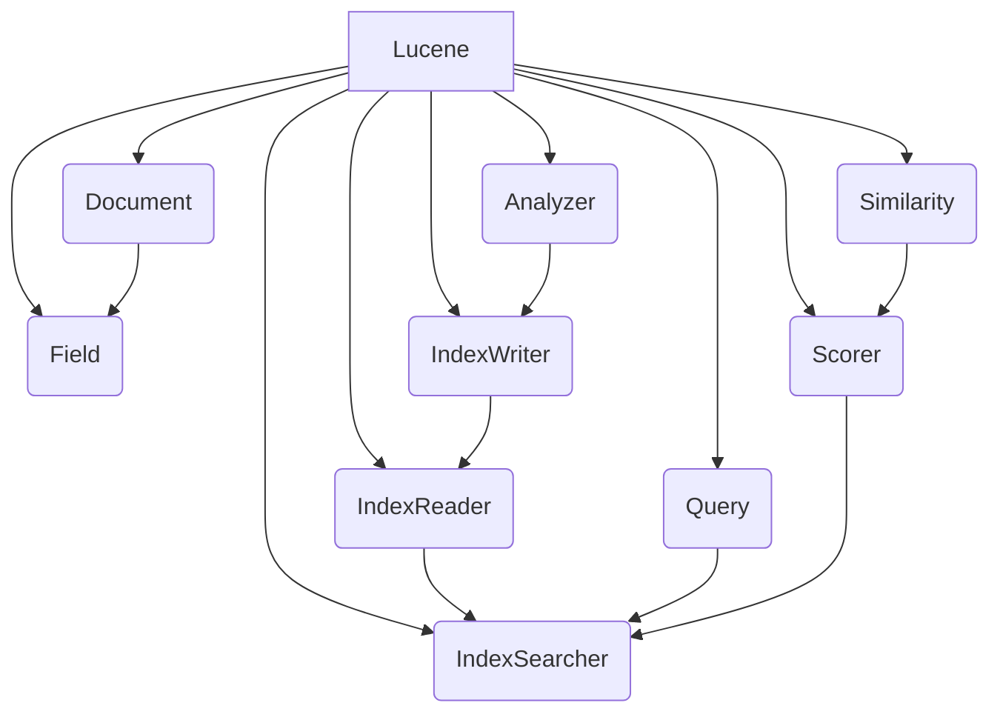

# Lucene原理与代码实例讲解

## 1. 背景介绍

### 1.1 问题的由来

在当今信息时代,数据量呈指数级增长,海量的非结构化数据如何高效地进行搜索和检索成为一个巨大的挑战。传统的数据库系统在处理非结构化数据时效率低下,无法满足实时搜索的需求。因此,一种高效的全文检索引擎应运而生。

### 1.2 研究现状

Lucene是Apache软件基金会的一个顶级开源项目,它提供了一个高性能、可扩展的全文搜索引擎库。Lucene以Java语言编写,它不仅可以嵌入到应用程序中,还可以作为独立的搜索服务器运行。Lucene已被广泛应用于各种领域,如网站搜索、电子邮件搜索、文件搜索等。

### 1.3 研究意义

深入理解Lucene的原理和实现机制对于构建高效的全文搜索系统至关重要。本文将全面剖析Lucene的核心概念、算法原理、数学模型以及代码实现,为读者提供一个系统的学习路径,帮助读者掌握Lucene的精髓,并能够熟练地应用Lucene进行全文检索开发。

### 1.4 本文结构

本文首先介绍Lucene的核心概念和它们之间的联系,然后深入探讨Lucene的核心算法原理和数学模型,并通过代码实例详细讲解其实现细节。接下来,文章将介绍Lucene在实际应用中的场景,并推荐相关的工具和学习资源。最后,总结Lucene的发展趋势和面临的挑战,为读者提供一个全面的视角。

## 2. 核心概念与联系



Lucene的核心概念包括:

1. **Document**: 代表一个需要被索引和搜索的文本单元,它由多个Field组成。
2. **Field**: 表示Document中的一个数据项,可以是标题、内容等。
3. **Analyzer**: 用于将文本转换为一个个Term(词条),并过滤掉无用词条。
4. **IndexWriter**: 负责将Document中的Field分词并建立反向索引。
5. **IndexReader**: 用于读取索引,为搜索做准备。
6. **IndexSearcher**: 根据Query执行搜索,返回TopDocs。
7. **Query**: 表示搜索条件,如TermQuery、PhraseQuery等。
8. **Scorer**: 根据相似度算分,为每个Document打分。
9. **Similarity**: 定义了相似度算分的具体策略。

这些概念相互关联,共同构成了Lucene的核心架构。其中,IndexWriter负责建立索引,IndexSearcher则负责搜索和排序。

## 3. 核心算法原理 & 具体操作步骤

### 3.1 算法原理概述

Lucene采用了倒排索引(Inverted Index)的数据结构,它将文档集合中的每个词条与其所在文档的集合相关联。这种结构可以高效地响应全文搜索查询。Lucene的核心算法包括:

1. **分词算法**: 将文本按照一定的规则分割成一个个词条。
2. **建立索引算法**: 根据分词结果,为每个词条构建倒排索引。
3. **布尔查询算法**: 基于倒排索引,执行布尔查询操作。
4. **评分算法**: 根据相似度计算公式,为每个查询结果打分。
5. **排序算法**: 按照评分结果,对查询结果进行排序。

### 3.2 算法步骤详解

#### 3.2.1 分词算法

Lucene使用Analyzer对文本进行分词,主要步骤如下:

1. **字符流转换**: 将文本转换为字符流。
2. **标记生成**: 使用TokenStream将字符流划分为一个个Token。
3. **标记过滤**: 使用TokenFilter过滤掉无用的Token。

```java
Analyzer analyzer = new StandardAnalyzer();
TokenStream tokenStream = analyzer.tokenStream("myfield", new StringReader("This is a test"));
TermToBytesRefAttribute termAtt = tokenStream.addAttribute(CharTermAttribute.class);
tokenStream.reset();
while (tokenStream.incrementToken()) {
    System.out.println(termAtt.getBytesRef());
}
tokenStream.end();
```

#### 3.2.2 建立索引算法

IndexWriter通过以下步骤建立倒排索引:

1. **收集词条**: 遍历文档,收集所有词条。
2. **词条编码**: 为每个词条分配一个唯一编码。
3. **构建倒排索引**: 为每个词条创建倒排索引,记录其所在文档集合。
4. **索引持久化**: 将内存中的索引数据刷新到磁盘。

```java
Directory dir = FSDirectory.open(Paths.get("index"));
IndexWriterConfig config = new IndexWriterConfig(analyzer);
IndexWriter writer = new IndexWriter(dir, config);
Document doc = new Document();
doc.add(new TextField("content", "This is a test", Field.Store.YES));
writer.addDocument(doc);
writer.close();
```

#### 3.2.3 布尔查询算法

Lucene支持多种查询方式,如TermQuery、PhraseQuery等。以TermQuery为例,查询步骤如下:

1. **查询解析**: 将查询字符串解析为查询对象。
2. **词条编码**: 将查询词条转换为内部编码。
3. **索引查找**: 在倒排索引中查找编码对应的文档集合。
4. **集合操作**: 对文档集合执行布尔操作(如AND、OR等)。

```java
Directory dir = FSDirectory.open(Paths.get("index"));
IndexReader reader = DirectoryReader.open(dir);
IndexSearcher searcher = new IndexSearcher(reader);
Query query = new TermQuery(new Term("content", "test"));
TopDocs docs = searcher.search(query, 10);
```

#### 3.2.4 评分算法

Lucene使用Vector Space Model(VSM)计算相似度分数,主要步骤如下:

1. **构建文档向量**: 根据词条频率(TF)构建文档向量。
2. **构建查询向量**: 根据查询词条权重构建查询向量。
3. **计算相似度**: 使用余弦相似度公式计算文档向量与查询向量的相似度。

$$\mathrm{score}(q,d) = \vec{q} \cdot \vec{d} / \|\vec{q}\| \|\vec{d}\|$$

其中$\vec{q}$为查询向量,$\vec{d}$为文档向量。

#### 3.2.5 排序算法

Lucene使用优先队列对评分结果进行排序,主要步骤如下:

1. **初始化优先队列**: 创建一个固定大小的优先队列。
2. **插入评分结果**: 遍历每个文档,将评分结果插入优先队列。
3. **提取TopDocs**: 从优先队列中提取评分最高的N个文档。

```java
TopScoreDocCollector collector = TopScoreDocCollector.create(10);
searcher.search(query, collector);
ScoreDoc[] hits = collector.topDocs().scoreDocs;
```

### 3.3 算法优缺点

#### 优点:

1. **高效**: 倒排索引结构和向量空间模型计算高效。
2. **可扩展**: 支持分布式索引和搜索。
3. **灵活**: 可自定义分词器、相似度算法等。

#### 缺点:

1. **索引占用空间大**: 倒排索引需要额外的存储空间。
2. **难以处理同义词**: 基于词条匹配,难以识别同义词。
3. **评分策略欠缺**: 评分算法较为简单,可能影响结果质量。

### 3.4 算法应用领域

Lucene可广泛应用于各种全文检索场景,如:

- **网站搜索**: 为网站提供内容搜索功能。
- **电子邮件搜索**: 快速查找电子邮件内容。
- **文件搜索**: 在本地或网络文件系统中搜索文件。
- **日志分析**: 对日志文件进行全文检索和分析。
- **信息检索**: 用于数字图书馆、科研文献等信息检索系统。

## 4. 数学模型和公式 & 详细讲解 & 举例说明

### 4.1 数学模型构建

Lucene采用Vector Space Model(VSM)将文档和查询表示为向量,从而将相关性计算转化为向量空间中的相似度计算问题。

对于文档$d$,其向量表示为:

$$\vec{d} = (w_{d1}, w_{d2}, \cdots, w_{dt})$$

其中$w_{dt}$表示词条$t$在文档$d$中的权重,通常使用TF-IDF公式计算:

$$w_{dt} = \mathrm{tf}_{dt} \times \log{\frac{N}{n_t}}$$

- $\mathrm{tf}_{dt}$: 词条$t$在文档$d$中出现的频率
- $N$: 文档总数
- $n_t$: 包含词条$t$的文档数量

对于查询$q$,其向量表示为:

$$\vec{q} = (w_{q1}, w_{q2}, \cdots, w_{qt})$$

其中$w_{qt}$表示词条$t$在查询$q$中的权重,通常使用布尔模型或向量空间模型计算。

### 4.2 公式推导过程

Lucene使用余弦相似度公式计算文档向量$\vec{d}$与查询向量$\vec{q}$的相似度:

$$\mathrm{score}(q,d) = \vec{q} \cdot \vec{d} / \|\vec{q}\| \|\vec{d}\|$$

其中$\vec{q} \cdot \vec{d}$为向量点积,表示为:

$$\vec{q} \cdot \vec{d} = \sum_{t=1}^{V} w_{qt} \times w_{dt}$$

$V$为词条总数。

$\|\vec{q}\|$和$\|\vec{d}\|$分别表示查询向量和文档向量的范数,计算方式为:

$$\|\vec{q}\| = \sqrt{\sum_{t=1}^{V} w_{qt}^2}, \quad \|\vec{d}\| = \sqrt{\sum_{t=1}^{V} w_{dt}^2}$$

将点积和范数代入余弦相似度公式,我们可以得到Lucene的评分公式:

$$\mathrm{score}(q,d) = \frac{\sum_{t=1}^{V} w_{qt} \times w_{dt}}{\sqrt{\sum_{t=1}^{V} w_{qt}^2} \times \sqrt{\sum_{t=1}^{V} w_{dt}^2}}$$

### 4.3 案例分析与讲解

假设有以下两个文档:

- $d_1$: "This is a test document."
- $d_2$: "This is another test."

我们将计算查询"test document"与这两个文档的相似度分数。

首先,我们需要计算每个词条在文档中的TF-IDF权重:

- $w_{d1,\text{this}}=1 \times \log{\frac{2}{2}}=0$
- $w_{d1,\text{is}}=1 \times \log{\frac{2}{2}}=0$
- $w_{d1,\text{a}}=1 \times \log{\frac{2}{1}}=0.301$
- $w_{d1,\text{test}}=1 \times \log{\frac{2}{2}}=0$
- $w_{d1,\text{document}}=1 \times \log{\frac{2}{1}}=0.301$
- $w_{d2,\text{this}}=1 \times \log{\frac{2}{2}}=0$
- $w_{d2,\text{is}}=1 \times \log{\frac{2}{2}}=0$
- $w_{d2,\text{another}}=1 \times \log{\frac{2}{1}}=0.301$
- $w_{d2,\text{test}}=1 \times \log{\frac{2}{2}}=0$

对于查询"test document",我们假设每个词条的权重为1,则查询向量为:

$$\vec{q} = (0, 0, 0, 1, 1)$$

文档向量为:

$$\vec{d_1} = (0, 0, 0.301, 0, 0.301), \quad \vec{d_2} = (0, 0, 0.301, 0, 0)$$

将它们代入余弦相似度公式,我们可以计算出相似度分数:

$$\begin{aligned}
\mathrm{score}(q,d_1) &= \frac{0 \times 0 + 0 \times 0 + 0 \times 0.301 + 1 \times 0 + 1 \times 0.301}{\sqrt{