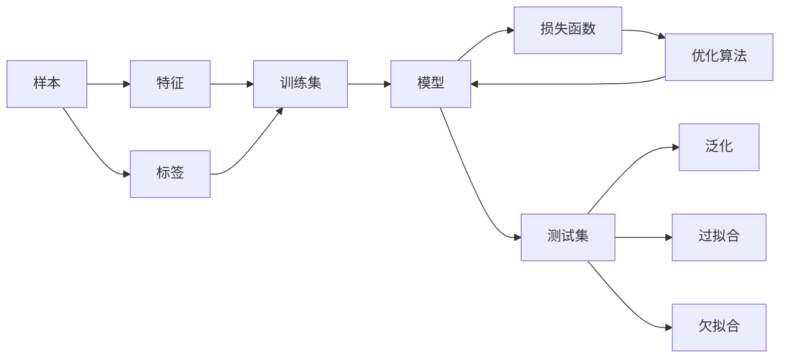

# Machine Learning (ML) 原理与代码实战案例讲解

## 1. 背景介绍
### 1.1  问题的由来
机器学习(Machine Learning, ML)作为人工智能(Artificial Intelligence, AI)的核心,是使计算机系统具备自主学习和智能决策能力的关键技术。在大数据时代背景下,海量的数据为机器学习的发展提供了前所未有的机遇。然而,如何从海量数据中挖掘有价值的信息,构建高效准确的机器学习模型,是当前亟需解决的重要问题。

### 1.2  研究现状
近年来,机器学习理论与应用取得了突飞猛进的发展。从传统的监督学习、无监督学习,到深度学习、强化学习等新兴方法,机器学习的研究范畴不断拓展。特别是深度学习技术的崛起,极大地提升了机器学习在计算机视觉、自然语言处理、语音识别等领域的性能表现。同时,机器学习在工业、金融、医疗、教育等行业得到了广泛应用,展现出巨大的应用价值和商业潜力。

### 1.3  研究意义
尽管机器学习取得了瞩目的进展,但在实际应用中仍面临诸多挑战:如何选择合适的机器学习算法?如何优化模型训练过程?如何权衡模型性能与效率?这些问题的解决有赖于对机器学习原理的深入理解和实践经验的积累。本文旨在系统阐述机器学习的核心概念和算法原理,并通过代码实战案例加深读者对理论知识的理解,为机器学习在实际问题中的应用提供指导和参考。

### 1.4  本文结构
本文共分为九个部分:第一部分介绍机器学习的研究背景与意义;第二部分阐述机器学习的核心概念;第三部分详细讲解机器学习的典型算法原理;第四部分建立机器学习问题的数学模型并推导相关公式;第五部分通过代码实例演示机器学习算法的具体实现;第六部分探讨机器学习的实际应用场景;第七部分推荐机器学习的学习资源和开发工具;第八部分总结全文并展望机器学习的未来发展;第九部分列举机器学习常见问题解答。

## 2. 核心概念与联系
机器学习涉及一系列核心概念,包括但不限于:
- 样本(Sample):数据的基本单元,通常由特征向量和标签构成。
- 特征(Feature):描述样本属性的数值。
- 标签/目标(Label/Target):样本的真实类别或数值。  
- 训练集(Training Set):用于训练模型的样本集合。
- 测试集(Test Set):用于评估模型性能的样本集合。
- 模型(Model):基于训练数据学习得到的数学函数。
- 损失函数(Loss Function):衡量模型预测值与真实值之间差异的函数。
- 优化算法(Optimization Algorithm):通过最小化损失函数求解最优模型参数的算法。
- 泛化(Generalization):模型在新样本上的预测能力。
- 过拟合(Overfitting):模型过度拟合训练数据,导致泛化能力下降。
- 欠拟合(Underfitting):模型拟合能力不足,无法很好地捕捉数据的内在规律。

这些概念环环相扣,共同构成了机器学习的理论基础。样本通过特征表示并被划分为训练集和测试集;机器学习算法在训练集上学习得到模型,并使用损失函数度量模型的拟合程度;优化算法通过最小化损失函数得到最优模型参数;模型在测试集上的表现反映了其泛化能力,过拟合和欠拟合是需要防范的风险。

理解这些概念之间的联系,是掌握机器学习原理和应用的关键。下图展示了机器学习的核心概念之间的逻辑关系:

## 3. 核心算法原理 & 具体操作步骤
### 3.1  算法原理概述
机器学习的核心是让计算机系统从数据中学习,自主构建模型。根据学习范式的不同,机器学习算法可分为监督学习、无监督学习、半监督学习、强化学习等类别。本节重点介绍监督学习中的两类代表性算法:分类和回归。

分类算法的目标是根据样本的特征预测其所属类别。常见的分类算法包括逻辑回归、支持向量机、决策树、朴素贝叶斯等。这些算法通过不同的策略学习样本特征与类别标签之间的映射关系,构建分类决策边界。

回归算法的目标是根据样本的特征预测其对应的连续数值。代表性的回归算法有线性回归、多项式回归、支持向量回归等。回归算法通过拟合样本特征与目标值之间的函数关系,实现对新样本目标值的预测。

除经典的分类和回归算法外,一些先进的机器学习方法如集成学习、深度学习、迁移学习等,通过模型的组合、特征的层次抽象、知识的迁移等技术,进一步提升了机器学习的性能和适用性。

### 3.2  算法步骤详解
以逻辑回归为例,详细说明机器学习算法的具体步骤。逻辑回归是一种常用的二分类算法,其核心是通过Sigmoid函数将样本特征映射到0-1之间,作为样本属于正类的概率。

逻辑回归的主要步骤包括:

(1) 数据准备:收集和清洗数据,选择合适的特征表示方法。将数据划分为训练集和测试集。

(2) 模型定义:定义逻辑回归模型 $h_{\theta}(x)=g(\theta^Tx)$,其中 $g(z)=\frac{1}{1+e^{-z}}$ 为Sigmoid函数, $\theta$ 为模型参数。

(3) 损失函数:引入对数似然损失函数衡量模型的拟合程度。对于二分类问题,损失函数定义为:

$$
J(\theta) = -\frac{1}{m}\sum_{i=1}^{m}[y^{(i)}\log h_{\theta}(x^{(i)})+(1-y^{(i)})\log (1-h_{\theta}(x^{(i)}))]
$$

其中 $m$ 为样本数量, $y^{(i)}$ 为第 $i$ 个样本的真实标签。

(4) 优化求解:使用梯度下降等优化算法最小化损失函数,更新模型参数 $\theta$ 直至收敛。梯度下降的参数更新公式为:

$$
\theta_j:=\theta_j-\alpha\frac{1}{m}\sum_{i=1}^{m}(h_{\theta}(x^{(i)})-y^{(i)})x_j^{(i)}
$$

其中 $\alpha$ 为学习率, $x_j^{(i)}$ 为第 $i$ 个样本的第 $j$ 个特征。

(5) 模型评估:在测试集上评估模型的性能,计算准确率、精确率、召回率、F1值等评价指标。

(6) 模型调优:通过交叉验证等方法选择最优的模型超参数,如正则化系数、迭代次数等。

(7) 模型应用:使用训练好的模型对新样本进行预测,并将其部署到实际应用系统中。

### 3.3  算法优缺点
逻辑回归的主要优点包括:
- 直接对分类可能性进行建模,容易理解和实现。
- 训练速度较快,存储资源占用少。
- 可以输出概率值,便于需要概率辅助决策的任务。
- 对数线性模型,可以轻松地纳入正则化避免过拟合。

逻辑回归的主要缺点包括:
- 难以处理非线性特征,需要进行特征工程或引入核技巧。
- 对于严重偏斜的数据集,逻辑回归的性能表现不佳。
- 容易受到异常点的影响。

### 3.4  算法应用领域
逻辑回归在许多领域得到了广泛应用,如:
- 金融风控:预测客户违约或信用评分。
- 医疗诊断:根据症状预测疾病发生的概率。
- 营销推荐:预测用户对特定商品或服务的购买意向。
- 人力资源:简历筛选,预测求职者是否符合岗位要求。

总之,逻辑回归是一种简单有效的机器学习算法,通过对数几率回归建模,实现对样本类别的概率预测。在实践中,我们还需要根据具体问题的特点,选择恰当的特征表示、正则化方法、优化策略,以达到理想的预测性能。

## 4. 数学模型和公式 & 详细讲解 & 举例说明
### 4.1  数学模型构建
机器学习的核心是通过数学模型描述样本数据的内在规律。以线性回归为例,我们假设样本的特征与目标值之间存在线性关系:

$$
y = \theta_0 + \theta_1x_1 + \theta_2x_2 + ... + \theta_nx_n
$$

其中 $y$ 为目标值, $x_1,x_2,...,x_n$ 为样本的 $n$ 个特征, $\theta_0,\theta_1,...,\theta_n$ 为模型参数。

线性回归的目标是找到一组参数,使得模型的预测值与真实值尽可能接近。我们引入均方误差(Mean Squared Error, MSE)作为损失函数:

$$
J(\theta) = \frac{1}{2m}\sum_{i=1}^{m}(h_{\theta}(x^{(i)})-y^{(i)})^2
$$

其中 $m$ 为样本数量, $h_{\theta}(x^{(i)})$ 为模型对第 $i$ 个样本的预测值, $y^{(i)}$ 为第 $i$ 个样本的真实值。

### 4.2  公式推导过程
为了求解最优的模型参数,我们通过最小化损失函数的方式来优化模型。常用的优化算法是梯度下降法,其核心思想是沿着损失函数下降最快的方向更新参数。

对损失函数求偏导数,可得:

$$
\frac{\partial J(\theta)}{\partial \theta_j} = \frac{1}{m}\sum_{i=1}^{m}(h_{\theta}(x^{(i)})-y^{(i)})x_j^{(i)}
$$

根据梯度下降法的更新规则,参数 $\theta_j$ 的更新公式为:

$$
\theta_j := \theta_j - \alpha \frac{\partial J(\theta)}{\partial \theta_j} = \theta_j - \alpha \frac{1}{m}\sum_{i=1}^{m}(h_{\theta}(x^{(i)})-y^{(i)})x_j^{(i)}
$$

其中 $\alpha$ 为学习率,控制每次参数更新的步长。

重复执行梯度下降的参数更新,直至损失函数收敛或达到预设的迭代次数,即可得到最优的模型参数。

### 4.3  案例分析与讲解
下面通过一个简单的案例来说明线性回归的建模与求解过程。

假设我们要根据房屋面积预测房价,收集到以下样本数据:

| 面积(平方米) | 房价(万元) |
|------------|-----------|
| 50         | 150       |
| 70         | 200       |
| 90         | 250       |
| 110        | 300       |
| 130        | 350       |

首先,我们将样本数据表示为矩阵形式:

$$
X = \begin{bmatrix}
1 & 50 \\ 
1 & 70 \\
1 & 90 \\
1 & 110 \\
1 & 130
\end{bmatrix}, \quad
y = \begin{bmatrix}
150 \\
200 \\
250 \\
300 \\
350
\end{bmatrix}
$$

其中 $X$ 为样本特征矩阵,每行表示一个样本,第一列为全1,用于拟合偏置项 $\theta_0$。 $y$ 为样本的目标值向量。

假设线性回