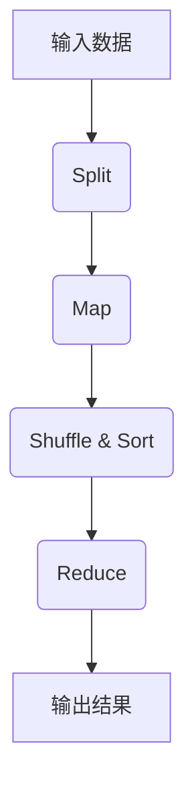

# MapReduce原理与代码实例讲解

## 1. 背景介绍

### 1.1 问题的由来

随着数据量的快速增长,传统的单机系统已经无法满足大规模数据处理的需求。大数据时代的到来,对于分布式系统的计算能力提出了更高的要求。MapReduce作为一种编程模型,被广泛应用于大数据处理领域,成为解决海量数据计算问题的有力工具。

### 1.2 研究现状

MapReduce最初由Google公司提出,并在2004年发表了论文《MapReduce: Simplified Data Processing on Large Clusters》。该论文描述了一种基于大规模集群的并行计算模型,旨在简化大数据处理的编程复杂性。随后,Apache Hadoop作为MapReduce编程模型的开源实现,得到了广泛的应用和发展。

### 1.3 研究意义

MapReduce编程模型具有以下重要意义:

1. **简化分布式计算**:MapReduce将分布式计算抽象为两个核心操作(Map和Reduce),极大地降低了分布式系统的编程复杂度。

2. **高度容错性**:MapReduce具有自动故障恢复机制,能够在节点出现故障时自动重新调度任务,确保计算的可靠性。

3. **数据局部性优化**:MapReduce会尽量将计算任务调度到存储数据的节点上,减少数据传输开销,提高计算效率。

4. **可扩展性强**:MapReduce可以通过增加计算节点来线性扩展计算能力,满足大规模数据处理的需求。

### 1.4 本文结构

本文将全面介绍MapReduce编程模型的原理、实现细节和应用场景。首先阐述MapReduce的核心概念和工作流程,然后深入探讨其算法原理和数学模型。接下来,通过代码示例详细解释MapReduce的实现细节。最后,介绍MapReduce在实际应用中的案例,并对其未来发展趋势和挑战进行展望。

## 2. 核心概念与联系

MapReduce是一种编程模型,它将大规模数据处理抽象为两个核心操作:Map和Reduce。

**Map操作**负责将输入数据集拆分为多个小块,并对每个小块进行处理,生成中间结果。Map操作通常用于数据过滤、转换和提取等任务。

**Reduce操作**则负责对Map操作产生的中间结果进行合并和聚合,生成最终结果。Reduce操作常用于数据汇总、统计和分析等任务。

MapReduce的工作流程如下所示:



1. **Split**:将输入数据集拆分为多个数据块,并分发到不同的Map任务中进行处理。

2. **Map**:每个Map任务对分配的数据块进行处理,生成键值对形式的中间结果。

3. **Shuffle & Sort**:系统收集各个Map任务产生的中间结果,按照键值对的键进行分组和排序,将具有相同键的值分发到同一个Reduce任务中。

4. **Reduce**:每个Reduce任务对收到的中间结果进行合并和聚合,生成最终结果。

5. **输出结果**:将Reduce任务产生的最终结果输出到指定位置。

MapReduce编程模型的优势在于将复杂的大数据处理任务分解为简单的Map和Reduce操作,并通过分布式计算实现高效并行处理。同时,MapReduce具有自动故障恢复、数据局部性优化和可扩展性等特点,使其成为处理大规模数据的有力工具。

## 3. 核心算法原理 & 具体操作步骤

### 3.1 算法原理概述

MapReduce算法的核心思想是将大规模数据处理任务拆分为多个独立的子任务,并通过分布式计算实现并行处理。算法的执行过程分为以下几个阶段:

1. **输入拆分(Input Split)**:将输入数据集拆分为多个数据块,每个数据块作为一个Map任务的输入。

2. **Map阶段**:每个Map任务对分配的数据块进行处理,生成键值对形式的中间结果。

3. **Shuffle阶段**:系统收集各个Map任务产生的中间结果,按照键值对的键进行分组和排序,将具有相同键的值分发到同一个Reduce任务中。

4. **Reduce阶段**:每个Reduce任务对收到的中间结果进行合并和聚合,生成最终结果。

5. **输出阶段**:将Reduce任务产生的最终结果输出到指定位置。

### 3.2 算法步骤详解

1. **输入拆分(Input Split)**

   MapReduce框架将输入数据集拆分为多个数据块,每个数据块作为一个Map任务的输入。数据块的大小通常设置为64MB或128MB,以平衡任务并行度和数据局部性。

2. **Map阶段**

   每个Map任务对分配的数据块进行处理,生成键值对形式的中间结果。Map函数的输入是一个键值对,输出也是一个键值对。Map函数的执行过程如下:

   ```
   map(key_in, value_in) -> list(key_out, value_out)
   ```

   Map函数可以根据业务需求进行数据过滤、转换和提取等操作。

3. **Shuffle阶段**

   系统收集各个Map任务产生的中间结果,按照键值对的键进行分组和排序,将具有相同键的值分发到同一个Reduce任务中。这个过程被称为Shuffle,它包括以下步骤:

   a. **分区(Partitioning)**:根据分区函数将Map输出的键值对分配到不同的分区中。

   b. **排序(Sorting)**:在每个分区内,按照键对键值对进行排序。

   c. **合并(Merging)**:将排序后的键值对合并到一个大的数据流中,并分发到相应的Reduce任务。

4. **Reduce阶段**

   每个Reduce任务对收到的中间结果进行合并和聚合,生成最终结果。Reduce函数的输入是一个键和与该键关联的值列表,输出也是一个键值对。Reduce函数的执行过程如下:

   ```
   reduce(key_in, list(value_in)) -> list(key_out, value_out)
   ```

   Reduce函数可以根据业务需求进行数据汇总、统计和分析等操作。

5. **输出阶段**

   将Reduce任务产生的最终结果输出到指定位置,如HDFS或其他存储系统。

### 3.3 算法优缺点

**优点**:

1. **简化分布式计算**:MapReduce将复杂的分布式计算抽象为简单的Map和Reduce操作,极大地降低了编程复杂度。

2. **高度容错性**:MapReduce具有自动故障恢复机制,能够在节点出现故障时自动重新调度任务,确保计算的可靠性。

3. **数据局部性优化**:MapReduce会尽量将计算任务调度到存储数据的节点上,减少数据传输开销,提高计算效率。

4. **可扩展性强**:MapReduce可以通过增加计算节点来线性扩展计算能力,满足大规模数据处理的需求。

**缺点**:

1. **延迟高**:MapReduce适合于批量处理大规模数据集,但对于需要低延迟响应的场景,它可能不太适合。

2. **不支持迭代计算**:MapReduce的计算模型是单向的,不支持迭代式计算,因此对于需要多次迭代的算法(如机器学习算法),MapReduce可能会显得力不从心。

3. **不支持实时流式计算**:MapReduce是基于批处理的计算模型,不适合实时流式数据处理场景。

4. **存在不必要的中间结果**:在某些情况下,MapReduce可能会产生大量不必要的中间结果,导致额外的存储和计算开销。

### 3.4 算法应用领域

MapReduce算法广泛应用于以下领域:

1. **网络数据处理**:用于处理来自网站、社交媒体和移动应用的大规模日志数据和用户行为数据。

2. **科学计算**:用于处理基因组数据、天文数据和气象数据等大规模科学数据集。

3. **商业智能**:用于处理企业内部的交易数据、客户数据和营销数据,进行数据分析和商业智能挖掘。

4. **机器学习**:用于处理大规模训练数据,训练机器学习模型。

5. **文本处理**:用于处理大规模文本数据,进行文本挖掘、信息检索和自然语言处理等任务。

6. **图像处理**:用于处理大规模图像数据,进行图像识别、图像检索和图像分析等任务。

总的来说,MapReduce算法适用于需要处理大规模数据集的各种场景,特别是那些可以分解为Map和Reduce操作的批量数据处理任务。

## 4. 数学模型和公式 & 详细讲解 & 举例说明

### 4.1 数学模型构建

MapReduce算法的数学模型可以用集合论来描述。假设输入数据集为$D$,经过Split操作后被拆分为$n$个数据块$D_1, D_2, \ldots, D_n$,即:

$$D = \bigcup_{i=1}^{n} D_i$$

对于每个数据块$D_i$,Map函数$m$将其映射为一个键值对列表$L_i$:

$$L_i = m(D_i) = \{(k_1, v_1), (k_2, v_2), \ldots, (k_m, v_m)\}$$

其中,$k_j$是键,$v_j$是与键$k_j$关联的值。

在Shuffle阶段,系统将所有Map输出的键值对列表$L_1, L_2, \ldots, L_n$合并为一个大的键值对集合$L$:

$$L = \bigcup_{i=1}^{n} L_i$$

然后,根据键对$L$进行分区和排序,得到$p$个分区$L_1', L_2', \ldots, L_p'$,其中每个分区$L_j'$包含具有相同键的键值对。

对于每个分区$L_j'$,Reduce函数$r$将其映射为一个键值对列表$R_j$:

$$R_j = r(L_j') = \{(k_1', v_1'), (k_2', v_2'), \ldots, (k_q', v_q')\}$$

最终的输出结果$R$是所有Reduce输出的并集:

$$R = \bigcup_{j=1}^{p} R_j$$

通过这种数学模型,我们可以清晰地描述MapReduce算法的执行过程,并为算法的正确性和性能分析提供理论基础。

### 4.2 公式推导过程

在MapReduce算法中,一个关键问题是如何确定Map任务和Reduce任务的数量,以实现最佳的计算性能。我们可以通过公式推导来解决这个问题。

假设输入数据集的大小为$S$,集群中有$N$个节点,每个节点的计算能力为$C$,Map任务的数量为$M$,Reduce任务的数量为$R$。我们的目标是最小化作业的总执行时间$T$。

首先,我们可以将总执行时间$T$分解为Map阶段的执行时间$T_m$和Reduce阶段的执行时间$T_r$:

$$T = T_m + T_r$$

Map阶段的执行时间$T_m$与输入数据集的大小$S$和Map任务的数量$M$有关:

$$T_m = \frac{S}{M \times C}$$

Reduce阶段的执行时间$T_r$与Map输出的中间结果大小$I$和Reduce任务的数量$R$有关:

$$T_r = \frac{I}{R \times C}$$

我们可以假设中间结果的大小$I$与输入数据集的大小$S$成正比,即$I = \alpha S$,其中$\alpha$是一个常数。

将$I$代入$T_r$的公式,我们得到:

$$T_r = \frac{\alpha S}{R \times C}$$

将$T_m$和$T_r$代入$T$的公式,我们得到:

$$T = \frac{S}{M \times C} + \frac{\alpha S}{R \times C}$$

为了最小化总执行时间$T$,我们可以对$M$和$R$进行求导,并令导数等于0:

$$\frac{\partial T}{\partial M} = -\frac{S}{M^2 \times C} = 