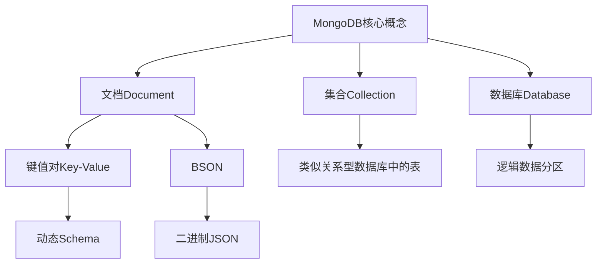

# MongoDB原理与代码实例讲解

## 1. 背景介绍

### 1.1 问题的由来

随着数据量的快速增长和数据结构的多样化,传统的关系型数据库在处理非结构化数据和大规模数据时显得力不从心。这促使了NoSQL(Not Only SQL)数据库的兴起,MongoDB作为其中的代表,被广泛应用于各个领域。

### 1.2 研究现状

MongoDB是一种开源的文档型数据库,它的出现解决了关系型数据库在存储非结构化数据时的痛点。与关系型数据库基于表的概念不同,MongoDB基于集合(collection)和文档(document)的概念,能够高效地存储和查询非结构化数据。

### 1.3 研究意义

深入理解MongoDB的原理对于开发人员来说至关重要,有助于更好地利用它的优势,提高数据处理效率。本文将全面剖析MongoDB的核心概念、架构设计、数据模型等,并结合代码实例,帮助读者掌握MongoDB的使用技巧。

### 1.4 本文结构

本文首先介绍MongoDB的核心概念和数据模型,然后深入探讨其内部架构设计和查询原理。接下来,通过代码实例详细讲解MongoDB的基本操作和高级特性。最后,总结MongoDB的发展趋势和面临的挑战。

## 2. 核心概念与联系

MongoDB的核心概念包括文档(Document)、集合(Collection)和数据库(Database)。

- 文档(Document)是MongoDB中的基本数据单元,由一组键值对(Key-Value)组成,类似于JSON对象。文档的结构是动态的,称为动态Schema。文档使用BSON(Binary JSON)格式存储,是二进制编码的JSON。
- 集合(Collection)类似于关系型数据库中的表,用于存储文档。集合中的文档无需具有固定的模式。
- 数据库(Database)是MongoDB中逻辑数据分区的概念,用于存储集合。

这些核心概念之间紧密相连,构成了MongoDB的数据模型和存储架构。

## 3. 核心算法原理 & 具体操作步骤

### 3.1 算法原理概述

MongoDB采用了多种算法和技术来实现高效的数据存储和查询,包括:

1. **B树索引**:用于提高查询效率,支持多种索引类型。
2. **内存映射存储引擎**:利用操作系统的虚拟内存管理,将数据文件映射到内存,提高数据访问速度。
3. **复制集(Replica Set)**:实现数据冗余和高可用性。
4. **分片集群(Sharded Cluster)**:实现水平扩展,支持海量数据存储。

### 3.2 算法步骤详解

#### 3.2.1 B树索引

MongoDB使用B树索引来加速数据查询。B树是一种自平衡的树形数据结构,能够高效地查找和插入数据。MongoDB支持多种索引类型,包括单键索引、复合索引、多键索引、地理空间索引和文本索引等。

B树索引的工作原理如下:

1. 当创建索引时,MongoDB会为集合中的每个文档构建一个键值对,其中键是索引字段的值,值是文档的唯一标识符。
2. 这些键值对按照键的大小顺序存储在B树中。
3. 查询时,MongoDB会先在B树中查找匹配的键,然后根据键对应的值找到相应的文档。

#### 3.2.2 内存映射存储引擎

MongoDB使用内存映射存储引擎(Memory Mapped Storage Engine)来提高数据访问速度。该引擎利用操作系统的虚拟内存管理机制,将数据文件映射到内存中,从而避免了传统的磁盘I/O操作。

内存映射存储引擎的工作流程如下:

1. MongoDB启动时,会将数据文件映射到内存中。
2. 对数据的读写操作直接在内存中进行,无需进行磁盘I/O。
3. 操作系统会自动将内存中的数据同步到磁盘文件,确保数据持久性。

#### 3.2.3 复制集(Replica Set)

MongoDB通过复制集实现数据冗余和高可用性。复制集是一组MongoDB实例的集合,其中一个实例是主节点(Primary),其他实例是从节点(Secondary)。

复制集的工作原理如下:

1. 所有写操作都在主节点上执行。
2. 主节点将写操作记录在oplog(操作日志)中。
3. 从节点从主节点复制oplog,并应用相同的操作,保持数据同步。
4. 如果主节点发生故障,从节点中会自动选举出新的主节点,确保服务的连续性。

#### 3.2.4 分片集群(Sharded Cluster)

MongoDB通过分片集群实现水平扩展,支持海量数据存储。分片集群由以下组件组成:

- **分片(Shard)**:用于存储实际数据的MongoDB实例。
- **mongos**:路由器,负责将客户端请求转发到正确的分片。
- **配置服务器(Config Server)**:存储集群元数据,如分片信息和路由信息。

分片集群的工作原理如下:

1. 客户端向mongos发送查询请求。
2. mongos根据集群元数据计算出目标分片,并将请求转发到相应的分片。
3. 分片执行查询操作,并将结果返回给mongos。
4. mongos合并来自多个分片的结果,并返回给客户端。

### 3.3 算法优缺点

#### 优点:

1. **高性能**:B树索引、内存映射存储引擎和分片集群等技术提高了MongoDB的查询和写入性能。
2. **高可用性**:复制集确保了数据的冗余和服务的连续性。
3. **可扩展性**:分片集群支持水平扩展,能够存储海量数据。
4. **灵活的数据模型**:文档模型适合存储非结构化数据,动态Schema提供了更大的灵活性。

#### 缺点:

1. **事务支持有限**:MongoDB在4.0版本之前不支持多文档事务,可能导致数据不一致。
2. **内存占用较高**:内存映射存储引擎需要大量内存来缓存数据文件。
3. **复杂的部署和维护**:复制集和分片集群的部署和维护相对复杂。
4. **查询优化困难**:缺乏像SQL那样成熟的查询优化器,需要手动优化查询。

### 3.4 算法应用领域

MongoDB广泛应用于以下领域:

1. **Web应用**:适合存储非结构化数据,如用户信息、评论、日志等。
2. **物联网(IoT)**:能够高效存储和处理海量设备数据。
3. **移动应用**:适合存储移动应用的用户数据和内容数据。
4. **内容管理系统(CMS)**:适合存储富文本、图像、视频等非结构化数据。
5. **大数据分析**:作为数据湖的一部分,存储和处理海量半结构化数据。

## 4. 数学模型和公式 & 详细讲解 & 举例说明

### 4.1 数学模型构建

MongoDB在查询优化和数据分片等方面使用了多种数学模型和算法。以下是其中一些重要的数学模型。

#### 4.1.1 B树索引模型

B树是一种自平衡的树形数据结构,用于存储有序数据。MongoDB使用B树作为索引结构,以提高查询效率。

B树的数学模型可以表示为:

$$
B(n, m) = \begin{cases}
n \geq 2 \\
m \geq \lceil n/2 \rceil \\
\text{每个节点最多有 } m \text{ 个子节点} \\
\text{除根节点和叶节点外,每个节点至少有 } \lceil n/2 \rceil \text{ 个子节点}
\end{cases}
$$

其中:

- $n$ 表示B树的阶数,即每个节点最多可以有多少个子节点。
- $m$ 表示每个节点最少可以有多少个子节点,需满足 $m \geq \lceil n/2 \rceil$。
- 根节点可以有少于 $\lceil n/2 \rceil$ 个子节点,但至少有两个子节点(除非是空树)。

B树的高度与查找、插入和删除操作的时间复杂度密切相关。对于一棵包含 $N$ 个键的B树,其高度 $h$ 满足:

$$
h \leq \log_{\lceil n/2 \rceil} (N+1)
$$

因此,B树的查找、插入和删除操作的时间复杂度为 $O(\log_{\lceil n/2 \rceil} N)$,比二叉查找树的 $O(\log_2 N)$ 更高效。

#### 4.1.2 数据分片模型

MongoDB通过分片集群实现水平扩展,支持存储海量数据。数据分片的核心思想是将数据划分为多个分片,并分布在不同的分片节点上。

假设我们有一个集合 $C$,需要根据某个分片键 $K$ 进行分片。我们可以定义一个散列函数 $h(K)$,将分片键的值映射到一个数值范围 $[0, N)$,其中 $N$ 是分片的数量。

$$
h: K \rightarrow [0, N)
$$

然后,我们可以将集合 $C$ 划分为 $N$ 个分片 $S_0, S_1, \ldots, S_{N-1}$,其中:

$$
S_i = \{d \in C \mid i = h(K_d) \}
$$

其中 $K_d$ 是文档 $d$ 的分片键值。

这种分片策略确保了具有相同分片键值的文档会被存储在同一个分片中,从而提高了查询效率。

### 4.2 公式推导过程

#### 4.2.1 B树索引查找时间复杂度推导

我们来推导一下B树索引的查找时间复杂度。

假设一棵B树的阶数为 $n$,高度为 $h$,包含 $N$ 个键。

1. 根节点最多有 $n$ 个子节点,每个子节点代表一个子树。
2. 每个子树最多包含 $N/n$ 个键。
3. 对于每个子树,最坏情况下需要进行 $\log_{\lceil n/2 \rceil} (N/n)$ 次比较才能找到目标键。

因此,查找一个键的最坏情况时间复杂度为:

$$
T(N) = 1 + \log_{\lceil n/2 \rceil} (N/n)
$$

由于 $N/n \geq 1$,我们有:

$$
T(N) \leq 1 + \log_{\lceil n/2 \rceil} N
$$

进一步推导,我们可以得到:

$$
T(N) \leq \log_{\lceil n/2 \rceil} (N+1)
$$

因此,B树索引的查找时间复杂度为 $O(\log_{\lceil n/2 \rceil} N)$。

#### 4.2.2 数据分片负载均衡公式推导

在分片集群中,我们希望数据能够均匀地分布在各个分片上,以实现负载均衡。假设我们有 $N$ 个分片,每个分片的容量为 $C$,集合中的文档数量为 $M$,我们需要确保每个分片上的文档数量不超过其容量。

令 $m_i$ 表示第 $i$ 个分片上的文档数量,则我们需要满足:

$$
\forall i \in [0, N), m_i \leq C
$$

为了实现负载均衡,我们希望每个分片上的文档数量尽可能接近 $M/N$。因此,我们可以定义一个目标函数:

$$
\min \sum_{i=0}^{N-1} (m_i - M/N)^2
$$

该目标函数表示每个分片上的文档数量与理想值 $M/N$ 之间的平方差之和。通过最小化该目标函数,我们可以实现数据在各个分片上的均匀分布。

在实际应用中,MongoDB使用了更加复杂的算法来实现数据分片和负载均衡,但上述公式可以帮助我们理解其核心思想。

### 4.3 案例分析与讲